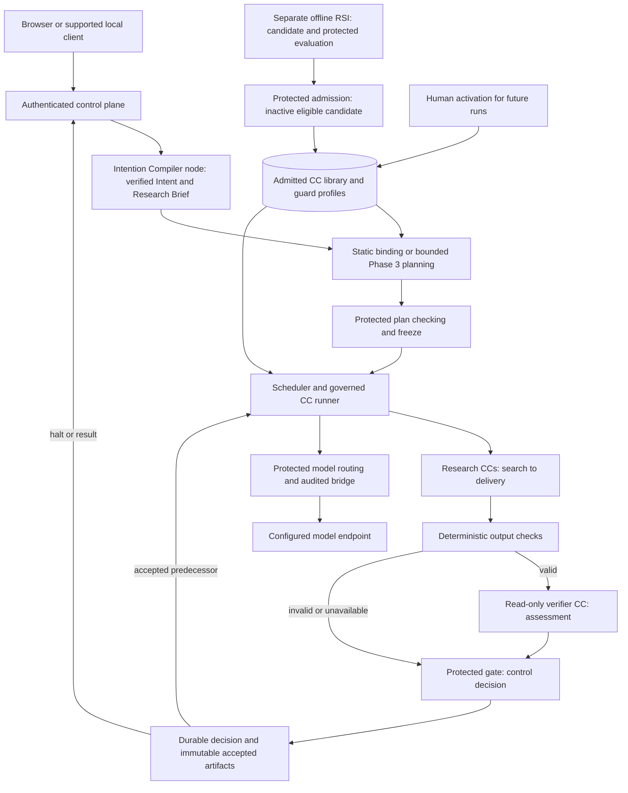

# AI4Research M1 design package

**Reading level: human immediate · October 8, 2026 · branch `ai4r_muk`.** This folder is the sole maintained architecture. Start here. The [current PRD receipt](sources/product/README.md) defines product requirements; this package explains the system that realizes them. The [source index](sources/product/README.md) preserves receipt identities and explicit local exceptions.

**PRD and design authority:** The PRD owns overall requirements and required outcomes. Design interprets the PRD and owns architecture and implementation-facing details that achieve those outcomes. If implementation guidance conflicts, follow the current design. Product obligations remain binding; a conflict that changes an obligation needs an explicitly recorded authorized decision.

## Human super-important read: understand the whole system

Read these three documents for M1 responsibilities, authority, placement, phases and the next build.

| Order | Read | Review outcome |
|---|---|---|
| 1 | This README | Find responsibilities and the reading route |
| 2 | [System architecture](m1-design.md) | Explain connections, deployment, phases and what comes next |
| 3 | [Principles](principles.md) | Explain checking, permissions, evidence and failure invariants |

## For design authors and human reviewers

[Design method and architectural integrity](design-method.md) explains the role and depth of architecture, tiered human review, change propagation and integrity checks. Read it when authoring or reviewing changes. [Decision review](decision-review.md) gives alternatives, pros, cons and implications for the latest repairs.

**PRD supplied separately:** This folder contains architecture, source receipts and clause mappings, not the PRD body. Use the PRD Main/Context supplied by the coding prompt.

## Build a specific component

For the complete Intention Compiler, start with the [Architecture Main entrypoint](builds/intention-compiler/README.md) and [Architecture Context](builds/intention-compiler/context.md). Follow their required foundation and schema links. Success reaches accepted `Research_Brief.json`; accepted Intent IR alone is incomplete.

## Human should read: review the affected responsibility

Select the affected responsibility. These pages explain purpose, connections, behavior, authority, failures and rationale.

| Question | Detailed design |
|---|---|
| What makes Intent usable, and how does it become Requirements? | [Intent and Requirements](intent-design.md) |
| How do plans freeze, bind future inputs and execute? | [Workflow](workflow.md) |
| What does each research responsibility produce? | [Research design](research-design.md) |
| What is a CC, and how do checking and library changes work? | [Capsules](capsules.md), [authoring](capsule/authoring.md) |
| Who assigns checks and constructs verifier evidence? | [Guard design](guard-design.md) |
| Where do models, generated code, state and the browser live? | [Placement](placement.md), [model routing](model-routing.md) |
| What happens after a halt, cancellation or restart? | [Failure handling](failure-and-human.md) |
| How do people inspect results and technical evidence? | [Artifact inspection](artifact-inspection.md), [automation/client boundary](automation.md) |
| Where is RSI and what can it change? | [Offline RSI](offline-rsi.md) |
| What must a phase or the next build demonstrate? | [Delivery phases](delivery-phases.md), [phase details](phase-details.md), [Immediate Plan](immediate-plan.md) |

## AI read: human-readable reference, selective human review

Read [reference principles and index](reference/README.md) for field contracts, selected exact schemas and readable examples. [CC fields](capsule/declaration.md) preserve the reusable declaration inventory. [Vocabulary](glossary.md), [clause coverage](coverage-allocation.md), [source decisions](authority-index.md) and [design review](coverage.md) support tracing, not a second architecture.

Find a particular artifact or field through the [contract index](reference/contract-index.md). Reference defines shared fields; implementers choose private algorithms, classes and adapters within them. No historical-schema search is required.

## System picture

AI4Research turns a supplied research purpose and local assets into a grounded opportunity, registered hypothesis, bounded POC, matched measurements and a readable report. Every work output is a candidate until protected checking and durable acceptance permit its use.

Preparation and planning use the same checking pattern shown for research. The runtime feedback edge represents dependency release, not a cyclic research graph. RSI is outside live research execution; its scores cannot release product work or activate themselves.

## Responsibility and authority

| Component | Owns | Connects to |
|---|---|---|
| Compiler/work CC | Candidate artifact fulfilling its assigned responsibility | Runner supplies inputs; checking consumes outputs |
| Verifier CC | Read-only verdict, findings, reasons and uncertainty about the submitted artifact | Protected review context in; assessment out to host |
| Protected binder | Concrete contracts, typed bindings and independent check assignments | Accepted requirements, admitted pins, policy, evidence and durable state |
| Protected gate | Checked decision and durable acceptance; no release before commit | Exact contract, subject, evidence and assessment |
| Protected library admission | Inactive candidate eligibility and standing history | Declaration/body/provenance, independent evaluation; human activation |
| Scheduler/runner | Eligible dispatch, scoped execution, budgets and observed evidence | Frozen contracts, CCs, model bridge and restricted experiment executor |
| Control plane | Authenticated submission, inspection and visible results/blockers | Browser/CLI/TUI and server-owned run state |
| Offline RSI | Bounded implementation improvement and comparable evidence | Protected target profile, isolated runner/referee and inactive library candidates |

CC authors produce work or assessments; protected infrastructure releases it. Inspect IRs and decisions as readable records, with raw evidence separate.

## Deployment and scope

One workflow application container bundles the frontend, web/control service and runtime. The browser uses host loopback, by default `http://127.0.0.1:5173`; the image entrypoint starts the application. No external UI helper is required. Internal model access is protected; generated scientific code has a separate confinement boundary. The optional [development sidecar](development-tools/sidecar/README.md) is an ordinary authenticated client on the private container network, outside product agents and M1 delivery dependencies.

Full M1 includes the baseline research journey/workstation, independent isolated RSI, and the applicable bounded dynamic integration efforts. The current compiler build ends at accepted Research Brief or a visible halt; its foundational dependencies are included. Composite/merged CCs, remote workers and live self-modification are compatibility/research directions, not implied implementations.

## Review and evidence

[Design review](coverage.md) traces source obligations, compatibility, challenge cases and limitations. Documentation checks do not establish runtime acceptance.

Received PRD bodies remain unchanged outside this package and are supplied separately. [Decisions](principles.md#decisions-and-source-amendments) identify authorized local departures, especially D5's fixed bounded multi-pass compiler and D6's packaging realization; literal zero differences are not claimed. Historical material is optional provenance. The separate very-condensed experiment is a historical comparison input and is not a substitute for this revised three-level package.
