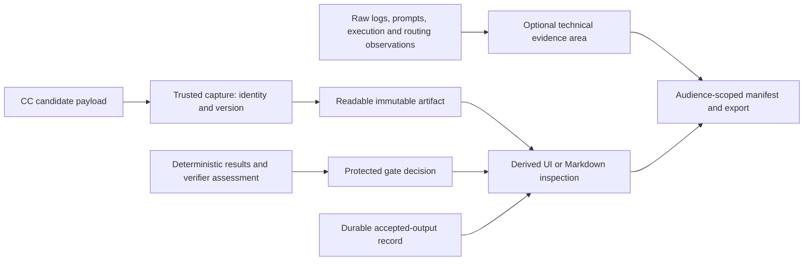

# Artifact inspection and evidence

**Reading level: human potential.** Question: how can a person understand what the system interpreted, checked and delivered without decoding storage objects?

## Substantive artifacts first

Persist and export descriptive, formatted files: `Intent_IR.json`, `Research_Brief.json`, `Intent_Assessment.json`, `Requirements_Assessment.json`, `Gate_Decision.json`, and the PRD research filenames. Identity-bearing directories may organize runs, but inspection must not require mapping anonymous `.bin` objects to their meaning. Internal content-addressed storage remains possible if the inspection/export boundary projects readable named artifacts without changing their bytes/meaning.

The UI or a generated Markdown view shows problem/purpose, requested result, scope, constraints, user targets, unresolved items, defaults, verdict/reasons and status. It is derived from the same records, not a separately authored interpretation. Preserve provenance links and make candidate/accepted distinctions visible. Do not hide blocking uncertainty behind a successful JSON parse, a green summary or a generic completion label.

## Ownership and flow

Capture owns byte identity and runtime provenance; the producer owns content only. The gate owns acceptance; an artifact file alone grants no readiness. Inspection/export owns audience filtering and descriptive naming, not reinterpretation or acceptance. The control plane transfers verified results; it does not generate another research conclusion.

## Manifest principles

A manifest names run identity, artifact role/type, schema/version, descriptive path/media type, exact hash, producing invocation, acceptance/decision reference, audience and redactions or missing evidence. Distinguish payload, runner-owned envelope and protected release record. Bind observations to contract, inputs, implementation/dependency pins and effective configuration. [Major field contracts](reference/other-contracts.md#manifest-and-runtime-records) define these connections.

References must resolve to the exact immutable content in the authorized export, or be explicitly withheld/unavailable with a reason. A redacted export has its own byte identity plus authorized source provenance; it cannot reuse the original hash for changed content. Do not expose credentials, private host paths or RSI hidden fixtures in general exports.

## Lifecycle and failure meaning

Users can inspect saved Brief, ideas/citations, opportunity/reasons, hypothesis/test plan, measurements, scientific verdict and report. Viewing a historical run is read-only and never starts another experiment. An in-progress export states its stage/status and which artifacts have not yet been produced; it is not a completed result. A failed run retains the candidate, checking results, halt reason and available evidence. If storage fails, show the operational error without claiming that missing evidence was saved.

An interrupted attempt, unavailable measurement, unsupported seed or token/cost gap stays visible. A scientific verdict contains reasoning tied to recorded measurements and registered criteria; the final report preserves that verdict and separates recommendations from measured facts. Removing local research data follows authenticated user scope and cannot silently mutate retained accepted evidence in another run. [Failure policy](failure-and-human.md) defines fresh corrected work and [client boundary](automation.md) defines retrieval/reconnection.
