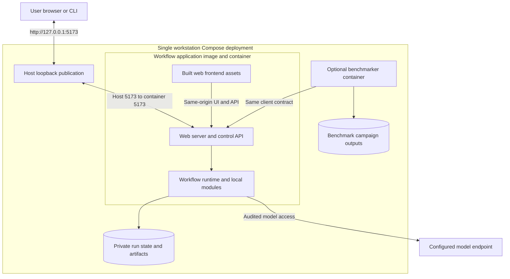

# Automated development and platform benchmarking

**Reading level: human potential.** Question answered: How do authenticated clients connect, observe and recover without release authority?

**Required shape:** a benchmarker drives the workflow exactly as an authenticated user client does. It submits bounded work, observes status, retrieves permitted artifacts, and records terminal outcomes. It cannot write authoritative run state, insert accepted outputs, bypass the Evaluator Gate, or mount the hidden RSI fixture store. Concrete commands, routes and fixture mechanisms remain implementation choices.

## Local Compose topology

The workflow application remains one service. In a containerized deployment, its image includes the built browser frontend, web server/control API and workflow runtime; the browser assets are served by that application on the same origin as the control API. Do not require a separate frontend container or a host-side helper script to start the product or open its UI. The image's own entrypoint/start command owns application startup; operators can launch the packaged deployment through the container runtime or Compose. A host script may be a convenience wrapper, not a runtime dependency.

The browser connects to `http://127.0.0.1:5173` by default. Publish container port `5173` to host loopback only (equivalent to `127.0.0.1:5173:5173`); the application may listen on its container interface so host port forwarding reaches it. UI and control API share that endpoint. A deliberate port override must preserve loopback-only host exposure and be documented. Internal module calls need no assigned TCP ports. The optional benchmarker is an external client, not another research worker or distributed compute host.

Within Compose, the benchmarker addresses the workflow by service DNS and its **container** application port; its own `localhost` is not the workflow service. No benchmarker inbound port is needed. An authenticated private network endpoint for the client does not authorize LAN exposure. Keep model IPC as a restricted socket/named-pipe equivalent, never a public model-adapter TCP listener. Do not expose SQLite, artifact storage, fixture oracle, or Docker socket as client services.

The benchmarker gets a scoped credential permitting submit/status/retrieval in the declared evaluation workspace. It has no gate-policy, activation, referee or arbitrary configuration-write authority. The host/launcher selects approved profile definitions; the client supplies their identifiers and allowed per-run inputs. Normal M1 submission cannot disable mandatory controls. Declared ablations run only in the isolated evaluation profile and carry invalid-for-product/admission labels.

The workflow owns its state/artifact volumes; the benchmarker owns campaign output. Supplied inputs are registered through the same controlled resource-import path as user inputs. A fixture mount, where needed, contains only the campaign's visible inputs and is read-only; it never grants the benchmarker direct access to release state or grants POC code access to campaign expectations. Retrieve permitted bundle exports through the client boundary. Package/model/image preparation happens before the run; startup does not silently download datasets or change frozen dependencies.

## Client contract and campaign behavior

The workflow application exposes one versioned, authenticated client boundary for supported UI/CLI clients and external clients such as the optional benchmarker or development sidecar. On the container network, clients reach it through the configured application service name and container port `5173` by default; browser users reach the same UI/control service through the host-loopback publication described above. The product boundary provides a readiness/capability response containing the client-contract version, target instance/build identity, supported operations and prerequisite states. A client verifies target and compatibility before submission; mismatch or missing required capability blocks the operation. Readiness distinguishes HTTP/process liveness from storage, authentication, model and required-isolation readiness. The [client field contract](reference/other-contracts.md#client-and-model-boundaries) defines shared readiness/submission/status/evidence information. Route names, transport encoding and internal adapters remain implementation choices within that contract. The [sidecar connection contract](development-tools/sidecar/README.md#application-connection-and-compatibility) relies on this product boundary and adds no privileged product endpoint.

| Operation | Meaning that must be stable |
|---|---|
| Readiness | Verify target instance/build and client-contract compatibility; distinguish service liveness from model/authentication, storage and required-security readiness. Declare an unavailable prerequisite rather than measuring a mock as a real model run. |
| Submit | After readiness and compatibility pass, submit the original objective, permitted resources, explicit product/evaluation mode, approved profile identity and requested seed where supported. Return one run identity; ambiguous transport completion does not automatically resubmit. |
| Observe | Read correlated status and events, with reconnect/poll support. Transport disconnection never cancels or duplicates research work. |
| Finish/retrieve | Structured terminal status, detailed verdict/reason, accepted result references and allowed Run Bundle. Headless failures never wait for a human. |
| Cancel | Explicit authenticated control action; preserve work already performed and cancellation evidence. It cannot undo external effects. |

The submission contract must support client request identity and reconciliation after uncertain delivery, so automation can discover whether a run was created before retrying. The transport adapter selects the concrete reconciliation mechanism. Separate client transport recovery from forbidden automatic capsule retries. For Intent Compilation and Verification Slice (formerly TRIAL-1), allow one active run and sequential campaign cases; no concurrent-run orchestration is needed.

Provide a simple documented launch/run/retrieve path and a smoke mode using labeled mocks. A model-backed mode exercises the actual bridge, compiler, verifier and durable release. Both use the same runner and client adapter. A Compose campaign command should return non-success when required cases or prerequisites fail, preserve per-case records, and allow cleanup of replaceable containers without deleting evidence. Exact CLI syntax and Compose service definitions are implementation work, not executable promises in this design.

Campaigns freeze the task set, expected outcomes, profiles, component pins and analysis policy before measurement. Run matched inputs/configurations, preserve repetitions and requested/effective seeds, failures, elapsed time and available calls/cost. Label model nondeterminism and provider gaps. Cases can continue after a terminal failed run according to campaign policy; the failed workflow itself cannot continue. Scientific benchmark deltas remain inside the user's research protocol; campaign pass rates and latency are platform measures.

## Development capabilities worth establishing early

Use shared invocation, output validation, trusted evidence-context assembly, runtime verifier CC assessment, protected gate decision, release persistence and export builders across the slice and full M1. Native UI, CLI and benchmark adapters should call one application use-case boundary rather than reimplementing workflow decisions. Supply inspectable effective configuration and fixture-based mock adapters; protect real runtime paths from test-only verdict injection. Deliberately exercise loss of model access, artifact substitution, storage failure, malformed verifier output and browser/client disconnect through the same boundary.

Keep admission tooling capable of validating/pinning the two trial CCs now and additional capabilities later. Preserve exact dependency identities and per-attempt evidence. A port/type compatibility check and a frozen reference graph will be useful for both planner integration and RSI comparison. These capabilities are architectural needs; Private APIs, diagnostics and evaluation mechanisms remain implementation choices within these boundaries.

## Benchmark and RSI evidence connections

Export versions, exact effective configuration, run identity, admitted outputs, observations and limitations in an audience-scoped manifest. Platform benchmarker analyzes exports; Data Foundation prepares them; offline RSI consumes only explicitly approved development material. The RSI referee/oracle remains a protected independent path. Platform evaluation must stay within the master PRD: no expanded model access, uncontrolled benchmark downloads, training or hidden-feedback leakage. Detailed campaigns belong to their owning specification.
