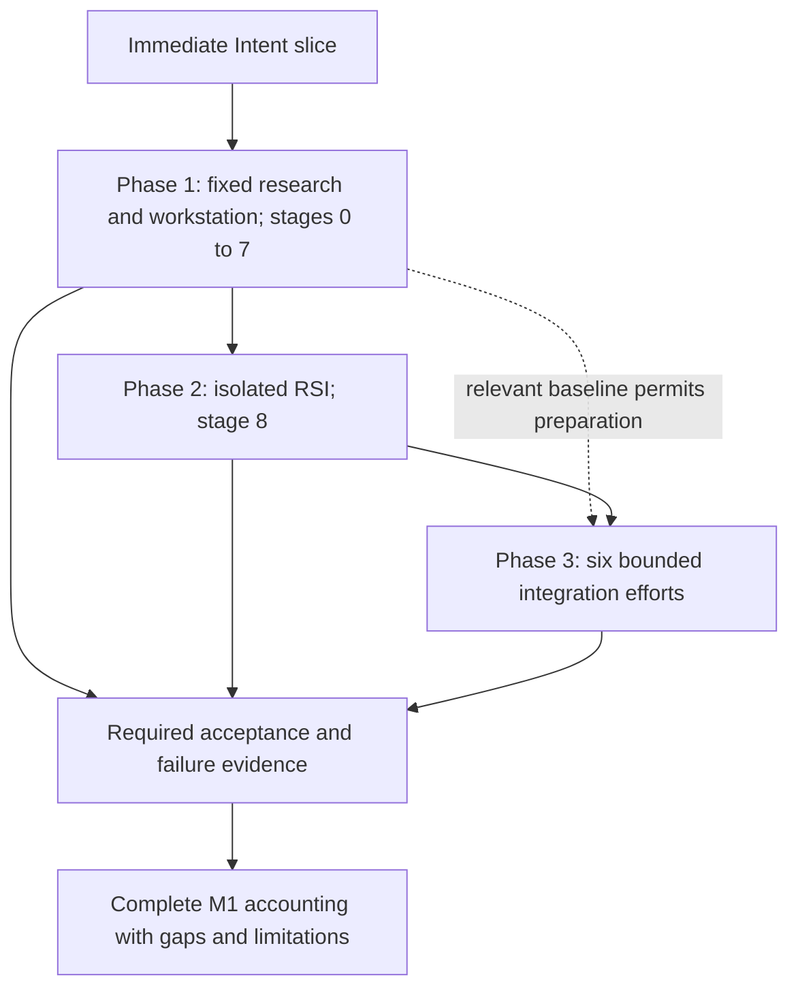

# Delivery phases and build direction

**Reading level: human potential.** Delivery phases, implementation stages and runtime research steps are different concepts. This page selects scope; [phase details](phase-details.md) retain exact stage exits and source dispositions. The [PRD](sources/product/prd-m1-current-2026-10-07.txt) owns acceptance requirements.

## Immediate build

[Intent Compilation and Verification Slice (formerly TRIAL-1)](immediate-plan.md) is the first connected boundary inside Delivery Phase 1. It builds text intake, Intent compilation, deterministic checking, an independent verifier, protected decision/persistence and a visible accepted result or halt. It does not build Requirements, the research graph or RSI. A semantic verifier is not a downstream research-work consumer and cannot alone establish the PRD Stage 1 progression exit.

## Full M1 phases

| Phase | Entry and build | Produced result / exit meaning |
|---|---|---|
| **1: fixed research baseline and workstation** | Authorized model access and local prerequisites. Stages 0–7 establish invocation/evidence foundation, qualified intake, checked Intent and Brief, fixed binding, search/screening, registered hypothesis, bounded POC, baseline/treatment science and delivery, plus installer/doctor, CLI/Web/TUI, identity, security, inspection and limits | One supplied research request traverses the governed journey. Each stage exit and required failure case has evidence. Users inspect artifacts and halt reasons, retrieve reproducible evidence and receive valid negative findings. The slice alone is not this exit |
| **2: independent local-isolated RSI** | Stable eligible `rank_opportunities` parent, fixed contract, allowed mutation paths, custodian/referee and meaningful protected fixtures. Stage 8 executes bounded paired candidate evaluation and guardrail challenges | Required Target 1 sandbox child and reconciled evidence, query/resource accounting, protected data and inactive lineage. No automatic production change. Target 2 is conditional; lack of its model support does not waive Target 1 |
| **3: bounded dynamic integration** | Relevant operational baseline seams and available upstream modules. Integrate advanced compiler, Agent Team/Cluster planning, dynamic CC binding, heterogeneous routing, alternate verifier and applicable Code Mode within declared scope | Record the outcome and evidence for every applicable effort, retaining the operational baseline. An unavailable dependency is blocked, unfinished behavior incomplete, and a mock is not real integration acceptance |

Independent preparation can proceed when its own prerequisites exist. Integration/completion still requires the relevant predecessor exits; the absence of a finished dynamic planner does not postpone RSI interface design. Detailed [stage/phase mapping](phase-details.md) prevents a narrow slice or partial integration from being reported as whole-phase completion.

## Boundaries that remain fixed

The baseline stays operational when a Phase 3 configuration is disabled. A new route, compiler or candidate version affects new attributable runs; it never changes a started invocation, accepted Brief, frozen graph or historical decision. Advanced clarification is bounded pre-acceptance work in declared interactive mode. The Phase 1 baseline is non-interactive; headless paths never wait.

One active research run follows one opportunity/hypothesis and sequential baseline/treatment measurement. M1 adds no distributed workers, model training, external publication, live self-installation or recursive improver deployment. Composite creation/execution, merging, internal member graphs, multiple planning epochs and broader optimizers remain later work. M1 uses separate gated work CC nodes.

## How completion is judged

Stage and phase completion require reproducible evidence, not implementation existence or a diagram. The latest PRD adds user-story traceability, explicit stage validation, phase summaries and `M1_Final_Test_Report.md`. Its required summaries reference underlying verification; they do not replace it. Change history explains revisions; current canonical PRD/design must describe selected behavior without replaying that history. This package contains design, not the development workflow or runtime test results.

Use [Immediate Plan](immediate-plan.md) for the first build, the phase table for whole-phase selection, and [phase details](phase-details.md) for stage boundaries. [Principles](principles.md#decisions-and-source-amendments) retain explicit local exceptions D5/D6; unchanged source bytes are not a claim of literal agreement with those departures.
