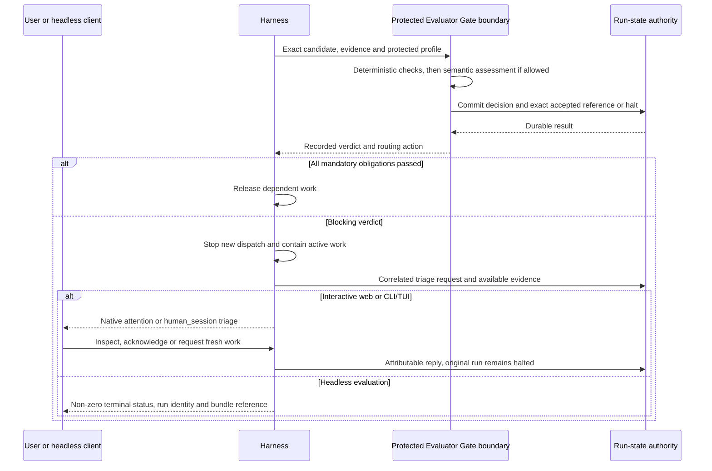
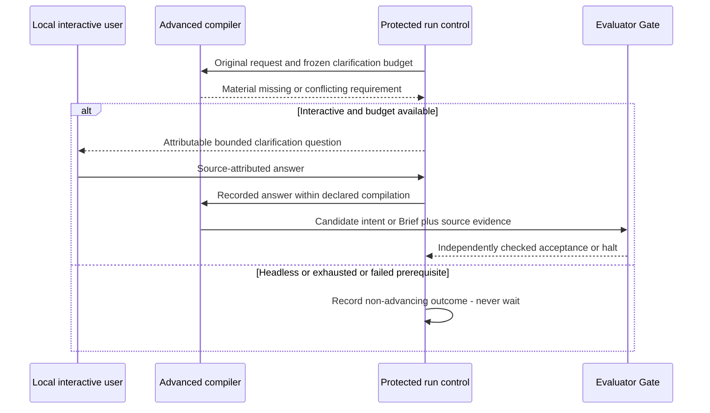

# Failure handling and human callback

**Reading level: human potential.** Question answered: What happens when work blocks, faults, restarts or needs a human?

**Decision:** every blocking product failure stops new dispatch and creates an attributable human-action request after available evidence is preserved. Interactive sessions use native `human_session` / interaction prompts for triage. Headless sessions return a terminal status immediately and never wait for a reply. Human triage cannot turn failed mandatory checks into an advancing verdict.

The **Evaluator Gate boundary** composes deterministic checks, a runtime verifier CC assessment and protected host decision/release. Verifier capsules are CCs; gates are protected infrastructure. The verifier reports an assessment verdict about the bound subject, while the gate validates/interprets that verdict under policy and controls advancement through durable run-state and scheduler readiness. The harness applies its recorded routing action; neither a producer nor a model-generated “pass” controls scheduling. See [vocabulary](glossary.md) and [verification](capsules.md).

## When to call the human

| Event | Autonomous behavior | Human callback |
|---|---|---|
| Empty/unreadable intake; unsupported domain or mandatory input | Reject before work dispatch, retain rejection reason | Show actionable input correction at the submitting surface. It does not start a semantic clarification dialogue. |
| Material intent/requirement ambiguity or conflicting constraints in complete Intention Compiler node/Delivery Phase 1, or after Delivery Phase 3 clarification is exhausted | Evaluator Gate records a non-advancing result; halt | Ask the user to correct the source objective or supply the missing permitted input. New submission creates a new run. |
| Work execution fault, invalid artifact, mandatory semantic failure | Record `FAIL`, stop new dispatch | Triage request with failed obligation, exact subject, available evidence and permitted next action. |
| Unauthenticated/unavailable model, missing dataset/dependency, timeout preventing valid evaluation | Record `ENVIRONMENT_BLOCKED` where dependency failure prevents a valid judgment; halt | Request the specific environment repair. A demonstrated implementation defect remains `FAIL`; uncertainty stays explicit. |
| Insufficient evidence or unresolved verifier judgment | Record `INCONCLUSIVE`, halt | Request inspection/additional evidence. Human opinion alone cannot satisfy a mechanically or scientifically required observation. |
| Denied effects, fixture access, permission escalation, budget exhaustion | Contain/terminate affected execution; halt whole run | Security or resource triage. No “allow once” override of frozen restrictions, no live budget increase or route substitution. |
| Persistence failure before release | Block readiness, retain whatever evidence can safely persist; no pass | Operational alert via the control plane. If durable recording is unavailable, display the failure and return non-success; do not claim a persisted triage record. |
| `PASS_WITH_KNOWN_LIMITATIONS` with all mandatory checks satisfied | Advance, carry warnings into downstream evidence/report | No blocking callback; warnings visible immediately and disclosed at delivery. |
| Valid scientific rejection or scientific inconclusive result | Infrastructure verifier may pass; proceed to Delivery | Deliver the scientific result and follow-ups. No mandatory intervention merely because the hypothesis failed. |
| User cancels | Stop new dispatch; contain active work; preserve effects/evidence | Acknowledge cancellation; do not generate a redundant failure question. |
| Browser disconnect | Continue server-owned execution | No callback solely for disconnection. A later failure remains visible on reconnection. |
| Engine restart interrupts unfinished work | Preserve accepted artifacts, mark interrupted attempts paused; no replay | Show interruption and evidence to the human. Recovery is inspection and a fresh run in M1, not automatic in-place resumption. |

Delivery Phase 3 advanced compilation may use a **pre-acceptance clarification state** under PRD §4.7.3. Freeze its bounded turn/time/call policy and interactive mode at entry; ask only for missing or conflicting research requirements through the local native surface, record each question/reply with product-user/source attribution, and then independently verify the candidate intent/Brief. This is declared compilation work before accepted requirements and graph freeze, not failure-driven repair or permission to change an accepted contract. Exhausted dialogue, unresolved material ambiguity or an infrastructure/security failure halts under this table. Headless mode never waits: use supplied answers only or return the non-advancing outcome. Intention Compiler and Delivery Phase 1 remain non-interactive compilers.

Freeze interaction mode and originating session with effective run configuration. The same gate policy applies in every mode:

If the durable write fails, release remains blocked and the client receives a storage failure with whatever identifiers/evidence are available. The diagram's commit acknowledgment is a prerequisite, not an assumption that storage always works. A callback is a control-plane interaction, not another research DAG node that can unlock rejected work.

| Mode | Delivery of a blocking callback | Waiting and replies |
|---|---|---|
| Web / Intention Compiler | Existing run status and native interaction surface, with reason and evidence references | Server releases execution resources after halt. An unattended request remains durable and visible when the user reconnects. No detached terminal is spawned. |
| Interactive CLI/TUI / full M1 | Native `human_session` triage through the current authenticated session | The interaction may wait for inspection/acknowledgment, but the research run is already halted. Disconnecting or dismissing does not resume it. |
| Headless development/evaluation / Intention Compiler and full M1 | Stable machine-readable non-success, detailed verdict/reason, `run_id` and bundle reference when available | Never invoke an input prompt or wait on `human_session`. Record human action needed for later inspection; benchmarker continues its campaign policy. |

The callback identifies run, node/attempt (where one exists), verdict and routing action, failed obligations, known effects, evidence references, and required correction. Avoid hidden fixtures, credentials, and unchecked candidate text becoming trusted instructions. Multiple faults in the same halted attempt attach to one correlated request; reconnecting does not create duplicate questions. A reply targets that exact request and is rejected if stale or from another session/run.

## What a human may do

Inspect or acknowledge the halt, abort the triage session, repair the environment, correct the objective, supply permitted resources, or explicitly initiate fresh attributable work. Record the actor, answer and changed inputs. Keep the failed run and its verdict unchanged. A new run records its relationship to the previous one, re-resolves configuration and eligible pins, re-freezes its plan, and performs all required checks. No correction edits an accepted artifact in place.

This resolves PRD §4.6.4's “manually correcting the run” as **a new linked run**, consistent with D4 and the absence of partial-DAG rewind in M1. Human triage is a product runtime feature. It introduces no coding approval cards, reviewer assignments or completion gates under Constitution v2.

## Delivery Phase 3 clarification before acceptance

Accepted requirements cannot be edited by this dialogue. A later blocking execution failure follows terminal triage and linked fresh work, not a return to clarification.

## Offline RSI is a separate callback policy

A normal candidate score decline or compatibility rejection records evidence and can feed the bounded offline search; it does not ask the user on every attempt. Query/resource exhaustion ends the session and returns a summary. A security violation, degraded fixture boundary, referee fault or evidence tampering stops the session and requests operator triage. Hidden cases and per-case final feedback are withheld even from ordinary callback content.

Successful evaluation produces an inactive candidate and admission evidence. A human must explicitly admit/activate as required by the PRD; better scores never promote automatically. Refusal leaves production unchanged. Activation affects future runs, with explicit rollback. These product decisions do not become a development-review process.

## Pattern and reuse evidence

Use the existing **correlated human interaction pattern**: halt/record first, project attention to the current surface, bind a reply to the run and correlation ID. Combine it with the protected decision/release pattern already required by the PRD. This avoids inventing an agent that owns both evaluation and workflow authority.

Local source inspection at JiuwenSwarm `cc29cb0cc5d42b55235d276d23f0a7836dfdcc70` found `_detect_human_waiting_prompts` in `jiuwenswarm/server/runtime/agent_adapter/team_helpers.py`, which projects native waiting states into `chat.ask_user_question`, and `SwarmFlowReplyParams` in `jiuwenswarm/common/schema/swarmflow_reply.py`, which carries session, run and correlation IDs. `WorkflowProgress` in `jiuwenswarm/agents/harness/team/handlers/workflow_state.py` separates human nodes and records replies. These are inspected reuse leads, not proven integration. An adapter must preserve the rule that a native reply never automatically resumes rejected research work. Verify these source leads against the implementation checkout before selecting an adapter.
