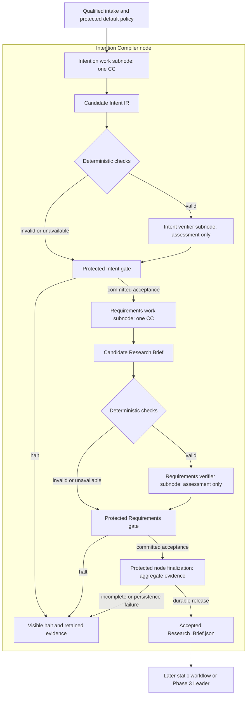

# Immediate Plan: complete Intention Compiler node

**Human potential.** Current next build: the whole Intention Compiler, not the earlier Intent Compilation and Verification Slice (formerly TRIAL-1). That smaller assignment is historical and remains preserved in frozen experiment inputs; task/interface identities are not renamed. Use the [Main build entrypoint](builds/intention-compiler/README.md) and [supporting Context](builds/intention-compiler/context.md).

## What to build

Qualified local intake, attributed interpretation, accepted Intent IR, compiled requirements, verified `Research_Brief.json` and protected enclosing-node release. Include the governed execution/evidence/control foundations, bundled frontend/service/runtime image, browser inspection and local headless interface. Private implementation details belong to implementers; shared fields and authority do not.

## What acceptance means

Intent IR must preserve meaning and provide a coherent purpose/result usable by Requirements. A topic alone cannot pass merely because omissions are honestly recorded. Missing optional hardware/method/thresholds need not block; permitted defaults are separate attributed decisions. The verifier assesses the submitted IR against original evidence and protected criteria, not a second interpretation.

Requirements consumes only accepted Intent and outputs the PRD Research Brief. Its verifier checks preservation, default authority, constraints, output/evidence completeness and downstream usability. Hypothesis later registers experimental criteria. Passing Intent verification is an internal milestone, not compiler completion.

Node finalization checks the exact accepted Brief, internal decisions, observed invocations and combined limits without another semantic-review call. Only durable protected release makes the Brief available externally. A failed/no-output invocation, missing finding, stale subject, timeout or failed commit halts and retains real evidence; no fake output reference or automatic repair is permitted.

## Minimum supporting system

Use pinned work/verifier declarations, fixed admitted versions, protected model bridge, independently owned check profiles and node/subnode contracts, immutable artifacts and durable state. Separate bounded work generations and verifier calls share frozen time/call budgets; the baseline does not require one LLM call. Unknown token/cost telemetry is unavailable.

The image entrypoint starts the bundled UI/API/runtime; browser access uses loopback port publication. Inspect descriptive `Intent_IR.json`, `Research_Brief.json`, assessments, checking results and decisions, with raw evidence separate. Browser closure does not cancel; restart pauses interrupted work without replay. Headless halts never wait for approval.

## Build boundary and proof

Demonstrate a real supported request reaching accepted Brief, then exercise the [component verification matrix](reference/compiler-verification.md). A bounded test consumer validates the released Brief contract, not a research workflow. Planning, Search, Hypothesis, Builder, scientific execution, Delivery, RSI, advanced compiler and sidecar implementation are excluded.

This build contributes Stage 0/1 foundations and the Stage 2 Brief boundary. It does not complete Stage 2's fixed graph initialization or full M1. The entrypoint identifies which shared foundations must be built so “only the compiler” cannot be interpreted as a naked prompt wrapper.
