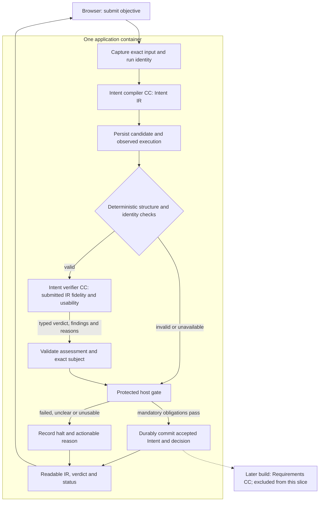

# Immediate Plan: Intent Compilation and Verification Slice

**Reading level: human potential.** Formerly TRIAL-1, this is the bounded first build inside M1 Delivery Phase 1. The name does not rename task/interface identities. [Intent design](intent-design.md) explains the boundary in depth; [Intent fields](reference/intent-and-requirements.md) standardize its outputs.

## What to build

A user submits text through the existing local web surface. Intake captures the exact request and starts a server-owned run. The Intent CC produces a structured interpretation of problem/purpose, desired change, requested result, context, scope and constraints, preserving omissions and contradictions. It does not conduct research, select a method or invent user goals.

The diagram's gate is protected infrastructure. The verifier's verdict is data; only the gate and durable run-state authorize progression. The checker is not a curly-brace test: it validates the declared schema, reference identities, required structures and source-span bounds. Passing those checks permits semantic review, not automatic acceptance.

## What acceptance means

The submitted IR must preserve the user's meaning **and** provide a coherent purpose/result that Requirements can use. The verifier evaluates that exact artifact against protected criteria and original input evidence. It does not solve the request or provide a replacement interpretation.

“Research on data lake retrieval algorithm” with no discernible purpose or requested result must not pass just because the compiler repeats the topic and lists omissions. Preserve that output as a candidate, explain what is missing and halt. Missing optional hardware or experimental details do not automatically make intent unusable; authorized defaults and experiment registration belong to later responsibilities. Contradictory, invented or materially incomplete meaning blocks even when the JSON is valid.

Malformed output blocks before semantic review. Failed/unclear semantic assessment, unavailable model, timeout, stale evidence and persistence failure cannot release an accepted reference. Show the exact candidate, checking results and actionable reason where available. A clearer submission starts linked new work; there is no autonomous clarification/repair loop. Headless execution returns non-success without waiting.

## Minimum supporting system

The slice includes the governed runner and audited fixed model bridge, two pinned CC definitions (compiler and read-only verifier), protected check/profile assignment, immutable artifact capture, durable gate state, scoped authentication/readiness, existing UI inspection and audience-scoped export. Effective call/time budgets cover both invocations. Unknown token/cost telemetry is unavailable, not zero.

Use descriptive `Intent_IR.json`, `Intent_Assessment.json` and `Gate_Decision.json` with a view of the same records. The image bundles/serves the frontend and starts through its entrypoint; the browser uses the loopback port. Browser closure does not cancel the run. Restart preserves accepted state and pauses interrupted work without replay.

## Build boundary and proof

Requirements, planner, search, POC execution, scientific measurement/evaluation, Delivery and RSI execution are excluded. Field contracts for their later connections remain present in the reference. The full Brief and initialized research graph are Stage 2 outcomes that this slice does not establish.

Demonstrate accepted actionable intent and blocked malformed, unusable, contradictory, invented and instruction-bearing candidates. Also challenge missing constraints, stale/swapped subjects, verifier timeout, storage failure, browser disconnect, restart and headless behavior. Expected labels must reflect usability as well as fidelity. A model returning JSON or a collection of happy-path passes does not establish verifier quality; retain false acceptances/refusals and shared-provider limitations.
