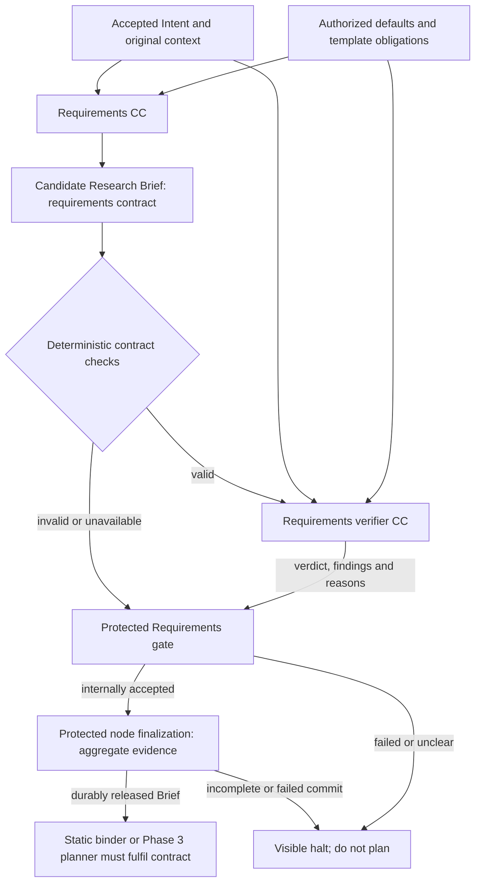

# Intention Compiler node: interpretation, requirements and release

**Reading level: human potential.** Question: what does the compiler need to understand, what must its verifier establish, and why does Requirements wait? [Immediate Plan](immediate-plan.md) selects the first build; [field contracts](reference/intent-and-requirements.md) define its interoperable data.

## Intention CC responsibility

The Intention Compiler is the enclosing node. This section describes its first work subnode; accepted Intent IR is intermediate. The Requirements subnode and both verification/gate paths are also mandatory. [Current build](builds/intention-compiler/README.md) reaches the Research Brief.

The Intention CC takes the exact qualified original request and permitted context. In a bounded generative pass it extracts the problem/research purpose, desired change, requested result, affected entities, scope, exclusions, constraints, preferences and stated targets. It preserves source attribution and separates absent information from stated values. It produces **Intent IR**, not a Research Brief or proposed scientific solution.

The result is an interpretation usable by a downstream compiler. A topic label alone is insufficient when no purpose or requested result can be discerned. The Intention CC must represent that uncertainty, not invent a benchmark, report type, algorithm or desired change. Missing optional hardware/method/threshold fields are different from not knowing what work the user wants. Requirements may apply authorized parameter defaults; Hypothesis later registers empirical criteria. No browsing, host profiling, research or autonomous clarification is needed to fabricate missing intent.

## Deterministic boundary

```mermaid
flowchart TB
    Request[/Input: exact qualified request and permitted context/]
    Profile[/Protected profile: schema, criteria, policy and limits/]
    Request --> WorkCC

    subgraph Compiler[Intention Compiler node — governed CC workflow]
        direction TB
        subgraph IntentSubnode[Intent subnode]
            direction TB
            subgraph Work[Work subnode]
                direction TB
                WorkCC[Intention CC capsule<br/>Interpret request; preserve scope, constraints and uncertainty]
            end
            WorkCC --> Candidate[/Candidate Intent_IR.json/]
            Candidate --> Checks{Deterministic checks<br/>schema, spans, sources and identities}
            Checks -->|valid| CheckResults[/Check results/]
            Checks -->|invalid or unavailable| CheckFail[/Failed check result and reason/]
            CheckResults --> ContextBuilder[Protected context builder<br/>bind exact subject and review evidence]
            Candidate --> ContextBuilder
            Profile --> Checks
            Profile --> ContextBuilder
            Request --> ContextBuilder
            ContextBuilder --> Context[/Protected review context record<br/>candidate + accepted input + criteria/policy + checks + observations/]
            subgraph Verify[Verifier subnode]
                direction TB
                VerifierCC[Intent verifier CC<br/>Assess fidelity, coverage, scope, uncertainty and usability; do not edit or accept]
            end
            Context --> VerifierCC
            VerifierCC --> Assessment[/Typed assessment record<br/>verdict + findings/reasons + evidence + uncertainty/]
            Assessment --> Validate[[Mechanical validation<br/>schema + required findings + exact subject identity]]
            Validate --> ValidAssessment[/Validated assessment/]
            CheckResults --> Gate
            CheckFail --> Gate
            Candidate --> Gate
            ValidAssessment --> Gate
            Profile --> Gate
            Gate{{Protected Intent gate<br/>apply mandatory checks and policy; commit or halt}}
        end
        Gate -->|accept: commit exact candidate| Accepted[/Accepted Intent_IR.json/]
        Gate -->|reject or block| Halt[/Terminal halt reason; candidate and evidence retained/]
        Accepted --> Requirements
        subgraph RequirementsSubnode[Requirements work subnode]
            Requirements[Requirements CC capsule<br/>Consumes accepted Intent IR; produces candidate Research Brief]
        end
    end

    classDef input fill:#E2F0D9,stroke:#548235,color:#1f2937
    classDef work fill:#DDEBF7,stroke:#4472C4,color:#1f2937
    classDef verifier fill:#E4DFEC,stroke:#7030A0,color:#1f2937
    classDef check fill:#FCE4D6,stroke:#C55A11,color:#1f2937
    classDef checkResult fill:#FCE5CD,stroke:#E69138,color:#1f2937
    classDef context fill:#E7E6E6,stroke:#7F7F7F,color:#1f2937
    classDef assembly fill:#D9E2F3,stroke:#5B6573,color:#1f2937
    classDef assessment fill:#CCFFFF,stroke:#008C95,color:#102A43
    classDef validated fill:#C9DAF8,stroke:#1155CC,color:#1f2937
    classDef control fill:#FFF2CC,stroke:#BF9000,color:#1f2937
    classDef halt fill:#F4CCCC,stroke:#A61C00,color:#1f2937
    class Request,Profile,Candidate,Accepted input
    class CheckResults,CheckFail checkResult
    class ValidAssessment validated
    class WorkCC,Requirements work
    class VerifierCC verifier
    class Checks,Validate check
    class ContextBuilder assembly
    class Context context
    class Assessment assessment
    class Gate control
    class Halt halt
    style Compiler fill:#F8FAFC,stroke:#334155,stroke-width:2px,stroke-dasharray:6 4
    style IntentSubnode fill:#F8FAFC,stroke:#64748B,stroke-dasharray:4 3
    style Work fill:#EFF6FF,stroke:#4472C4,stroke-dasharray:4 3
    style Verify fill:#F5F3FF,stroke:#7030A0,stroke-dasharray:4 3
    style RequirementsSubnode fill:#EFF6FF,stroke:#4472C4,stroke-dasharray:4 3
```

The fixed slice has a predefined schema and checking profile. Runtime binding still ties them to the exact request, candidate and invocation. Deterministic checks validate required fields/types, schema version, span ranges and permitted source references, identity/pins, observed completion and supported limits/effects. They do not establish that a paraphrase is correct, that a topic is actionable, or that a contradiction is harmless. Their pass authorizes review only.

## Intent verifier responsibility

The verifier receives the candidate IR as its primary subject, original request/context as evidence, protected criteria and relevant execution observations. It asks whether **this artifact** performed Intent's job: faithful coverage, no unsupported additions, preserved scope/constraints, consistent interpretation, explicit material uncertainty and a workable purpose/result for Requirements.

It does not take the prompt and issue a competing answer, complete missing work, rewrite the candidate, choose a research solution or stop the scheduler. It reports criterion findings, evidence, uncertainty, limitations and a verdict. A faithful “I cannot determine the requested work” is valid candidate data but yields a non-advancing assessment. A confident yet contradictory/invented interpretation also blocks. An unproven research hypothesis is not automatically an impossible intent; the question is usable requested work, not advance proof of scientific success.

Malicious instructions in candidate text are data. Separate invocation/conversation and protected criteria reduce self-certification; the same provider can still make correlated mistakes. A verifier has no recursive semantic reviewer. Its output is mechanically checked for schema, subject identity and complete required criterion coverage.

## Gate responsibility and human outcome

Protected host code validates and interprets deterministic results plus the assessment, then writes the authoritative decision. It alone publishes accepted output after persistence succeeds. Missing references, contradictory findings, failed mandatory obligations, material unresolved uncertainty or unavailable evidence cannot advance. A compiler-generated readiness flag is advisory.

On an unusable intent, the control plane shows which purpose/result/constraint needs clarification, the retained IR and verifier/gate reasons. The original run remains halted. A clearer user submission starts a linked new run; Phase 1 does not wait for asynchronous approval or run a multi-turn clarification/repair loop. Headless returns immediately; browser disconnect does not resume or cancel the run. [Failure policy](failure-and-human.md) handles infrastructure failures and later Phase 3 clarification separately.

## Requirements CC and the second boundary

Requirements receives **accepted** Intent, original context, supplied resource references and protected defaults. A second bounded generative pass produces the Research Brief: objective, scope, mandatory outcomes, optional preferences, constraints, targets, deliverables, acceptance expectations, evidence obligations, attributed assumptions/defaults and remaining uncertainty. It cannot silently repair misunderstood intent or select the eventual experiment.

The Requirements verifier checks that the submitted Brief preserves accepted meaning and accounts for all mandatory outcomes, constraints, exclusions and deliverables; preferences do not become obligations silently. Defaults must come from permitted policy and remain distinguishable from user statements. Acceptance/evidence obligations must be coherent and usable for planning. Unknown experimental methods need not block a Brief if downstream Hypothesis can legitimately determine them; missing intended result or unresolved contradictory requirements does block.

The binder/planner consumes the accepted contract. Coverage maps required outcomes and deliverables to proposed work; required checks are independently assigned. The Hypothesis Blueprint later fixes experiment-specific measurements and classifications, without altering user requirements. [Guard design](guard-design.md) defines the shared mechanism; [reference](reference/intent-and-requirements.md) connects required fields to deterministic and semantic checks.

## Source and build boundaries

D5 permits the selected fixed multi-pass sequence instead of the unchanged PRD's literal single bounded generation. Combined limits are frozen; each compilation remains bounded/non-interactive in the baseline. Verifier calls are separate checking work. The current Immediate Plan builds the whole compiler through accepted Research Brief. Complete Stage 2 includes qualified documents/resources, accepted Brief and initialized baseline graph; the Intent verifier is not downstream work Node B.

## Connections and reference route

The whole node receives qualified intake and protected defaults, exposes accepted Research Brief, and connects to later static binding or Phase 3 Leader integration. Intent IR stays the verified intermediate between its work subnodes. [Fields and purpose](reference/intent-and-requirements.md), [node/subnode ownership](reference/node-execution.md), [verification cases](reference/compiler-verification.md) and [build scope](builds/intention-compiler/README.md) define the connected boundary.
