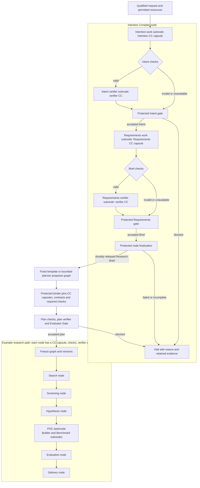
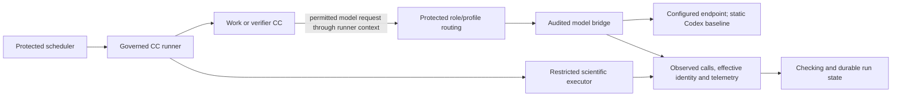
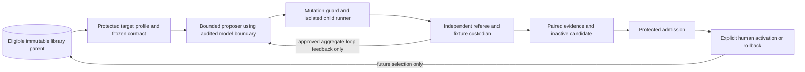

# System architecture

**Reading level: human immediate.** This page connects the whole M1 system. [Research design](research-design.md) expands each responsibility; [reference](reference/README.md) defines the information crossing boundaries.

## From meaning to a governed research program

**Example flow:** accepted intent becomes a Research Brief, the Brief becomes a checked and frozen plan, and that plan releases research nodes in dependency order. The example shows where CCs, verifiers and gates sit; it is an orientation view, not a promise that every plan has this exact graph.

The [expanded research-node view](#research-nodes-and-subnodes) shows each stage's work and verifier subnodes and gates. The [POC task/node view](#inside-the-poc-task) gives the Builder and Benchmark checks a larger view. A blocked check, verifier or gate halts the dependent path and retains evidence. If Intent has no workable purpose/result, Requirements is not invoked and no intent is invented.

The Brief fixes objectives, mandatory outcomes, preferences, scope, constraints, deliverables and evidence obligations. The baseline binds a fixed SwarmFlow research sequence; the Phase 3 planner may propose compatible admitted CCs. Protected binding independently assigns checks and effective authority. Freeze captures the graph and pins before execution; future values remain typed references until their producing gates accept them.

Search produces cited candidates; Screening selects one with reasons; Hypothesis registers measurements and success/falsification boundaries before code/results; Builder packages a bounded intervention without running the scientific trial; Benchmark collects matched empirical evidence; Evaluation applies the registered criteria; Delivery reports the result and limitations. A scientific `FAIL` can be a correctly completed result and proceed to Delivery after infrastructure acceptance.

## Execution and model routing

Each execution subnode binds one CC; the enclosing node contains its bounded work/verifier structure. Additional work CCs use separate gated subnodes within their declared node; verifier invocations remain separately governed checking assignments. Composite/merged CCs and arbitrary capsule member graphs remain later work.

The model boundary is shared by compiler, research, verifier and eligible RSI proposal calls. The runner binds the role/profile and effective limits; routing selects only an approved endpoint within that binding. Phase 1 uses fixed selection. Phase 3 integration may introduce heterogeneous routes and an alternate verifier, but never a hidden mid-call replacement. Missing required access blocks; unavailable token/cost telemetry remains explicitly unavailable. [Routing detail](model-routing.md) explains those seams.

Runner admission, node authority and run policy intersect per CC. Deterministic/semantic checking cannot undo effects, so execution confinement and disclosure permissions are enforced before work. Generated POC code cannot access gate state, referee fixtures, credentials or unrelated host paths.

## Where RSI connects

Required Target 1 improves a sandbox copy of Screening's pure ranking helper. It preserves incoming scoring dimensions, contract and referee. The M1 deliverable is a child plus evaluation/security evidence; it does not change live production ranking. Target 2 implementation-text changes are conditional on bounded headless model support. RSI shares audited model/evidence capabilities but has its own session, budgets and callback policy, outside the live research DAG. [Offline detail](offline-rsi.md) defines protected data partitions and limits.

## Inside the POC task

**A CC does the assigned work; checks, a separate verifier and protected gates decide whether its output can advance.** The example makes the two POC subnodes visible. The node gate releases the combined result only after the required subnode decisions and evidence are durable.

```mermaid
flowchart TB
    H[(Input: accepted Blueprint/protocol, Brief and scoped project assets)]
    O[(Output: released POC bundle and Benchmark_Payload.json with execution evidence)]
    subgraph Workflow[Governed CC workflow]
      subgraph POC[POC node — build a bounded intervention, then measure it]
        subgraph Builder[Builder subnode]
          B[Builder work · Builder CC<br/>Create bounded package; no trial or dependency installation]
          BA[(Candidate POC_Artifact_Bundle.zip and build evidence)]
          BC{Build checks<br/>syntax, readiness and forbidden-module use/imports}
          BR[Protected review context<br/>accepted Blueprint/Brief + package + check results + criteria]
          BV[Build verifier · verifier CC<br/>Assess package/evidence against build obligations; do not edit or accept]
          BVA[/Typed build assessment/]
          BVAL[[Validate assessment schema and exact subject identity]]
          BG{{Protected Build gate<br/>apply checks + validated assessment; commit or halt}}
          B --> BA --> BC
          BC -->|valid| BR --> BV --> BVA --> BVAL --> BG
          BC -->|invalid or unavailable| BG
        end
        subgraph Benchmark[Benchmark subnode]
          M[Benchmark work · Benchmark CC<br/>Provision frozen dependencies; baseline first, then treatment; no interpretation]
          MA[(Candidate Benchmark_Payload.json, empirical results and logs)]
          MC{Measurement checks<br/>protocol, resource, hardware, runs, metrics and execution evidence}
          MR[Protected review context<br/>accepted package/protocol + payload/logs + check results + criteria]
          MV[Measurement verifier · verifier CC<br/>Assess run fidelity, measurements and evidence completeness; do not edit or accept]
          MVA[/Typed measurement assessment/]
          MVAL[[Validate assessment schema and exact subject identity]]
          MG{{Protected Measurement gate<br/>apply checks + validated assessment; commit or halt}}
          M --> MA --> MC
          MC -->|valid| MR --> MV --> MVA --> MVAL --> MG
          MC -->|invalid or unavailable| MG
        end
        NG{{POC node gate<br/>commit only when both required subnode results are accepted}}
        X[/Halt reason; preserve candidate and evidence/]
        BG -->|accepted bundle| M
        BG -->|accepted build result| NG
        BG -->|reject or block| X
        MG -->|accepted measurement evidence| NG
        MG -->|reject or block| X
        NG -->|commit node evidence| O
        NG -->|incomplete or failed commit| X
      end
      H --> B
    end
    classDef artifact fill:#E2F0D9,stroke:#548235,color:#1f2937
    classDef work fill:#DDEBF7,stroke:#4472C4,color:#1f2937
    classDef verify fill:#E4DFEC,stroke:#7030A0,color:#1f2937
    classDef check fill:#FCE4D6,stroke:#C55A11,color:#1f2937
    classDef context fill:#E7E6E6,stroke:#7F7F7F,color:#1f2937
    classDef assessment fill:#CCFFFF,stroke:#008C95,color:#102A43
    classDef gate fill:#FFF2CC,stroke:#BF9000,color:#1f2937
    classDef halt fill:#F4CCCC,stroke:#A61C00,color:#1f2937
    class H,O,BA,MA artifact
    class B,M work
    class BV,MV verify
    class BC,MC,BVAL,MVAL check
    class BR,MR context
    class BVA,MVA assessment
    class BG,MG,NG gate
    class X halt
    style Workflow fill:#F8FAFC,stroke:#334155,stroke-width:2px,stroke-dasharray:6 4
    style POC fill:#EFF6FF,stroke:#4472C4,stroke-width:2px
    style Builder fill:#F8FAFC,stroke:#64748B,stroke-dasharray:4 3
    style Benchmark fill:#F8FAFC,stroke:#64748B,stroke-dasharray:4 3
```

The Builder capsule packages the intervention; it does not run the scientific trial. The Benchmark capsule measures the registered baseline and treatment. The verifier assesses evidence independently of the work CC, and neither verifier nor artifact can accept itself. See [Tasks, nodes, and verification](workflow.md#tasks-nodes-and-verification) for the shared execution contract.

## Research nodes and subnodes

**Each diagram shows one node inside the governed CC workflow.** Inputs and outputs sit outside that node; internal candidates, checks, verifier assessment and gate remain inside the node. Green means an artifact, blue means work, purple means independent assessment, orange means deterministic checking, and amber means protected control. The gate alone releases the named accepted artifact. This repeated pattern explains the shared contract; node-specific evidence and criteria remain defined by their contracts.

```mermaid
flowchart TB
    I[(Input: accepted Brief, local extracted documents, permitted academic sources)]
    O[(Output: accepted Candidate_Set.json with cited sources and 1–3 grounded ideas)]
    subgraph Workflow[Governed CC workflow]
      subgraph Node[Search node — bounded retrieval and grounded ideation]
        W[Search work subnode · Search CC<br/>Run fixed query strategy; group exact source excerpts; preserve citations]
        C{Deterministic checks<br/>contract, source references, required fields and limits}
        R[Protected review context<br/>accepted inputs + exact candidate + check results + assigned criteria]
        V[Verifier subnode · verifier CC<br/>Assess grounding, citation fidelity, scope and required coverage; do not edit or accept]
        A[/Typed verifier assessment<br/>verdict, reasons, evidence and uncertainty/]
        X[[Validate assessment schema and exact subject identity]]
        G{{Protected gate<br/>apply checks + validated assessment; commit or halt}}
        Q[(Candidate_Set.json)]
        H[/Halt reason; preserve candidate and evidence/]
        W --> Q --> C
        C -->|valid| R
        C -->|invalid or unavailable| G
        R --> V --> A --> X --> G
        G -->|reject or block| H
      end
      I --> W
      G -->|accept exact candidate| O
    end
    classDef artifact fill:#E2F0D9,stroke:#548235,color:#1f2937
    classDef work fill:#DDEBF7,stroke:#4472C4,color:#1f2937
    classDef verify fill:#E4DFEC,stroke:#7030A0,color:#1f2937
    classDef check fill:#FCE4D6,stroke:#C55A11,color:#1f2937
    classDef context fill:#E7E6E6,stroke:#7F7F7F,color:#1f2937
    classDef assessment fill:#CCFFFF,stroke:#008C95,color:#102A43
    classDef gate fill:#FFF2CC,stroke:#BF9000,color:#1f2937
    classDef halt fill:#F4CCCC,stroke:#A61C00,color:#1f2937
    class I,O,Q artifact
    class W work
    class V verify
    class C,X check
    class R context
    class A assessment
    class G gate
    class H halt
    style Workflow fill:#F8FAFC,stroke:#334155,stroke-width:2px,stroke-dasharray:6 4
    style Node fill:#EFF6FF,stroke:#4472C4,stroke-width:2px
```

```mermaid
flowchart TB
    I[(Input: accepted Candidate_Set.json and Brief constraints)]
    O[(Output: accepted Opportunity_Card.json with score reasons and disposition)]
    subgraph Workflow[Governed CC workflow]
      subgraph Node[Screening node — consolidate and rank one opportunity]
        W[Screening work subnode · Screening CC<br/>One-pass consolidation; score novelty, feasibility and compute alignment; filter forbidden dependencies]
        C{Deterministic checks<br/>contract, 1–5 score dimensions, reasons and fixed tie/missing-score policy}
        R[Protected review context<br/>accepted candidates + exact card + check results + assigned criteria]
        V[Verifier subnode · verifier CC<br/>Assess evidence support, scoring reasons, constraints and disposition; do not edit or accept]
        A[/Typed verifier assessment<br/>verdict, reasons, evidence and uncertainty/]
        X[[Validate assessment schema and exact subject identity]]
        G{{Protected gate<br/>apply checks + validated assessment; commit or halt}}
        Q[(Candidate Opportunity_Card.json)]
        H[/Halt reason; preserve candidate and evidence/]
        W --> Q --> C
        C -->|valid| R
        C -->|invalid or unavailable| G
        R --> V --> A --> X --> G
        G -->|reject or block| H
      end
      I --> W
      G -->|accept exact candidate| O
    end
    classDef artifact fill:#E2F0D9,stroke:#548235,color:#1f2937
    classDef work fill:#DDEBF7,stroke:#4472C4,color:#1f2937
    classDef verify fill:#E4DFEC,stroke:#7030A0,color:#1f2937
    classDef check fill:#FCE4D6,stroke:#C55A11,color:#1f2937
    classDef context fill:#E7E6E6,stroke:#7F7F7F,color:#1f2937
    classDef assessment fill:#CCFFFF,stroke:#008C95,color:#102A43
    classDef gate fill:#FFF2CC,stroke:#BF9000,color:#1f2937
    classDef halt fill:#F4CCCC,stroke:#A61C00,color:#1f2937
    class I,O,Q artifact
    class W work
    class V verify
    class C,X check
    class R context
    class A assessment
    class G gate
    class H halt
    style Workflow fill:#F8FAFC,stroke:#334155,stroke-width:2px,stroke-dasharray:6 4
    style Node fill:#EFF6FF,stroke:#4472C4,stroke-width:2px
```

```mermaid
flowchart TB
    I[(Input: accepted opportunity, Brief, supplied baseline and validation resource)]
    O[(Output: accepted Hypothesis_Blueprint.json with frozen protocol)]
    subgraph Workflow[Governed CC workflow]
      subgraph Node[Hypothesis node — register one testable claim and protocol]
        W[Hypothesis work subnode · Hypothesis CC<br/>Specify mechanism, variables, baseline, fixed measures, thresholds and middle-region rule]
        C{Deterministic checks<br/>contract, required protocol fields, resource bindings and consistency}
        R[Protected review context<br/>accepted inputs + exact Blueprint + check results + assigned criteria]
        V[Verifier subnode · verifier CC<br/>Assess testability, evidence provenance and protocol completeness; do not edit or accept]
        A[/Typed verifier assessment<br/>verdict, reasons, evidence and uncertainty/]
        X[[Validate assessment schema and exact subject identity]]
        G{{Protected gate<br/>apply checks + validated assessment; commit or halt}}
        Q[(Candidate Hypothesis_Blueprint.json)]
        H[/Halt reason; preserve candidate and evidence/]
        W --> Q --> C
        C -->|valid| R
        C -->|invalid or unavailable| G
        R --> V --> A --> X --> G
        G -->|reject or block| H
      end
      I --> W
      G -->|accept exact Blueprint| O
    end
    classDef artifact fill:#E2F0D9,stroke:#548235,color:#1f2937
    classDef work fill:#DDEBF7,stroke:#4472C4,color:#1f2937
    classDef verify fill:#E4DFEC,stroke:#7030A0,color:#1f2937
    classDef check fill:#FCE4D6,stroke:#C55A11,color:#1f2937
    classDef context fill:#E7E6E6,stroke:#7F7F7F,color:#1f2937
    classDef assessment fill:#CCFFFF,stroke:#008C95,color:#102A43
    classDef gate fill:#FFF2CC,stroke:#BF9000,color:#1f2937
    classDef halt fill:#F4CCCC,stroke:#A61C00,color:#1f2937
    class I,O,Q artifact
    class W work
    class V verify
    class C,X check
    class R context
    class A assessment
    class G gate
    class H halt
    style Workflow fill:#F8FAFC,stroke:#334155,stroke-width:2px,stroke-dasharray:6 4
    style Node fill:#EFF6FF,stroke:#4472C4,stroke-width:2px
```

The [POC task/node diagram](#inside-the-poc-task) shows its Builder and Benchmark work subnodes and their separate gates. The POC node gate aggregates both accepted results.

```mermaid
flowchart TB
    I[(Input: accepted measurements, raw logs, frozen Blueprint and Brief)]
    O[(Output: accepted Evaluation_Verdict.json with conclusion, risks and follow-ups)]
    subgraph Workflow[Governed CC workflow]
      subgraph Node[Evaluation node — apply preregistered criteria to evidence]
        W[Evaluation work subnode · Evaluation CC<br/>Check empirical origin, metric completeness and validity; classify against fixed criteria]
        C{Deterministic checks<br/>required measurements, provenance, schema and frozen thresholds}
        R[Protected review context<br/>accepted evidence + exact verdict + check results + assigned criteria]
        V[Verifier subnode · verifier CC<br/>Assess evidence-to-conclusion fidelity and criteria application; do not edit or accept]
        A[/Typed verifier assessment<br/>verdict, reasons, evidence and uncertainty/]
        X[[Validate assessment schema and exact subject identity]]
        G{{Scientific-output Evaluator Gate<br/>apply checks + validated assessment; commit or halt}}
        Q[(Candidate Evaluation_Verdict.json)]
        H[/Halt reason; preserve candidate and evidence/]
        W --> Q --> C
        C -->|valid| R
        C -->|invalid or unavailable| G
        R --> V --> A --> X --> G
        G -->|reject or block| H
      end
      I --> W
      G -->|accept exact verdict| O
    end
    classDef artifact fill:#E2F0D9,stroke:#548235,color:#1f2937
    classDef work fill:#DDEBF7,stroke:#4472C4,color:#1f2937
    classDef verify fill:#E4DFEC,stroke:#7030A0,color:#1f2937
    classDef check fill:#FCE4D6,stroke:#C55A11,color:#1f2937
    classDef context fill:#E7E6E6,stroke:#7F7F7F,color:#1f2937
    classDef assessment fill:#CCFFFF,stroke:#008C95,color:#102A43
    classDef gate fill:#FFF2CC,stroke:#BF9000,color:#1f2937
    classDef halt fill:#F4CCCC,stroke:#A61C00,color:#1f2937
    class I,O,Q artifact
    class W work
    class V verify
    class C,X check
    class R context
    class A assessment
    class G gate
    class H halt
    style Workflow fill:#F8FAFC,stroke:#334155,stroke-width:2px,stroke-dasharray:6 4
    style Node fill:#EFF6FF,stroke:#4472C4,stroke-width:2px
```

```mermaid
flowchart TB
    I[(Input: accepted verdict, Brief, citations, Blueprint, package and benchmark evidence)]
    O[(Output: released standard Markdown report and evidence package)]
    subgraph Workflow[Governed CC workflow]
      subgraph Node[Delivery node — report the accepted result and its limits]
        W[Delivery work subnode · Delivery CC<br/>Preserve claims, methods, measured delta, verdict, warnings, limits and follow-ups]
        C{Deterministic checks<br/>report structure, required evidence links and claim references}
        R[Protected review context<br/>accepted inputs + exact report/package + check results + assigned criteria]
        V[Verifier subnode · verifier CC<br/>Assess report consistency with accepted evidence and required disclosures; do not edit or accept]
        A[/Typed verifier assessment<br/>verdict, reasons, evidence and uncertainty/]
        X[[Validate assessment schema and exact subject identity]]
        G{{Delivery Evaluator Gate<br/>apply checks + validated assessment; commit or halt}}
        Q[(Candidate report and evidence package)]
        H[/Halt reason; preserve candidate and evidence/]
        W --> Q --> C
        C -->|valid| R
        C -->|invalid or unavailable| G
        R --> V --> A --> X --> G
        G -->|reject or block| H
      end
      I --> W
      G -->|accept exact report and package| O
    end
    classDef artifact fill:#E2F0D9,stroke:#548235,color:#1f2937
    classDef work fill:#DDEBF7,stroke:#4472C4,color:#1f2937
    classDef verify fill:#E4DFEC,stroke:#7030A0,color:#1f2937
    classDef check fill:#FCE4D6,stroke:#C55A11,color:#1f2937
    classDef context fill:#E7E6E6,stroke:#7F7F7F,color:#1f2937
    classDef assessment fill:#CCFFFF,stroke:#008C95,color:#102A43
    classDef gate fill:#FFF2CC,stroke:#BF9000,color:#1f2937
    classDef halt fill:#F4CCCC,stroke:#A61C00,color:#1f2937
    class I,O,Q artifact
    class W work
    class V verify
    class C,X check
    class R context
    class A assessment
    class G gate
    class H halt
    style Workflow fill:#F8FAFC,stroke:#334155,stroke-width:2px,stroke-dasharray:6 4
    style Node fill:#EFF6FF,stroke:#4472C4,stroke-width:2px
```

The Scientific-output and Delivery Evaluator Gates apply checks, verifier assessments and protected decisions. A blocking check, verifier or gate stops dependent work and retains evidence.

## Placement, state and human inspection

The application image contains the frontend, same-origin web/control API and workflow runtime. Its entrypoint starts the product. The browser reaches container port 5173 through host-loopback publication, normally `127.0.0.1:5173:5173`. No external UI script or separate frontend container is required. A separate sidecar/benchmarker uses configured private-network service DNS and the container port, ordinary scoped authentication and a compatibility handshake; its own localhost is not the application.

SQLite owns durable lifecycle/release state. Immutable files retain artifacts and append-only observations; Run Bundles and derived scorecards cite them. Product account/profile state survives workspace/run deletion and is distinct from OS identity. Inspecting saved results never starts execution or changes accepted state.

Humans see readable Intent, Brief, major research artifacts, verification reasons, accepted/candidate status and limits. The UI or Markdown view is derived from the same versioned records. Raw traces remain available separately, with audience restrictions and redaction. Candidate files after a failed commit are not accepted outputs. Browser disconnection does not cancel server execution; restart preserves evidence and pauses interrupted attempts without replay.

## Navigate from responsibility to fields

| Responsibility and purpose | Inputs → outputs / connections | Detail and field reference |
|---|---|---|
| Intention Compiler: establish usable research obligations | Qualified intake → verified Intent IR → verified Brief → binding/planning | [Build](builds/intention-compiler/README.md), [fields](reference/intent-and-requirements.md) |
| Planning/binding: authorize achievable work | Brief + admitted capabilities → frozen node/subnode contracts → runner | [Workflow](workflow.md), [contracts](reference/node-execution.md) |
| Research: investigate and measure | Brief → candidates → opportunity → protocol → POC → measurements → scientific verdict → report | [Ports/purpose](research-design.md#research-path-and-ports), [fields](reference/other-contracts.md#research-artifacts) |
| Checking/gates: decide admissibility | Submitted work + protected criteria/evidence → assessment → committed release or halt | [Guards](guard-design.md), [fields](reference/checking.md) |
| Routing/execution: run admitted capabilities safely | Bound role/context/limits → approved model or confined scientific executor → observations | [Placement](placement.md), [routing](model-routing.md), [fields](reference/other-contracts.md#client-and-model-boundaries) |
| Evidence/clients: make outcomes inspectable | Captured artifacts/state → readable inspection/export → authorized clients | [Inspection](artifact-inspection.md), [fields](reference/other-contracts.md#manifest-and-runtime-records) |
| Library/RSI: improve eligible implementations offline | Target profile → isolated evaluation → inactive candidate → admission → human activation | [RSI](offline-rsi.md), [fields](reference/other-contracts.md#offline-rsi-records) |

Each detail page explains purpose, owners, inputs/outputs and failures. [Contract index](reference/contract-index.md) leads from an artifact to its field chart, selected schema and examples. Read future context to preserve intended seams, not to expand the assigned build.

## Full M1 and the next build

| Delivery phase | Required architecture and exit meaning |
|---|---|
| Phase 1: baseline, Stages 0–7 | Governed foundation; qualified request → accepted Brief → static bound research graph; search/screen/hypothesis; POC and matched measurements; scientific verdict/report; persistence, evidence and native workstation clients. Demonstrate real connected work and failure handling |
| Phase 2: Stage 8 RSI | Independent bounded Target 1 mutation/evaluation/evidence with frozen referee and security; sandbox candidate stays outside production. Target 2 depends on available bounded model execution |
| Phase 3: integration | Attempt every applicable advanced compiler, Team/Cluster planning, dynamic discovery/binding, heterogeneous routing, alternate verifier and Code Mode effort. Preserve baseline; distinguish validated, blocked and incomplete outcomes |

The **next build** is the complete Intention Compiler node: qualified intake → verified Intent IR → Requirements → verified Research Brief → protected node release. Include governed execution, model access, evidence/state and bundled browser/container foundations. Exclude downstream research and RSI execution. Intent IR is an internal milestone, not completion. This establishes the Brief boundary but not Stage 2 graph initialization or full M1. [Build entrypoint](builds/intention-compiler/README.md), [Immediate Plan](immediate-plan.md) and [phase details](phase-details.md) define scope. Existing task/interface identities retain their history.

Composite/merged CCs, planning epochs, remote workers and recursive improver deployment remain context for stable boundaries, not M1 implementation. D5/D6 remain explicit source exceptions. Product acceptance requires PRD exits and implementation evidence; documentation checks establish only design consistency.
