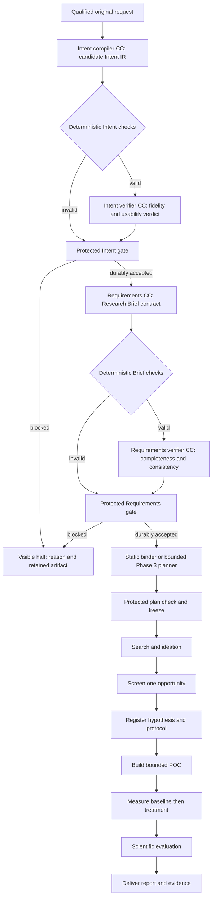
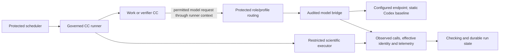
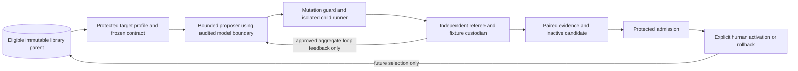

# System architecture

**Reading level: human immediate.** This page connects the whole M1 system. [Research design](research-design.md) expands each responsibility; [reference](reference/README.md) defines the information crossing boundaries.

## From meaning to a governed research program

Intake captures the original request and qualifies permitted local documents/assets. It rejects unreadable required inputs rather than silently losing them. Intent compilation identifies the user's problem, desired change and requested result. Requirements turns accepted meaning into the Research Brief contract. Neither compiler chooses the scientific solution.

Every later work box uses the same deterministic/verifier/protected-gate pattern; it is omitted from that portion for readability. If Intent is broken, Requirements is never invoked. If Intent records no workable purpose/result, its honest uncertainty is preserved and the gate halts. The user receives a specific correction request, not invented requirements or an automatic repair loop.

The Brief fixes objectives, mandatory outcomes, preferences, scope, constraints, deliverables and evidence obligations. The baseline binds a fixed SwarmFlow research sequence; the Phase 3 planner may propose compatible admitted CCs. Protected binding independently assigns checks and effective authority. Freeze captures the graph and pins before execution; future values remain typed references until their producing gates accept them.

Search produces cited candidates; Screening selects one with reasons; Hypothesis registers measurements and success/falsification boundaries before code/results; Builder packages a bounded intervention without running the scientific trial; Benchmark collects matched empirical evidence; Evaluation applies the registered criteria; Delivery reports the result and limitations. A scientific `FAIL` can be a correctly completed result and proceed to Delivery after infrastructure acceptance.

## Execution and model routing

Each M1 execution node has one work CC. Additional work CCs use separate gated nodes; verifier invocations remain separately governed checking assignments. Composite/merged CCs and internal member graphs remain later work.

The model boundary is shared by compiler, research, verifier and eligible RSI proposal calls. The runner binds the role/profile and effective limits; routing selects only an approved endpoint within that binding. Phase 1 uses fixed selection. Phase 3 integration may introduce heterogeneous routes and an alternate verifier, but never a hidden mid-call replacement. Missing required access blocks; unavailable token/cost telemetry remains explicitly unavailable. [Routing detail](model-routing.md) explains those seams.

Runner admission, node authority and run policy intersect per CC. Deterministic/semantic checking cannot undo effects, so execution confinement and disclosure permissions are enforced before work. Generated POC code cannot access gate state, referee fixtures, credentials or unrelated host paths.

## Where RSI connects

Required Target 1 improves a sandbox copy of Screening's pure ranking helper. It preserves incoming scoring dimensions, contract and referee. The M1 deliverable is a child plus evaluation/security evidence; it does not change live production ranking. Target 2 implementation-text changes are conditional on bounded headless model support. RSI shares audited model/evidence capabilities but has its own session, budgets and callback policy, outside the live research DAG. [Offline detail](offline-rsi.md) defines protected data partitions and limits.

## Placement, state and human inspection

The application image contains the frontend, same-origin web/control API and workflow runtime. Its entrypoint starts the product. The browser reaches container port 5173 through host-loopback publication, normally `127.0.0.1:5173:5173`. No external UI script or separate frontend container is required. A separate sidecar/benchmarker uses configured private-network service DNS and the container port, ordinary scoped authentication and a compatibility handshake; its own localhost is not the application.

SQLite owns durable lifecycle/release state. Immutable files retain artifacts and append-only observations; Run Bundles and derived scorecards cite them. Product account/profile state survives workspace/run deletion and is distinct from OS identity. Inspecting saved results never starts execution or changes accepted state.

Humans see readable Intent, Brief, major research artifacts, verification reasons, accepted/candidate status and limits. The UI or Markdown view is derived from the same versioned records. Raw traces remain available separately, with audience restrictions and redaction. Candidate files after a failed commit are not accepted outputs. Browser disconnection does not cancel server execution; restart preserves evidence and pauses interrupted attempts without replay.

## Full M1 and the next build

| Delivery phase | Required architecture and exit meaning |
|---|---|
| Phase 1: baseline, Stages 0–7 | Governed foundation; qualified request → accepted Brief → static bound research graph; search/screen/hypothesis; POC and matched measurements; scientific verdict/report; persistence, evidence and native workstation clients. Demonstrate real connected work and failure handling |
| Phase 2: Stage 8 RSI | Independent bounded Target 1 mutation/evaluation/evidence with frozen referee and security; sandbox candidate stays outside production. Target 2 depends on available bounded model execution |
| Phase 3: integration | Attempt every applicable advanced compiler, Team/Cluster planning, dynamic discovery/binding, heterogeneous routing, alternate verifier and Code Mode effort. Preserve baseline; distinguish validated, blocked and incomplete outcomes |

The **next build** is the Intent Compilation and Verification Slice: qualified text → compiler candidate → deterministic checks → read-only semantic verifier → protected committed acceptance or visible halt. It excludes Requirements, research and RSI execution. It is partial foundation/preparation evidence, not completed Stage 1 or M1. [Immediate Plan](immediate-plan.md) defines its bounds; [phase exits](delivery-phases.md) and [stage details](phase-details.md) define prerequisites, artifacts and exclusions before approving a larger build. Task and interface identities retain their history.

Composite/merged CCs, planning epochs, remote workers and recursive improver deployment remain context for stable boundaries, not M1 implementation. D5/D6 remain explicit source exceptions. Product acceptance requires PRD exits and implementation evidence; documentation checks establish only design consistency.
