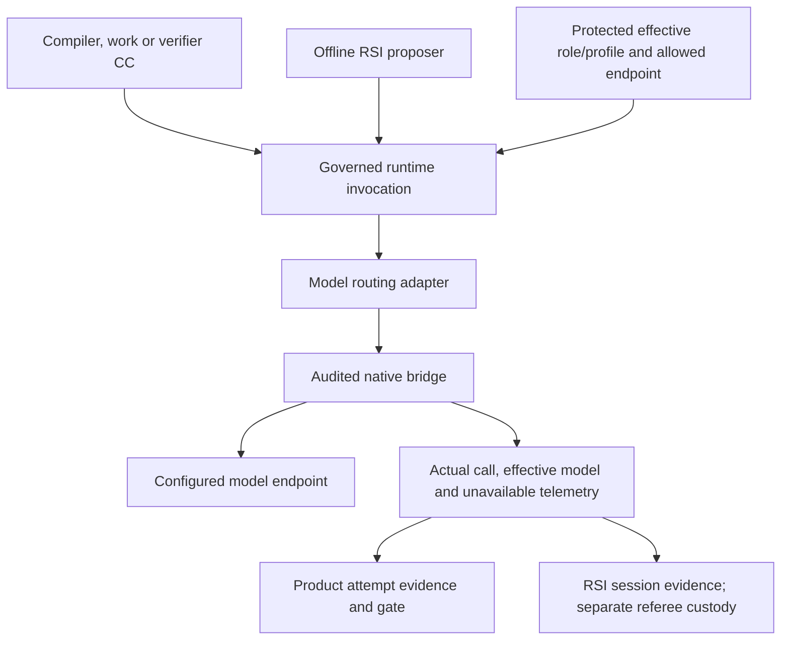

# Model routing and governed invocation

**Reading level: human potential.** Question: who requests a model, who selects it, and where are its effects/evidence controlled?

## Purpose and connections

The protected model boundary gives compiler, planner/research, verifier and eligible RSI proposer CCs one auditable route to configured model access. It prevents a capability from creating a private unaudited client, changing its own checking model, or bypassing execution/disclosure limits. The CC requests inference through its governed context; the runner attaches approved role/profile, scope and budgets before routing.

Product and RSI use the same boundary capability, not the same conversation, authority or evidence audience. Verifier invocation/context is separate from its producer. An independently owned profile selects its route; the producer cannot nominate favorable checking instructions or approve a different endpoint.

## Approach and readiness

Phase 1 selects the fixed approved native Codex route at run entry. Phase 3 can map roles to heterogeneous approved endpoints and test an alternate verifier through this adapter. Record requested versus effective provider/model/configuration, component pins, call identity, elapsed time, errors, observed usage when reliable and unavailable reasons otherwise. Native configuration identity is not independently verified served-model identity; label the distinction.

The declared budget applies across all permitted model/tool calls; each additional work CC has a separate M1 node. Tool/network/provider disclosure permissions are enforced before requests; a `network:none` capability can use only its specifically authorized injected bridge, not unrestricted socket access. Routing cannot widen permission or fabricate seed determinism/cost. Invocation-count and time limits remain enforceable when token telemetry is absent, consistent with PRD §4.7.4.

## Passing and blocking

Dispatch requires authenticated access, a supported route/profile, required model capabilities, bounded process/IPC ownership and permitted context disclosure. An unavailable mandatory connection or incompatible capability blocks readiness. A started call cannot silently switch model, retry or substitute cached output after failure. A newly chosen baseline is a separate attributable run. Label mocks and routing stubs; they prepare interfaces but establish no real model acceptance.

Avoid taking ownership of unrelated interactive model sessions. The model bridge is restricted local IPC or an approved provider adapter; it is not a publicly exposed TCP proxy. [Placement](placement.md) defines host/code isolation; [inspection](artifact-inspection.md) defines evidence views; [client fields](reference/other-contracts.md#client-and-model-boundaries) standardize exported identity and readiness information.

## Registry and two-stage selection

The bounded model registry records endpoint/version, declared versus verified capabilities (context, modality, tools and structured output), supported roles, access/health state and available usage metadata. The binder/planner chooses the admitted CC; the router never substitutes a different capability. Phase 3 first filters endpoints against required capabilities, access, disclosure and policy, then chooses among eligible endpoints under a pinned role/profile selection rule. Freeze the effective choice before the invocation. Empty eligibility blocks; no learned router, ensemble or mid-execution switching is introduced.

The [client/model field contract](reference/other-contracts.md#client-and-model-boundaries) supplies the registry/selection records. Implementation specifications choose the bounded selection algorithm and test its declared rule on matched cases, including no eligible model and unavailable telemetry.
