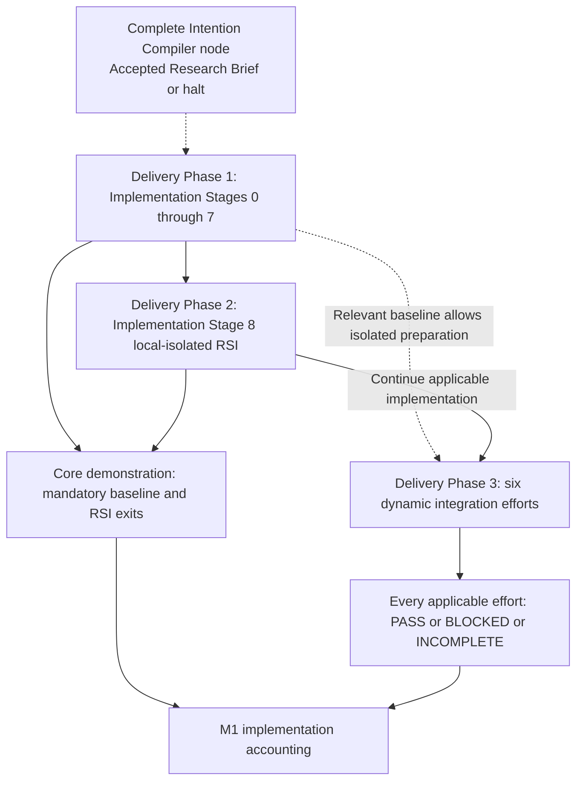

# M1 delivery phases, stage exits and complete Intention Compiler node

**Reading level: human potential.** Question answered: What prerequisites and exits distinguish the full M1 stages and delivery phases?

**M1 has three delivery phases.** Delivery Phase 1 contains the governed deterministic research baseline; Delivery Phase 2 contains required local-isolated RSI validation; Delivery Phase 3 contains expected dynamic integration efforts. Core demonstration requires Delivery Phases 1–2 and Implementation Stages 0–8. Every applicable Delivery Phase 3 capability must still be attempted and recorded. A documented advanced-feature gap does not automatically invalidate the core demo. This is a design allocation, not a claim that any exit has passed.

Use the [latest received PRD](sources/product/README.md), especially §§1.3–1.9 and 6.1–6.14, for exact scope and acceptance. Read [research responsibilities](research-design.md) for every workflow responsibility and [Intention Compiler](immediate-plan.md) for the first connected build. A delivery phase, implementation stage, scientific workflow responsibility and native SwarmFlow runtime phase are different concepts.

## Every implementation stage

The predecessor exits govern integration/completion; independent preparation may proceed earlier. Each boundary uses admitted capabilities, a protected Node Execution Contract, captured evidence and the same Evaluator Gate. Concrete executable verification procedures belong to the implementation verification artifacts; this document defines architectural exits.

| Delivery / implementation stage | Inputs and responsibility | Runnable exit and retained evidence | Design connection |
|---|---|---|---|
| Delivery Phase 1, Implementation Stage 0 (§6.3): runtime unblocker | Protected local configuration/identity, model credentials, bounded Codex adapter and secured IPC | Real bounded model request returns through JiuwenSwarm with required security; distinguish authentication, storage, security and HTTP liveness | [Placement](placement.md), [automation](automation.md)|
| Delivery Phase 1, Implementation Stage 1 (§6.4): governed backbone | Declaration/admission → static route/reviewer → durable evidence → runner → gate | Node A accepted output releases an actual bounded work Node B; invalid A prevents B; equivalent headless failure exits without human wait. Exact contracts, versions, effective config and decisions persist | [Capsules](capsules.md), [callbacks](failure-and-human.md)|
| Delivery Phase 1, Implementation Stage 2 (§6.5): intake, Brief, fixed graph | Text/documents, supplied project/data resources, defaults → complete Brief → static SwarmFlow bindings | Supported local request yields validated `Research_Brief.json` and initializes the fixed graph without autonomous planning. Intent alone cannot satisfy this exit | [Intent/Brief fields](reference/intent-and-requirements.md), [workflow](workflow.md)|
| Delivery Phase 1, Implementation Stage 3 (§6.6): evidence to hypothesis | Accepted Brief → bounded retrieval/candidates → fixed screening → hypothesis/protocol | `Candidate_Set.json`, `Opportunity_Card.json`, `Hypothesis_Blueprint.json` retain citations/constraints, and each gate controls advancement; freeze empirical criteria before build | [Research ports](research-design.md#research-path-and-ports)|
| Delivery Phase 1, Implementation Stage 4 (§6.7): Builder/POC | Accepted immutable Blueprint, scoped assets and declared environment | Bounded mechanically valid `POC_Artifact_Bundle.zip` accepted with construction/readiness evidence, without repair loop or scientific experiment during build | [Research ports](research-design.md#research-path-and-ports), [confinement](placement.md)|
| Delivery Phase 1, Implementation Stage 5 (§6.8): benchmark/science | Accepted POC, frozen baseline/data/protocol → empirical payload → evaluation | Demonstrate scientific positive and valid negative cases, with infrastructure acceptance permitting the appropriate downstream state. Raw observations and fixed criteria establish the conclusion | [Research ports](research-design.md#research-path-and-ports), [callbacks](failure-and-human.md)|
| Delivery Phase 1, Implementation Stage 6 (§6.9): Delivery/end-to-end | Accepted evaluation and complete cited artifacts → standardized report/package → local transfer | One request travels through all research responsibilities §3.1–3.9 with every governed transition recorded; user retrieves result and durable lifecycle closes | [M1 design](m1-design.md)|
| Delivery Phase 1, Implementation Stage 7 (§6.10): workstation shell | Stable research path → installer/init/doctor, visibility, CLI/web/TUI, local terminal, identity/security/config | Developer installs, initializes, executes, observes, inspects and retrieves complete workflow through supported local interfaces. Browser closure, interactive callbacks and headless behavior preserve runtime policy | [Operational shell](research-design.md#operational-shell), [automation](automation.md)|
| Delivery Phase 2, Implementation Stage 8 (§6.11): local-isolated RSI | Stable eligible ranking helper, fixed referee, protected fixtures, target allowlist and query limits | Bounded child evaluated outside live DAG; guardrail attacks are blocked/recorded; evidence/lineage reconcilable; no unauthorized contract/referee/live-version change. Human adoption/activation and rollback remain explicit; Target 1 sandbox delivery leaves production unchanged | [Offline RSI](offline-rsi.md), [RSI callbacks](failure-and-human.md#offline-rsi-is-a-separate-callback-policy)|

Implementation Stage 1 foundation obligations also apply to every later node. Implementation Stages 3–6 preserve original requests, accepted Brief, source references and protocol where needed; they do not consume only the immediately preceding text summary. Implementation Stage 7 does not delay basic secure startup/headless evidence needed for earlier testing. Implementation Stage 8 independent fixture/target preparation may begin early; accepted integration requires meaningful baseline evidence.

## Complete Intention Compiler: current bounded build

The [current build entrypoint](builds/intention-compiler/README.md) includes qualified local intake → verified Intent IR → verified Research Brief → protected enclosing-node release, plus governed runtime/model, evidence/state and bundled browser/container foundations. The earlier complete Intention Compiler node ended at accepted Intent; that scope is historical, preserved in frozen inputs.

This build proves the compiler boundary only when a real supported request reaches accepted Brief with required evidence. Halt scenarios need separate failure evidence. It contributes Stage 0/1 foundations and Stage 2 compilation, but does not initialize the fixed research DAG or complete Stages 3–8/Phase 3. A bounded test consumer checks Brief compatibility without implementing research stages. Existing task/interface identities are reconciled under native coding records, not renamed by this design.

## Delivery Phase 3 integration accounting

All six efforts below need declared scope, prerequisites, evidence and a recorded outcome. No real execution has been assessed by this documentation review.

| Expected effort (§6.12) | Connection / useful reuse | Entry, fallback and evidence boundary |
|---|---|---|
| Advanced intention compiler | Versioned adapter outputs the same accepted Brief semantics; preserves original-source attribution and unresolved items | Relevant bounded baseline operational; external compiler available enough to test. Isolated configuration; retain baseline compiler. Interactive modes need explicit bounded scope and the same callback policy |
| Agent Team / Cluster planning | Native local Leader/Team decomposition proposes objectives/roles/dependencies; may invoke a deterministic SwarmFlow subworkflow | Operational fixed research graph first. Leader self-check is preliminary; independent protected plan verification and freeze precede work. No uncontrolled post-start replan or remote worker infrastructure |
| Dynamic CC discovery/binding | [Symphony provider/catalogue seams](contracts-and-native-reuse.md#what-symphony-already-offers) expose eligible declarations; direct typed binding creates node contracts | Snapshot admitted inventory, exact pins, port compatibility, per-CC authority and node budgets. No match means infeasible, never implicit invention or installation. Retain fixed bindings |
| Heterogeneous model routing | Audited model-selection adapter records requested/effective role/profile/endpoint; native routing seams where compatible | Approved access only. Mocked routing supports interface preparation; real endpoint validation remains distinct. Keep static Codex fallback; failures never silently switch a started invocation |
| Alternate verifier | Existing read-only assessment interface with a pinned approved model profile | Preserve checks, gate criteria, evidence custody and protected release; compare fixed challenge cases. Separate provider may reduce one correlation, but does not establish error independence. Retain baseline verifier |
| Applicable OpenJiuwen Code Mode | Existing Builder/runner adapter uses available bounded coding capabilities | Verify actual pinned dependency support and confinement first; generated code cannot bypass declarations, contracts, network restrictions or gate evidence. Unavailable capability is documented, not simulated as real integration |

Disable an experimental configuration to restore the operational baseline. Automatic fallback must not erase an attempted failure or change a frozen run's model/graph; a newly selected baseline run is separately attributable. Preparation can overlap earlier work once its relevant baseline boundary exists; completion/promotion follows declared entry conditions. Scientific scope stays the research lane; implementation/specification classifications in §4.7 are subtask types within that lane, not unrestricted autonomous software engineering.

## Completion reports and evidence

The PRD requires `Phase_1_Completion_Report.md`, `Phase_2_Completion_Report.md`, `Phase_3_Completion_Report.md`, `M1_Final_Test_Report.md` and `M1_Implementation_Report.md` as evidence summaries. These summaries connect requirement coverage to exact candidates/configurations, underlying verification evidence, outcomes, failures, gaps and limitations. They remain separate from scientific Delivery reports. Reporting procedures and coding governance live outside this design.

Delivery Phase 3 outcomes use `PASS` only for implemented and validated declared scope; `BLOCKED` identifies an unavailable required upstream/external dependency; `INCOMPLETE` identifies behavior not yet demonstrated. Mock evidence and unrun tests are labeled. Core demonstration and complete implementation accounting are separate conclusions. Required failure injections, stage exits and Definition of Done remain decisive; an architectural checklist or report file does not establish acceptance. The source's October 31 target does not permit inventing per-stage dates or bypassing an exit.

## Source corrections and boundaries

The latest attachment remains verbatim. These resolutions apply to architecture and task allocation, with their source clauses recorded:

| Source ambiguity | Adopted resolution |
|---|---|
| §3.1.3 local single-user profile versus §§2.3/5.4 durable product account | Local profile means execution configuration; stable product account is separate. One active local context does not require enterprise multi-tenant separation |
| §4.8.3 Leader self-review/replan versus independent gate and no silent replan | Bounded preliminary proposal refinement may precede freeze; self-review never releases a plan. Blocking accepted execution halts; corrected work starts a linked new run |
| Node-time version resolution versus run freeze | Instantiate contracts from captured eligible pins, then bind exact accepted artifacts before node start. No mid-run active-version substitution |
| §4.2.8 minimal result example omits contract and participating CC identities | It is a minimum illustration; authoritative decisions also bind exact node contract, all participating invocations/versions and reviewed subject evidence |
| §6.13 lists detailed schemas/API work under Architecture Design | This package owns meaning, trust boundaries, critical schemas and major artifact fields. Implementation owns internal realization and concrete verification without weakening product obligations |

D1's prior dynamic-baseline exception is superseded by the new phase design. D5 retains two bounded compiler invocations instead of the literal one-generation fallback; D6 retains Docker/SQLite realization with separate account/profile authority. Those exceptions remain explicit in [decisions](principles.md#decisions-and-source-amendments). New account/phase/report requirements revise the earlier design baseline; do not claim they were already covered by older source captures.
