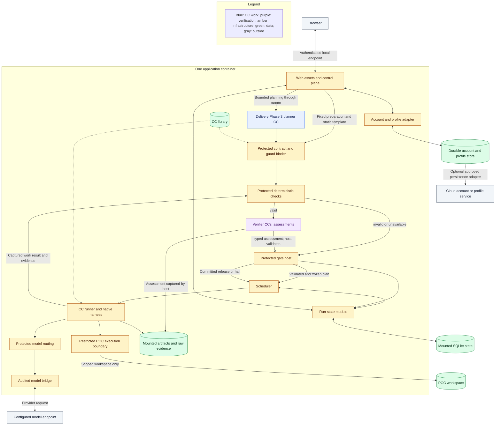
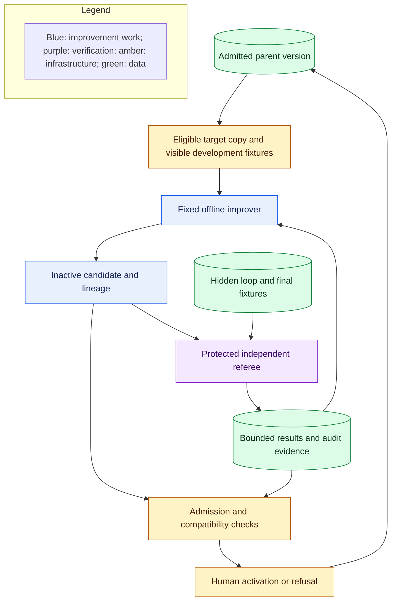

# Placement, evidence, and reuse

**Reading level: human potential.** Question answered: Where do frontend, runtime, evidence, models and isolated execution live?

## Deployment and boundaries

**Required now.** Use one authorized local execution host with Python services, the existing TypeScript web UI, SQLite authoritative run state and filesystem artifacts. Product identity is user-scoped, distinct from the local OS account; durable account/profile state survives run/workspace deletion. M1 keeps one active authorized execution context, without enterprise multi-tenant administration. Keep internal modules distinct without making them separate services. One container may contain several native processes.

The planner is invoked through the same runner; its separate box shows responsibility. The model bridge and restricted execution boundary are infrastructure, not CCs.

Build the browser frontend into the workflow application image and serve its static assets from that container alongside the web server/control API and workflow runtime. The container image supplies its own startup entrypoint so a containerized install can start and present the UI without a separate host-side helper script or frontend container. Publish the shared UI/API endpoint on host loopback only: default browser URL `http://127.0.0.1:5173`, mapping host `127.0.0.1:5173` to the application's container port `5173`. Listening on a container interface enables port forwarding but does not authorize LAN exposure. Persist data separately from the replaceable image; supply credentials through protected configuration, not declarations or output artifacts. The [Compose client topology](automation.md#local-compose-topology) shows the access path and benchmarker connection.

Use the existing Codex integration as the baseline model route. Preserve protected local IPC and owned execution context. Attempt approved alternate routing and verifier integration in isolated Delivery Phase 3 configurations, retaining the static Codex fallback. Every supported model call crosses the audited bridge; local run/capsule correlation stays in local telemetry rather than being added to provider prompts solely for attribution. Record time/calls and reliably available native spend/budget telemetry. Capture reliably exposed account allowance/limits/credits/reset separately; these are not per-invocation token or cost measurements. Absent reliable telemetry remains unavailable.

Generated POC code is untrusted. Docker packaging and a Python virtual environment do not prove confinement. Enforce scoped filesystem access, restricted identity, denied undeclared network/tools, resource limits, and separation from credentials, control state, library activation, and hidden fixtures. Do not expose the Docker socket. The owning task selects and verifies the available mechanism; if a mandatory boundary cannot be enforced, block execution. PRD §3.6.2 additionally forbids generated POC code from importing or using OS/network modules, including `os`, `sys`, `subprocess`, `requests`, `urllib` and `shutil`. The Builder/Verifier must reject a violating package before empirical execution; an intentional bypass is a required negative case. This product compliance rule does not constrain trusted provisioning/capture infrastructure in the same way. Prompt instructions or import scanning complement enforced confinement but cannot replace it.

Use a protected persistent account/profile store logically separate from run/workspace state; SQLite is a suitable initial realization, outside workspace deletion scope. Resolve account defaults then machine-local and project overrides into the frozen effective configuration. Never silently import prior unrelated research. A future cloud adapter may store approved profile/account fields; it cannot write gate state, access local project/hidden-fixture data, or become a remote control/callback transport. No cloud vendor is required for the local M1 baseline. Host-published workflow endpoints remain loopback with protected session authentication; private-network client access uses ordinary scoped authentication; stable account attribution does not replace these controls.

The [Compose client topology](automation.md#local-compose-topology) specifies network-port intent and benchmarker access. [M1 data ownership](research-design.md#data-and-state-ownership) identifies each authoritative writer and consumer.

Verifier disclosure and read capabilities are deliberately smaller than work capabilities. The [review-context contract](guard-design.md#output-led-review-and-controlled-disclosure) specifies permitted evidence, model audience checks, immutable subject views, prohibited effects and non-advancing outcomes when necessary evidence cannot be disclosed. These are enforced boundaries, not prompt-only instructions.

## Data foundation

**Required now.** The run-state module owns durable lifecycle, frozen graph, attempts, decisions, and accepted artifact references. The scheduler and control plane use that authority. Native queues, journals, caches, and UI traces are projections or dispatch aids.

Store exact inputs, implementation/configuration identities, produced artifacts, runtime evidence, raw verifier assessments, and gate decisions with run/node/attempt correlation. Keep declared behavior distinct from observed behavior. Tool-call logs alone do not prove absence of hidden filesystem or network effects; an unobserved mandatory condition cannot be treated as passed.

Release-essential artifacts and decisions must commit before advancing. Storage failure blocks release. Optional diagnostics may fail without changing execution, but their absence is explicit. This reconciles the supplementary data-source's best-effort capture hooks with the master PRD's durable gate boundary.

Preserve raw evidence before workspace cleanup or native retention deletes it. Derived run records, conformance views, scorecards, and exports can be rebuilt from that evidence. Separate agent working context from authoritative records. Keep credentials out of capture; raw prompts and supplied data remain locally protected. Any export must respect its permitted audience and hidden-fixture boundary.

Scientific benchmarking executes the user's baseline/treatment protocol. Platform benchmarking compares system variants on matched inputs and frozen effective configurations. Both use the same attribution foundation, but their measurements and conclusions are distinct. Exports record what actually ran, seeds where supported, component versions, gate evidence, and unavailable measurements. Gate-disabled ablations are evaluation runs, not valid product runs or admission evidence.

## Offline RSI

The [human-callback policy](failure-and-human.md#offline-rsi-is-a-separate-callback-policy) distinguishes ordinary candidate feedback, session faults and explicit activation. Runtime Evaluator Gate, offline referee and fixture oracle are different roles, defined in [the glossary](glossary.md).

**Required now for full M1; outside the first build.** Prepare the independent interface early so offline work need not wait for planner implementation. The initial required target is the pure `rank_opportunities` helper inside the Screening CC. Keep its input/output meaning, required dimensions, Top-1 behavior, and effect boundary fixed. Candidate mutations operate on a sandbox copy; production remains unchanged.

The [RSI connection design](offline-rsi.md) defines target profiles, data partitions, replay and future improver seams. Target 1 remains a sandbox child/evidence deliverable; the activation arrow applies only to explicitly eligible adoption, not automatic Target 1 production change.

The feedback arrow returns only the approved bounded loop information. Hidden fixture content, expected outputs, per-case hidden results, and final-evaluation feedback remain outside the proposer and candidate. Separate development, hidden-loop, hidden-final, and milestone data. Reserve final evaluation for terminal assessment; freeze scoring and evaluation identities before the session. Compare parent and child under the same relevant configuration and enforce the declared query/resource limits.

RSI may change only explicitly eligible implementation parts. It cannot change contracts, gate/verifier/check assets, security or mutation permissions, evidence stores, fixture custody, model weights, or activation controls. Enforce restrictions outside the mutable target. Preserve attempts, lineage, scoring, and violation evidence. Admission and human activation are separate from a better score; retain rollback. Target 2 mutates explicitly permitted Screening implementation text only when bounded headless model execution is available (PRD 4.4.1); otherwise defer it to M2 without blocking required Target 1 or M1 completion.

## Native reuse

**Required now.** Start from native UI/transport, SwarmFlow scheduling, Symphony agent/harness components, existing model integration, storage, and diagnostics. Historical integration audits are source leads, not proven integrations or current policy. [Human callback](failure-and-human.md#pattern-and-reuse-evidence) records current inspected native interaction leads.

At the installed dependency version, verify adapter behavior for swallowed exceptions, hidden retries, journal/cache replay, duplicate effects, cancellation, and background lifecycle. In particular, a native cached result cannot establish a committed CC gate pass. Keep model-process ownership separate from unrelated interactive chats. Concrete module files and private APIs remain implementation choices.

## Container startup, IPC and storage obligations

The application image pins frontend assets, runtime dependencies and shipped CC versions. Its entrypoint validates configuration, persistent-store access, session authentication and required security before accepting work; it serves inspection and explicit readiness failures when execution prerequisites are unavailable. Startup does not require a separate UI script or spawn a new experimental image for each POC.

For the containerized Codex baseline, package the approved CLI/bridge inside the application image and provision its existing subscription credential through protected operator configuration. Authentication preparation may require an operator action; it is not a host UI startup dependency. The runner uses owned restricted Unix-domain IPC inside the Linux container, with an ephemeral credential; no model-adapter TCP listener or broad host home-directory mount. Keep credentials and IPC inaccessible to the restricted POC identity. Native supported workstation deployments use the equivalent existing protected local IPC. An inaccessible subscription, unsupported CLI runtime or missing required GPU/device capability is an explicit execution-readiness blocker, never a silent host proxy or mock fallback.

Persist run-state, immutable evidence and account/profile state independently of image lifetime. Account/profile data is outside workspace deletion. Hidden RSI fixture storage has separate custody and no product/client/POC mount authority. Provisioning produces a restricted local worker on the same authorized host; Docker packaging does not grant the Builder container-orchestration or Docker-socket access. Retain the PRD unprivileged venv and enforce filesystem/network restrictions outside generated code. Doctor must demonstrate denied secret/control/fixture access and unavailable isolation must block execution.

Trusted provisioning resolves only the frozen, fully pinned dependency set. Validate archive paths, links and declared files before extraction; reject traversal and undeclared members. Provision from an approved prepared cache where available; any permitted package fetch is a trusted, bounded provisioning effect with fixed origins/content identities, never POC network permission. Missing pins, incompatible dependencies or unavailable packages halt. Freeze transitive dependencies rather than letting a later installer choose new versions. The user baseline executes from a read-only captured copy; treatment writes never alter it.

Browser exposure uses host-loopback publication; optional private clients use service DNS/container port and a scoped token. Raw container-interface listening is the D6 packaging exception to literal PRD loopback-process wording, not authority for LAN exposure. Secure token delivery uses the existing local bootstrap outside agent prompts and exports; private clients receive separately scoped credentials. Revocation blocks future control actions and dispatch as policy requires, preserving historical attribution. Image restart reopens saved records and pauses interrupted execution without automatic replay.

Required deployment verification includes image start without an external UI helper; browser/API same origin; denied LAN and unauthenticated/private-client access; persistent inspection after recreation; inaccessible secrets/control/hidden fixtures from POC; denied undeclared network; model IPC readiness; and failure without new dispatch when a mandatory boundary degrades. Exact container files and OS enforcement mechanism belong to implementation specifications and must prove these outcomes.

Startup also enables the native lossless trajectory store, configured trace-truncation limit sufficient for required evidence, and sandbox activity logging (PRD §5.2.1). Required evidence must survive native display truncation; raw logs remain outside agent memory. Boot checks assert the restricted product/POC identity cannot read hidden fixtures. Use the existing local one-time session bootstrap for browser authentication, never persist its token in exported URLs/logs; private clients use separately scoped credentials. This is ordinary local initialization, not an external UI helper requirement.

## Dependency preparation and provisioning

| Owner / time | Input → required result | Failure |
|---|---|---|
| Protected environment preparation, before research | Approved frameworks/platform → reviewed environment catalog; exact direct/transitive package versions, hashes and offline package availability | Unsupported platform or incomplete closure makes that catalog entry unavailable |
| Resource qualification / Hypothesis | Supplied baseline/data and compatible catalog → captured resources and selected immutable environment lock | No compatible prepared entry blocks before Builder |
| Builder | Accepted Blueprint and selected lock → unchanged lock as `requirements.txt`, bounded scripts and readable POC manifest | Undeclared imports, changed lock or unpinned transitive package blocks packaging acceptance |
| Trusted Benchmark provisioner | Accepted bundle/lock → containment checks, exact package verification and installation in unprivileged isolated environment | Missing/hash-mismatched package or provisioning failure halts; no resolver upgrade or automatic repair |
| Restricted scientific executor | Provisioned environment/frozen protocol → baseline then treatment measurements and raw evidence | Generated code cannot install, discover dependencies, access secrets or alter the baseline |

Protected preparation is outside Builder and generated-code permissions. M1 uses prepared package bytes; supplying a new framework requires protected preparation and a new linked run, rather than dynamic installation during work. A Python virtual environment provides dependency separation; filesystem/process/network confinement remains separately enforced. Exact locks enable reconstruction but do not prove scientific validity or package safety.
