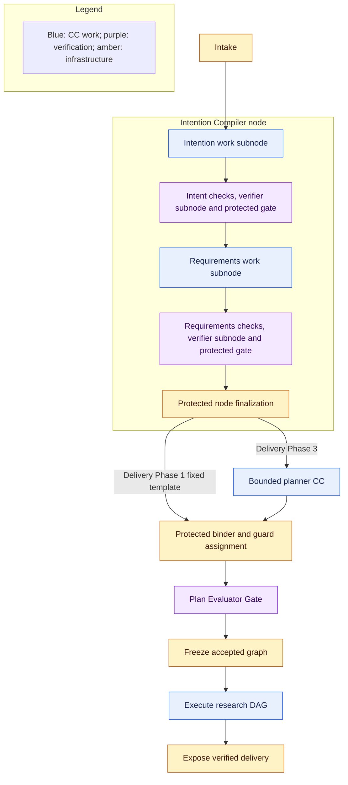
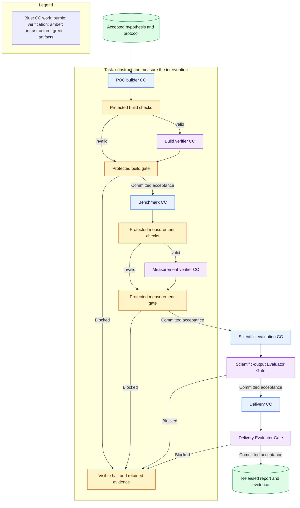

# Workflow: planning and execution

**Reading level: human potential.** Question answered: How are accepted requirements turned into governed work and dependencies?

## Establish intent before planning

**Required now.** Ordinary intake binds the original request and permitted documents, project assets, and validation data to a run. Reject empty or unreadable required input. Do not fetch undeclared datasets, clone arbitrary repositories, or turn missing evidence into observed facts.

D5 separates Intent and Requirement compilation, with independent verification at each boundary. The Delivery Phase 1 product entry remains bounded and non-interactive: one orchestration request produces the complete Brief without autonomous solution design. This intentionally permits two bounded compiler invocations rather than necessarily the PRD literal one-generation fallback; their combined time/call limits are frozen. The earlier complete Intention Compiler node exercised only the first; the current complete compiler build must reach accepted Brief. The accepted Research Brief states objectives, scope, constraints, deliverables, and evidence obligations. Preserve ambiguity; a material unresolved requirement blocks readiness. The [Intent/Requirements field contract](reference/intent-and-requirements.md) fixes shared information; protected default policy supplies only authorized missing parameters. A topic with no workable purpose/result halts rather than receiving invented intent. These fixed verification assignments cannot be removed by the planner.

Verification boxes include deterministic checks, a separate verifier invocation, and protected gate application, as specified in [capsules](capsules.md). A clarification or blocking result is recorded through the control plane; headless evaluation returns a blocking status without waiting for interactive input.

Preparation is a protected fixed sequence established by the run-state module before the research graph exists. It gives each enclosing preparation node and its work/verifier subnodes distinct node/subnode/attempt identities, admitted pins, input references, policy and budgets. The same runner and release boundary apply; a pre-freeze invocation is not permission to execute a proposed graph. Freeze authorizes only the later research DAG. This prevents a circular dependency in which the planner would need its own finished graph before it could run.

The [guard design](guard-design.md) defines shared profile resolution for fixed preparation and planned work. The protected binder remains present in both phases; a planner supplies a proposal, never a replacement for binding or independent guard assignment. Preparation templates are bound and checked before dispatch just as later contract templates are; research graph freeze is the later aggregate authorization.

## Planner choice and limits

**Delivery Phase 1 required baseline:** bind the hardcoded sequential SwarmFlow research graph and its admitted versions without autonomous planning. Check and freeze its contracts exactly as for any graph. It remains an operational fallback, not merely a comparison fixture.

**Delivery Phase 3 expected M1 integration:** use bounded direct typed CC selection and graph construction under D1. Inputs are accepted requirements, an admitted library snapshot, permitted resources, effective policy, and limits. Output is a captured candidate graph with objective-to-result coverage, input bindings, dependencies, and proposed additional checking assignments. [Plan and node fields](reference/other-contracts.md#planning-and-node-contracts) define required information; the binder independently derives mandatory checks. The planner cannot execute generated plan code, grant access, change active library versions, or waive required verification.

Generate a bounded set of candidates. Deterministic validation rejects missing or ineligible capabilities, incompatible port meanings, cycles, unbound inputs, denied effects, conflicting shared writes, absent verification, and exceeded limits. Semantic plan verification checks that the chosen work addresses the accepted objective; graph shape alone cannot prove coverage. No available capability means infeasible planning, not an invitation to invent one.

Rank feasible candidates first by comparable evidence of successful outcomes, then execution time and available cost. Keep sample counts and uncertainty visible. Unknown reliability remains unmeasured, and unknown cost is not zero. The selected planning profile pins the bounded search, comparison rule, conservative defaults and ties. Preserve a fixed reference graph for regression and matched comparisons. A single feasible candidate provides no evidence of optimization.

This is the best candidate found within a declared search budget, not globally optimal planning. A separate logical-operator layer would add binding flexibility but also another representation to reconcile; direct CC bindings give the Delivery Phase 3 path one inspectable execution boundary shared with the static baseline. Retain objective mappings so later logical planning can lower into that same boundary. Separating graph proposal, dependency dispatch and execution makes their evidence and authority independently inspectable.

## Freeze and unknown future values

**Required now.** Freeze the accepted topology, exact CC and dependency versions, verification profiles, policy, limits, and input references before planned execution. Store Node/subnode contract templates and hashes at freeze; instantiate concrete future-input references against that captured snapshot as predecessor results become accepted. Record the final contract identity before dispatch. No active-library change can alter an existing run, and no post-start contract edit is permitted. Future producer outputs are typed references, not already-known values. Freeze does not claim that a hypothesis or measurement exists before its producer runs.

Choose capabilities whose declared input range covers the supported M1 research domain. Use one opportunity and one hypothesis path. The Hypothesis CC establishes and freezes the baseline, validation resource, measurement definitions, success/falsification boundaries, and protocol before POC generation or empirical execution. Downstream work may apply that protocol but cannot edit it after seeing results.

Evaluate preconditions with the same semantics at planning and dispatch. Known false conditions reject a plan; value-dependent conditions remain explicit dispatch obligations. An unsupported hypothesis, missing resource, or false dispatch precondition blocks the run. Do not silently choose another capsule, alter the graph, or create a new protocol. Immutable pins prevent version substitution; current suspension/revocation may still block a pinned version at start or release. Multiple planning epochs remain a future possibility, not M1 behavior.

## Tasks, nodes, and verification

**Required now.** A task groups objectives; a node is a governed objective instance, not a CC call. Protected runtime assembly creates its Node Execution Contract from accepted requirements, fixed or approved planned bindings, admission metadata and policy. It binds input/output meaning, acceptance/proof obligations, resource/effect limits and exact CC versions. M1 binds one work CC per subnode; additional work CCs use separate gated subnodes within their declared node. Verifier calls are separately governed checking assignments. The PRD permits broader capability sets, but arbitrary capsule member graphs and composite/merged CCs remain later work. Required invocation checks remain, and node-level aggregate verification authorizes successor nodes.

Build and measurement show their deterministic checks explicitly; combined scientific-output and Delivery Evaluator Gate boxes include deterministic checks, read-only assessment and protected decisions. Dependency arrows mean runner-mediated transfer of accepted artifacts, not direct calls that bypass gates. A verifier assessment comes from a separately governed verifier subnode; neither is the downstream work Node B. All participating invocation evidence is aggregated against the node contract. Only committed node acceptance releases successor nodes. Verifiers do not recursively require semantic verifiers.

## Scheduling and failure

Use the [failure and human-callback policy](failure-and-human.md) as the single routing authority. The [research port table](research-design.md#research-path-and-ports) supplies all stage inputs and outputs.

**Required now.** Dispatch dependency-ready nodes only after their required predecessor gates have durably advanced. Reuse an equivalent native topological scheduler. M1 uses one active research run and a sequential research path. Future independent-node execution requires declared effects/resources, an explicit execution profile and separate validation; it is not introduced by D1.

A blocking execution, verification, security, budget, or persistence failure stops new work dispatch for the whole run. Preserve in-flight outcomes and attempt evidence; cancellation does not undo effects already performed. Default to zero automatic repair or replay. A human correction creates attributable new work and must pass verification; a changed graph or objective needs a new plan and freeze. Never overwrite a failed attempt.

Browser disconnection does not cancel execution. Restart preserves accepted results and marks interrupted attempts paused for inspection. No native cache entry can replace an authoritative gate decision or justify repeating an uncertain effect. The first build starts a fresh run rather than resuming in place.

Scientific rejection or inconclusive measurement is different from infrastructure failure. Valid evidence and correctly applied criteria can advance to Delivery, which discloses the result and its limitations. All report preparation happens inside the application; the control plane transfers the accepted artifacts.

## Concrete execution boundary

Protected binding creates the enclosing node contract and exact [Subnode Execution Contract](reference/node-execution.md) before dispatch. Participating bindings name admitted declaration/body/dependency pins, role, effective authority and per-call limits; parent node limits bound their aggregate; subnode limits narrow each assignment. Inputs carry named typed ports and exact refs, outputs name catalog contracts/versions and evidence obligations. The guard profile is pinned in the contract; the bound check plan references that finalized contract without a hash cycle. Missing input or unsupported authority blocks dispatch, never becomes a placeholder observed artifact.
