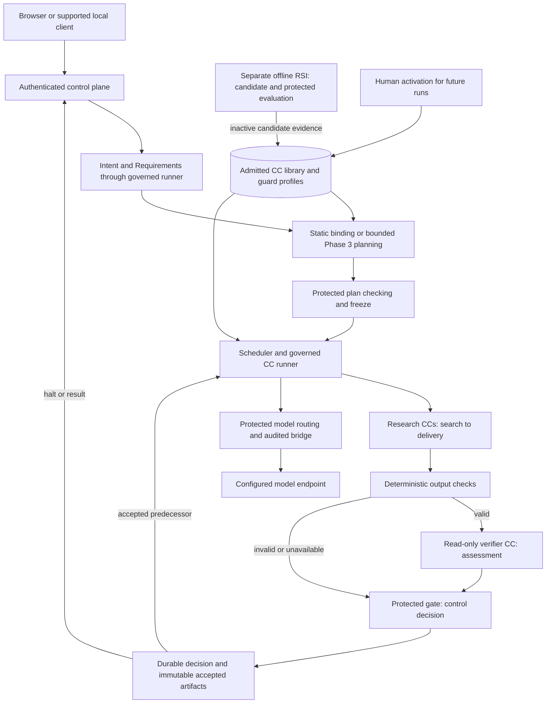

# Complete M1 system

| Path | Connections and authority |
|---|---|
| Preparation | User/client → authenticated control plane → qualified request/resources → Intent compiler → deterministic checks → read-only Intent verifier → protected gate → Requirements CC → same checking → accepted Brief |
| Planning | Brief + eligible library snapshot + policy → static binder (Phase 1) or bounded Leader proposal (Phase 3) → independent plan checking/freeze → concrete contracts → scheduler |
| Research | Search/cited candidates → Screening/one opportunity → Hypothesis/frozen protocol → Builder/package → Benchmark/matched measurements → Scientific Evaluation/classification → Delivery/report and evidence |
| Runtime | Scheduler dispatches only committed eligible work; governed runner enforces scope/budgets, invokes admitted CCs and captures observations; deterministic checks then verifier assessment feed protected gate and durable state |
| Models | CC/role/profile through runner → bounded registry/route → audited bridge → configured endpoint; response, actual identity and available telemetry return to attempt evidence |
| Data | Immutable files retain content/observations; SQLite owns lifecycle/release; Run Bundles/scorecards/export and native memory are records/projections, not alternative authority |
| RSI | Protected target profile + parent → isolated proposer/guard/runner → independent custodian/referee → paired evidence/inactive child → admission/human activation or rollback for future selection |
| Product shell | Native CLI/Web/TUI share control plane; saved artifact inspection is read-only; stable account/profile store is separate from run/workspace |

All work steps use capture, deterministic checks, semantic verification and protected durable release; no direct unchecked producer-to-consumer calls. The [research obligations](research-design.md) define consumer usability. Scientific FAIL/INCONCLUSIVE can correctly pass infrastructure checking and reach Delivery.

One app image contains frontend/service/runtime; its entrypoint starts them. Browser uses `http://127.0.0.1:5173` through `127.0.0.1:5173:5173`; optional sidecar uses private service DNS/port and scoped authentication. POC execution has a restricted identity/filesystem/network boundary distinct from packaging. Account, state, evidence and hidden fixture custody have separate lifetimes/access.

Restart pauses interrupted attempts without replay; browser disconnection leaves server work running. Headless failure returns non-success without waiting. [Placement](placement.md), [failure handling](failure-and-human.md) and [field contracts](reference/other-contracts.md) define compatibility.

## System connections

