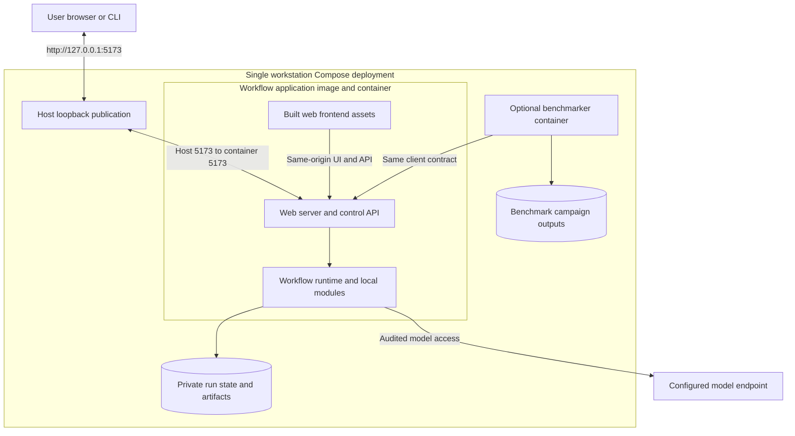

# Placement and deployment

One authorized local host; one application image bundles frontend assets, same-origin web/control API and runtime. Multiple protected native processes are allowed. Image entrypoint starts services and validates configuration/storage/authentication/isolation. No host UI script or separate frontend container is required. Browser reaches `http://127.0.0.1:5173`; publish `127.0.0.1:5173:5173`. Container-interface listening enables forwarding/private clients, never LAN access. This is D6's exception to literal process-loopback wording.

Private sidecar/benchmarker uses application service DNS/container port, compatibility/readiness handshake and separately scoped credentials. It cannot mount state/fixtures or control gate policy. Optional tooling is not an M1 prerequisite.

Package approved Codex CLI/bridge inside the Linux application image; operator provisions existing subscription authentication through protected configuration. Use owned Unix-domain IPC and ephemeral credential, not adapter TCP or a broad host home mount. Native supported workstation uses equivalent protected IPC. Missing subscription/runtime/device blocks execution; no silent host proxy/mock fallback. Provider credentials, gate state and hidden data are inaccessible to POC code.

Persist SQLite lifecycle, immutable files/evidence and account/profile state separately from replaceable image/workspace. Hidden RSI store has separate custody. Account defaults → local machine → project overrides resolve before run freeze; no override widens policy. Native memory holds compact reasoning references. Files/decision must persist before release; orphans grant none. Browser disconnect preserves execution; restart pauses without replay.

Generated POC uses a restricted local identity, scoped copies of baseline/data and `/workspace/poc/`, denied undeclared network/tools and observed limits. Container packaging/venv/import scanning alone do not prove confinement. No Docker socket or per-POC orchestration. Forbidden generated modules include `os`, `sys`, `subprocess`, `requests`, `urllib`, `shutil`; trusted infrastructure operations are distinct.

Trusted provisioning rejects archive traversal/links/undeclared files and unresolved direct/transitive pins. Use approved cached packages or explicitly permitted bounded trusted fetch with fixed origin/content; POC gains no network authority. Missing/conflicting dependencies halt without repair. Baseline copy stays read-only; treatment cannot alter protocol. Model and isolation readiness must be proved; unavailable enforcement blocks.

Verify startup without UI helper, same-origin access, denied LAN/unauthenticated access, persistent inspection after recreation, denied secret/control/fixture/network access and IPC readiness. Exact OS/container mechanisms belong to implementation specifications. Optional cloud profile persistence is not a cloud research-data/worker service.

## Container access

Startup enables lossless trajectory capture, required trace retention and sandbox activity logs; boot checks deny restricted identity access to hidden fixtures. Native one-time local browser token bootstrap stays out of logs/exports; private clients use separately scoped credentials.
