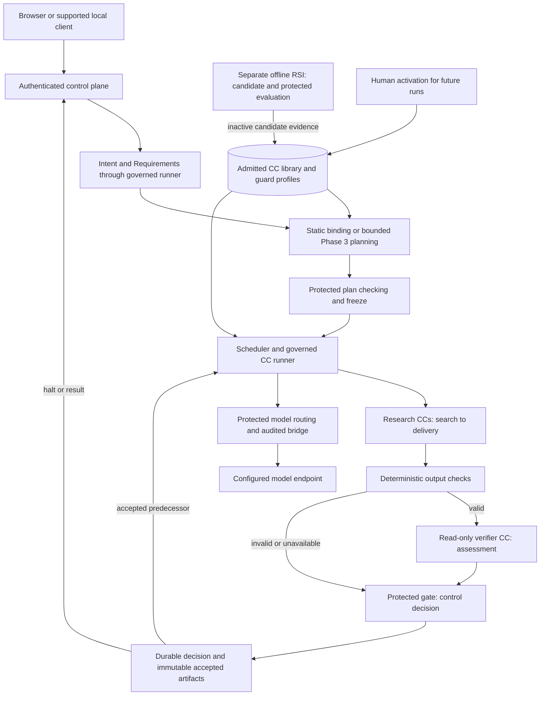

# AI4Research M1 design package

**Reading level: human immediate · October 7, 2026 · branch `ai4r_muk`.** This folder is the sole maintained architecture. Start here. The [current PRD](sources/product/prd-m1-current-2026-10-07.txt) defines product requirements; this package explains the system that realizes them. The [source index](sources/product/README.md) preserves receipt identities and explicit local exceptions.

## Required reading order

The complete first human route is five documents. It explains the whole system without requiring schema review. The PRD accompanies the route; its contents are not repeated here.

| Order | Human immediate | What you should understand |
|---|---|---|
| 1 | This README | Purpose, reading levels, system picture and ownership |
| 2 | [Principles](principles.md) | Invariants, CC/verifier/gate responsibilities and source decisions |
| 3 | [System architecture](m1-design.md) | Workflow, model routing, data, RSI and application placement |
| 4 | [Delivery phases](delivery-phases.md) | Complete M1 commitments, prerequisites and exit meanings |
| 5 | [Immediate Plan](immediate-plan.md) | The first bounded build and what it must demonstrate |

## For design authors and human reviewers

[Design method and architectural integrity](design-method.md) explains the role and depth of architecture, tiered human review, change propagation and integrity checks. It guides design maintenance; the five-document product reading route stays unchanged.

## Human potential: deepen a particular question

These documents preserve consequential detail for authors and reviewers. They explain purpose, inputs/consumers, broad approach, passing/blocking behavior, authority and rationale. They are not another mandatory cover-to-cover route.

| Question | Detailed design |
|---|---|
| What makes Intent usable, and how does it become Requirements? | [Intent and Requirements](intent-design.md) |
| How do plans freeze, bind future inputs and execute? | [Workflow](workflow.md) |
| What does each research responsibility produce? | [Research design](research-design.md) |
| What is a CC, and how do checking and library changes work? | [Capsules](capsules.md), [authoring](capsule/authoring.md) |
| Who assigns checks and constructs verifier evidence? | [Guard design](guard-design.md) |
| Where do models, generated code, state and the browser live? | [Placement](placement.md), [model routing](model-routing.md) |
| What happens after a halt, cancellation or restart? | [Failure handling](failure-and-human.md) |
| How do people inspect results and technical evidence? | [Artifact inspection](artifact-inspection.md), [automation/client boundary](automation.md) |
| Where is RSI and what can it change? | [Offline RSI](offline-rsi.md) |
| How do stage exits relate to delivery phases? | [Phase details](phase-details.md) |

## AI reference: implement compatible boundaries

Read [reference principles and index](reference/README.md) for field contracts, selected exact schemas and readable examples. [CC fields](capsule/declaration.md) preserve the reusable declaration inventory. [Vocabulary](glossary.md), [clause coverage](coverage-allocation.md), [source decisions](authority-index.md) and [design review](coverage.md) support tracing, not a second architecture.

Reference material defines shared meaning and required fields. Agents choose internal classes, algorithms, prompt wording, transport adapters and storage realization within these contracts. They cannot replace shared representations independently. Routine preparation requires no historical-schema search.

## System picture

AI4Research turns a supplied research purpose and local assets into a grounded opportunity, registered hypothesis, bounded POC, matched measurements and a readable report. Every work output is a candidate until protected checking and durable acceptance permit its use.

Preparation and planning use the same checking pattern shown for research. The runtime feedback edge represents dependency release, not a cyclic research graph. RSI is outside live research execution; its scores cannot release product work or activate themselves.

## Responsibility and authority

| Component | Owns | Connects to |
|---|---|---|
| Compiler/work CC | Candidate artifact fulfilling its assigned responsibility | Runner supplies inputs; checking consumes outputs |
| Verifier CC | Read-only verdict, findings, reasons and uncertainty about the submitted artifact | Protected review context in; assessment out to host |
| Binder and gate host | Effective contracts/check assignments and advancement decisions | Accepted requirements, admitted pins, policy, evidence and durable state |
| Scheduler/runner | Eligible dispatch, scoped execution, budgets and observed evidence | Frozen contracts, CCs, model bridge and restricted experiment executor |
| Control plane | Authenticated submission, inspection and visible results/blockers | Browser/CLI/TUI and server-owned run state |
| Offline RSI | Bounded implementation improvement and comparable evidence | Protected target profile, isolated runner/referee and inactive library candidates |

CC authors do not implement workflow release. A JSON-shaped answer is not proof that work succeeded. Humans can inspect Intent, Requirements, verdicts and halt reasons without decoding anonymous binary objects.

## Deployment and scope

One workflow application container bundles the frontend, web/control service and runtime. The browser uses host loopback, by default `http://127.0.0.1:5173`; the image entrypoint starts the application. No external UI helper is required. Internal model access is protected; generated scientific code has a separate confinement boundary. The optional [development sidecar](development-tools/sidecar/README.md) is an ordinary authenticated client on the private container network, outside product agents and M1 delivery dependencies.

Full M1 includes the baseline research journey/workstation, independent isolated RSI, and the applicable bounded dynamic integration efforts. The immediate slice ends at accepted Intent or a visible halt. Future fusion, remote workers and live self-modification are compatibility/research directions, not implied implementations.

## Review and evidence

The architecture must answer: who produces each artifact, who consumes it, what makes it usable, who may advance, and what the user sees when it is blocked. [Design review](coverage.md) records source coverage, challenge cases and limitations. Documentation does not establish runtime acceptance.

The PRD stays verbatim. [Decisions](principles.md#decisions-and-source-amendments) identify authorized local departures, especially D5's two compiler generations and D6's packaging realization; literal zero differences are not claimed. Historical material is optional provenance. The separate very-condensed experiment is a historical comparison input and is not a substitute for this revised three-level package.
