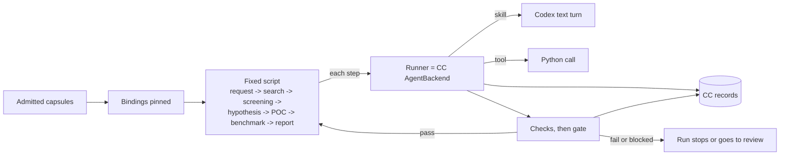

# A possible first design

> **A possible first design. Not decided; pre-milestone. Shows only the primary workflow as a fixed system.**

One way the primary AI4Research workflow could run on jiuwenswarm as a hardcoded sequence of capsule calls, with CC's tools around each call. One model, through the Codex subscription runtime.

Code read: jiuwenswarm `ai4r_main_branch` at `6d8c89e12`; jiuwenswarm paths are under `jiuwenswarm/jiuwenswarm/`. agent-core paths are under `openjiuwen/`, read in a clone at `e23806c1`. jiuwenswarm pins agent-core `9e339019` (`pyproject.toml:20`), which we could not read, so agent-core lines need a re-check at the pin.

## What the runtime allows today

The Codex subscription runtime is text chat only. `codex_start.py:21` sets `JIUWENSWARM_AGENT_SDK=codex_subscription`, so `create_adapter` returns `CodexSubscriptionAdapter` (`server/runtime/agent_adapter/agent_adapters.py:144`). It refuses team mode, skills, MCP, plugins, agent templates and attachments (`interface_codex.py:39-42`). The App Server runs read-only, with shell, web search and MCP off (`server/runtime/codex_subscription/transport.py:76-88`). No DeepAgent is built, so its rails (`SkillUseRail`, the permission rail) do not run.

So in this design **the model would call no tools. The runner would call every capsule itself.** A `skill` capsule would be one model turn. A `tool` capsule would be a Python call.

## How the fixed sequence could run

The sequence would be a Swarmflow script, run by the engine directly through `run_workflow(path, backend=...)` (agent-core `agent_teams/workflow/engine/runner.py:294`). The team launcher `run_swarmflow` builds DeepAgent workers on a `Model` (`agent_teams/workflow/runner.py:228`), so this design would not use it. CC would supply the backend: its `AgentBackend.run(prompt, opts, schema_json, call_key)` (`engine/backends/base.py:102`) would be the runner. Each step would be one `agent()` call (`engine/primitives.py:540`) with `label` = step id, `phase` = stage and `schema` = one JSON Schema object with a property per output port.

The stage names in the diagram are illustrative; they are not taken from a cited source.

1. **Start.** A run would start in the agent server, the process that holds the signed-in Codex child. One way is a new adapter method, such as `cc.run.start`, registered in the agent server beside `CodexAccountAdapter` (`server/agent_ws_server.py:1133-1135`); the gateway only forwards it (`gateway/app_gateway.py:2159-2191`). Adapters return one reply, so it would start a background run, return `{run_id}`, and push progress and the answer with `send_push`. The smaller way is a CC-run branch in `CodexSubscriptionAdapter` (`interface_codex.py:33-49`) on the existing `chat.send` stream; [B1 uses that](b1-design.md#through-jiuwenswarm-the-deep-view).
2. **Pre-run check.** Each capsule must have been admitted earlier. The Binding writer reads its Standing: no `admitted` Standing, no run.
3. **Binding.** At run start the workflow runtime writes one Binding per step: its `decl_hash`, `code_sha256`, checks and budget. The script reads only the Bindings.
4. **Call.** The runner re-hashes the code and refuses on a mismatch. It calls the capsule, stores the output as an Artifact and writes an Observation.
5. **Check.** After each step the script calls `gate(step)`: deterministic and reference checks first, then judged checks through the Binding's judge capsule. The gate writes a Verification. A deterministic `fail` or any `blocked` stops the run; a judged `fail` goes to a person for review (policy `blocking`).
6. **Report.** The last Artifact is the report.

**Model calls.** `SubscriptionService.stream` (`codex_subscription/service.py:131`) serves chat: one thread per session, text in, deltas out. Capsule calls would need the text/JSON service the AI4R-001 plan proposes (`specs/AI4R-001-codex-subscription/plan.md`, §4 item 7): one isolated thread per call, with an `outputSchema`. It would reuse `AppServerTransport` (`transport.py:30`).

Until that service exists, a capsule call can be a `stream` turn:

- **A fresh synthetic session id per call.** `stream` takes no epoch and no `outputSchema`, so the output schema goes in the prompt as text. Each id stays in `subscription/bindings.json` for good, and every turn gets the chat's fixed developer instructions.
- **The engine checks the schema and retries.** `agent()` retries when the backend raises, when a `timeout` option expires, or when the result fails the schema it passed. So the backend returns an envelope, such as `{value, decision, obs_id}`, that always matches that schema, and the gate checks the port. No call sets `timeout`; the runner enforces the time budget.
- **Resume sees only the prompt.** The engine's resume signature covers the prompt, `label`, `phase`, `model` and the schema, not other options. So the capsule name, `decl_hash` and input hashes go in the prompt or `label`; otherwise a run is never resumed.
- **One Codex child for every session.** A failed, timed-out or cancelled turn closes the shared transport (`service.py:197-208`), which kills the child for the user's own chat too. The model adapter never cancels a turn mid-stream.

**Records.** CC records could go in `cc/` under the profile root (`JIUWENSWARM_DATA_DIR`, `common/utils.py:416`), keyed `cc/<kind>/<scope>/<id>` and written with `exclusive_set`. That is beside jiuwenswarm's own: `agent/sessions/<id>/history.jsonl` (`server/runtime/session/session_history.py:255,324`), `agent/.logs` (`common/utils.py:2406`) and `subscription/bindings.json` (`service.py:25`). The Swarmflow journal path (agent-core `agent_teams/paths.py:360`) is team-scoped; a non-team `run_workflow` takes `journal_path` instead, with `resume` set to the same path so a run can resume. Observations would carry the run id and `call_key` in `ext`, so they join the journal.

## Where each CC piece could hook in

| CC piece | Hooks into (file:line) | Reuse or new |
|---|---|---|
| Run entry | agent server: `GatewayAdapter` (`server/runtime/gateway_adapter/base.py:30`), registry in the agent server (`server/agent_ws_server.py:1133`); or a branch in `CodexSubscriptionAdapter` (`interface_codex.py:33-49`) | new adapter or branch, reused pattern |
| Fixed sequence | agent-core `run_workflow` (`engine/runner.py:294`), `agent()` (`primitives.py:540`), `phase()` (`:1506`), `load_workflow_source` (`engine/loader.py:97`) | reuse |
| Runner | `AgentBackend` (`engine/backends/base.py:39,102`) | new backend, reused interface |
| Model call | `AppServerTransport` (`transport.py:30`); proposed text/JSON service | new, on reused transport |
| Skill capsule | files read by hash from the CC store; `SkillUseRail` (built at `interface_deep.py:8063`) needs a DeepAgent | new |
| Tool capsule | agent-core `LocalFunction` (`core/foundation/tool/function/function.py:48`) | reuse |
| Admission | `compute_content_checksum` (`server/runtime/skill/archive_store.py:220`) hashes a whole folder; CC hashes per file | new |
| Binding | written by the workflow runtime before the first `agent()`, one per step; run id on `Runtime` (`engine/runtime.py:49`) | new |
| Checks and gate | Symphony `Evaluator` (`symphony/evaluation/base.py:139`); engine `verify()` (`primitives.py:882`) returns pass, fail or undecided from reviewer votes (`engine/verify.py:83`), not per-check results, so unused | new |
| Budget | `run_workflow(budget=...)` with `BudgetLedger`; `AgentResult.tokens` (`base.py:35`) | not reused: the engine budget counts tokens only, and Codex reports none. The runner enforces a time budget; engine budgets stay unbounded |
| Permission check | `PermissionEngine.check_permission` (`harness/security/permission_engine/core.py:272`); the rail (`agents/harness/common/rails/permissions/permission_interrupt_rail.py:44`) needs a DeepAgent | reuse the engine, if it runs standalone |
| Records store | `BaseKVStore.exclusive_set`, `get_by_prefix` (`core/foundation/store/base_kv_store.py:42,93`); `BaseObjectStorageClient` (`core/foundation/store/object/base_storage_client.py:7`) | reuse |
| Run view | `run_workflow(progress_sink=...)`; `WorkflowMonitorHandler` (`agents/harness/team/handlers/workflow_monitor_handler.py:27`) needs a team monitor, but its state builder `WorkflowRunState` (`workflow_state.py`) does not | reuse `WorkflowRunState` in a CC sink that emits `workflow.updated` |

## Not in this design

- planner
- RSI
- model routing
- librarian
- importers
- composites

Also left out: human triage (`human()`), MCP and A2A capsules, team mode.

## Open questions

- **The pin.** agent-core lines come from `e23806c1`, not `9e339019`.
- **Engine outside team mode.** `run_workflow` takes any `AgentBackend`, but nothing in jiuwenswarm calls it that way today.
- **Structured output.** `outputSchema` is in the App Server protocol, but the plan's research proves syntax only.
- **Tokens.** `service.py` reads no usage events, so token budgets and Observation token costs stay empty.
- **Where POC and benchmark code run.** App Server is read-only with shell off. jiuwenbox is a Linux sandbox; this runtime runs on Windows.
- **Permission engine.** Does `PermissionEngine` run without a DeepAgent?
- **Run view.** Does the browser's workflow tree render a non-team run's `workflow.updated`?
- **Restart.** A restart forces `NEW_SESSION_REQUIRED`. Does a CC run resume from the journal or restart?
- **Naming.** In `service.py`, `bindings` maps sessions to threads. A CC Binding pins capsules.

## Read next

[Capability Capsule](capsule/capsule.md) · [Tools](capsule/tools.md) · [Schemas](schemas/schemas.md) · [Binding](schemas/binding.md)
