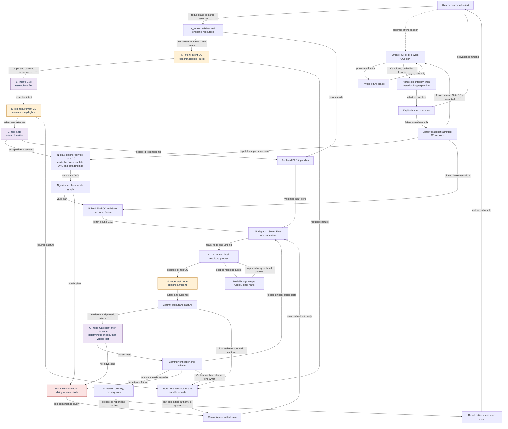
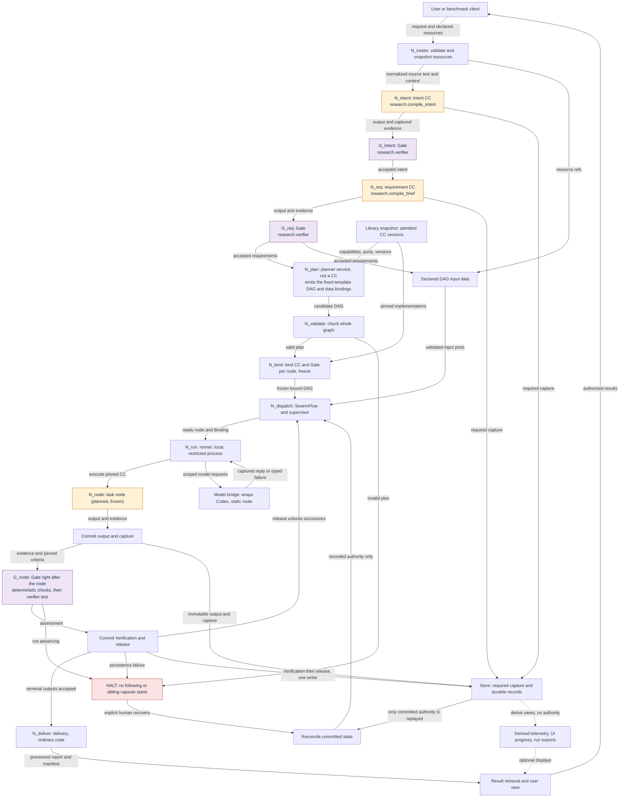
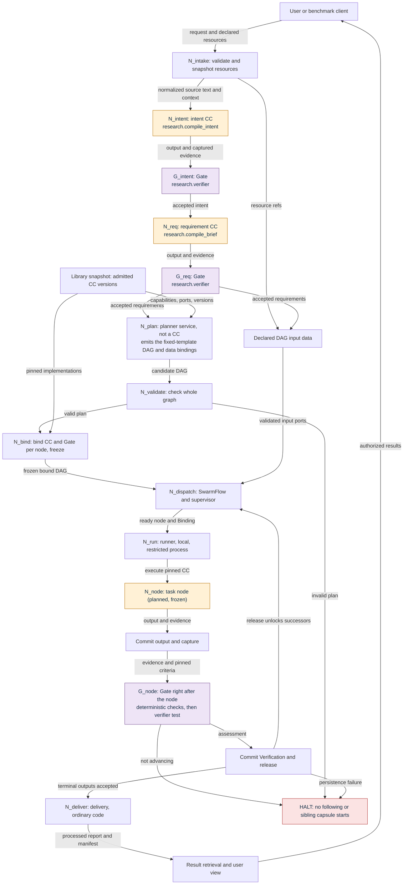

# Flow variants: smaller views of the same graph

> Answers: What does the flow look like without observability, without RSI, and with core nodes only?

These three diagrams are **generated** from the graph source in [flow](flow.md#graph-source-edit-here-then-regenerate) by `python _tools/flow_views.py`. Never edit the generated block. The full view is on [flow](flow.md).

## Without observability

Observability branches are removed from the drawing only. Required capture and durable records still happen. Hiding a display never disables evidence.

<!-- generated:flow-no-observability -->

<!-- /generated:flow-no-observability -->

## Without RSI

Production flow alone. [RSI](rsi.md#term-rsi) never [runs](system/lifecycle.md#term-run) inside it. [RSI](rsi.md) is the separate area.

<!-- generated:flow-no-rsi -->

<!-- /generated:flow-no-rsi -->

## Core (neither)

The smallest picture: request in, governed DAG, answer out. Store, [halts](system/lifecycle.md#term-halt) and recovery are left out of the drawing only.

<!-- generated:flow-core -->

<!-- /generated:flow-core -->
