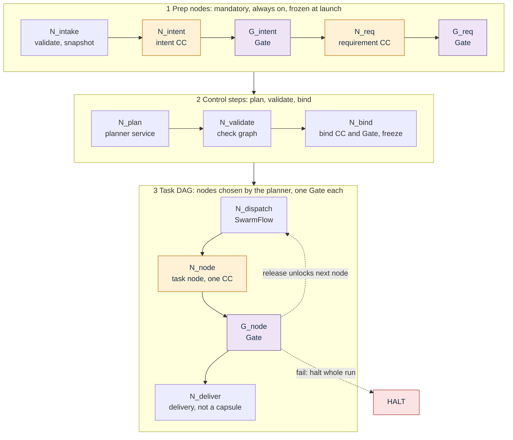
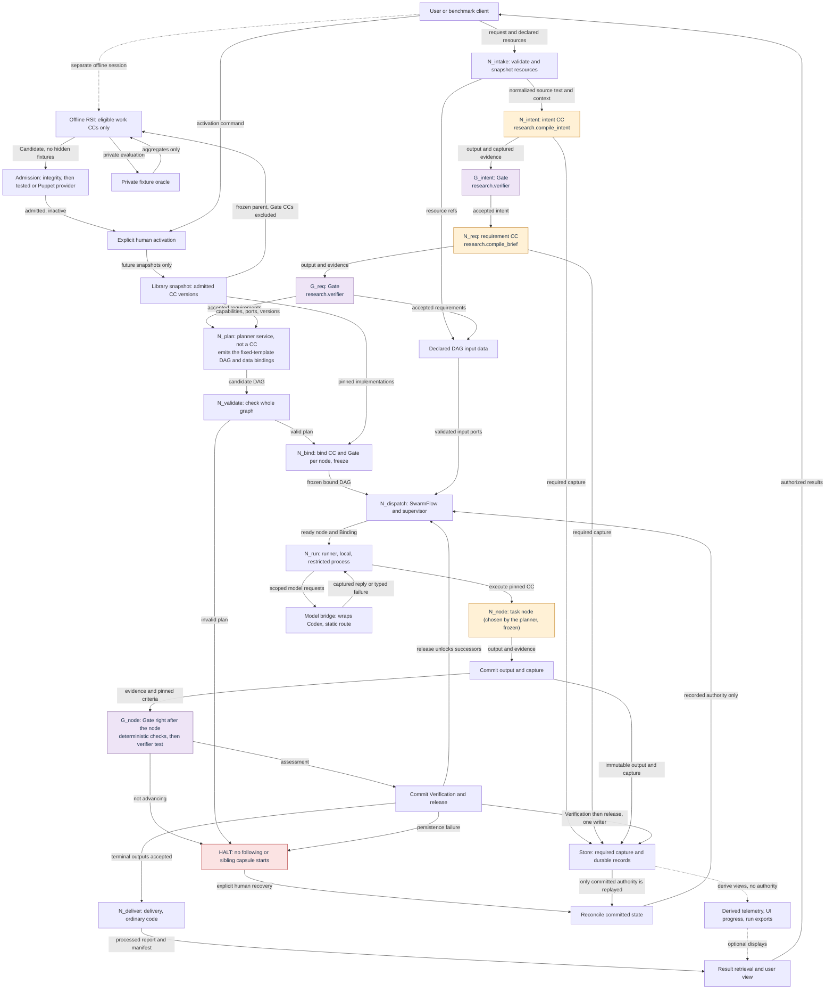

# Flow: how data goes in, through the system, and out

PRD: 1.3, 4.2.8, 4.6.1, 4.6.2, 4.6.4

> Answers: How does data go in, through the system and out?

One graph, edited in one place. The full view below and the three views in [flow variants](flow-variants.md) are **generated** from the source block at the bottom (`python _tools/flow_views.py`). Never edit the generated [blocks](system/modules.md#term-block).

## The flow in nine lines

1. **N_intake** validates the request and snapshots permitted resources.
2. **N_intent** (one CC, `research.compile_intent`, model-backed) compiles the request, reviews its own result through a nested verifier call and repairs within a fixed budget. **G_intent** then re-checks the final result with a fresh independent verifier call (after deterministic [checks](capsule/fields.md#term-check)) and decides advance or halt.
3. **N_req** (the requirement CC, `research.compile_brief`, one model pass) derives outputs, constraints, acceptance and evidence from accepted intent. **G_req** checks the result.
4. **N_plan** (planner service, not a CC, no model call in M1) emits the fixed-template DAG of [nodes](system/nodes.md#term-node), dependencies and typed data bindings from accepted requirements and a [library snapshot](capsule/library.md#term-library-snapshot).
5. **N_validate / N_bind** check the whole graph, choose exact CC versions, attach each node's [Gate](verification.md#term-gate), **freeze**. This is the second of two freeze points: the library snapshot and [prep plan](types/run-plan.md#term-prep-plan) ([steps](system/nodes.md#term-step) 1-3) freeze at launch, the [planned plan](types/run-plan.md#term-planned-plan) [freezes](system/lifecycle.md#term-freeze) here, after requirements. Invalid plan = zero dispatch.
6. **N_dispatch** ([SwarmFlow](system/integration.md#term-swarmflow) + supervisor) feeds declared inputs into the DAG and dispatches ready nodes.
7. **N_run** executes each node's CC locally. Output and capture are **committed first**, then **G_node** checks right after.
8. A failing Gate **[halts](system/lifecycle.md#term-halt)** the run: no later or sibling step starts. Passing Gate + committed release unlocks successors.
9. **N_deliver** (ordinary code, not a [capsule](capsule/capsule.md#term-capability-capsule)) assembles accepted terminal results, publishes, and returns them to the user.

Nested [operator](capabilities/README.md#term-operator) calls (`op.*`) inside a node get a mechanical [Verification](schemas/verification-record.md#term-verification) and are covered by the node's Gate. The nested verifier review inside `research.compile_intent` is validated by that capsule and is not Gated.

SwarmFlow [runs](system/lifecycle.md#term-run) the fixed outer flow (all nine positions always exist). Task nodes become fixed after step 5. M1 may run ready nodes one at a time. Steps 2-3 and every node call use the same runner and Gate path. See [verification](verification.md), [runtime](runtime.md).

## Key terms

| Term | Meaning |
|---|---|
| <a id="term-fixed-outer-flow"></a>**Fixed outer flow** | The positions that always exist in a run: intake, intent and Gate, requirements and Gate, planner, validate and bind and freeze, dispatch and delivery. SwarmFlow runs it. |

## Overview

Three stages in one picture. Names match the graph source below. Detail views follow.



## Full view

<!-- generated:flow-full -->

<!-- /generated:flow-full -->

Three smaller views (without observability, without [RSI](rsi.md#term-rsi), core) are in [flow variants](flow-variants.md). They come from the same graph source below.

## Which nodes are mandatory and which are chosen

Mandatory nodes are always on. Task nodes are placed by the planner. The Run graph is all of them. The Task DAG is the task nodes and their edges ([nodes](system/nodes.md#node-classes)).

| Node ID | Role | Class | Mandatory? |
|---|---|---|---|
| N_intake | validate, snapshot | Prep node | yes |
| N_intent, G_intent | intent CC and its Gate | Prep node | yes |
| N_req, G_req | requirement CC and its Gate | Prep node | yes |
| N_plan | planner service | Control step | yes. M1 emits one fixed template DAG; no model call |
| N_validate, N_bind | validate, bind, freeze | Control step | yes |
| N_dispatch, N_run | dispatch, local execution | Control step | yes |
| N_node + G_node | one task node and its Gate | Task node | no. One pair per task node, count varies |
| N_deliver | delivery | Delivery | yes |
| Observability views | derived displays | none | capture is always on, views are optional |
| RSI area | offline improvement | none | separate, never in a run |

## Data in and out

| Direction | Supported in M1 | Not in M1 |
|---|---|---|
| In: request | CLI argument (`--topic`), web prompt box, authenticated local benchmark HTTP call | chat channels (Slack, WeChat, Feishu, Discord), voice |
| In: resources | local reference docs (`.txt`, `.md`, `.pdf`), a user-supplied project directory, user-supplied validation data. Snapshotted once. | cloning repos, downloading datasets, open-web crawling, Office formats |
| Out: result | report plus artifact package in the user workspace; shown in web UI or TUI | automatic publication, chat notifications |
| Out: evidence | run bundle, sealed export for the benchmark client | live dashboards, cluster telemetry |

Intake fields and projections: [intake](types/intake.md), [source_text](types/source-text.md), [resource_snapshot](types/resource-snapshot.md). Entry and exit surfaces: [workstation](system/workstation.md), [benchmark export](system/benchmark-export.md).

## How failures are handled

| Failure | What happens | Details |
|---|---|---|
| Intake invalid | rejected before any capsule runs | [intake](types/intake.md) |
| Gate FAIL, ENVIRONMENT_BLOCKED, INCONCLUSIVE | halt whole run, keep committed evidence, route to human review | [verification](verification.md) |
| Plan invalid (cycle, missing producer, wrong version, denied effect, budget) | zero dispatch, findings recorded | [planner](system/planner.md) |
| Output commit or Verification commit fails | counts as failure; nothing is [released](system/lifecycle.md#term-release) | [lifecycle](system/lifecycle.md) |
| Timeout, cancel, denied effect | halt, kill child tree, keep capture | [runtime](runtime.md) |
| Duplicate request id | returns committed result or "in progress". Changed bytes = conflict. | [lifecycle](system/lifecycle.md) |
| A declared failure mode (for example `NO_ELIGIBLE_OPPORTUNITY`) | capsule ends with its failure code; [Gate host](capsule/gate-host.md#term-gate-host) maps it to INCONCLUSIVE, halt and escalate (not an empty success, not a scientific negative) | [screening](capabilities/screening.md) |
| Valid negative science | not a failure. Report is still produced. | [evaluation](capabilities/evaluation.md) |
| Crash or kill | never resumes by itself; restart writes a halt report (INTERRUPTED) and waits for `cc resume` |
| Recovery | explicit, human-started. Reuse committed work, re-run missing Gate only. Changed inputs or pins need a new run. | [lifecycle](system/lifecycle.md) |

## Graph source (edit here, then regenerate)

Line format: optional tag (`[obs]`, `[rsi]` or `[detail]`), then Mermaid. Untagged lines are core. `[detail]` lines (store, halts, recovery) appear in every view except core.

<!-- flow-source:begin -->
```text
flowchart TB
  USER["User or benchmark client"] -->|"request and declared resources"| N_intake["N_intake: validate and snapshot resources"]
  N_intake -->|"normalized source text and context"| N_intent["N_intent: intent CC<br/>research.compile_intent"]
  N_intent -->|"output and captured evidence"| G_intent["G_intent: Gate<br/>research.verifier"]
  G_intent -->|"accepted intent"| N_req["N_req: requirement CC<br/>research.compile_brief"]
  N_req -->|"output and evidence"| G_req["G_req: Gate<br/>research.verifier"]
  G_req -->|"accepted requirements"| N_plan["N_plan: planner service, not a CC<br/>emits the fixed-template DAG and data bindings"]
  LIB["Library snapshot: admitted CC versions"] -->|"capabilities, ports, versions"| N_plan
  N_plan -->|"candidate DAG"| N_validate["N_validate: check whole graph"]
  N_validate -->|"valid plan"| N_bind["N_bind: bind CC and Gate per node, freeze"]
  LIB -->|"pinned implementations"| N_bind
  N_bind -->|"frozen bound DAG"| N_dispatch["N_dispatch: SwarmFlow and supervisor"]
  N_intake -->|"resource refs"| DATA["Declared DAG input data"]
  G_req -->|"accepted requirements"| DATA
  DATA -->|"validated input ports"| N_dispatch
  N_dispatch -->|"ready node and Binding"| N_run["N_run: runner, local, restricted process"]
  N_run -->|"execute pinned CC"| N_node["N_node: task node (chosen by the planner, frozen)"]
  N_node -->|"output and evidence"| SAVE["Commit output and capture"]
  SAVE -->|"evidence and pinned criteria"| G_node["G_node: Gate right after the node<br/>deterministic checks, then verifier test"]
  G_node -->|"assessment"| COMMIT["Commit Verification and release"]
  COMMIT -->|"release unlocks successors"| N_dispatch
  COMMIT -->|"terminal outputs accepted"| N_deliver["N_deliver: delivery, ordinary code"]
  N_deliver -->|"processed report and manifest"| VIEW["Result retrieval and user view"]
  VIEW -->|"authorized results"| USER
  G_node -->|"not advancing"| HALT["HALT: no following or sibling capsule starts"]
  N_validate -->|"invalid plan"| HALT
  COMMIT -->|"persistence failure"| HALT
  [detail] HALT -->|"explicit human recovery"| REC["Reconcile committed state"]
  [detail] REC -->|"recorded authority only"| N_dispatch
  [detail] STORE["Store: required capture and durable records"]
  [detail] MODEL["Model bridge: wraps Codex, static route"]
  [detail] N_intent -->|"required capture"| STORE
  [detail] N_req -->|"required capture"| STORE
  [detail] SAVE -->|"immutable output and capture"| STORE
  [detail] COMMIT -->|"Verification then release, one writer"| STORE
  [detail] STORE -->|"only committed authority is replayed"| REC
  [detail] N_run -->|"scoped model requests"| MODEL
  [detail] MODEL -->|"captured reply or typed failure"| N_run
  [obs] VIEWS["Derived telemetry, UI progress, run exports"]
  [obs] STORE -.->|"derive views, no authority"| VIEWS
  [obs] VIEWS -.->|"optional displays"| VIEW
  [rsi] RSI["Offline RSI: eligible work CCs only"]
  [rsi] ORACLE["Private fixture oracle"]
  [rsi] ADMIT["Admission: integrity, then tested or Puppet provider"]
  [rsi] ACT["Explicit human activation"]
  [rsi] USER -.->|"separate offline session"| RSI
  [rsi] LIB -->|"frozen parent, Gate CCs excluded"| RSI
  [rsi] RSI -->|"private evaluation"| ORACLE
  [rsi] ORACLE -->|"aggregates only"| RSI
  [rsi] RSI -->|"Candidate, no hidden fixtures"| ADMIT
  [rsi] ADMIT -->|"admitted, inactive"| ACT
  [rsi] USER -->|"activation command"| ACT
  [rsi] ACT -->|"future snapshots only"| LIB
  classDef cc fill:#FFF1D6,stroke:#B86E00,color:#172D45;
  classDef gate fill:#EEE4F6,stroke:#754A91,color:#172D45;
  classDef halt fill:#FBE3E3,stroke:#B03030,color:#172D45;
  class N_intent,N_req,N_node cc;
  class G_intent,G_req,G_node gate;
  class HALT halt;
```
<!-- flow-source:end -->
