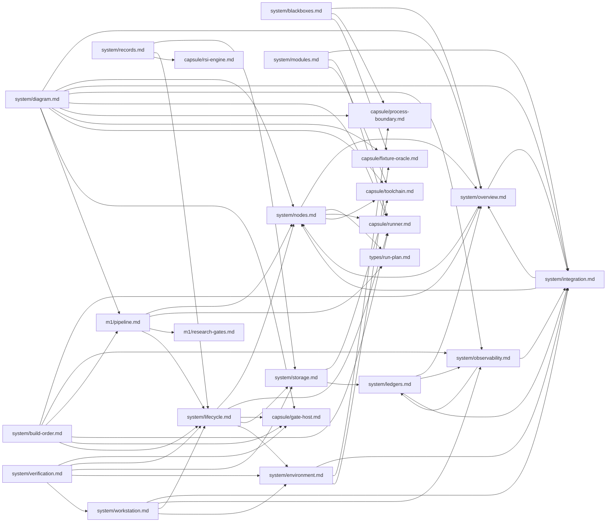

# The design graph

Generated by `_tools/arch_lint.py` from page front matter (`depends_on`). Do not edit by hand.

```mermaid
flowchart LR
    p_m1_pipeline_md["m1/pipeline.md"]
    p_system_blackboxes_md["system/blackboxes.md"]
    p_system_build_order_md["system/build-order.md"]
    p_system_diagram_md["system/diagram.md"]
    p_system_environment_md["system/environment.md"]
    p_system_integration_md["system/integration.md"]
    p_system_ledgers_md["system/ledgers.md"]
    p_system_lifecycle_md["system/lifecycle.md"]
    p_system_modules_md["system/modules.md"]
    p_system_nodes_md["system/nodes.md"]
    p_system_observability_md["system/observability.md"]
    p_system_overview_md["system/overview.md"]
    p_system_records_md["system/records.md"]
    p_system_storage_md["system/storage.md"]
    p_system_verification_md["system/verification.md"]
    p_system_workstation_md["system/workstation.md"]
    p_m1_pipeline_md --> p_system_nodes_md
    p_types_run_plan_md["types/run-plan.md"]
    p_m1_pipeline_md --> p_types_run_plan_md
    p_m1_research_gates_md["m1/research-gates.md"]
    p_m1_pipeline_md --> p_m1_research_gates_md
    p_m1_pipeline_md --> p_system_lifecycle_md
    p_system_blackboxes_md --> p_system_overview_md
    p_capsule_process_boundary_md["capsule/process-boundary.md"]
    p_system_blackboxes_md --> p_capsule_process_boundary_md
    p_capsule_fixture_oracle_md["capsule/fixture-oracle.md"]
    p_system_blackboxes_md --> p_capsule_fixture_oracle_md
    p_system_build_order_md --> p_system_overview_md
    p_system_build_order_md --> p_system_observability_md
    p_system_build_order_md --> p_m1_pipeline_md
    p_capsule_runner_md["capsule/runner.md"]
    p_system_build_order_md --> p_capsule_runner_md
    p_capsule_gate_host_md["capsule/gate-host.md"]
    p_system_build_order_md --> p_capsule_gate_host_md
    p_system_build_order_md --> p_system_lifecycle_md
    p_system_diagram_md --> p_system_overview_md
    p_system_diagram_md --> p_system_nodes_md
    p_system_diagram_md --> p_system_integration_md
    p_system_diagram_md --> p_system_observability_md
    p_system_diagram_md --> p_capsule_runner_md
    p_system_diagram_md --> p_capsule_process_boundary_md
    p_system_diagram_md --> p_capsule_fixture_oracle_md
    p_capsule_toolchain_md["capsule/toolchain.md"]
    p_system_diagram_md --> p_capsule_toolchain_md
    p_system_diagram_md --> p_capsule_gate_host_md
    p_system_diagram_md --> p_m1_pipeline_md
    p_system_environment_md --> p_system_integration_md
    p_system_environment_md --> p_capsule_process_boundary_md
    p_system_environment_md --> p_capsule_fixture_oracle_md
    p_system_integration_md --> p_system_overview_md
    p_system_integration_md --> p_system_nodes_md
    p_system_ledgers_md --> p_system_overview_md
    p_system_ledgers_md --> p_system_observability_md
    p_system_ledgers_md --> p_system_integration_md
    p_system_lifecycle_md --> p_system_nodes_md
    p_system_lifecycle_md --> p_capsule_runner_md
    p_system_lifecycle_md --> p_capsule_gate_host_md
    p_system_lifecycle_md --> p_system_storage_md
    p_system_lifecycle_md --> p_system_environment_md
    p_system_modules_md --> p_system_integration_md
    p_system_modules_md --> p_capsule_runner_md
    p_system_modules_md --> p_capsule_toolchain_md
    p_system_nodes_md --> p_system_overview_md
    p_system_nodes_md --> p_types_run_plan_md
    p_system_nodes_md --> p_capsule_runner_md
    p_system_nodes_md --> p_capsule_toolchain_md
    p_system_observability_md --> p_system_ledgers_md
    p_system_observability_md --> p_system_integration_md
    p_system_overview_md --> p_system_nodes_md
    p_system_overview_md --> p_system_integration_md
    p_system_records_md --> p_system_storage_md
    p_system_records_md --> p_system_lifecycle_md
    p_capsule_rsi_engine_md["capsule/rsi-engine.md"]
    p_system_records_md --> p_capsule_rsi_engine_md
    p_system_storage_md --> p_capsule_toolchain_md
    p_system_storage_md --> p_system_ledgers_md
    p_system_verification_md --> p_capsule_gate_host_md
    p_system_verification_md --> p_system_lifecycle_md
    p_system_verification_md --> p_system_storage_md
    p_system_verification_md --> p_system_environment_md
    p_system_verification_md --> p_system_workstation_md
    p_system_workstation_md --> p_system_integration_md
    p_system_workstation_md --> p_system_observability_md
    p_system_workstation_md --> p_system_lifecycle_md
    p_system_workstation_md --> p_system_environment_md
```
