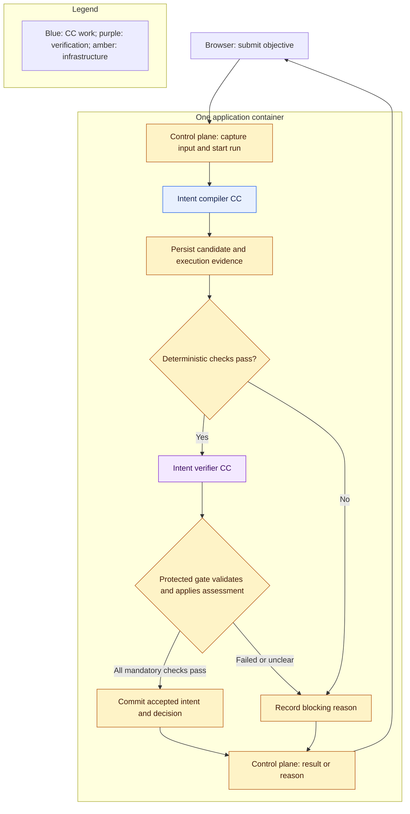

# First build: the intent pair

Architecture slice, 2026-10-06. **Required now for this slice:** implement the connected Intent compiler CC → Intent verifier CC path and its supporting runtime. The remaining full-M1 responsibilities stay in the [overview](README.md).

## Intended result

A user submits a text objective through the existing local web UI. Ordinary intake rejects empty input and binds the original text to a new run. The compiler extracts the objective, desired outcome, explicit scope, and stated constraints without choosing a solution or adding unsupported requirements. Preserve omissions, conflicts, and missing information visibly.

The verifier receives the original request, exact compiler output, declared responsibility, and protected fidelity rubric in a separate invocation. It assesses material omissions, unsupported additions, scope drift, and unresolved ambiguity. The producer cannot edit this rubric or the verifier context. A semantically faithful result becomes an accepted intermediate intent artifact; a blocking or unclear result leaves a visible reason and no accepted artifact.

This is not the complete Research Brief. The later Requirement compiler consumes accepted intent and produces that contract.

## Connected boundary

The shared runner invokes both CCs. Integrity checks and gate application are ordinary protected infrastructure, so the slice has exactly two authored CCs. Malformed or timed-out verifier output blocks acceptance; the verifier has no recursive semantic verifier. Apply the subject-binding and durable-release rules in [capsules](capsules.md#exact-verification-boundary).

## Minimum supporting system

| Component | Slice responsibility |
|---|---|
| Declaration and library | Package, admit, activate, and pin two definitions with their implementation closure; preserve the [required field reference](capsule/declaration.md) without implementing deferred mechanisms |
| CC runner | Bind scoped inputs, invoke native model/skill integration, enforce time/call limits, and capture outcomes |
| Fixed orchestration and protected gate | Execute dependencies, validate both outputs, and expose only the exact accepted artifact |
| Existing UI and control plane | Submit, inspect status and failure reasons, and retrieve intermediate output |
| Run-state module and files | Persist input, attempts, candidate output, raw assessment, decisions, configuration, and accepted references |
| Observability | Correlate run, node, attempt, CC/verifier versions, duration, available model-call information, and artifact references |

Use the [placement defaults](placement.md): one local application container, existing Python/TypeScript stack, SQLite, files, protected model integration, loopback exposure, and session authentication. A mock can aid development; it cannot establish the connected model-backed trial. Keep credentials out of evidence.

Closing the browser does not cancel work. Restart preserves accepted output and marks interrupted work paused without automatic replay. For this trial, in-place resumption and automatic correction are excluded. A corrected submission starts a fresh run with a new identity and retains previous failure evidence.

## Sources and exclusions

Give the coding agent original clauses from the [master PRD](../product/prd-m1-full-2026-10-02.txt) plus [D1–D9](principles.md#decisions-and-source-amendments), this page, the CC field reference, verification boundary, and placement guidance.

| Clauses | Portion exercised by this slice |
|---|---|
| 3.0.1–3.0.2, 4.3.3–4.3.4 | Working baseline model integration, attribution, and independent verifier provisioning |
| 3.1.1, 3.1.3, 3.1.5; 3.2.1, 3.2.2, 3.2.4; 4.7.2–4.7.3 | Text input and faithful intermediate intent; no complete requirement contract |
| 4.1.1–4.1.4; 4.2.1–4.2.2, 4.2.6–4.2.9 | Two admitted pinned CCs, actual evidence, two-tier verification, protected release, and failure behavior |
| 4.5.2–4.5.3; 4.6.1–4.6.4; 5.1.1–5.1.2; 5.2.2; 5.3.2; 5.4.2; 5.6 | Durable run control, UI inspection, local access, and relevant effective configuration |

Allocate exact subclauses in the registered TASK; these rows do not claim entire sections are satisfied. Apply 4.2.9 to intent validity, swapped/stale outputs, timeouts, environment failures, uncertainty, and gate locking; scientific-negative and POC-specific cases remain full-M1 work. Global scope, security, evidence, and referee boundaries apply. Include headless halt behavior for automated evaluation without adding another user-facing application.

Exclude planner, Requirement compiler, search, POC execution, benchmarking, scientific evaluation, Delivery CC, internal composition, dynamic routing, and RSI execution. Final transfer is ordinary control-plane handling. Their declaration concepts and future compatibility remain intact.

## Coding-agent responsibility

Start at [M1-001](../tasks/M1/M1-001/TASK.md) under [TASKS → TASK → Spec Kit](../code/code_sop/SPEC_KIT_WORKFLOW.md). The agent defines detailed formats, APIs, prompts, implementation order, acceptance criteria, fixtures, and verification in the registered native artifacts.

Require real connected acceptance/refusal evidence and a fixed labeled challenge set characterizing verifier fidelity and instruction resistance. Keep that set separate from live inputs and outside RSI. Preserve per-case outcomes and same-provider limitations; a separate model invocation does not guarantee independent errors. Spec Kit selects concrete cases and thresholds before measuring the implementation.

Compare observed behavior with this intent. Distinguish unclear requirements from implementation faults, unavailable services, and weak verification. Expand only after recording what the slice actually demonstrated; no happy-path result alone establishes complete M1 or verifier reliability.
