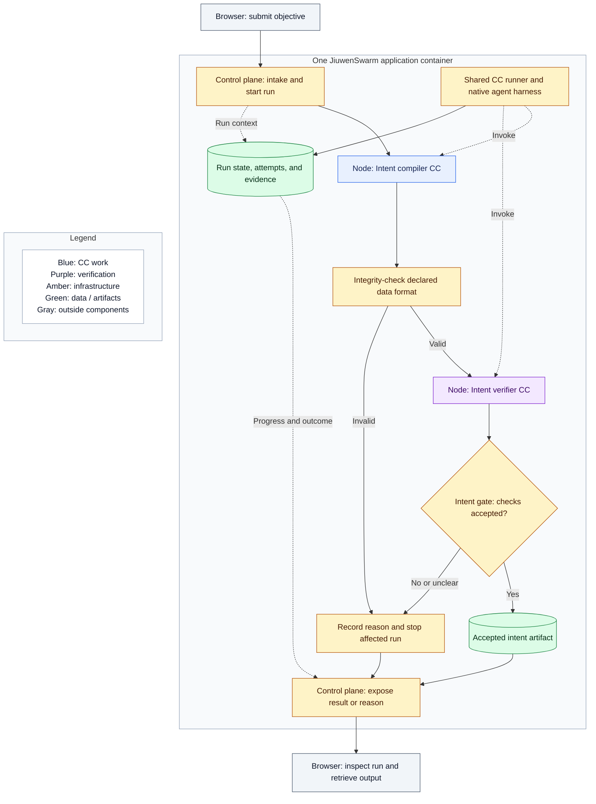

# Immediate plan: two-capsule intent trial

Tentative implementation slice for review, 2026-10-05. Read terms in the [overview](README.md#vocabulary-and-naming). This page bounds a coding attempt; Spec Kit supplies its detailed design and acceptance conditions.

## Intent

Find out whether a small architecture description plus the relevant PRD is enough for a coding agent to build the behavior we intended in one implementation attempt. Start with a real connected slice, not the entire research workflow. Keep the resulting runner and capsule authoring interface useful for the next slice.

Use two CCs: **Intent compiler CC** and **Intent verifier CC**. A compiler alone would show generation but would not exercise independent checking or gate-controlled release. This pair demonstrates the beginning of the fixed pipeline without needing a planner, experiments, or a scientific rubric.

The trial ends at an accepted intent artifact. It does not produce the requirements contract or claim completion of PRD section 3.2. The later requirement compiler consumes this intermediate artifact when that stage is implemented.

## The small journey

The web server and UI assets are inside the container as described in [placement](placement.md); this drawing groups them with the control plane. The two control-plane boxes and browser boxes show different responsibilities of the same components. The runner invokes both nodes. The arrows between nodes express dependencies, not direct capsule-to-capsule calls that bypass the runner. Gates and ordinary integrity checks are infrastructure, so this remains exactly two authored CCs.

The user submits a text objective in the existing web UI. Ordinary intake handling rejects empty input and binds the original text to the run. The compiler extracts the objective, desired outcome, explicit scope, and stated constraints without inventing a solution or unsupported requirements. Preserve missing or conflicting information visibly.

The verifier receives both the original input and compiler output. It checks fidelity to the request and identifies unsupported additions, omissions, or unresolved ambiguity. It is a separate invocation with its own instructions; the producer cannot edit its checking policy. Sharing the configured model integration does not mean sharing the producer's conversation or treating agreement as proof.

Integrity-check both CC outputs against their declared formats. The gate accepts only a mechanically valid artifact with an accepted verifier result. A timeout, invalid output, failed check, or unresolved ambiguity leaves a visible reason and no accepted artifact. For this first trial, configure zero automatic correction attempts; a user can submit a fresh run. This is a small policy setting within the broader bounded-correction design.

## Minimum supporting system

| Component | Responsibility in this trial |
|---|---|
| CC declarations and small library | Package two versioned definitions with their implementation references; use the [shared authoring concepts](capsule/declaration.md), validate supported definitions, and pin what each run invokes |
| CC runner | Resolve a CC, bind inputs and a scoped context, invoke the native model/skill adapter, enforce an execution time limit, and record the outcome |
| Fixed orchestration and gate | Run the two dependencies in order and release only accepted output; use a native workflow mechanism where it fits |
| Control plane and existing UI | Submit a run, show status and failure reasons, and retrieve its result without keeping the browser connected |
| Shared run-state module | Persist authoritative progress and attempt/result references in SQLite; store artifacts and logs in files |
| Basic observability | Correlate run, node, attempt, and CC version; show start/end, duration, check decisions, errors, and artifact references |

Reuse Python, the TypeScript UI, native transport, Symphony agent/harness components, and compatible SwarmFlow execution. Keep modules distinct without making them separate services. Use one application container with persistent data mounts and externally supplied model configuration; follow the existing image/startup path. Publish the host endpoint only on loopback and preserve local session authentication for UI/API access. Add only missing adapters. The model integration must actually work in the chosen environment; a mock can help development but cannot demonstrate the connected model-backed trial.

Observability should let a developer answer: where did this run stop, which definition ran, what went into it, what came out, and why was it accepted or refused? Keep credentials out of evidence. Report available model-call information honestly; do not fabricate token or cost measurements. A full telemetry platform is unnecessary.

Closing the browser must not cancel the run. After an application restart, preserve accepted output and show interrupted attempts as paused rather than replaying them automatically. For this slice, the user can inspect that state and submit a fresh run; in-place resumption is later work.

## Scope to give the coding agent

Provide this page, the overview vocabulary, [capsule declaration](capsule/declaration.md), and the relevant [placement/reuse](placement.md) guidance alongside exact clauses from the [frozen PRD](../product/prd-m1-full-2026-10-02.txt). Keep the rest of the architecture available as context, not as an instruction to implement every stage.

| PRD source | Allocation for this slice |
|---|---|
| 3.1.1, 3.1.3, 3.1.5 | Text submission, local run context, and empty-input qualification; material imports are deferred |
| 3.2.1, 3.2.2, 3.2.4 | Intent interpretation, explicit scope, and stated constraints; this intermediate output is not the complete Research Brief |
| 4.1.1–4.1.4 | The applicable authoring, version binding, eligibility, and single-runner responsibilities for two packaged CCs; broader registry/routing/RSI behavior is outside this slice |
| 4.2.1, 4.2.2, 4.2.8 | Evidence, mechanical conformance, intent-fidelity review, and gate decisions; no automatic repair loop, scientific evaluation, code-execution review, or benchmark checks |
| 4.5.2, 4.5.3 | Persistent records, effective configuration, and observable outcomes for these two CCs; defer scorecards, cross-run analysis, and RSI exports |
| 5.1.1, 5.1.2, 5.2.2 | Local submission, progress, per-run trace inspection, and intermediate output access using the native UI; defer global trace search, host-health dashboards, and final research-report views |
| 5.4.2 | Host loopback exposure and local session authentication; no public access, remote deployment, or enterprise identity system |

The registered coding task must allocate exact subclauses and relevant global requirements, recording exclusions and conflicts rather than claiming all listed sections are implemented. In particular, the PRD combines intent and requirements compilation; this design separates them. Its blanket two-tier gating and wider routing/RSI program do not expand this trial. Follow the [current principles](principles.md) where later user decisions supersede archived architecture defaults. Preserve PRD sources verbatim.

Do not add a model-assisted planner, requirement compiler, search, POC execution, benchmarks, delivery CC, internal CC composition, or routing/RSI for this attempt. Final transfer of this intermediate artifact is ordinary control-plane handling. The runner's public boundary should accommodate later capabilities, but implementing every future execution form now would defeat the trial.

## Coding and learning from the attempt

Use the existing [TASKS → TASK → Spec Kit workflow](../code/code_sop/SPEC_KIT_WORKFLOW.md). Register the slice and its sources before implementation. The coding agent owns schemas, APIs, prompts, file structure, fixtures, tests, acceptance conditions, and verification of the connected system. Keep that work in the native spec/plan/tasks artifacts rather than adding another architecture checklist or handoff card.

Ask the agent to carry one scoped attempt through specification, implementation, and verification. It may ask about genuinely missing product decisions; “one-shot” is not permission to fabricate them. Demonstrate a real accepted run and visible refusal/failure behavior, with the evidence and limitations recorded in the task's native artifacts. Exact test cases and pass conditions remain Spec Kit's work.

Then compare the working behavior with this intent. If it matches, expand the workflow using the same authoring and runner boundary. If it misses, distinguish a missing requirement or unclear architecture boundary from an implementation defect, unavailable dependency, or weak verifier. Add the smallest missing guidance and retry; neither a failed attempt nor a happy-path demonstration alone proves how much architecture is needed.
