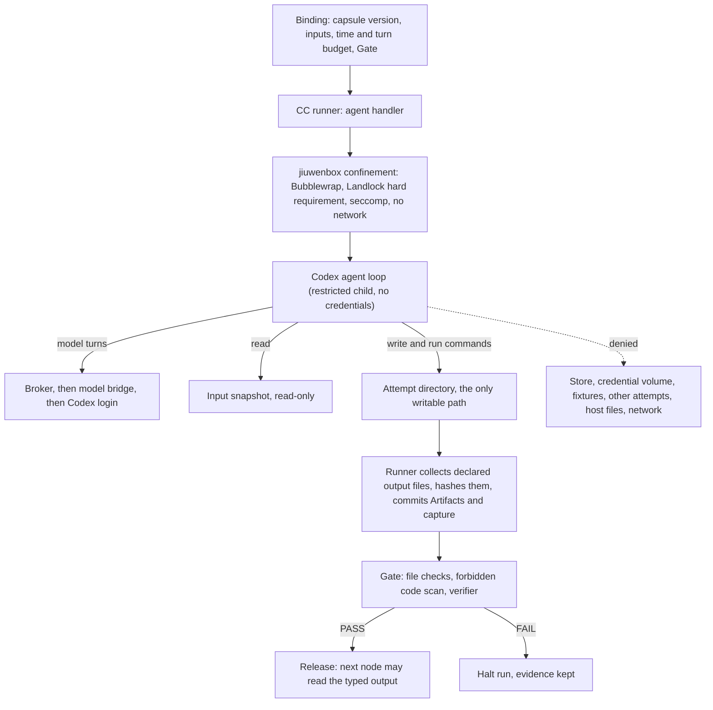
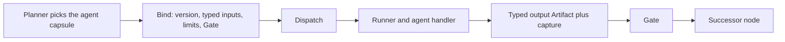

# Agents, workspaces and isolation

PRD: 2.6, 2.9, 4.1.4, 4.9.2, 5.4.3

> Answers: How are agents, workspaces and generated code kept apart?

*Kubernetes parallel ([k8s-lens](k8s-lens.md)): restricted children use named execution profiles like PodSecurity `restricted` (non-root, dropped capabilities, no privilege escalation, seccomp, default-deny network).*

How [capsules](capsule/capsule.md#term-capability-capsule) are driven, what workspace they get, and what jiuwenswarm gives us for isolation. Facts about existing code were read from the jiuwenswarm, jiuwenbox and agent-core sources; items not yet verified are marked.

## How capsules are driven

| Question | Answer |
|---|---|
| Does a jiuwenswarm agent run a capsule natively? | No. The **runner** [runs](system/lifecycle.md#term-run) capsules. Native agents, skills and [SwarmFlow](system/integration.md#term-swarmflow) `agent()` workers are not used to run them. |
| Where does the model [turn](system/model-bridge.md#term-model-turn) happen? | Always in the **[Model bridge](system/model-bridge.md#term-model-bridge)**, through Codex. Never inside a capsule process. |
| What is a `skill` capsule? | A set of single-turn model calls over its pinned `SKILL.md` text. The runner builds the prompt; a reply asking for a tool or nested call is routed by the runner's broker. The native skill loader (`SkillUseRail`, which lets a model use ordinary file and shell tools) is **not** used. |
| What is a `tool` capsule? | A Python function in a separate child process. It calls the model, other capsules and workspace operations only through the runner's broker. |
| What can the Codex model do? | Text only. Tools, shell, apps and web search are off, the sandbox is read-only, server requests are rejected, no skills, no human replies. No `--yolo`. This is the existing transport and it matches what we need. |
| Who decides what runs next? | The supervisor. A model or capsule never picks its successor. |
| Native Leader or Cluster Mode agents? | Only in the isolated experiment track. |

Why: native agents get ordinary file and shell tools in one OS user, with permissions off by default. Running capsules ourselves lets every call have a [Binding](schemas/binding.md#term-binding), a budget, captured evidence and a [Gate](verification.md#term-gate).

## Key terms

| Term | Meaning |
|---|---|
| **Confinement** | The mechanism that limits a restricted child to its input snapshots and one attempt directory, with no network and no credentials. We reuse the jiuwenbox engine for it and keep its defaults off. |
| **Attempt directory** | The one writable scratch directory of a single call, owned by that capsule's child process. Nothing leaks between calls, and only declared output files are collected from it. |
| **Restricted child** (also: restricted children) | A capsule or POC process run as a separate non-root identity with a private network namespace, no credentials, no store, no fixtures and one writable attempt directory. |
| **jiuwenbox** | The existing sandbox service (Bubblewrap, Landlock, seccomp, network isolation, cgroup limits) that we reuse as the confinement engine. Its opt-in defaults are not used. |
| **Landlock** | A Linux kernel feature that limits which paths a process may use. We require it as a hard requirement, not best effort. |
| **seccomp** | A Linux kernel filter that limits the system calls a process may make. It is part of the confinement profile. |
| **hard_requirement** | The setting that makes Landlock mandatory: if confinement cannot start with it, the call fails with `UNSUPPORTED_SECURITY_PROFILE` instead of running without it. |

## Workspaces

| Workspace | Path in the container | Who writes | Why |
|---|---|---|---|
| Run input | `./workspace/input/` (`docs/`, `repo/`, `datasets/`) | intake only, then read-only snapshots | inputs must not change during a run |
| Capsule scratch | one **attempt directory** per call | that capsule's child process only | nothing leaks between calls |
| POC workspace | `./workspace/poc/` | the POC service and its child | generated code gets one small area |
| Run records | store volume | supervisor only | single writer keeps records consistent |
| Outputs | `outputs/<run_id>/` | delivery only | results are written once, after Gates |
| jiuwenswarm agent workspace (`~/.jiuwenswarm/agent/workspace`, memory, todo, messages) | native | native agents | not used by capsules. Task memory holds summaries only; raw logs stay in the run bundle |

A capsule gets **no ambient workspace**. It sees its input snapshots read-only and its attempt directory, through broker operations. `./workspace/input|poc` exist in the PRD only; nothing in the code creates them yet. The installer creates them.

## What isolation exists in jiuwenswarm today

| Mechanism | Exists | On by default | What we do |
|---|---|---|---|
| Permission engine, file guard, net guard, tool [checks](capsule/fields.md#term-check) | yes | **no**: permissions are disabled and allow-all; the Codex path skips them | do not count on them. The runner enforces its own decisions |
| File guard workspace boundary | yes, for tool calls only | no | at most a second confinement. The shell check reads only literal absolute paths in the command, so `$var` paths and subprocesses get past it |
| Local sandbox flag (`restrict_to_sandbox`) | best effort | Code Mode only | not a boundary |
| `owner_scopes` (channel, user) | yes | empty | unused |
| **jiuwenbox**: Bubblewrap namespaces, Landlock, seccomp, network isolation, cgroup limits, run-as user | **yes, implemented** | **no**: opt-in, Landlock best-effort, egress allow, auth off | **reuse as the confinement engine** for restricted children. Do not use its defaults |
| One OS user for all agents | yes | n/a | we add separate identities (below) |
| Per-capsule or per-attempt workspace | no | n/a | new work |
| Restricted child identities and brokers | no | n/a | new work |
| Docker with nested Bubblewrap | Dockerfiles exist | n/a | not verified. Needs the doctor [probes](system/environment.md#term-probe) |

Schema: the profile of a [restricted child](capsule/process-boundary.md#term-restricted-child) is `tools-v1.schema.json#execution_profile`.

## Rules we rely on

1. **Nothing native counts as isolation until it is proven on.** We rely on our own confinement plus negative probes.
2. **Restricted children** run as separate non-root identities with a private network namespace, no credentials, no store, no [fixtures](system/test-surfaces.md#term-fixture), and one writable attempt directory.
3. **The confinement engine** is jiuwenbox's policy model and launcher (Bubblewrap, Landlock, seccomp, network namespace). We require Landlock `hard_requirement`, network `isolated`, and the server token. Failure to start with these returns `UNSUPPORTED_SECURITY_PROFILE`; there is no fallback to the host.
4. **Brokers** replace direct access: model turns, nested capsule calls, scholarly search, file reads of snapshots. Each broker call is authenticated, scoped to one call, and captured.
5. **Per-project sandbox keys** in jiuwenswarm are not per-capsule isolation. We key sandboxes by attempt.
6. **Identities and volumes** are created by the installer at container start: supervisor, runner, runner child, model bridge, oracle. See [placement](placement.md).
7. **Unverified until the doctor passes:** nested Bubblewrap inside Docker, Landlock and seccomp on the target kernel, every negative probe (reads of credentials, store, fixtures, other [attempts](system/lifecycle.md#term-attempt); network; escape). An unrun probe is never a pass ([verification](verification.md)).

## Codex agents inside a capsule

There are two ways Codex can be used inside a capability capsule. M1 production uses only the first.

| | Mode 1: text turn (M1 production) | Mode 2: agent with tools (`agent` [kind](capsule/capsule.md#term-capsule-kind), not in M1 production) |
|---|---|---|
| What Codex is | a model endpoint behind the bridge | an agent loop that can read, write and run commands |
| Capsule kinds | `skill` and `tool` | `agent` (an unchecked kind today) |
| What Codex can do | return text, once per turn | read the input [snapshot](capsule/library.md#term-library-snapshot), write files in its attempt directory, run commands inside the sandbox |
| Tools | none. Shell, apps, web search and file tools are off, the Codex sandbox is read-only | file and shell tools, only inside the confinement below |
| Network | none | none. Model traffic goes only through the bridge |
| Credentials | in the bridge only | in the bridge only. The agent process never sees the login |
| Where it runs | the bridge process | a restricted child, one per call |
| Typical use | intent, requirements, search, hypothesis, report, the verifier | future builders, Code Mode experiments |
| Gate | the standard Gate | the standard Gate, plus the checks on produced files below |

### How it is secured (mode 2)

Rules:

1. The agent runs inside the same confinement as any restricted child ([isolation](isolation.md#rules-we-rely-on)). Its workspace is the attempt directory. Nothing outside it is writable.
2. Model turns go through the broker and bridge, so every turn is captured, counted against the call budget, and routed by the static route. The agent never holds a login.
3. The agent has no network. Search or retrieval it needs is a nested capsule call (`op.*`) through the broker, which has its own record and Gate.
4. Budgets are hard: wall time, number of model turns, process count, output size and file count. The first limit hit kills the whole child tree and ends the call with the standard budget error. Token counts are recorded only when the endpoint reports them.
5. The agent decides nothing about control flow. It cannot start [nodes](system/nodes.md#term-node), edit the plan, change its own limits or read the Gate criteria.
6. Only files named by the capsule's output [ports](capsule/fields.md#term-port) are collected. Everything else in the attempt directory is kept as evidence and discarded.
7. Produced code is untrusted. The Gate scans it (forbidden imports and calls, undeclared files, size) before any later node may run or read it. Running generated code is a separate node that uses the POC service, never the agent's own sandbox.
8. The [Declaration](capsule/fields.md#term-declaration) states the agent kind, allowed tools, effects (`writes attempt directory only`), limits and zero RSI-mutable Gate fields. Observed tool use is compared with the declared tool list and a mismatch fails the Gate.

### As a node

To the rest of the system it is an ordinary node: typed inputs, typed output, one Binding, one Gate, one release. The only difference is what happens inside the call.

Status: mode 2 is **proposed**. It needs the `agent` handler in the runner, the confinement probes, and a PRD decision before it is used in a production run.

## Corrections to older statements

- Per-agent permissions are ignored in the native compose layer (only Global, User and Session layers apply).
- Older pages describe Bubblewrap confinement as new work and jiuwenbox as deferred. jiuwenbox already implements the Bubblewrap, Landlock and seccomp envelope; we reuse its engine and keep its server defaults off.
- Native agent-core line references in the docs were read at the local head, not the pinned revision. Re-check them at the pin before coding against them.

Detail: [process boundary](capsule/process-boundary.md), [permissions](capsule/permissions.md), [environment](system/environment.md), [integration](system/integration.md), [runner](capsule/runner.md).
