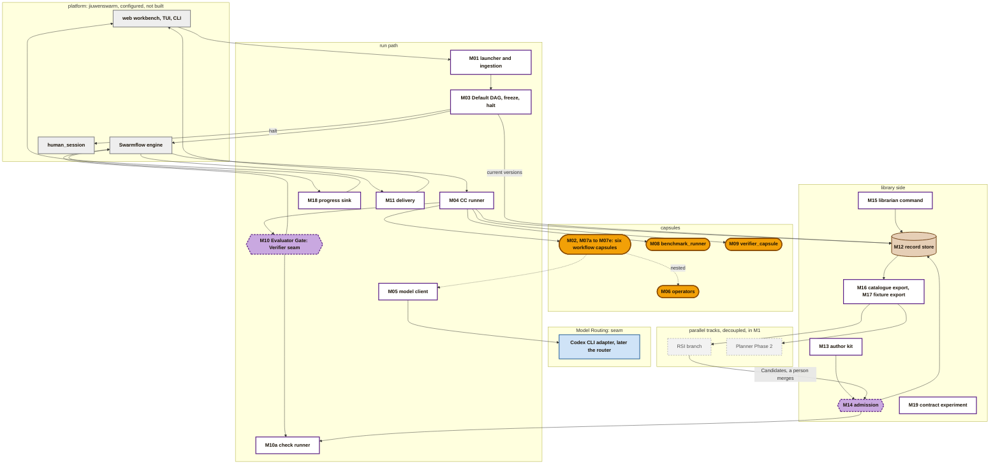
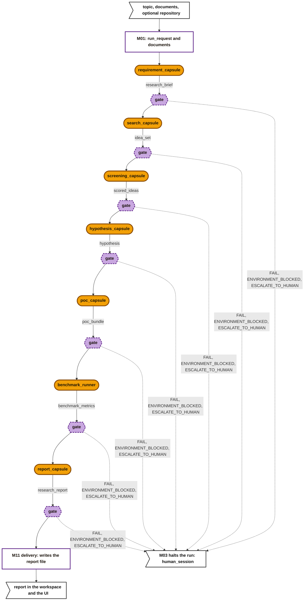

# M1 architecture: the build design

> **Draft, not yet approved.** The design a coding agent builds M1 from. It splits the PRD's M1 into modules, fixes each module's inputs, outputs and tests, and gives the build order. Each module is one issue. It replaces the [past M1 design](m1-design.md).

## How to use this document

**For the coding agent:**

- **Sources of truth.** The PRD says *what* M1 must do. This page says *which modules* do it and *how they connect*. The [capsule folder](capsule/capsule.md) and the [schemas](schemas/schemas.md) define every record, and [guards](capsule/guards.md) lists the checks that keep them valid. If two of these disagree, stop and report; do not choose.
- **One issue per module.** Build each module against its interface and tests only, with fixtures standing in for its neighbours. Never depend on another module's internals ([what architecture covers](architecture.md)).
- **Do not build what is excluded.** Each module says what it must not do. The [stages page](capsule/stages.md) lists the schema fields M1 does not check: accept them when present, never require or act on them.
- **Working choices** are decisions made here to unblock the build. Treat them as fixed until this page changes.
- **Seam modules** belong to RSI, the Verifier or Model Routing. Their owners build them to the interface given here.

**Latest data wins.** Where the PRD and the later kickoff messages differ, this page follows the kickoff: five gate verdicts. The capsules are the PRD 4.1 list (with `requirement_capsule` among them), plus `verifier_capsule` and a code-only `benchmark_runner`.

**Runtime.** Model calls go through the Codex CLI adapter, which is being made fully usable now.

**Open by design.** Payloads fix a minimum and allow more. Registries are open lists. A capsule's model and its router are its author's business, as long as the capsule can be tested.

## The system

Grey = jiuwenswarm, used as it ships. White = our control code. Amber = capsule. Purple = a gate. Brown = records. Blue = a seam owned by another workstream. Grey dashed = a parallel track: in M1, but off the main path.

## One run, end to end

- `PASS` and `PASS_WITH_KNOWN_LIMITATIONS` continue; the other three verdicts halt.
- Each node's inputs are earlier outputs, wired by port. For example, `hypothesis_capsule` takes `idea_set` and `scored_ideas`, and `report_capsule` takes every earlier output.

## Payloads

Every payload is a `json` port whose `value_schema` is a shared JSON Schema file, pinned by hash. Producer and consumer pin the same file ([fields](capsule/fields.md#ports-what-it-takes-and-gives)).

**Each schema is open.** It fixes the minimum fields below with their types, and allows extra fields (`additionalProperties: true`). Anything beyond the minimum belongs to the capsule's author. M00b writes these files. Named port types can come later, when a second consumer needs to match by type.

| Payload | Made by | Minimum fields |
|---|---|---|
| `run_request` | M01 | `topic: string`; `options: object` (the template-mapped run variables); `repository: string?` (a workspace path); `skipped: [{path, reason}]` |
| `documents` | M01 | a `collection<file>` port, one text Artifact per document |
| `research_brief` | `requirement_capsule` | `question: string`; `scope: {in: [string], out: [string]}`; `compute_limits: object`; `metrics: [{name: string, direction: "max" or "min", target?: number}]`, at least one; `deliverables: [string]` |
| `idea_set` | `search_capsule` | `ideas: [{id: string, title: string, summary: string, sources: [{ref: string, locator: string}]}]`, at least one |
| `scored_ideas` | `screening_capsule` | `scores: [{idea_id: string, dimensions: {string: number}}]`; `chosen_id: string`; `rationale: string` |
| `hypothesis` | `hypothesis_capsule` | `statement: string`; `independent_vars: [string]`; `dependent_vars: [string]`; `expected_metrics: [{name, value, unit}]`; `baseline: string`; `failure_criteria: [string]` |
| `poc_bundle` | `poc_capsule` | `files: [string]` (workspace paths); `entry_point: string`; `harness_command: string` |
| `benchmark_metrics` | `benchmark_runner` | `metrics: [{name: string, value: number, unit: string}]`; `unmeasured: [string]`; `exit_status: integer`; `runtime_s: number` |
| `research_report` | `report_capsule` | `markdown: string`; `sections: [string]`; `citations: [{ref: string, source_idea_id: string}]`; `limitations: [string]` |
| `evidence_bundle` | M10 | `artifacts: [Ref]`; `decl_hash: sha256`; `obs_ref: Ref`; `criteria: [check_id]` |
| `verifier_assessment` | `verifier_capsule` | `criteria: [{check_id: string, result: "pass", "fail" or "unknown", rationale: string, evidence: [string]}]` |

**Caveats go in the output.** Any output can carry caveats in its Artifact's `issues` ([Artifact](schemas/artifact.md)). `report_capsule` lists every earlier `issues` entry in `limitations`.

## The modules

Each module lists its owner, inputs and outputs, what it must do and must not do, its tests, and the modules it needs first. "CC" means this team. The checks each module hosts are in [guards](capsule/guards.md).

### Shared content

**M00a Port type vocabulary v1.** Owner: CC.
- **Out:** the vocabulary record with the base types and the registry checks ([port types](schemas/port-types.md)).
- **Tests:** a valid and an invalid value of each type pass and fail `check.value_matches_type.v1`.

**M00b Payload schemas.** Owner: CC.
- **Out:** one JSON Schema file per payload above, each with its sha256.
- **Tests:** a minimal and an extended example of each validate; each example with a required field missing fails.

**M00c Policy epochs.** Owner: CC; the reason-code owners are agreed with the Verifier.
- **Out:** development epochs during the build, each accepting the earlier ones, and `e1` for release ([policy](schemas/policy.md)).
- **Contents:** the first-epoch values, the admission judge by name, the time budget default of 600 s and cap of 1800 s, and the reason-code owners.
- **Tests:** the lint passes; every rule has a reason code, and every call-level code has an owner.

### Library side

**M12 Record store.** Owner: CC.
- **In:** any CC record or content.
- **Out:** records keyed `cc/<kind>/<scope>/<id>` under the profile root, and content keyed by sha256 ([library](capsule/library.md#what-the-library-holds)).
- **Must:** write once (`exclusive_set`); read by key and by prefix.
- **Must not:** edit or delete.
- **Tests:** a second write to a key fails; equal bytes are stored once.

**M10a Check runner.** Owner: CC. Admission, the author kit and the gate all use it.
- **In:** a check, the values it targets, and for a judged check the judge to call.
- **Out:** `pass`, `fail` or `unknown`, with evidence.
- **Must:** run `deterministic` and `reference` checks as pinned code; run `judged` checks through the given judge via M04 (`caller: gate`, or `admission` at admission).
- **Must not:** decide a gate outcome; that is M10's job.
- **Tests:** each anchor on fixtures; an error in a check's code gives `unknown`, never `pass`.

**M13 Author kit.** Owner: CC.
- **In:** a draft Declaration, its files and tests, and the policy.
- **Out:** errors with reason codes; the computed `decl_hash`, `interface_hash` and `code_sha256`; and the generated `make_capsule.md` ([make_capsule.md](capsule/make-capsule.md)).
- **Must:** share admission's validation and hashing code, and run the admission checks through M10a.
- **Tests:** the [example Declaration](capsule/fields.md#example) passes; each checked rule has a fixture that fails with its code.

**M14 Admission.** Owner: CC.
- **In:** a [Candidate](schemas/candidate.md), from an author or from the RSI branch.
- **Out:**
  - a [Verdict](schemas/verdict.md), recording the judge in `checks_run[].judge`;
  - test cases, a visible suite, and Artifacts for test inputs;
  - the stored files;
  - a [Standing](schemas/standing.md) entry: `admitted`, or `admitted_inactive` for an RSI child of a `propose` parent.
- **Must:**
  - follow the [admission steps](capsule/library.md#admission-the-only-way-in);
  - run test calls through M04 as `admission` calls, and checks through M10a;
  - use the policy's admission judge, never a capsule's own `decl_hash`;
  - apply the RSI rules to RSI Candidates: `rsi_permitted`, `changes_allowed`, `rsi_cannot_grant`, `parent_admitted`, `parent_suites_pass`.
- **Must not:** certify above `provisional`. M1 has no sealed suites.
- **Admission is never automatic into the main branch.** A person reviews and merges each admitted capsule.
- **Tests:** a good Candidate is admitted; each rule's failing Candidate is refused with its code; a changed file gives `HASH_MISMATCH`; an RSI child that changes a path not in `may_change` gives `RSI_NOT_PERMITTED`.

**M15 Librarian command.** Owner: CC.
- **In:** a person's request: a name, a move (`suspect`, `deprecated`, `retired`, `revoked`, activate, or revert to an admitted version) and a reason.
- **Out:** a new Standing entry, with an `_BY_OWNER` reason or `REVERTED`.
- **Must not:** move anything on its own; leave `revoked`.
- **Tests:** a revert makes the next run pin the earlier version; a `revoked` capsule is refused at freeze.

**M16 Catalogue export.** Owner: CC. For Planner Phase 2.
- **Out:** a JSON list of admitted capsules: name, summary, ports, effect class, `decl_hash`.
- **Tests:** only `admitted` versions appear.

**M17 Fixture export.** Owner: CC. For the RSI branch and the RSI data foundation.
- **In:** a finished `run_id`.
- **Out:** a folder `fixtures/<run_id>/` with one subfolder per node holding `inputs/`, `outputs/`, `observation.json` and `verification.json`, plus `declarations/` and a `manifest.json` of hashes. These are the PRD's "sample DAG fixtures".
- **Tests:** replaying an export through tier 1 of M10 gives the same tier 1 results. Tier 2 calls a model, so it is not replayed.

### Run path

**M01 Launcher and ingestion.** Owner: CC. The PRD's Ingestion, and Intention Compiler Phase 1.
- **In:** a topic from the CLI or the web UI; `.txt`, `.md` and `.pdf` files in the workspace input directory; an optional repository path.
- **Out:** a `run_request` and the documents, handed to M04 to record as Artifacts with `origin: human`; then a Swarmflow run of M03 with a new `run_id`.
- **Must:** extract PDF text; map CLI and UI inputs to the DAG's run variables by template; list skipped files in `skipped`.
- **Must not:** interpret the topic. That is `requirement_capsule`'s job.
- **Tests:** each file type becomes a non-empty document; an unsupported file appears in `skipped`.
- **Builds on:** B1's [launcher](b1-design.md#the-cc-runner-how-capsules-plug-into-jiuwenswarm).

**M03 Default DAG, freeze and halt.** Owner: CC. The PRD's Planner Phase 1.
- **In:** the `run_request`; each named capsule's current Standing and Verdict; the policy; the vocabulary.
- **Out:** one [Binding](schemas/binding.md) per node, then the Swarmflow script running the nodes in order.
- **Freeze must:**
  - bind only `admitted` capsules;
  - re-hash each capsule's code, and all the code it pins in `needs.external`, and refuse any that differs from what was admitted (`CARRIER_CHANGED`). Changed code is never bound on the hot path;
  - refuse a wiring whose output type differs from the input it feeds (`PORT_TYPE_MISMATCH`);
  - refuse a verifier that RSI may change.
- **Halt must:** on a halting verdict, end the run, and open `human_session` with the failing node's Verification. Where `human_session` is not available yet, stop and show the failure.
- **Must not:** choose capsules. The script names them. The M19 experiment passes a map from node to capsule name.
- **Tests:** a missing, revoked, changed or type-mismatched capsule stops the run before any call; a `FAIL` fixture halts at that node.

**M04 CC runner.** Owner: CC. The only way any capsule runs.
- **Four entry points:**

  | Caller | Needs a Binding | Output goes to M10 | Recorded as |
  |---|---|---|---|
  | `dispatch`: Swarmflow's `agent()` for a node | yes | yes | Observation; Verification by M10 |
  | `gate`: M10a calling the verifier | the node's Binding (`verifier`) | no | Observation |
  | `admission`: M14's test calls | no; the test case instead | no | Observation with `test_ref` |
  | `nested`: capsule code calling a capsule in its `needs.external` | the parent's Binding | no; the parent's gate covers it | Observation with the pinned `decl_hash` |

- **Must:**
  - re-hash code at load, and check `needs.when` and the input names;
  - call by kind: a `skill` becomes a model turn through M05; a `tool` is a Python call; a `prompt_section` is inserted into a skill's turn;
  - pass a nested callee the caller's `decl_hash` and declared effects;
  - stop a call at its time budget (`BUDGET_EXCEEDED`);
  - honour `needs.human_interaction` ([fields](capsule/fields.md#needs-what-must-hold-and-what-it-uses)): `none` gets no way to reach a person; `optional` may ask through `human_session` and carries on without an answer; `blocking` waits for the answer;
  - return `{value, verdict, obs_id}` to the engine for `dispatch` calls.
- **Must not:** raise to the engine; let the engine retry; run a nested call to a capsule the caller does not pin.
- **Tests:**
  - a changed file gives `CARRIER_CHANGED`;
  - an unpinned nested call is refused;
  - a slow capsule gives `BUDGET_EXCEEDED`, never `TIMEOUT`;
  - an admission call writes no Verification.
- **Builds on:** B1's [runner](b1-design.md#the-cc-runner-how-capsules-plug-into-jiuwenswarm).

**M05 Model client.** Owner: CC; a thin helper.
- **In:** a prompt and an optional model hint from the capsule.
- **Out:** the reply text; `model: {id, version}`; `tokens: {input, output, cache_hit}` when reported.
- **Seam with Model Routing:** the call goes to the Codex CLI adapter today, and to the router later. Where the router sits is Model Routing's decision. CC needs only that every model call can be recorded, and replayed from fixtures in tests.
- **Tests:** a reply that is not valid JSON, when JSON was asked for, is a capsule error.

**M06 Operator capsules: `op.deepsearch`, `op.codesearch`, `op.workspace_io`.** Owner: CC. `tool` capsules that wrap the deepsearch repo and workspace I/O. Other capsules pin them by `decl_hash` at admission and call them as `nested` calls.
- **In and out:**
  - `op.deepsearch`: a query and the run's documents in; ranked passages with locators out. It indexes the run's documents itself.
  - `op.codesearch`: a query and the repository in; files and line references out.
  - `op.workspace_io`: a read or write of a path.
- **Must:** `op.workspace_io` refuses any path outside the run's workspace, or outside the caller's declared `fs:` effects. On the Codex runtime nothing else enforces these ([permissions](capsule/permissions.md#gaps-and-conflicts)).
- **Tests:** each works on a fixture corpus or repository; an out-of-bounds write is refused.

**M09 `verifier_capsule`.** Owner: CC builds it; the Verifier owns its rubric.
- **Kind:** skill, ported from `result-evaluator` and `citation-reviewer`.
- **In:** `evidence_bundle`. **Out:** `verifier_assessment`, keyed by `check_id`.
- **Must:** assess, never decide. `evolution.rsi: none`.
- **Admission:** it declares deterministic checks only (its output shape), so admitting it needs no judge.
- **Tests:** a fixture with an unsupported claim is assessed `fail` on claim-to-evidence.

**M10 Evaluator Gate.** Owner: the **Verifier (seam)**. CC supplies M10a and the inputs.
- **In:** the Stage Evidence Bundle (the output Artifacts, the Declaration, the Observation), and the Binding's checks and `verifier`.
- **Out:** a [Verification](schemas/verification-record.md) with the decision (`pass`, `fail`, `blocked`), and one of five verdicts for M03.
- **Must:**
  - tier 1, through M10a: the deterministic and reference checks, and the fixed checks on the call's outcome and time. Tokens are recorded, not gated, until they are checked;
  - tier 2, only if tier 1 passes: the judged checks, through M10a and the verifier;
  - derive the verdict:
    - `PASS`: the decision is `pass`, and no output has `issues`.
    - `PASS_WITH_KNOWN_LIMITATIONS`: the decision is `pass`, and an output has `issues`.
    - `FAIL`: the decision is `fail`.
    - `ENVIRONMENT_BLOCKED`: the decision is `blocked`, with a `runtime`-owned reason.
    - `ESCALATE_TO_HUMAN`: any other `blocked`.
- **Must not:** halt the run or open `human_session`; M03 does.
- **Tests:** a fixture for each verdict; a capsule crash or a `BUDGET_EXCEEDED` is never `ENVIRONMENT_BLOCKED`.

**M18 Progress sink.** Owner: CC.
- **In:** engine progress events, and each gate's verdict.
- **Out:** run-tree updates in the web UI (`/swarmflows`), including failure details when a node halts.
- **Builds on:** B1's progress sink ([B1 modules](b1-design.md#the-cc-runner-how-capsules-plug-into-jiuwenswarm)).
- **Tests:** a run shows every node's verdict in order.

**M02, M07a to M07e: the six workflow capsules.** Owner: CC. One issue each.
- **Each is a Declaration, code or skill files, and test cases,** admitted through M14.
- **Ported prompts and rubrics** are copied into the capsule's own files. Each capsule sets `evolution.rsi` and `may_change`.

  | Issue | Capsule | Kind | Ported from | In | Out | Pins |
  |---|---|---|---|---|---|---|
  | M02 | `requirement_capsule` | skill | custom | `run_request`, `documents` | `research_brief` | none |
  | M07a | `search_capsule` | tool | `idea-tree-team` | `research_brief`, `documents` | `idea_set` | `op.deepsearch` |
  | M07b | `screening_capsule` | skill | `assessment-screening` | `idea_set`, `research_brief` | `scored_ideas` | none |
  | M07c | `hypothesis_capsule` | skill | `evolve-design` | `idea_set`, `scored_ideas`, `research_brief` | `hypothesis` | none |
  | M07d | `poc_capsule` | tool | custom | `hypothesis`, `run_request` | `poc_bundle` | `op.codesearch`, `op.workspace_io` |
  | M07e | `report_capsule` | skill | `report-writer` | every earlier output | `research_report` | none |

  *Working choice:* a capsule that calls an operator is a `tool`. Its code makes the operator call as a `nested` call, and its model call through M05.
- **Checks per capsule:**
  - deterministic: its payload schema, plus its own rules. For example, every `idea_set` source resolves; `chosen_id` is one of the scored ideas; every metric the Brief names appears in `hypothesis.expected_metrics`;
  - judged: its acceptance criteria, for tier 2.
- **Tests:** admitted, with at least one test case per check.

**M08 `benchmark_runner`.** Owner: CC. A `tool` capsule with no model: the PRD's "basic runtime metrics collection".
- **In:** `poc_bundle`, `hypothesis`. **Out:** `benchmark_metrics`.
- **Must:**
  - run `harness_command` as a subprocess in the workspace, within its time budget;
  - report each metric the hypothesis names, or list it in `unmeasured`.
- **Effect class:** `compensable`, writing only `fs:workspace/runs/*`. On M1, network isolation is not enforced; a sandbox (jiuwenbox) is a later step.
- **Tests:** a fixture harness produces its metrics; a hanging harness gives `BUDGET_EXCEEDED`.

**M11 Delivery.** Owner: CC.
- **In:** the checked `research_report`.
- **Out:** the report written to `outputs/<run_id>/report.md` in the workspace; the run's final answer in the UI, naming the file and every `PASS_WITH_KNOWN_LIMITATIONS` node.
- **Tests:** the file exists, and matches `research_report.markdown`.

**M19 Contract experiment.** Owner: CC. The PRD's CC M1 state.
- **In:** a fixed prompt set.
- **Out:** runs in two arms, and a comparison of verdicts, halts, time and report quality.
  - **with:** the M02 and M07 capsules;
  - **without:** a second set under their own names (such as `screening_capsule_bare`), with a `text` payload, one minimal output check, and one judged check against the Brief.
- **Must:** run each arm through M03 with its own node-to-capsule map; share runs with the Verifier's benchmark.
- **Tests:** both arms run end to end on one prompt.

## Seams with other workstreams

| Workstream | Owner | Interface | This page's side |
|---|---|---|---|
| Model Routing | Xiaoyang | a model call that can be recorded and replayed; the Codex CLI integration, which is the PRD's first step | M05 calls it |
| Verifier | Ramika | M10: the Stage Evidence Bundle in; the decision and one of five verdicts out; the reason-code owners; `verifier_capsule`'s rubric | M04, M10a and M09 are built by CC |
| RSI | Saurav | works on its own branch. It reads M17's fixtures and the Declarations, and submits Candidates (`submitted_by.kind: rsi`) to M14 | M14 checks them; a person merges; nothing is admitted automatically |
| RSI data foundation | Suraj | fixtures in M17's layout and the [test case](schemas/checks.md) format | M14 stores them |
| Verifier fine-tuning | James | a new `verifier_capsule` version, submitted by a person | M14 admits it |
| Planner Phase 2, Leader Agent, Code Mode | Planner and Builder tracks | M16's catalogue; M17's fixtures | read only |

## Not in M1

- **Kinds:** `mcp`, `a2a`, `subagent`, `agent_template` and `composite` capsules. Importing outside capabilities.
- **Selection:** search and ranking.
- **Library automation:** certification above `provisional`; automatic Standing moves; drift and quality monitoring; publishing to a store.
- **Run control:** retries and repair loops; adding or removing capsules mid-run.
- **Sandboxing** of capsule code.
- **Token gates,** until the adapter reports tokens and they are checked.

The parallel tracks *are* in M1, but decoupled: they work on fixtures and meet the main path only through admission and M16.

## Build order

```mermaid
flowchart LR
    A["M00a, M00b, M00c"] --> B["M12 store, M10a check runner"] --> C["M04 runner, M05 model client"] --> D["M13 author kit, M14 admission"]
    D --> E["M06 operators, M09 verifier"] --> F["M10 gate"] --> G["M01, M03, M18"]
    G --> H["M02, M07a to M07e, M08"] --> I["M11: first full run"] --> J["M17 fixtures, for the tracks"]
    J --> K["M15, M16, M19"]
```

- **M17 ships right after the first full run,** so the parallel tracks get sample fixtures early. Until then they can use B1's run.
- **Each box is one or more issues,** each built and tested against its interface alone.

## Open

1. **The five workflow capsules.** The kickoff counts "5 workflow + 1 verifier". This page follows PRD 4.1's six. Confirm with the PRD owner.
2. **The reason-code owners and `BUDGET_EXCEEDED`.** Agree them with the Verifier, since the five verdicts rest on them.
3. **`blocking` human interaction and the time budget.** Does waiting for a person count against a call's time budget, and what happens on the Codex runtime while `human_session` has no reply path? All six M1 workflow capsules can be `none` until this is settled.
4. **DeepSearch's own model endpoint and index.** To confirm with the deepsearch repo. They sit inside `op.deepsearch` either way.
