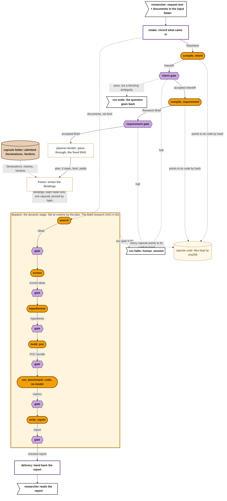
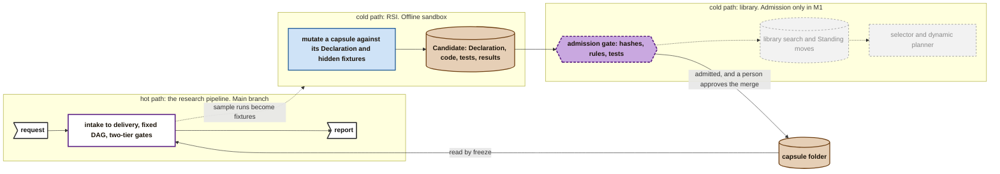
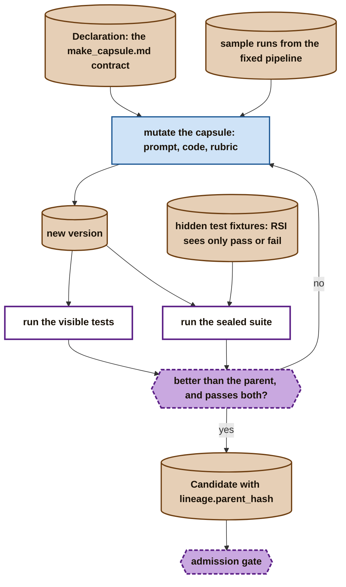
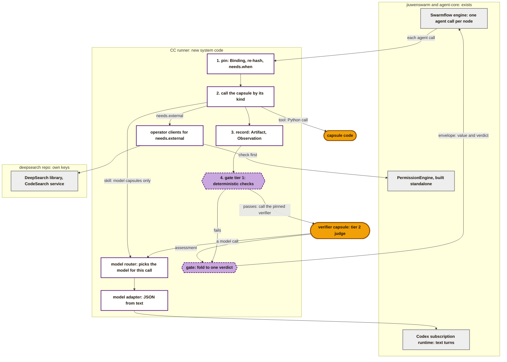
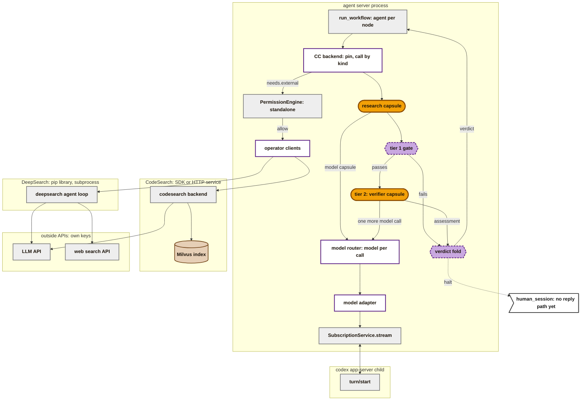

# M1: the research pipeline

> **Draft design, open to change.** M1 is the PRD's first milestone. It grows [B1](b1-design.md) into the full research pipeline: the same general stages, the same CC runner, and the same straight line. Dispatch now runs the fixed research DAG, and every handoff has a two-tier gate. M1 also adds operators and admission. RSI, the multi-model router and the dynamic planner are built beside the main path as parallel tracks.

**What M1 is:**

- **Every feature of the earlier AI4Research,** rebuilt on three openJiuwen repos. The Test Report lists the features; [the nodes](#the-nodes) maps each one to where it lives. The stack:

  | Repo | What M1 takes from it |
  |---|---|
  | jiuwenswarm | the runtime: Swarmflow runs the pipeline, plus the web UI, sessions, `human_session` and the permission engine |
  | deepsearch | the operators: DeepSearch (document search) and CodeSearch (code navigation) |
  | sciencediscovery | the domain logic and grading rubrics, ported into the capsules |

- **A fixed pipeline first, dynamic orchestration beside it.** The main branch runs a hardcoded Swarmflow DAG: the stable fallback and the release path. The dynamic planner is built at the same time on an offline track. It may replace the fixed DAG after M1.
- **The same components as B1:** intake, intent compilation, requirement compilation, planner-binder, freeze, dispatch and delivery. Planner-binder and freeze are still **pass-throughs**. Dispatch now runs the research stages in order instead of one task-specific capsule.
- **A two-tier gate at every handoff,** where B1 had one deterministic tier:
  - **Tier 1** is Python assertions: schema, files present, non-empty, budget.
  - **Tier 2** is an LLM semantic judge: the verifier capsule.

  A gate that does not pass halts the run and hands it to `human_session`.
- **Six core capsules** in the `make_capsule.md` contract (the Declaration): five workflow capsules and one verifier. Their rubrics are ported from sciencediscovery, and every payload is strict JSON. The two general capsules from B1, `compile_intent` and `compile_requirement`, carry over.
- **Admission, but no library search.** Capsules pass an admission gate before any run. There is no selector and no planner on the main path: the fixed DAG names its capsules.
- **RSI, the multi-model router and the dynamic planner are parallel tracks,** kept off the main branch until the fixed pipeline is stable (the PRD's integration gate).
- **The model router is not a pipeline stage.** It is an inner step of a capsule call, used only when that capsule uses a model. It picks the model for that one call at runtime. Tool capsules never reach it.

## The pipeline

**Key** (as in B1 and the M1 map): amber stadium = a capability capsule, with or without a model. Purple dashed hexagon = a two-tier gate. White box, purple border = control code. White box, dashed orange border = a pass-through that makes no choices. Brown = an object or the capsule folder. Pale dotted = the capsule code, kept by hash. Orange box = the dynamic dispatch stage. Thick arrow = binding. White flag = a person. A dotted "halt" line is a gate's `FAIL`, `ENVIRONMENT_BLOCKED` or `ESCALATE_TO_HUMAN` verdict.

**Two kinds of stage.** Intake, intent compilation, requirement compilation, planner-binder, freeze and delivery are always in the pipeline. **Dispatch**, the boxed stage, is dynamic: which capsules run there, and in what order, is set at runtime by the plan. In M1 the plan is the fixed research DAG. The dynamic planner, built on its own track, may later fill the box at runtime; the stages around it stay the same. Inside dispatch, every capsule is followed by its own gate.

**A capsule points to its code; a Binding makes it a node.** A capsule is its Declaration. It does not hold its code: it points to files kept elsewhere by their sha256. Freeze writes a Binding for each node, and the Binding is what makes "this node runs this capsule, at this exact hash". The runner re-hashes the code before every call.

Every gate has the same two tiers, drawn once below. Gates are drawn as separate nodes because they are separate modules. Tier 1 runs inside the CC backend, as in B1; where tier 2 runs is open.

## Inside a capsule and its two-tier gate

```mermaid
flowchart LR
    IN["input object"]:::rec --> RN["runner: checks hashes and needs.when, then calls"]:::ctrl
    subgraph CAP["capability capsule: makes the object, decides nothing"]
        M["the work: a model call with the output schema, or plain code"]:::cc --> POST["post-checks: deterministic, only add issues"]:::cc
    end
    RN --> M
    POST --> OBJ["output object + Observation"]:::rec
    OBJ --> T1{{"tier 1: Python assertions. Schema, files, non-empty, budget"}}:::gate
    T1 -->|"passes"| T2(["tier 2: verifier capsule. LLM semantic judge"]):::cc
    T2 -->|"assessment"| V{{"gate: fold to one verdict"}}:::gate
    T1 -->|"fails"| V
    V -->|"PASS, PASS_WITH_KNOWN_LIMITATIONS"| NEXT["next node"]:::ctrl
    V -->|"FAIL, ENVIRONMENT_BLOCKED, ESCALATE_TO_HUMAN"| HS>"run halts: human_session"]:::ext

    classDef cc fill:#F2A007,stroke:#8A4B00,stroke-width:3px,color:#1a1208,font-weight:bold
    classDef gate fill:#C9A8E0,stroke:#5B1F86,stroke-width:2.5px,stroke-dasharray:6 3,color:#1a1208,font-weight:bold
    classDef ctrl fill:#ffffff,stroke:#5B1F86,stroke-width:2.5px,color:#1a1208,font-weight:bold
    classDef rec fill:#E6CFB6,stroke:#6E3F12,stroke-width:2px,color:#1a1208,font-weight:bold
    classDef ext fill:#ffffff,stroke:#3b3b3b,stroke-width:2px,color:#111111,font-weight:bold
```

- **The capsule** makes the object and decides nothing, as in B1.
- **Tier 1** runs the Binding's deterministic and reference checks, then the gate's fixed checks on the call (it ended ok, it stayed within budget). It needs no model. If tier 1 already decides, tier 2 does not run (policy `gates`).
- **The budget is time only in M1.** The PRD's tier 1 checks token ceilings, but the Codex runtime reports no token use, so `cost.tokens` and `budget.tokens` stay unchecked until a runtime reports them.
- **Tier 2** runs the Binding's judged checks with the verifier capsule, pinned in the Binding's `verifier` like any other capsule. It judges the output against the capsule's acceptance rules: task relevance, logical coherence, completeness, and claim-to-evidence integrity. It only writes an assessment. The gate, which is code, emits the verdict.
- **The Stage Evidence Bundle** the PRD names is the output Artifacts (the deliverables), the capsule's Declaration (the contract and its acceptance rules), and the Observation (outcome and cost against the budget).
- **Five verdicts.** Two continue and three halt. The meanings are proposed:

  | Verdict | Meaning | The run |
  |---|---|---|
  | `PASS` | every check passed | continues |
  | `PASS_WITH_KNOWN_LIMITATIONS` | passed, with caveats carried forward | continues |
  | `FAIL` | a check failed on the output | halts |
  | `ENVIRONMENT_BLOCKED` | the call could not run: runtime down, timeout | halts |
  | `ESCALATE_TO_HUMAN` | the judge could not decide | halts |

  The schema's Verification has three decisions (`pass`, `fail`, `blocked`); see Open.

## How capsules get into M1

The same three loops as B1: the hot path, the RSI cold path and the library cold path. **M1 adds an admission gate between them.** There is still no library search, selector or planner on the main path.

Grey dashed = not on the M1 main path. Blue = agents in the RSI sandbox.

- **Admission** checks a Candidate's Declaration against the policy, hashes every file, runs its tests, and writes a Verdict and an `admitted` Standing entry. M1 admits capsules at the `provisional` level.
- **A person still approves the merge.** Nothing autonomous reaches the main branch until the fixed pipeline is stable.
- **The fixed DAG names its capsules,** so freeze needs no selector. It pins each admitted capsule by `decl_hash` and `code_sha256`, with its Verdict.

### The RSI tree in M1: an offline sandbox

RSI is decoupled from the live pipeline. It works on static capsule contracts and sample runs, so it never waits for a live DAG.

- **Hidden fixtures prevent overfitting to the prompt.** They map to the schema's sealed test suites: RSI gets only pass or fail, never the cases. Test suite `access` is unchecked in M1 (Unlocks: certification).
- **A mutation is a child version.** It carries `lineage.parent_hash`, and it must pass its parent's suites when the interface is unchanged (rule `parent_suites_pass`). Both are unchecked in M1 and unlocked by RSI, which shares the schema.
- **Two supporting tracks feed RSI:** a data foundation that supplies capsule data and fixtures, and fine-tuning of the model used as the verifier.

## The nodes

| Node | Kind | In | Out | Tier 1 passes when |
|---|---|---|---|---|
| intake | control code | the request text, from the web UI or the CLI; `.txt`, `.md` or `.pdf` documents from the workspace input directory | RawIntent, and each document as an Artifact | (no gate) |
| `compile_intent` | CC, model | RawIntent | IntentIR | as in B1 |
| `compile_requirement` | CC, model | accepted IntentIR | Research Brief (the semantic contract): the question, scope, compute limits, metrics, deliverables | it matches its schema; every IntentIR goal appears in some requirement's `source_refs` |
| planner-binder | control code, pass-through | accepted Brief | plan: the fixed six steps, with `bind` and `yields` | (no gate) |
| freeze | control code, pass-through | plan | run contract (the Bindings), each with its Verdict | (no gate; it refuses a capsule with no admitted Verdict) |
| `search` | CC, model; calls DeepSearch | Brief; intake's documents, through `bind` | candidate ideas, each with sources | at least one idea; every source resolves |
| `screen` | CC, model | ideas | ideas scored on the rubric, one chosen | scores use the rubric's dimensions; exactly one is chosen |
| `hypothesise` | CC, model | chosen idea | hypothesis and experiment setup | it names a measurable metric and a baseline |
| `build_poc` | CC, model; calls CodeSearch and workspace I/O | hypothesis | POC bundle: code and a test harness | the files exist inside the workspace; the harness entry point is present |
| `run_benchmark` | CC, code, no model | POC bundle | metrics | it finished within its time budget; every metric the hypothesis named is reported |
| `write_report` | CC, model | all earlier outputs, through `bind` | report | every required section is present; citations resolve to the idea sources |
| delivery | control code | checked report | the report shown to the researcher | (no gate) |

Tier 2 runs on every gated output with the verifier capsule.

**Where the capsules come from.** The five workflow capsules drawn here are a working choice; which five is open.

| Capsule | Ported from |
|---|---|
| `compile_requirement` | B1's capsule, as the PRD's requirement capsule |
| `search` | sciencediscovery `idea-tree-team` |
| `screen` | sciencediscovery `assessment-screening` |
| `hypothesise` | sciencediscovery `evolve-design` |
| `build_poc` | new |
| `run_benchmark` | new; a tool capsule, not one of the six |
| `write_report` | sciencediscovery `report-writer` |
| `verifier_capsule` | sciencediscovery `result-evaluator`, `citation-reviewer` |

**Where each Test Report feature lives:**

| Feature | In M1 |
|---|---|
| Codex CLI integration | the model adapter over the Codex subscription runtime, as in B1 |
| Ingestion | intake |
| Requirement compilation | `compile_intent`, `compile_requirement` |
| Search and ideation | `search`, with DeepSearch |
| Screening | `screen` |
| Hypothesis | `hypothesise` |
| POC implementation | `build_poc`, with CodeSearch and workspace I/O |
| Benchmarking | `run_benchmark` |
| Evaluation | the two-tier gate after every node |
| Delivery | `write_report`, then delivery |
| Visibility, installer, UI, accounts, message channels, configuration | jiuwenswarm as it ships, as the PRD says. The CC run adds its run tree and its records |

## The CC runner in M1

The same runner as [B1](b1-design.md#the-cc-runner-how-capsules-plug-into-jiuwenswarm): system code, not a capsule, and the only way a capsule runs inside jiuwenswarm. It is the Swarmflow engine's `AgentBackend`. Per call it pins, calls through the handler for the capsule's `kind`, records, and gates. M1 extends it:

**Key:** grey = already built: jiuwenswarm, agent-core, or the deepsearch repo. White with purple = the CC runner, new. Purple dashed = the gate. Amber = capsule code.

**What M1 adds to the B1 runner:**

- **Tier 2.** After tier 1 passes, the gate calls the verifier pinned in the Binding, as a call with `caller: gate`. The judge is one more Codex text turn through the same model adapter. The gate folds tier 1 and the assessment into one of the five verdicts. The diagram draws tier 2 inside the runner; whether it is its own `agent()` call instead is open.
- **The model router.** It sits inside the runner's model call, between the kind handler and the model adapter. It picks a model per capsule call, at runtime, within the capsule's `needs.model` limits, and records its choice in the Observation's `model`. `needs.model` is unchecked in M1 (Unlocks: routing), and on the main branch the router has one choice. Tool capsules never reach it.
- **Operators.** The model cannot call tools on this runtime, so the runner calls DeepSearch, CodeSearch and workspace I/O for a capsule, and only those in its `needs.external`. Neither operator is a jiuwenswarm tool: DeepSearch is the pip library `openjiuwen-deepsearch`, run as a subprocess, and CodeSearch is an SDK or HTTP service over a Milvus index. The runner needs one client per operator, and checks each call first with a standalone `PermissionEngine`, built the way jiuwenswarm's `owner_scopes.py:161-169` builds one. There is no approval UI outside the permission rail, so CC must decide what an `ASK` result means.
- **Admitted capsules.** The capsule folder loader also reads each capsule's Verdict.
- **Kinds.** `skill` and `tool`, as in B1. `prompt_section` may be needed for shared rubric text.

**The modules M1 adds.** Each is one issue, with fixed inputs and outputs:

| Module | In | Out |
|---|---|---|
| admission | a Candidate, the policy | a Verdict, a Standing entry, and the capsule's files in the folder |
| tier 2 caller | an output, the Binding's judged checks and its `verifier` | an assessment Artifact |
| verdict fold | tier 1 results, the assessment | one of the five verdicts |
| operator clients | a capsule's `needs.external`, an operator request | the operator's result, from its own library or service, after a standalone `PermissionEngine` check |
| model router | a model capsule's call and its `needs.model` | the model for this call, passed to the model adapter |
| six core capsules, and `run_benchmark` | each capsule's Declaration | its code and tests, admitted |

## Through jiuwenswarm: the deep view

The common path is the same as B1's: chat, gateway, agent server, engine, CC backend, model adapter, Codex child. See [B1's deep view](b1-design.md#through-jiuwenswarm-the-deep-view). This diagram shows only what M1 adds on top of it. Paths are as in B1: jiuwenswarm files under `jiuwenswarm/jiuwenswarm/` at `6d8c89e12`, and agent-core at `e23806c1`.

**Key:** grey = already built: jiuwenswarm, agent-core, the deepsearch repo, or an outside API. White with purple = new CC code. Amber = a capsule. Purple dashed = a gate. Brown = a store. White flag = a person.

**What each addition needs:**

- **Tier 2** is one more model call through the same router, model adapter and Codex child. Every judge call adds one more permanent entry to `subscription/bindings.json`. A judge turn that fails or times out closes the shared Codex child (`service.py:197-208`), as in B1.
- **The model router** is inside the runner's model call. Only model capsules and the judge reach it.
- **Operators** each need their own client and their own credentials. Neither runs on the Codex subscription. A DeepSearch run takes about 15 minutes as a subprocess and sends no progress events of its own.
- **The permission check** uses a `PermissionEngine` built without a DeepAgent, as `owner_scopes.py:161-169` does. **[pin]** Its constructor is read at agent-core `e23806c1`, not the pin `9e339019`.
- **`human_session`** is where the PRD sends a halted run. On this runtime nothing can take the person's reply: only the team backend has `human` sessions, and the Codex adapter refuses a Swarmflow reply (`interface_codex.py:67-70`). See Open.
- **The research nodes** change nothing on the path. They are more `agent()` calls on the same backend.

## Observability and traces

The same two layers as [B1](b1-design.md#observability-and-traces): CC records are the source of truth, and traces are for debugging, joined by `run_id` and `obs_id`. M1 adds:

- **More calls observed.** Every tier 2 judge call gets its own Observation, with `caller: gate`. An operator call runs inside a capsule's call, so its time is in that capsule's Observation; what it touched goes in `effects_observed`, which is unchecked in M1.
- **The Stage Evidence Bundle is built from records:** the Artifacts, the Declaration and the Observation.
- **Failure traces** go to the run tree when a gate halts, so the person who triages the run sees why.
- **The tracks read the records, not the traces.** Sample runs from the fixed pipeline become fixtures for RSI and benchmarking.

## Parallel tracks

Capability Capsule and Verifier build the main path. RSI, the multi-model router and the dynamic planner are parallel tracks: built off the main branch, and merged only after the fixed pipeline is stable. The data foundation and verifier fine-tuning support RSI. Each workstream meets the main path only at its interface.

| Workstream | What it builds in M1 | Its interface to the main path |
|---|---|---|
| Capability Capsule | the six core capsules in the `make_capsule.md` contract, with rubrics ported from sciencediscovery and strict JSON payloads; the CC runner; admission | the capsule folder and the runner |
| Verifier | the Evaluator gate: the two tiers and the five verdicts; a three-phase benchmark against native openJiuwen | the Verification record; the records of sample runs |
| RSI | mutation in an offline sandbox, against static contracts and hidden fixtures | a Candidate, through admission |
| RSI data foundation | the data and fixtures RSI works on | sample runs and fixtures |
| Verifier fine-tuning | tuning the model behind the tier 2 judge | a new version of the verifier capsule, through admission |
| Model routing | on the main branch, the Codex CLI adapter over one subscription. On an isolated branch, a multi-model router against simulated endpoints until enterprise keys arrive | an inner step of a model capsule's call, never a pipeline stage: it reads `needs.model` and records the model in the Observation |
| Dynamic planner | the Cluster Mode planner, tested against offline scenarios; the Leader Agent for intent compilation | may replace the fixed DAG after M1 |

## How M1 fits jiuwenswarm

| M1 piece | In jiuwenswarm or agent-core | Status |
|---|---|---|
| Run entry | the CC-run branch on the `chat.send` stream, as in B1 | as in B1 |
| The pipeline | a Swarmflow script run by `run_workflow(path, backend=...)`, one `agent()` call per node | as in B1 |
| Capsule calls, gates | the CC runner as the engine's `AgentBackend`. Tier 1 runs inside it; where tier 2 runs is open | new, extends B1 |
| The model | the Codex subscription runtime (the PRD's Codex CLI adapter): text turns, with JSON parsed from the reply. The model router sits inside the runner's model call; on the main branch it has one choice | works now as text turns |
| Budget | time only: Codex reports no tokens, so the PRD's token ceilings cannot be checked yet | runner only, as in B1 |
| Operators | not jiuwenswarm tools. The runner calls each through its own client, after a check by a standalone `PermissionEngine` (`agents/harness/common/rails/permissions/owner_scopes.py:161-169`) | new: a client per operator, and a CC rule for an `ASK` result |
| Halting to a person | `human_session` has no reply path on this runtime (`interface_codex.py:67-70`) | open |
| Records | files under the profile folder, beside jiuwenswarm's own logs | as in B1 |

## What M1 uses from the schemas

| Schema | Used in M1 for |
|---|---|
| [Declaration](schemas/declaration.md) | every capsule's `make_capsule.md` contract: ports, checks, acceptance rules, operators, effects |
| [Candidate](schemas/candidate.md), [Verdict](schemas/verdict.md) | admitting capsules, including RSI's new versions |
| [Standing](schemas/standing.md) | the `admitted` entry admission writes; nothing on the main path reads or moves it |
| [Check](schemas/checks.md) | both tiers' checks; the visible tests and the hidden (sealed) suites |
| [Policy](schemas/policy.md) | the gates' fold, the budgets, the mappings |
| [Port types](schemas/port-types.md) | the typed JSON passed from node to node |
| [Binding](schemas/binding.md) | each node's pin, and its verifier's |
| [Observation](schemas/observation.md) | every capsule call and every judge call |
| [Artifact](schemas/artifact.md) | every node's output, the Brief, the report |
| [Verification](schemas/verification-record.md) | each gate's decision |

**Not used on the main path:** Finding (RSI and a librarian would use it, off the main branch).

## Open

1. **Five verdicts versus the schema's three.** The PRD's gate has five verdicts; the schema's Verification has three decisions.
2. **Which five workflow capsules.** The fuller PRD lists six workflow capsules; the newest summary counts five. This page draws a working choice.
3. **`human_session` needs a reply path on the Codex runtime.** Until then a halted run cannot take the person's answer.
4. **Where POC and benchmark code run.** Today's Codex runtime is read-only, with no shell.
5. **Tier 2 as its own `agent()` call or inside the runner.**
6. **The operators need their own API keys.** DeepSearch needs its own LLM and web search keys, and CodeSearch its own LLM key. Neither runs on the Codex subscription.
7. **Operator calls are long jobs.** A DeepSearch run takes about 15 minutes and sends no progress. The runner's time budget and the run view must allow for it.
8. **Hidden fixtures.** How sealed suites reach admission is a known gap in the schemas.
9. **Token budgets.** The PRD's tier 1 checks token ceilings, and the Codex runtime reports no tokens.
