# Capsule M1 Map

M1 on openJiuwen: one task. Intake → intent compilation → requirement compilation → semantic contract → planner-binder and freeze as pass-throughs → schedule + dispatch → delivery. Capsules wherever they apply; acceptance steps are gates; the frontend is open. Draft 9, 2026-09-25.

**Legend.** Amber stadium = capability capsule (CC). Purple dashed hexagon = gate or decision, never a CC.
White box, purple border = our control code. Grey = Symphony / agent-core, already built. Brown cylinder = record or
store. Blue = CC schema section or record. Green = verifier (a tool). Black box with `?` = open: inputs and outputs
known, method not. Grey struck-through = not in this milestone. White / black parallelograms = a block's IN / OUT.
Heavy black line = main data flow; pink = answer back to the human; teal = bind from the library; dashed lines =
schema plug-ins, Symphony links, verifier checks, reject / repair, observations.

The diagrams use the ELK layout (set in each block's front matter). A renderer without ELK falls back to its default
layout: the content is the same, the arrangement differs.

## Blackbox view

Each block is one box: what goes in, what it does, what comes out.

```mermaid
---
config:
  layout: elk
---
flowchart TB
FE["<b>FRONTEND · OPEN [?]</b><br/>IN · a human: text, files<br/>DOES · open: CLI to begin?<br/>OUT · request + attachments"]:::box_unk
subgraph HOT ["M1 · ONE TASK"]
    subgraph ROW1 ["understand the request"]
        direction LR
        INT["<b>INTAKE [M1]</b><br/>IN · request + attachments<br/>DOES · takes the request in<br/>OUT · RawIntent"]:::box_hot
        ITN["<b>INTENT COMPILATION [M1]</b><br/>IN · RawIntent<br/>DOES · what did they ask for?<br/>OUT · accepted IntentIR"]:::box_hot
        RQC["<b>REQUIREMENT COMPILATION [M1]</b><br/>IN · accepted IntentIR<br/>DOES · what would satisfy them?<br/>OUT · RequirementIR v2"]:::box_hot
        CON[("<b>SEMANTIC CONTRACT</b><br/>in RequirementIR v2<br/>want: integer · given: text<br/>allowed capsule · checks")]:::schr
    end
    subgraph ROW2 ["carry it out"]
        direction LR
        PB["<b>PLANNER-BINDER · PASS-THROUGH [M1]</b><br/>IN · the semantic contract<br/>DOES · no decisions: passes it on<br/>OUT · PlanIR · 1 step"]:::box_thin
        FRZ["<b>FREEZE · PASS-THROUGH [M1]</b><br/>IN · PlanIR<br/>DOES · pins it and passes it on<br/>OUT · run contract"]:::box_thin
        DSP["<b>SCHEDULE + DISPATCH · SIMPLIFIED [M1]</b><br/>IN · run contract<br/>DOES · one fixed node<br/>OUT · gated integer"]:::box_hot
        DEL["<b>DELIVERY [M1]</b><br/>IN · gated integer<br/>DOES · answers the user<br/>OUT · answer"]:::box_hot
    end
end
subgraph AROUND ["around the run"]
    direction LR
    RUN["<b>RUNNER [M1]</b><br/>IN · a node + its capsule<br/>DOES · assembles the Declaration, calls the sites<br/>OUT · outputs + invocation"]:::box_hot
    EVAL[["evaluator.evaluate<br/>PASS · FAIL · DEFER<br/>M1 caller: dispatch<br/>M2 adds planning"]]:::ver
    STORE["<b>STORE · SIMPLIFIED [M1]</b><br/>IN · an author's capsule<br/>DOES · admits once, keeps it by hash<br/>OUT · latest admitted"]:::box_sch
    SYM1["<b>SYMPHONY [M1 · HAVE]</b><br/>IN · admitted capsules<br/>DOES · indexes them; no planning<br/>OUT · ids by name"]:::box_sym
    OBS1["<b>OBSERVABILITY [M1]</b><br/>IN · every capsule call<br/>DOES · records from day one<br/>OUT · records for later loops"]:::box_obs
    subgraph NOT ["OUTSIDE M1 · the PRD sets this boundary"]
        direction TB
        X1["<s>library selection</s>"]:::gone
        X2["<s>planner intelligence</s>"]:::gone
        X3["<s>RSI</s>"]:::gone
        X4["<s>optimizer, merge</s>"]:::gone
        X5["<s>librarian</s>"]:::gone
        X6["<s>judges</s>"]:::gone
        X7["<s>meta-RSI</s>"]:::gone
    end
end
ANS>"HUMAN reads the answer<br/>back through the same frontend"]:::ext
FE -->|"request text + attachments"| INT
INT -->|"RawIntent"| ITN
ITN -->|"accepted IntentIR"| RQC
RQC -->|"RequirementIR v2"| CON
CON -->|"semantic contract"| PB
PB -->|"PlanIR · 1 step"| FRZ
FRZ -->|"run contract"| DSP
DSP -->|"gated integer"| DEL
STORE -.->|"admitted only"| SYM1
SYM1 ==>|"capsule id"| PB
STORE --o|"hashes to pin"| FRZ
DEL ==>|"answer"| ANS
ITN -.->|"reject / clarify"| ANS
DSP -->|"hands the node"| RUN
RUN -.->|"same runner"| ITN
RUN -.->|"same runner"| RQC
CON -.->|"checks"| DSP
STORE -.->|"code, checks"| RUN
DSP -.-> EVAL
ITN -.- OBS1
RQC -.- OBS1
DSP -.- OBS1
RUN -.- OBS1
classDef cc fill:#F2A007,stroke:#8A4B00,stroke-width:3px,color:#1a1208,font-weight:bold
classDef gate fill:#C9A8E0,stroke:#5B1F86,stroke-width:2.5px,stroke-dasharray:6 3,color:#1a1208,font-weight:bold
classDef ctrl fill:#ffffff,stroke:#5B1F86,stroke-width:2.5px,color:#1a1208,font-weight:bold
classDef rec fill:#E6CFB6,stroke:#6E3F12,stroke-width:2px,color:#1a1208,font-weight:bold
classDef sym fill:#C9C9C9,stroke:#3b3b3b,stroke-width:2px,color:#111111,font-weight:bold
classDef ext fill:#ffffff,stroke:#3b3b3b,stroke-width:2px,color:#111111,font-weight:bold
classDef ver fill:#9FDDC4,stroke:#006B4B,stroke-width:2.5px,color:#0d1a14,font-weight:bold
classDef sch fill:#0B63A6,stroke:#062F52,stroke-width:3px,color:#ffffff,font-weight:bold
classDef schr fill:#CFE3F5,stroke:#0B63A6,stroke-width:4px,color:#062F52,font-weight:bold
classDef unk fill:#111111,stroke:#F2A007,stroke-width:2px,stroke-dasharray:5 3,color:#ffffff,font-weight:bold
classDef gone fill:#F4F4F4,stroke:#9A9A9A,stroke-width:1.5px,stroke-dasharray:4 4,color:#8A8A8A,font-weight:bold
classDef io_in fill:#ffffff,stroke:#111111,stroke-width:3px,color:#111111,font-weight:bold
classDef io_out fill:#3a3a3a,stroke:#111111,stroke-width:3px,color:#ffffff,font-weight:bold
classDef box_hot fill:#FFF1D6,stroke:#B86E00,stroke-width:4px,color:#111111,font-weight:bold
classDef box_thin fill:#FFFFFF,stroke:#B86E00,stroke-width:2px,stroke-dasharray:3 3,color:#555555,font-weight:bold
classDef box_unk fill:#222222,stroke:#F2A007,stroke-width:3px,stroke-dasharray:6 4,color:#ffffff,font-weight:bold
classDef box_sym fill:#E3E3E3,stroke:#3b3b3b,stroke-width:4px,color:#111111,font-weight:bold
classDef box_sch fill:#CFE3F5,stroke:#0B63A6,stroke-width:5px,color:#062F52,font-weight:bold
classDef box_obs fill:#FCEFD9,stroke:#D98200,stroke-width:4px,stroke-dasharray:3 3,color:#111111,font-weight:bold
style HOT fill:#FFF6E6,stroke:#B86E00,stroke-width:4px,color:#111111,font-weight:bold
style NOT fill:#FAFAFA,stroke:#9A9A9A,stroke-width:3px,stroke-dasharray:6 4,color:#111111,font-weight:bold
style ROW1 fill:#FFF9EE,stroke:#D9A441,stroke-width:1px,color:#111111,font-weight:bold
style ROW2 fill:#FFF9EE,stroke:#D9A441,stroke-width:1px,color:#111111,font-weight:bold
style AROUND fill:#FBFBFB,stroke:#9A9A9A,stroke-width:1px,color:#111111,font-weight:bold
linkStyle 0,1,2,3,4,5,6,7,13 stroke:#111111,stroke-width:4px
linkStyle 11 stroke:#D6246E,stroke-width:5px
linkStyle 9 stroke:#00A3A3,stroke-width:3.6px,stroke-opacity:0.55
linkStyle 10 stroke:#8B4513,stroke-width:3.0px,stroke-dasharray:14 4,stroke-opacity:0.55
linkStyle 12 stroke:#8E24AA,stroke-width:2.4px,stroke-dasharray:7 4,stroke-opacity:0.55
linkStyle 18 stroke:#16A34A,stroke-width:2.6px,stroke-dasharray:2 3,stroke-opacity:0.55
linkStyle 8,14,15 stroke:#6B7280,stroke-width:2.4px,stroke-dasharray:12 3 3 3 3 3,stroke-opacity:0.55
linkStyle 16,17 stroke:#1D6FE0,stroke-width:2.0px,stroke-dasharray:6 2 1 2,stroke-opacity:0.55
linkStyle 19,20,21,22 stroke:#D98200,stroke-width:1.6px,stroke-dasharray:1 4,stroke-opacity:0.45,stroke-opacity:0.55
```

## Expanded view

Each block opened into its components.

```mermaid
---
config:
  layout: elk
---
flowchart TB
subgraph FE ["FRONTEND · OPEN [?]<br/>open: CLI to begin?"]
    FE_in[/"IN · a human: text, files"/]:::io_in
    FE0>"HUMAN"]:::ext
    FE1["? how the request arrives<br/>in: text + attached files<br/>out: request + attachment refs"]:::unk
    FE2>"CLI to begin?<br/>later: Web · IM ·<br/>jiuwenswarm Gateway"]:::ext
    FE_in --> FE0
    FE0 --> FE1
    FE1 --> FE_out
    FE2 -.->|"options"| FE1
    FE_out[\"OUT · request + attachments"\]:::io_out
end
subgraph HOT ["M1 · ONE TASK"]
    subgraph ROW1 ["understand the request"]
        direction LR
        subgraph INT ["INTAKE [M1]<br/>takes the request in"]
            direction TB
            INT_in[/"IN · request + attachments"/]:::io_in
            IN1["skeleton.intake<br/>capture → RawIntent<br/>attachments kept as refs"]:::ctrl
            INT_in --> IN1
            IN1 --> INT_out
            INT_out[\"OUT · RawIntent"\]:::io_out
        end
        subgraph ITN ["INTENT COMPILATION [M1]<br/>what did they ask for?"]
            direction TB
            ITN_in[/"IN · RawIntent"/]:::io_in
            IT1(["CC · compile_intent<br/>normalize + IntentIR<br/>model"]):::cc
            IT2(["CC · review_fidelity<br/>independent reviewer<br/>model"]):::cc
            ITg{{"decide_acceptance<br/>+ deterministic checks<br/>GATE · the only handoff"}}:::gate
            ITR["bounded repair"]:::ctrl
            ITN_in --> IT1
            IT1 --> IT2
            IT2 --> ITg
            ITg --> ITN_out
            ITg -.->|"repairable"| ITR
            ITR -.-> IT1
            ITN_out[\"OUT · accepted IntentIR"\]:::io_out
        end
        subgraph RQC ["REQUIREMENT COMPILATION [M1]<br/>what would satisfy them?"]
            direction TB
            RQC_in[/"IN · accepted IntentIR"/]:::io_in
            RC1(["CC · compile_requirement<br/>RequirementIR v2 from a template · model"]):::cc
            RC2(["CC · review_requirement<br/>semantic review, advisory · model"]):::cc
            RCg{{"acceptance<br/>deterministic contract<br/>validation · GATE"}}:::gate
            RCR["bounded repair"]:::ctrl
            RQC_in --> RC1
            RC1 --> RC2
            RC2 --> RCg
            RCg --> RQC_out
            RCg -.->|"defect"| RCR
            RCR -.-> RC1
            RQC_out[\"OUT · RequirementIR v2"\]:::io_out
        end
        CON[("<b>SEMANTIC CONTRACT</b><br/>in RequirementIR v2<br/>want: integer · given: text<br/>allowed capsule · checks")]:::schr
    end
    subgraph ROW2 ["carry it out"]
        direction LR
        subgraph PB ["PLANNER-BINDER · PASS-THROUGH [M1]<br/>no decisions: passes it on"]
            direction TB
            PB_in[/"IN · the semantic contract"/]:::io_in
            PB1["pass-through<br/>the contract names one capsule;<br/>write it into a 1-step PlanIR"]:::ctrl
            PBx1["<s>planner decision · MODEL</s>"]:::gone
            PBx2["<s>scoring · Symphony plan()</s>"]:::gone
            PBx3["<s>plan fidelity review</s>"]:::gone
            PB_in --> PB1
            PB1 --> PB_out
            PB_out[\"OUT · PlanIR · 1 step"\]:::io_out
        end
        subgraph FRZ ["FREEZE · PASS-THROUGH [M1]<br/>pins it and passes it on"]
            direction TB
            FRZ_in[/"IN · PlanIR"/]:::io_in
            FZ1["pass-through<br/>pin what the plan names"]:::ctrl
            FZ2[("RUN CONTRACT · frozen<br/>one Binding per node:<br/>decl_hash · code sha256 · Verdict<br/>+ semantic_contract_sha256")]:::schr
            FRZ_in --> FZ1
            FZ1 --> FZ2
            FZ2 --> FRZ_out
            FRZ_out[\"OUT · run contract"\]:::io_out
        end
        subgraph DSP ["SCHEDULE + DISPATCH · SIMPLIFIED [M1]<br/>one fixed node"]
            direction TB
            DSP_in[/"IN · run contract"/]:::io_in
            DS1["scheduler<br/>Kahn order · n = 1"]:::ctrl
            DS3["dispatcher.run<br/>hands the node<br/>to the runner"]:::ctrl
            DS2(["CC · count_spaces<br/>text → integer · pure"]):::cc
            DSg{{"step gate<br/>check named by<br/>outputs[].check"}}:::gate
            DSP_in --> DS1
            DS1 --> DS3
            DS3 --> DS2
            DS2 --> DSg
            DSg --> DSP_out
            DSP_out[\"OUT · gated integer"\]:::io_out
        end
        subgraph DEL ["DELIVERY [M1]<br/>answers the user"]
            direction TB
            DEL_in[/"IN · gated integer"/]:::io_in
            DL1["delivery<br/>control"]:::ctrl
            DEL_in --> DL1
            DL1 --> DEL_out
            DEL_out[\"OUT · answer"\]:::io_out
        end
    end
end
subgraph AROUND ["around the run"]
    direction LR
    subgraph RUN ["RUNNER [M1]<br/>assembles the Declaration, calls the sites"]
        RUN_in[/"IN · a node + its capsule"/]:::io_in
        RN0["read the Declaration<br/>assemble: code by hash<br/>inputs · permissions"]:::ctrl
        RN1["loader.load<br/>sha256, then import"]:::ctrl
        RN2["CapsuleTool.invoke<br/>ports in → ports out"]:::ctrl
        RN3["PermissionEngine<br/>by effect_class"]:::sym
        RN4(["run"]):::cc
        RN5[("invocation appended<br/>to the node's Binding;<br/>before freeze: to the<br/>run + stage record")]:::rec
        RUN_in --> RN0
        RN0 --> RN1
        RN1 --> RN2
        RN2 --> RN3
        RN3 --> RN4
        RN4 --> RN5
        RN5 --> RUN_out
        RUN_out[\"OUT · outputs + invocation"\]:::io_out
    end
    EVAL[["evaluator.evaluate<br/>PASS · FAIL · DEFER<br/>M1 caller: dispatch<br/>M2 adds planning"]]:::ver
    subgraph STORE ["STORE · SIMPLIFIED [M1]<br/>admits once, keeps it by hash"]
        STORE_in[/"IN · an author's capsule"/]:::io_in
        ST0>"author<br/>Declaration + code<br/>+ unit cases"]:::ext
        ST1{{"gate.admit<br/>schema + policy-m1"}}:::gate
        ST2["Declarations<br/>by decl_hash"]:::sch
        ST3[("Verdict<br/>pass · decl_hash · epoch")]:::schr
        ST5[("code objects<br/>by sha256")]:::rec
        ST6[["test cases<br/>by id"]]:::ver
        STORE_in --> ST0
        ST0 --> ST1
        ST1 --> ST2
        ST2 --> STORE_out
        ST1 -->|"writes"| ST3
        ST2 --o|"code"| ST5
        ST2 --o|"tests"| ST6
        STORE_out[\"OUT · latest admitted"\]:::io_out
    end
    subgraph SYM1 ["SYMPHONY [M1 · HAVE]<br/>indexes them; no planning"]
        SYM1_in[/"IN · admitted capsules"/]:::io_in
        SY0["CC provider<br/>capabilities() ·<br/>source_snapshot()"]:::ctrl
        SY2["FingerprintService<br/>snapshot read twice"]:::sym
        SY3["index<br/>ids · typed I/O"]:::sym
        SY4["? tool capsules in the graph<br/>in: tool Declarations<br/>out: graphed, or indexed only"]:::unk
        SY5["<s>plan() · model</s>"]:::gone
        SYM1_in --> SY0
        SY0 --> SY2
        SY2 --> SY3
        SY3 --> SYM1_out
        SY3 -.-> SY4
        SYM1_out[\"OUT · ids by name"\]:::io_out
    end
    subgraph OBS1 ["OBSERVABILITY [M1]<br/>records from day one"]
        OBS1_in[/"IN · every capsule call"/]:::io_in
        OB1["spans<br/>harness/observability"]:::sym
        OB2[("Binding + invocations<br/>key: run id + node")]:::rec
        OB3[("gate results<br/>pass · fail · reason")]:::rec
        OBS1_in --> OB1
        OB1 --> OBS1_out
        OBS1_in --> OB2
        OB2 --> OBS1_out
        OBS1_in --> OB3
        OB3 --> OBS1_out
        OBS1_out[\"OUT · records for later loops"\]:::io_out
    end
    subgraph NOT ["OUTSIDE M1 · the PRD sets this boundary"]
        direction TB
        X1["<s>library selection</s>"]:::gone
        X2["<s>planner intelligence</s>"]:::gone
        X3["<s>RSI</s>"]:::gone
        X4["<s>optimizer, merge</s>"]:::gone
        X5["<s>librarian</s>"]:::gone
        X6["<s>judges</s>"]:::gone
        X7["<s>meta-RSI</s>"]:::gone
    end
end
ANS>"HUMAN reads the answer<br/>back through the same frontend"]:::ext
FE_out -->|"request text + attachments"| INT_in
INT_out -->|"RawIntent"| ITN_in
ITN_out -->|"accepted IntentIR"| RQC_in
RQC_out -->|"RequirementIR v2"| CON
CON -->|"semantic contract"| PB_in
PB_out -->|"PlanIR · 1 step"| FRZ_in
FRZ_out -->|"run contract"| DSP_in
DSP_out -->|"gated integer"| DEL_in
STORE_out -.->|"admitted only"| SYM1_in
SYM1_out ==>|"capsule id"| PB_in
STORE_out --o|"hashes to pin"| FRZ_in
DEL_out ==>|"answer"| ANS
ITg -.->|"reject / clarify"| ANS
DS3 -->|"node"| RUN_in
RN4 -->|"runs this capsule"| DS2
RUN_out -.->|"same runner"| IT1
RUN_out -.->|"same runner"| IT2
RUN_out -.->|"same runner"| RC1
RUN_out -.->|"same runner"| RC2
CON -.->|"checks"| DSg
CON -.->|"the one capsule"| PB1
DS1 -.->|"needs.when on fresh state"| EVAL
ST5 -.->|"expected sha256"| RN1
ST2 -.->|"effect_class"| RN3
IT1 -.- OBS1_in
IT2 -.- OBS1_in
RC1 -.- OBS1_in
RC2 -.- OBS1_in
DS2 -.- OBS1_in
ITg -.- OBS1_in
RCg -.- OBS1_in
DSg -.- OBS1_in
RN5 -.- OBS1_in
classDef cc fill:#F2A007,stroke:#8A4B00,stroke-width:3px,color:#1a1208,font-weight:bold
classDef gate fill:#C9A8E0,stroke:#5B1F86,stroke-width:2.5px,stroke-dasharray:6 3,color:#1a1208,font-weight:bold
classDef ctrl fill:#ffffff,stroke:#5B1F86,stroke-width:2.5px,color:#1a1208,font-weight:bold
classDef rec fill:#E6CFB6,stroke:#6E3F12,stroke-width:2px,color:#1a1208,font-weight:bold
classDef sym fill:#C9C9C9,stroke:#3b3b3b,stroke-width:2px,color:#111111,font-weight:bold
classDef ext fill:#ffffff,stroke:#3b3b3b,stroke-width:2px,color:#111111,font-weight:bold
classDef ver fill:#9FDDC4,stroke:#006B4B,stroke-width:2.5px,color:#0d1a14,font-weight:bold
classDef sch fill:#0B63A6,stroke:#062F52,stroke-width:3px,color:#ffffff,font-weight:bold
classDef schr fill:#CFE3F5,stroke:#0B63A6,stroke-width:4px,color:#062F52,font-weight:bold
classDef unk fill:#111111,stroke:#F2A007,stroke-width:2px,stroke-dasharray:5 3,color:#ffffff,font-weight:bold
classDef gone fill:#F4F4F4,stroke:#9A9A9A,stroke-width:1.5px,stroke-dasharray:4 4,color:#8A8A8A,font-weight:bold
classDef io_in fill:#ffffff,stroke:#111111,stroke-width:3px,color:#111111,font-weight:bold
classDef io_out fill:#3a3a3a,stroke:#111111,stroke-width:3px,color:#ffffff,font-weight:bold
classDef box_hot fill:#FFF1D6,stroke:#B86E00,stroke-width:4px,color:#111111,font-weight:bold
classDef box_thin fill:#FFFFFF,stroke:#B86E00,stroke-width:2px,stroke-dasharray:3 3,color:#555555,font-weight:bold
classDef box_unk fill:#222222,stroke:#F2A007,stroke-width:3px,stroke-dasharray:6 4,color:#ffffff,font-weight:bold
classDef box_sym fill:#E3E3E3,stroke:#3b3b3b,stroke-width:4px,color:#111111,font-weight:bold
classDef box_sch fill:#CFE3F5,stroke:#0B63A6,stroke-width:5px,color:#062F52,font-weight:bold
classDef box_obs fill:#FCEFD9,stroke:#D98200,stroke-width:4px,stroke-dasharray:3 3,color:#111111,font-weight:bold
style HOT fill:#FFF6E6,stroke:#B86E00,stroke-width:4px,color:#111111,font-weight:bold
style NOT fill:#FAFAFA,stroke:#9A9A9A,stroke-width:3px,stroke-dasharray:6 4,color:#111111,font-weight:bold
style ROW1 fill:#FFF9EE,stroke:#D9A441,stroke-width:1px,color:#111111,font-weight:bold
style ROW2 fill:#FFF9EE,stroke:#D9A441,stroke-width:1px,color:#111111,font-weight:bold
style AROUND fill:#FBFBFB,stroke:#9A9A9A,stroke-width:1px,color:#111111,font-weight:bold
style INT fill:#ffffff,stroke:#B86E00,stroke-width:3px,color:#111111,font-weight:bold
style ITN fill:#ffffff,stroke:#B86E00,stroke-width:3px,color:#111111,font-weight:bold
style RQC fill:#ffffff,stroke:#B86E00,stroke-width:3px,color:#111111,font-weight:bold
style DSP fill:#ffffff,stroke:#B86E00,stroke-width:3px,color:#111111,font-weight:bold
style DEL fill:#ffffff,stroke:#B86E00,stroke-width:3px,color:#111111,font-weight:bold
style RUN fill:#ffffff,stroke:#B86E00,stroke-width:3px,color:#111111,font-weight:bold
style PB fill:#FDFDFD,stroke:#B86E00,stroke-width:2px,stroke-dasharray:3 3,color:#111111,font-weight:bold
style FRZ fill:#FDFDFD,stroke:#B86E00,stroke-width:2px,stroke-dasharray:3 3,color:#111111,font-weight:bold
style FE fill:#2A2A2A,stroke:#F2A007,stroke-width:3px,stroke-dasharray:6 4,color:#ffffff,font-weight:bold
style SYM1 fill:#F4F4F4,stroke:#3b3b3b,stroke-width:3px,color:#111111,font-weight:bold
style STORE fill:#EEF5FC,stroke:#0B63A6,stroke-width:4px,stroke-dasharray:10 4,color:#111111,font-weight:bold
style OBS1 fill:#FFF8EC,stroke:#D98200,stroke-width:3px,stroke-dasharray:3 3,color:#111111,font-weight:bold
linkStyle 0,1,2,4,5,6,7,8,9,12,13,14,15,18,19,20,21,22,23,24,25,26,27,28,29,30,31,32,33,34,35,36,37,38,39,40,41,44,45,46,47,49,50,51,52,53,54,55,56,57,58,59,60,61,62,68,69 stroke:#111111,stroke-width:4px
linkStyle 66 stroke:#D6246E,stroke-width:5px
linkStyle 64 stroke:#00A3A3,stroke-width:3.6px,stroke-opacity:0.55
linkStyle 65 stroke:#8B4513,stroke-width:3.0px,stroke-dasharray:14 4,stroke-opacity:0.55
linkStyle 3,10,11,16,17,48,67 stroke:#8E24AA,stroke-width:2.4px,stroke-dasharray:7 4,stroke-opacity:0.55
linkStyle 76 stroke:#16A34A,stroke-width:2.6px,stroke-dasharray:2 3,stroke-opacity:0.55
linkStyle 63,70,71,72,73 stroke:#6B7280,stroke-width:2.4px,stroke-dasharray:12 3 3 3 3 3,stroke-opacity:0.55
linkStyle 42,43 stroke:#E4572E,stroke-width:2.2px,stroke-dasharray:4 2,stroke-opacity:0.55
linkStyle 74,75,77,78 stroke:#1D6FE0,stroke-width:2.0px,stroke-dasharray:6 2 1 2,stroke-opacity:0.55
linkStyle 79,80,81,82,83,84,85,86,87 stroke:#D98200,stroke-width:1.6px,stroke-dasharray:1 4,stroke-opacity:0.45,stroke-opacity:0.55
```

