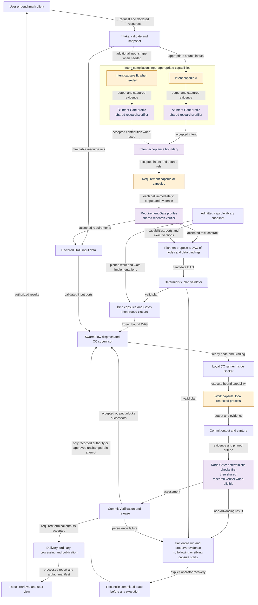
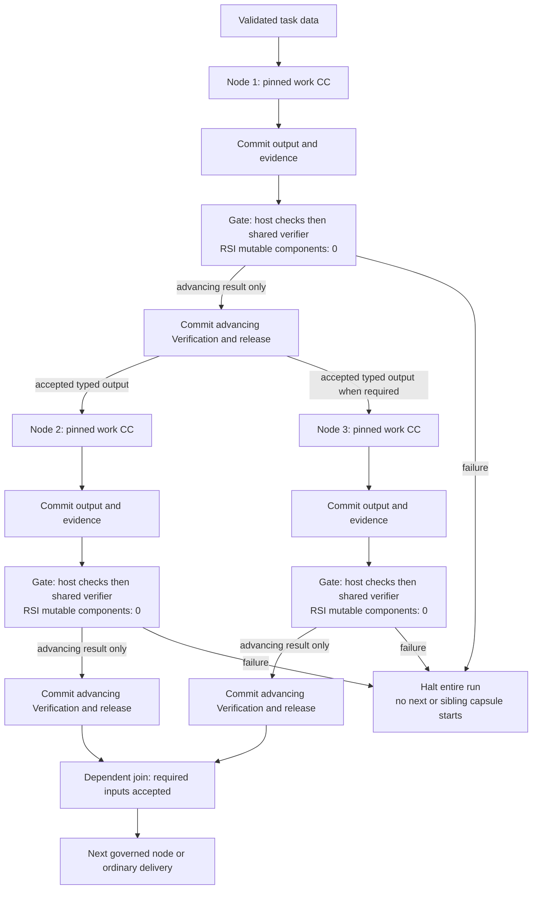

# M1 control flow: understand, plan, bind, execute

This page owns the system-level flow corrected on 5 October 2026. It replaces the fixed eight-stage chain as the overall presentation. The received PRD is unchanged. The earlier [M1 map](../m1.md) supplies the separation between intake, intent, requirements, planning/binding and dispatch; this correction makes planning produce a DAG rather than that old map's one-node pass-through.

## Order and responsibilities

1. **Intake:** validate the request and resources, snapshot permitted inputs and preserve their source references.
2. **Intent capsules:** use the input-appropriate intent capabilities to derive what the request means. More than one may participate. These are governed capsule calls, not optional deterministic hints in the corrected architecture.
3. **Intent Gate:** run the associated Gate capsule immediately after each intent capsule call. Only accepted outputs contribute to the accepted intent. The intent acceptance boundary must succeed before requirements begin. A drawn group boundary does not waive individual capsule Gates.
4. **Requirement capsules:** derive the task's required outputs, constraints, acceptance criteria and evidence from accepted intent. Run each associated Gate capsule immediately afterward. Only accepted requirements reach planning.
5. **Planner:** an ordinary orchestration service uses the accepted requirement contract and admitted library snapshot to propose a DAG of nodes, dependencies, typed data connections and completion criteria. It does not execute capsules. Codex supplies its model work through the existing protected adapter.
6. **Plan validator, binder and freeze:** validate the complete graph, resolve compatible admitted capsule versions, bind each node to its local capsule and Gate, and freeze exact inputs/policies/budgets. Invalid or incomplete plans do not dispatch.
7. **Data injection and dispatch:** supply accepted task data and immutable resource references to the DAG's declared input ports. The scheduler releases ready nodes only after their dependencies have accepted outputs.
8. **Local execution:** the runner executes a node's bound capsule locally inside the Docker application and its restricted process boundary. Its output and capture commit before the node's bound Gate capsule runs. Gate assessment and deterministic checks produce Verification; committed advancing Verification and release authorize downstream nodes.
9. **Delivery:** collect the required accepted terminal outputs, publish the checked report/artifact manifest and expose authorized retrieval.

A node is a plan position; a capsule is the bound capability implementation. Gates are bound capabilities invoked by the Gate host, not unrestricted model authority. Immediate Gate ordering means no dependent work consumes an ungated output; evidence persistence happens between the work call and Gate call.

## Fixed flow and planned nodes

[SwarmFlow integration](../system/integration.md#swarmflow-run-a-plan-be-the-backend) executes the fixed outer flow: intake, intent acceptance, requirement acceptance, planner invocation, validation, binding/freeze, dispatch and delivery. These required positions cannot be omitted by the model. Input-appropriate intent/requirement capsule participation is resolved under that fixed preparation flow.

Inside dispatch, the planner chooses work nodes and their connections from accepted requirements. After validation and freeze, that task DAG is fixed too: exact capsules, Gate profiles, inputs and dependency edges do not change during execution. A DAG describes dependencies; M1 can process ready nodes serially and does not require parallel execution.

## Gate scope, count and RSI protection

- **One semantic verification capsule identity:** `research.verifier`, reused through pinned intent, requirement and work-node criteria profiles. Several Gate call sites do not mean several admitted verifier implementations. Revised intent/requirement profiles still need contracts; this flow does not invent new verifier identities.
- **One Gate boundary per executed work capsule call:** intent calls, requirement calls and every bound DAG capsule call. The Gate host performs mandatory deterministic checks, then invokes the bound verification capsule when those checks permit semantic assessment. A deterministic failure already fails the boundary; it does not require a paid semantic call to fail again.
- Each Gate evaluates only the declared output/evidence, source fidelity, effects and criteria for its bound producer. It does not execute the producer's next step. The host folds the assessment into Verification; the supervisor alone commits release and dispatches.
- A failed Gate halts the run: no following work capsule is started, including ready nodes on another branch. Previously committed results remain available for diagnosis. Any in-flight work follows cancellation/capture rules; it cannot authorize further advancement. Explicit recovery reconciles durable state before execution.
- **Every capsule acting as a Gate has zero RSI-mutable components:** `evolution.rsi: none` and an empty `evolution.may_change`. M1 RSI cannot modify its prompt, body, checks, dependencies or criteria policy. [Shared verifier](../capsule/gate-capsules.md) owns this rule; [RSI controller](../capsule/rsi-engine.md) rejects protected targets.
- Evaluation success rates identify the work capsule version, verifier version, criteria/profile, benchmark fixtures, model configuration and measurement protocol. Keeping the referee fixed makes work-capsule comparisons interpretable; it does not establish statistical reliability from a small sample. A deliberate human referee revision starts a new comparison cohort rather than silently changing an existing rate.

## Whole-system information flow

This diagram names logical responsibilities. Intent capability identities, revised requirement ports and frontend-to-planner request shapes still require contract reconciliation; these boxes are not new released schema definitions. Branches represent input-appropriate participation, not a mandatory count of intent capsules.

The recovery arrow enters dispatch reconciliation, not a direct permission to rerun a capsule. [Lifecycle](../system/lifecycle.md) owns committed-state replay, unchanged-pin remediation and new-run rules. Intake/intent/requirement failures also halt before their downstream boundary; the graph does not draw every failure edge.

## DAG execution detail

This illustrates dependencies, not simultaneous execution or a new concurrency guarantee. The existing single-active-run limit remains. Internal scheduling concurrency needs an explicit contract before implementation; a DAG can execute ready nodes serially.

## Delivery boundary

Delivery is not a capsule. It receives accepted terminal results, resolves authorized evidence, performs deterministic result assembly/formatting, publishes the manifest and returns data through the application retrieval/view interface to the user. A research report-writing capability may be a planned work node, but the delivery module itself is ordinary control/output code and has no capsule admission or RSI target.

## Contract impact and readiness

- [Research pipeline](pipeline.md) still records the research capability chain and its 23 input bindings. It is a baseline/example to reconcile, not the corrected overall request-to-DAG flow.
- [IntentIR](../types/intent-ir.md) currently describes launcher hints. Its producer/consumer semantics must be reopened for actual intent capsules. Existing shape validation is not acceptance evidence for that new use.
- [Requirement capsule](requirement-capsule.md) currently consumes intake/source text. Accepted-intent ports and intent/requirement Gate profiles must be finalized together.
- [Planner](../system/planner.md), [service schemas](../contracts/services-v1.schema.json), [run plan](../types/run-plan.md), [module map](../system/modules.md) and configuration must be reconciled with the accepted requirement entry. Their old experimental-only restriction cannot define the corrected main flow.
- Recheck admission inventory, every affected caller, coverage, diagrams, stories and export after that reconciliation. Do not claim the old twelve-identity inventory covers the new intent capabilities.
- Local execution, protected Codex bridge, durable Gate authority, manual activation, isolated RSI, permissions and deferred SkillFuzz analysis remain applicable. No live replanning or automatic repair loop is introduced by planning once before freeze.

This is a specified system-level correction, not a completed coding-handoff contract release. The [showcase](../presentation/showcase/README.md) presents this flow and exposes the contract work remaining.
