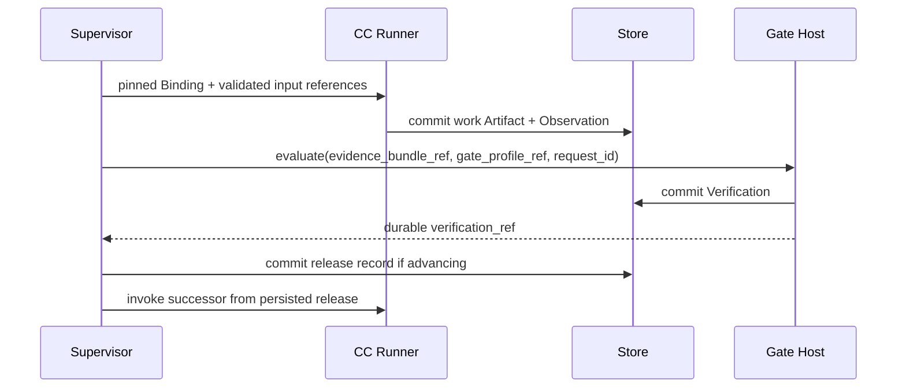

# M1 production path and capsule inventory

> **Flow correction, 5 October 2026:** [Current M1 control flow](control-flow.md) supersedes this page’s fixed-production / experimental-only overall layout. The contracts and diagrams below remain baseline material pending connected revision; they are not the current end-to-end showcase.


This page owns the production plan. The frozen October 2 PRD governs scope. Production is fixed and sequential; offline RSI and isolated Phase 2 experiments have separate plans and settings. Dynamic planning never modifies this plan.

## Smallest justified capsule set

Eight work capsules own the eight meaningful research contracts below. One shared `research.verifier` owns semantic infrastructure assessment. Three reusable search operators (`op.scholarly_search`, `op.local_search`, `op.codesearch`) remain capability boundaries because they serve multiple callers and mediate external or repository access. Total: twelve declared capability identities, excluding candidate versions. A count is an outcome of boundaries, not a target.

Source extraction, deterministic intent hints, dependency assessment, ranking arithmetic, measurement transforms, resource freezing, workspace IO and publication are ordinary modules. Their contracts remain explicit; none needs separate capsule admission merely to demonstrate composition. The original [inventory proposal](capsule-inventory-proposal.md) is historical.

Typed bindings borrow [Kubeflow component specifications](https://www.kubeflow.org/docs/components/pipelines/reference/component-spec/). Keeping pure helpers inside a versioned owner reduces deployment and admission work while preserving callable verification hooks.

## Spatial connections and contracts

| Step | Work capability | Exact inputs | Output | Gate profile |
|---|---|---|---|---|
| requirement | research.compile_brief | launcher intake; source_text; optional deterministic intent_ir hints | research_brief | research.accept_brief.v1 |
| search | research.search_ideas | research_brief; intake | idea_set | research.accept_ideas.v1 |
| screening | research.select_opportunity | idea_set; research_brief | opportunity_card | research.accept_card.v1 |
| hypothesis | research.form_hypothesis | opportunity_card; research_brief; intake | hypothesis_blueprint | research.accept_hypothesis.v1 |
| poc | research.build_poc | hypothesis_blueprint; research_brief; intake | poc_bundle | research.accept_poc.v1 |
| benchmark | research.run_benchmark | poc_bundle; hypothesis_blueprint | benchmark_payload | research.accept_benchmark.v1 |
| evaluation | research.evaluate_results | benchmark_payload; hypothesis_blueprint; research_brief | evaluation_verdict | research.accept_evaluation.v1 |
| report | research.write_report | evaluation_verdict; benchmark_payload; research_brief; idea_set; opportunity_card; hypothesis_blueprint; authorized StageContext | research_report | research.accept_report.v1 |

All semantic Gate slots bind `gate_capsule_name: research.verifier`. A required pinned `gate_profile_ref` supplies deterministic checks, criteria and evidence rules. Profile identifiers are not independently admitted capsule names. Schemas are owned by [type index](../types/types.md). Source projection and final publication use mechanically checked ordinary-module boundaries.

## Temporal flow


Each research arrow expands to the same sequence:



A failed output, Verification or release write halts; no successful transient result authorizes a successor. Duplicate request IDs return stored results or in-progress state. Timeouts and cancellation retain evidence. Explicit restart creates a new attempt with the same run and step identity, while input/policy changes create a new run. [Lifecycle](../system/lifecycle.md) owns those semantics.

Scientific `FAIL`, `INCONCLUSIVE` and `CONDITIONALLY_ACCEPTABLE` advance to report when infrastructure verification passes. No eligible opportunity halts for human review. No stage repairs, reruns or selects successors autonomously.

## Compilation, startup and completion

Production validation uses its committed intake and exact fixed-template proposal envelope before the Brief exists; no prerequisite model planning or fabricated Brief/objective IDs are required. [Planner validation](../system/planner.md) owns the track-specific bootstrap rules.

The static Swarmflow script instantiates this typed [run-plan contract](../types/run-plan.md); it contains no alternative analytical behavior. Startup resolves admitted work versions, the shared verifier, Gate profiles, schemas, library snapshot, model route and required measurement methods. It validates exact wires and permission/dependency closure before freeze. Missing contracts return POLICY_UNRESOLVED or the documented input error; unsupported execution profiles return UNSUPPORTED_SECURITY_PROFILE.

Launcher validates [intake](../types/intake.md), freezes resources and produces [source_text](../types/source-text.md). It may derive deterministic IntentIR hints without another model turn. [Requirement Compilation](requirement-capsule.md) owns the sole bounded semantic intention-compilation pass.

After report verification, [publication](delivery.md) writes the complete directory and validates its manifest. Completion requires durable publication evidence. Mechanical publication is not another research capsule or semantic judgment.

Code placement, reused source symbols and process boundaries are [modules](../system/modules.md). Independent calls and failure injection are [verification](../system/verification.md). This is a design contract; execution evidence is produced downstream.
## Complete plan fixture

The zero/one hashes below are structural fixture pins. Deployment substitutes admitted library/profile hashes; these are not executable authority. Optional IntentIR hints are omitted from the baseline and require no extra model or capsule.

```json
{
  "track": "production",
  "library_snapshot_sha256": "0000000000000000000000000000000000000000000000000000000000000000",
  "launcher_inputs": {
    "intake": "intake",
    "source_text": "source_text"
  },
  "steps": [
    {
      "step_id": "requirement",
      "capsule_name": "research.compile_brief",
      "gate_capsule_name": "research.verifier",
      "gate_profile_ref": {
        "kind": "gate",
        "id": "research.accept_brief.v1",
        "sha256": "1111111111111111111111111111111111111111111111111111111111111111"
      },
      "inputs": {
        "intake": "launcher.intake",
        "source_text": "launcher.source_text"
      },
      "judge_inputs": [
        "intake",
        "source_text"
      ]
    },
    {
      "step_id": "search",
      "capsule_name": "research.search_ideas",
      "gate_capsule_name": "research.verifier",
      "gate_profile_ref": {
        "kind": "gate",
        "id": "research.accept_ideas.v1",
        "sha256": "1111111111111111111111111111111111111111111111111111111111111111"
      },
      "inputs": {
        "research_brief": "requirement.research_brief",
        "intake": "launcher.intake"
      },
      "judge_inputs": [
        "research_brief",
        "intake"
      ]
    },
    {
      "step_id": "screening",
      "capsule_name": "research.select_opportunity",
      "gate_capsule_name": "research.verifier",
      "gate_profile_ref": {
        "kind": "gate",
        "id": "research.accept_card.v1",
        "sha256": "1111111111111111111111111111111111111111111111111111111111111111"
      },
      "inputs": {
        "idea_set": "search.idea_set",
        "research_brief": "requirement.research_brief"
      },
      "judge_inputs": [
        "idea_set",
        "research_brief"
      ]
    },
    {
      "step_id": "hypothesis",
      "capsule_name": "research.form_hypothesis",
      "gate_capsule_name": "research.verifier",
      "gate_profile_ref": {
        "kind": "gate",
        "id": "research.accept_hypothesis.v1",
        "sha256": "1111111111111111111111111111111111111111111111111111111111111111"
      },
      "inputs": {
        "opportunity_card": "screening.opportunity_card",
        "research_brief": "requirement.research_brief",
        "intake": "launcher.intake"
      },
      "judge_inputs": [
        "opportunity_card",
        "research_brief",
        "intake"
      ]
    },
    {
      "step_id": "poc",
      "capsule_name": "research.build_poc",
      "gate_capsule_name": "research.verifier",
      "gate_profile_ref": {
        "kind": "gate",
        "id": "research.accept_poc.v1",
        "sha256": "1111111111111111111111111111111111111111111111111111111111111111"
      },
      "inputs": {
        "hypothesis_blueprint": "hypothesis.hypothesis_blueprint",
        "research_brief": "requirement.research_brief",
        "intake": "launcher.intake"
      },
      "judge_inputs": [
        "hypothesis_blueprint",
        "research_brief",
        "intake"
      ]
    },
    {
      "step_id": "benchmark",
      "capsule_name": "research.run_benchmark",
      "gate_capsule_name": "research.verifier",
      "gate_profile_ref": {
        "kind": "gate",
        "id": "research.accept_benchmark.v1",
        "sha256": "1111111111111111111111111111111111111111111111111111111111111111"
      },
      "inputs": {
        "poc_bundle": "poc.poc_bundle",
        "hypothesis_blueprint": "hypothesis.hypothesis_blueprint"
      },
      "judge_inputs": [
        "poc_bundle",
        "hypothesis_blueprint"
      ]
    },
    {
      "step_id": "evaluation",
      "capsule_name": "research.evaluate_results",
      "gate_capsule_name": "research.verifier",
      "gate_profile_ref": {
        "kind": "gate",
        "id": "research.accept_evaluation.v1",
        "sha256": "1111111111111111111111111111111111111111111111111111111111111111"
      },
      "inputs": {
        "benchmark_payload": "benchmark.benchmark_payload",
        "hypothesis_blueprint": "hypothesis.hypothesis_blueprint",
        "research_brief": "requirement.research_brief"
      },
      "judge_inputs": [
        "benchmark_payload",
        "hypothesis_blueprint",
        "research_brief"
      ]
    },
    {
      "step_id": "report",
      "capsule_name": "research.write_report",
      "gate_capsule_name": "research.verifier",
      "gate_profile_ref": {
        "kind": "gate",
        "id": "research.accept_report.v1",
        "sha256": "1111111111111111111111111111111111111111111111111111111111111111"
      },
      "inputs": {
        "evaluation_verdict": "evaluation.evaluation_verdict",
        "benchmark_payload": "benchmark.benchmark_payload",
        "research_brief": "requirement.research_brief",
        "idea_set": "search.idea_set",
        "opportunity_card": "screening.opportunity_card",
        "hypothesis_blueprint": "hypothesis.hypothesis_blueprint"
      },
      "judge_inputs": [
        "evaluation_verdict",
        "benchmark_payload",
        "research_brief",
        "idea_set",
        "opportunity_card",
        "hypothesis_blueprint"
      ]
    }
  ]
}
```
