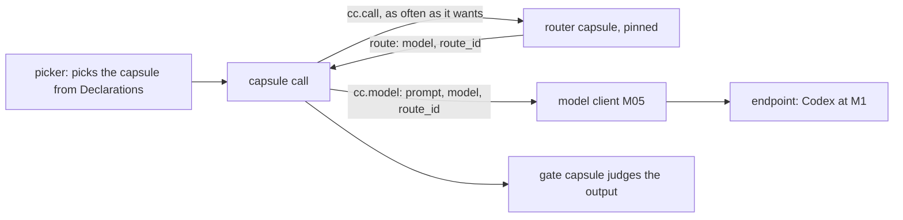

# Model routing in CC

Reply to the Model Routing design v1.4 ([kept unchanged](../model_router_design_en.md)).

**The main point.** The picker picks a capsule for the task; it never picks a model. What a capsule can do, including what its model contributes, is stated in that capsule's Declaration, so the Declaration is all the picker needs. Inside the capsule, the author may call a model library, the router, to do the same task better and cheaper. Routing changes how well and at what cost a capsule does its work, never what the work is. So the picker's job stays small, and routing is a gain on top.

## Rules for a routed capsule

1. **Pinned.** The capsule pins a router capsule in `needs.external`; the pin fixes the routing logic. The model catalog is outside state: the router declares `state_kind: reads_external`, and each decision names the catalog version it used.
2. **Fully dynamic.** The capsule may call the router and switch models as often as it likes, within one call or one run.
3. **Each decision is a record.** The router returns its decision as outputs: `route_id`, the model, the reasons, the catalog version. The runner stores them as Artifacts, so the router writes nothing itself and stays `pure` or `read_only`. The router team owns that record's type; their audit tables are a view built from these Artifacts. The capsule passes `route_id` to `cc.model`, and the runner stores it on the turn. A turn's `route_record_id` leads to the decision; the decision's `produced_by` leads to the router call; that call's `causation_id` leads to the capsule call.
4. **A router failure never fails the work.** If the router errors, the capsule uses its default model, and the router's failed call stays on record under its own `decl_hash`. An endpoint failure is the runtime's (`RUNTIME_UNAVAILABLE`, `EXTERNAL_UNAVAILABLE` or `TIMEOUT`), so the step halts as `ENVIRONMENT_BLOCKED` and can resume.
5. **Tests replay.** At admission the router runs under `cc.replaying()`, with its catalog read from the test's fixtures. `model_replies` are used in one turn order across the whole call tree, including any model turns the router makes.
6. **What is certified.** A Verdict certifies the capsule's logic on recorded replies, not the quality of any model. The gate judges every output in a run, whatever model made it. Quality and cost are measured per model, by `route_record_id`, before Standing or RSI acts on them.

## Changes to the router design

| Router design | In CC | Why |
|---|---|---|
| Stage 1 selects a Capsule; a Capsule Registry | removed; the picker picks capsules from their Declarations | one picker, one capsule definition |
| Executor, `execute()` | removed; the CC runner runs every capsule | one runner |
| Mandatory router per task | a router capsule a capsule pins and calls | not every capsule uses a model |
| No model switch within an execution | any number of switches, each with its own `route_id` | the author's choice; ids keep it traceable |
| The router writes its own audit store | the router outputs each decision; the runner stores it; audit tables are a view | stays testable, side-effect free, joined by ids |
| Review task type | gate capsules | one review path |
| Local CLIs excluded | the Codex subscription is an endpoint and the fallback | PRD 3.0.2 |

**Kept, inside the router capsule:** the model catalog (3.1, 3.4), the filter and the bounded LLM judgment (5), fallback rules (7), the audit fields (9).

## M1, then later

- **M1.** Codex is the only model on main branch. Any capsule reaches it with no setup: a skill by default or through its `SKILL.md` model; a tool through `cc.model(prompt)`. Routing is for `tool` capsules; skills and gate capsules use a fixed model determined prior to admission. `cc.model` already takes `route_id`, so a router can plug in without changes. Work on model routing with capability capsule will be unblocked and development possible, but not on main branch.
- **Later.** More endpoints. The skill handler applies a pinned router's decision before each turn, so skills can route. Optional routing hints under `ext.routing` in a Declaration, never required. A user's model choice for a run, passed to routers as a constraint.

## Asks of Model Routing

1. Register the Codex subscription as an endpoint.
2. Propose the router capsule's ports, with the decision (`route_id`, model, reasons, catalog version) as its output, before M1 ends.
