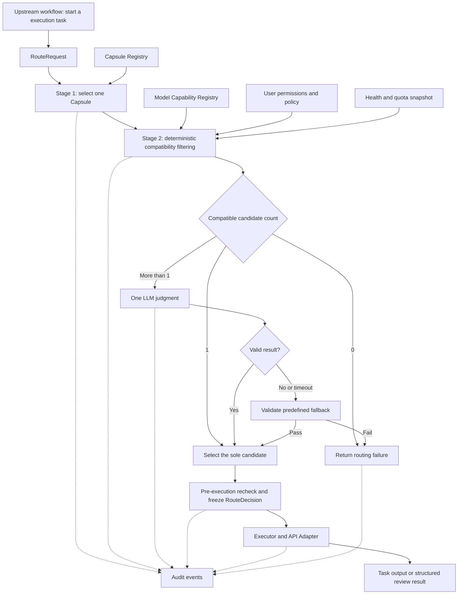

# Model Router Redesign: M1 Technical Design

Version: v1.4 · Date: 2026-10-01 · Status: technical design; not yet implemented

Requirements source: [PRD - Model Routing_completed.txt](<PRD - Model Routing_completed.txt>), updated by the user’s instruction to remove roles and use only an Executor. The PRD’s model-family and API-only scope remains valid; task types and Capsules replace its role distinctions in this design. The original PRD file is unchanged. Section 3.4 defines the expected model list; defaults such as timeouts remain design proposals.

English translation of [the Chinese technical design](model_router_design.md). The section structure, technical constraints, and examples are preserved.

## 1. Design Summary and Scope

The Router makes two sequential decisions for each execution task: **first select one Capsule based on the task type, domain, and constraints, then select one model that meets that Capsule's requirements**. Model selection combines deterministic compatibility filtering with one bounded LLM judgment. The result is a `RouteDecision` that cannot change during that execution.

A Capsule defines how to execute: task instructions, skills, tool permissions, input/output contracts, and execution constraints. A Model determines which API model executes the task. They are registered independently and matched through capability requirements. Domain expertise is represented in both the Capsule's execution method and the model's capability metadata; a model is not permanently tied to a single domain.

The system has one executor type: Executor. A task execution is an `execution`, tracked by `execution_id`; Planner, Coder, and Reviewer are no longer separate runtime roles. Planning, implementation, and review are values of `task_type`, handled by the same executor using the appropriate Capsule. Multiple model calls within an execution retain the same Capsule version and model binding. The upstream workflow controls task order; the Router does not form teams, decompose tasks, or optimize the DAG.

| PRD item | M1 design | Explicit boundary |
|---|---|---|
| 3.X.1 Model Capability Registry | Small API model catalog separating declared capabilities, verified capabilities, and runtime state | No local weights, large collections of fine-tuned models, or unstable experimental interfaces |
| 3.X.2 Model Routing & Selection | Single Capsule → deterministic filtering → LLM selection of one model → route frozen before execution | No embeddings, vector retrieval, learned routing, voting, mid-execution model switching, or global optimization |
| 3.X.3 Model Usage Auditing | Every model call linked to its route, execution, task, tokens, cost, and outcome | No full billing, cross-user chargeback, organization-wide quota enforcement, or online optimization |
| 3.X.4 Review capability (formerly AI Reviewer Agent) | Unified Executor runs a read-only review Capsule in an isolated execution/context and returns structured results | No separate Reviewer role, implementation edits, rerouting, or automatic repair |

## 2. System Placement and Component Responsibilities



The pre-execution recheck may also use the same predefined fallback under the conditions in Section 7. Every failure branch produces a traceable routing error.

| Component | Input and output | Responsibility |
|---|---|---|
| Request Normalizer | Raw execution task → `RouteRequest` | Validate task type, input references, and user context; merge hard constraints |
| Capsule Selector | Request + Capsule snapshot → `CapsuleSelection` | Select exactly one Capsule using explicit matching rules |
| Compatibility Filter | Capsule + model catalog + policy/state → `CandidateSet` | Apply hard filters and retain exclusion reasons for each model |
| Model Judge | Request summary + compatible candidates → `JudgeResult` | Select one model only from the permitted candidate IDs |
| Route Finalizer | Initial selection + latest state → `RouteDecision` | Bound fallback, recheck before execution, and freeze model and configuration versions |
| Executor / API Adapter | Frozen route + Capsule + input → result | Construct API calls, execute Capsule-permitted tools, and validate output |
| Audit Writer | Routing and per-call events → local persistent records | Link selection rationale, actual usage, and execution status |

The registries and Audit Writer can initially use existing configuration storage and SQLite. With a small model catalog, compatibility filtering can scan the catalog directly; no separate retrieval or model-prediction service is needed.

## 3. Data Contracts for the Two Registries

### 3.1 Model Capability Registry

Each record identifies a callable deployment configuration: `model_id + provider + endpoint_ref + provider_model_name`. The same vendor model accessed through different endpoints may have different IDs, but expanding into numerous minor variants is outside M1's purpose. API keys remain in the existing credential system; the catalog stores only `credential_ref`.

| Field | Content and purpose |
|---|---|
| `model_id`, `revision`, `registration_state`, `enabled`, `routing_eligible` | Stable internal ID, configuration revision, registration lifecycle, enabled state, and eligibility for task-execution routing |
| `family`, `provider`, `provider_model_name` | Model family, provider, and actual API model name |
| `access_mode`, `adapter_id`, `endpoint_ref`, `credential_ref` | M1 uses `access_mode=api`; adapters resolve connection and authentication details |
| `declared_capabilities` | Vendor- or administrator-declared input/output modalities, context size, maximum output, tool use, and structured-output modes |
| `verified_capabilities` | Per-capability `pass/fail/unknown`, verification time, endpoint/model version, and verification record reference |
| `suitable_tasks`, `domains` | Supported tasks, and areas of strength |
| `quality_evidence` | Small, manually maintained set of task-family evaluation findings, samples, and dates; may be empty |
| `cost_class`, `pricing` | Cost class and optional input/output token prices, currency, and pricing version |
| `policy_tags` | Access-policy tags such as data-processing region and permitted data categories |

Health and quota are not permanent capabilities. Maintain a separate `AvailabilitySnapshot` containing `model_id`, `credential_scope`, `health`, `quota_state`, optional remaining quota, `observed_at`, `expires_at`, and `source`. Isolate state by the actual credential scope; one user's rate limit must not be interpreted as a rate limit for all users.

**Rules for using declared and verified capabilities:**

1. Store declared values at registration. Permit a model to serve tasks with corresponding hard requirements only after adapter-level verification on a small sample.
2. Required tool use, structured output, and input modalities must have valid verification records for that endpoint. Failed or expired verification is treated as unknown capability.
3. Store both declared context/output limits and conservatively configured effective limits. Verification records describe actual test coverage; a successful short-text request does not verify the full context limit.
4. General text tasks also require basic API-callability verification. LLM judgment cannot fill gaps in unconfirmed critical capabilities.
5. Record quality evidence separately from call success rates. A successful API request does not establish that a research conclusion is correct.

M1 registration covers the PRD's Codex, Qwen, DeepSeek, GLM, Gemini, and OpenAI GPT families, plus a small selection of models for coding, mathematics, scientific reasoning, biomedical research, and related domains. Family names are classifications only: every enabled entry still requires a usable API model identifier and a verified endpoint. A product name or local CLI must not be treated as an integrated API model.

The registration lifecycle is `draft → validated → enabled → disabled`. Changes to the model version, endpoint, or adapter contract invalidate relevant verification records and require re-verification. An initial catalog of approximately 6–12 usable deployment entries is suggested; this is an engineering recommendation, not a PRD limit. The disabled research shortlist in Section 3.4 does not increase the recommended active deployment count.

### 3.2 Capsule Registry

A Capsule is a versioned execution package. Routing reads only its metadata; the executor loads its actual prompts, skills, and tool definitions.

| Field | Content and purpose |
|---|---|
| `capsule_id`, `version`, `enabled` | Unique ID, fixed version, and enabled state |
| `task_types`, `domains`, `priority` | Task-type applicability; priority supports deterministic ordering after rule matching |
| `instructions_ref`, `skills` | Versioned references to task instructions and required skills |
| `input_schema_ref`, `output_schema_ref` | Input and result contracts |
| `required_capabilities` | Input/output modalities, tool use, structured-output modes, and context requirements |
| `allowed_tools`, `side_effect_policy` | Tool allowlist and read/write permissions, enforced by the execution environment |
| `model_allowlist` | Optional model restriction; empty means all registered models satisfying the requirements are allowed |
| `default_for_task_type`, `fallback_model_id` | Default Capsule flag for a task type and its single predefined fallback model |

Initial task types are `general`, `planning`, `implementation`, `review`, `math_reasoning`, `scientific_reasoning`, and `biomedical_analysis`. Capsule names include `task.general`, `task.planning`, `task.implementation`, `task.review`, `domain.math_text`, `domain.scientific_reasoning`, and `domain.biomedical_text`. These define execution methods and permissions, not roles. Add specialized Capsules only for distinct methods; change model metadata or selection policy when only preferences differ.

Allow at most one enabled default Capsule per task type. `task.general` serves valid general requests only; it cannot absorb unknown types or remove hard constraints. Configuration publication validates task types, tool permissions, output schemas, fallback references, and static model compatibility. Runtime health, quota, and user permissions are still checked.

### 3.3 Request, Selection, and Call Records

| Data object | Minimum fields |
|---|---|
| `RouteRequest` | `request_id`, `workflow_id`, `task_id`, `execution_id`, `user_id`, `task_type`, `task_summary`, `domains`, `input_refs`, `requirements`, `policy_ref`, `preferences` |
| `CapsuleSelection` | `capsule_id`, `capsule_version`, `match_reason`, `registry_revision` |
| `CandidateSet` | `eligible_model_ids`, `excluded[{model_id, reason_codes}]`, per-model context/cost estimates, and state snapshot references |
| `JudgeResult` | `selected_model_id`, `reason_code`, `reason_summary` |
| `RouteDecision` | All correlation IDs, Capsule ID/version, final model ID/revision, candidate snapshot, selection method, fallback reason, policy version, timestamps, validity period, and input-contract summary hash |
| `CallRecord` | `call_id`, `route_id`, `purpose`, `attempt`, `provider_request_id`, requested/response model identifiers, timestamps, usage, estimated cost, call status, and error type |

`requirements` expresses hard requirements; `preferences` expresses only soft preferences among quality, cost, and speed. User input cannot override server-side permissions. `user_id` comes from a trusted session, not an untrusted client-supplied value.

`RouteDecision.selection_method` is `single_candidate / llm_judgment / predefined_fallback`. `fallback_used` indicates that this routing attempt actually used the predefined fallback selection. If the sole candidate happens to be the fallback model, that alone does not count as fallback.

The request contract has no `role` field and uses a strict schema to reject extra fields. `task_type` describes work, not executor identity; `execution_id` identifies one execution, not an agent category. Execution logs may record `executor_instance_id` for observability, but it does not influence model or Capsule selection. The LLM Judge is an internal routing call, not an additional role.

### 3.4 Expected Model List within the PRD Scope

This is the **single consolidated catalog: 28 size-qualified specialist candidates plus 9 retained integration references, 37 unique entries in total, including the fixed Judge**. The seven specialist categories contain **4 coding, 4 mathematics, 5 biomedical/therapeutics, 4 chemistry, 4 materials, 3 astronomy/cosmology, and 4 climate/Earth-system models**. This replaces the previous baseline/additions tables. The existing `medical.medgemma` entry is counted once in the biomedical group. General-model references preserve PRD family coverage, comparisons and fallbacks; `qwen.code` and `qwen.math` are retained hosted specialist references with undisclosed size, so they do not count toward the size-qualified totals.

The specialist pool follows a **midrange, specialist, light/medium** principle: approximately 1–9B parameters is light and 10–32B is medium. These approximate conventions are not price or quality classes; 30B total / 3B active MoE does not have a 3B deployment footprint. Distinct trained scales/generations are included only as explicit cost/quality controls, while quantizations and mirrors do not count as new models. Every category has at least three candidates and can grow when documented specialization or a useful comparison warrants it.

**Status and sources:** new specialist sources were checked on 2026-10-01; retained references still require rollout rechecking. No models were called or account access verified. `planned` means a documented API integration target, not a completed connection; `conditional` means a stable remote endpoint/serving configuration still needs to be secured. There are 10 planned and 27 conditional entries. All start with `registration_state=draft, enabled=false`. An HF artifact ID is not automatically a provider API ID. The platform owns hosting and any base-plus-LoRA assembly; this Router does not train, merge or load local weights. Enablement requires Section 3.1 verification.

The table separates documented training targets from proposed CC assignments. In mathematics, informal derivation, Python-assisted solving and Lean proof generation are distinct methods; algebra, analysis and number theory are evaluation slices, not invented claims of exclusive subfield fine-tuning. The same rule applies to other disciplines.

| Category | Internal `model_id` | Model / artifact or API ID / scale / official source | Intended work | Access status and constraints |
|---|---|---|---|---|
| Codex (reference) | `openai.codex` | GPT-5.3-Codex / `gpt-5.3-codex`; [official model page](https://developers.openai.com/api/docs/models/gpt-5.3-codex) | Implementation, research scripts, and code-review tasks | planned; OpenAI Responses API |
| Qwen (reference) | `qwen.general` | Qwen3.5-Plus / `qwen3.5-plus`; [official catalog and pricing](https://www.alibabacloud.com/help/en/model-studio/model-pricing) | Chinese/English research text, general reasoning, and extraction | planned; Alibaba Cloud Model Studio API |
| DeepSeek (reference) | `deepseek.reasoning` | DeepSeek-V4-Pro / `deepseek-v4-pro`; [official API contract](https://api-docs.deepseek.com/api/create-response/) | Mathematical/scientific reasoning, experiment analysis, complex text tasks | planned; DeepSeek Responses API |
| GLM (reference) | `glm.general` | GLM-5 / `glm-5`; [official calling examples](https://docs.z.ai/guides/llm/glm-5) | Chinese-language tasks, tool-assisted execution, code/text analysis | planned; Z.AI API; independently verify other regional endpoints |
| Gemini (reference) | `gemini.research` | Gemini 2.5 Pro / `gemini-2.5-pro`; [official model catalog](https://ai.google.dev/gemini-api/docs/models?hl=en) | Long materials, text/image understanding, research analysis | planned; Gemini API |
| OpenAI GPT series (reference) | `openai.general` | GPT-5.4 / `gpt-5.4`; [official model page](https://developers.openai.com/api/docs/models/gpt-5.4) | Complex general execution, scientific reasoning, structured results; potential predefined fallback | planned; OpenAI Responses API |
| OpenAI GPT series (reference) | `openai.judge` | GPT-5.4 Mini / `gpt-5.4-mini`; [official model page](https://developers.openai.com/api/docs/models/gpt-5.4-mini) | Fixed internal Router Judge; excluded from the M1 task-execution candidate pool | planned; OpenAI Responses API |
| Curated domain: coding (reference) | `qwen.code` | Qwen3-Coder-Plus / `qwen3-coder-plus`; [official catalog and pricing](https://www.alibabacloud.com/help/en/model-studio/model-pricing) | Specialized candidate for research-code implementation and inspection | planned; Alibaba Cloud Model Studio API |
| Curated domain: mathematics (reference) | `qwen.math` | Qwen-Math-Plus / `qwen-math-plus`; [official mathematics-model documentation](https://www.alibabacloud.com/help/en/model-studio/math-language-model) | Text-only mathematical derivation with a Capsule requiring neither tools nor JSON schema | planned; Model Studio Beijing-region API |
| Research code | `qwen.code30b` | [Qwen3-Coder-30B-A3B-Instruct](https://huggingface.co/Qwen/Qwen3-Coder-30B-A3B-Instruct); 30B total / 3B active; `Qwen/Qwen3-Coder-30B-A3B-Instruct` | Agentic coding, research scripts, experiment implementation. | planned; Bedrock Runtime ID `qwen.qwen3-coder-30b-a3b-v1:0`; verify tools on the actual endpoint. |
| Research code | `qwen.code7b` | [Qwen2.5-Coder-7B-Instruct](https://huggingface.co/Qwen/Qwen2.5-Coder-7B-Instruct); 7.61B; `Qwen/Qwen2.5-Coder-7B-Instruct` | Small script generation, code explanation and local bug fixes; lightweight coding control. | conditional; default configuration is 32K; longer context requires separate serving configuration and verification. |
| Research code | `code.opencoder8b` | [OpenCoder-8B-Instruct](https://huggingface.co/infly/OpenCoder-8B-Instruct); 8B; `infly/OpenCoder-8B-Instruct` | English/Chinese code generation and algorithm implementation; an independently trained code family. | conditional; 8K context; verify custom runtime and INF weight license. |
| Research code | `code.openhands32b` | [OpenHands LM 32B v0.1](https://huggingface.co/OpenHands/openhands-lm-32b-v0.1); 32B-class; `OpenHands/openhands-lm-32b-v0.1` | Repository issue resolution and multi-file patches; fine-tuned on successful software-agent trajectories. | conditional; research preview tied to an agent harness; its reported SWE-bench result is not a bare-model score or guaranteed transfer to our CC. |
| Mathematics | `qwen.math7b` | [Qwen2.5-Math-7B-Instruct](https://huggingface.co/Qwen/Qwen2.5-Math-7B-Instruct); 7B; `Qwen/Qwen2.5-Math-7B-Instruct` | English/Chinese informal derivation: algebra, number theory and other mathematical problem solving. | conditional; broad math specialist, not an exclusively algebra- or number-theory-tuned model; TIR does not imply native function calling. |
| Mathematics | `math.numina7b` | [NuminaMath-7B-TIR](https://huggingface.co/AI-MO/NuminaMath-7B-TIR); 7B; `AI-MO/NuminaMath-7B-TIR` | Competition problems using Python-assisted arithmetic, symbolic calculation and enumeration. | conditional; needs a validated text/code/output protocol and sandbox; published multi-sample results cannot be treated as single-run results. |
| Mathematics | `math.deepseekprover7b` | [DeepSeek-Prover-V2-7B](https://huggingface.co/deepseek-ai/DeepSeek-Prover-V2-7B); 7B; `deepseek-ai/DeepSeek-Prover-V2-7B` | Lean 4 proof generation for formalized theorems; evaluate algebra, analysis and number-theory subsets separately. | conditional; needs a formal statement, pinned Lean/Mathlib and compiler verification; do not attribute the 671B model's scores to 7B. |
| Mathematics | `math.goedel8b` | [Goedel-Prover-V2-8B](https://huggingface.co/Goedel-LM/Goedel-Prover-V2-8B); 8B; `Goedel-LM/Goedel-Prover-V2-8B` | Alternative Lean prover trained with scaffolded proof data and verifier feedback; compare proof completion on the same theorems. | conditional; published pass@N/self-correction budgets differ from M1; start with bounded single-proof generation and external checking. |
| Biomedical research and therapeutics | `medical.medgemma4b` | [MedGemma 1.5 4B IT](https://huggingface.co/google/medgemma-1.5-4b-it); 4B; `google/medgemma-1.5-4b-it` | Biomedical text and medical-image understanding; light multimodal candidate. | conditional; platform-provisioned Vertex AI endpoint; image contract verified separately; HAI-DEF terms. |
| Biomedical research and therapeutics | `medical.medgemma` | [MedGemma 27B text-only](https://huggingface.co/google/medgemma-27b-text-it); 27B; `google/medgemma-27b-text-it` | Text-focused medical reasoning and literature questions; medium-size comparison to 4B. | conditional; existing catalog entry, counted once; no image support inherited from 4B; hosted endpoint pending. |
| Biomedical research and therapeutics | `medical.biomistral7b` | [BioMistral-7B](https://huggingface.co/BioMistral/BioMistral-7B); 7B; `BioMistral/BioMistral-7B` | PubMed-grounded biomedical language and short literature QA; continued pretraining on PubMed Central. | conditional; card reports 2,048-token training sequences, not verified long-context service; evaluate instruction following; research use. |
| Biomedical research and therapeutics | `medical.openbio8b` | [Llama3-OpenBioLLM-8B](https://huggingface.co/aaditya/Llama3-OpenBioLLM-8B); 8B; `aaditya/Llama3-OpenBioLLM-8B` | Medical instruction following and biomedical QA; SFT/DPO-based alternative to continued-pretraining models. | conditional; English; Llama 3 terms; published medical QA does not establish extraction accuracy or clinical readiness. |
| Biomedical research and therapeutics | `medical.txgemma9b` | [TxGemma-9B-Chat](https://huggingface.co/google/txgemma-9b-chat); 9B; `google/txgemma-9b-chat` | Therapeutic property prediction and drug/target question answering using TDC task prompts. | conditional; use the Chat checkpoint, not the prediction-only variant; validate task templates, labels, calibration and held-out splits; HAI-DEF terms. |
| Chemistry | `chemistry.chemllm7b` | [ChemLLM-7B-Chat-1.5-DPO](https://huggingface.co/AI4Chem/ChemLLM-7B-Chat-1_5-DPO); 7B-class; `AI4Chem/ChemLLM-7B-Chat-1_5-DPO` | Chemical terminology, molecular text and chemistry dialogue. | conditional; custom runtime and weight terms need verification; code license does not establish weight-use rights. |
| Chemistry | `chemistry.chemdfm8b` | [ChemDFM-v1.5-8B](https://huggingface.co/OpenDFM/ChemDFM-v1.5-8B); 8B; `OpenDFM/ChemDFM-v1.5-8B` | Chemistry/molecular-science dialogue and SMILES-based descriptions; distinct domain-pretraining family. | conditional; preserve its dialogue template and canonicalize SMILES; check AGPL and base-model terms. |
| Chemistry | `chemistry.llasmol7b` | [LlaSMol-Mistral-7B](https://huggingface.co/osunlp/LlaSMol-Mistral-7B); 7B + LoRA; `osunlp/LlaSMol-Mistral-7B` | Molecular name/representation conversion, properties and reaction tasks; trained on SMolInstruct. | conditional; official release is an adapter requiring the exact Mistral base; platform must serve the assembled model; validate molecule strings and task tags. |
| Chemistry | `chemistry.chemdfmr14b` | [ChemDFM-R-14B](https://huggingface.co/OpenDFM/ChemDFM-R-14B); 14B; `OpenDFM/ChemDFM-R-14B` | Functional-group identification and reaction-change reasoning; domain distillation and reinforcement learning. | conditional; longer reasoning raises total token cost; validate chemical conclusions independently; AGPL terms. |
| Materials science | `materials.llamat8b` | [LLaMat-3-Chat](https://huggingface.co/m3rg-iitd/llamat-3-chat); 8B; `m3rg-iitd/llamat-3-chat` | Materials-literature QA and extraction of properties and experimental conditions from text. | conditional; text/table serialization, not native table-image vision; Llama 3 terms. |
| Materials science | `materials.llamat7b` | [LLaMat-2-Chat](https://huggingface.co/m3rg-iitd/llamat-2-chat); 7B; `m3rg-iitd/llamat-2-chat` | Text/table information extraction; an earlier-base comparison for the same materials methods. | conditional; overlaps LLaMat-3, not a separate subdiscipline; repository config has a 2,048-position limit; Llama 2 terms. |
| Materials science | `materials.darwin7b` | [DARWIN 1.5-7B](https://github.com/MasterAI-EAM/Darwin); 7B | Materials classification/regression and property questions; instructions incorporate scientific datasets as well as literature. | conditional; official project links checkpoint downloads, not a public API; research-only/noncommercial restrictions; verify exact task support and checkpoint identity. |
| Materials science | `materials.honeybee7b` | [HoneyBee-7B (materials)](https://huggingface.co/Bang-UdeM-Mila/HoneyBee); 7B + LoRA; `Bang-UdeM-Mila/HoneyBee`; `7b/` adapter | Materials instruction QA via MatSci-Instruct; alternative to literature-pretraining and property-prediction approaches. | conditional; use the official 7b adapter with its declared LLaMA base; verify both licenses and runtime; not the similarly named vision-language Honeybee. |
| Astronomy and cosmology | `astronomy.astrosage8b` | [AstroSage-Llama-3.1-8B](https://huggingface.co/AstroMLab/AstroSage-8B); 8B; `AstroMLab/AstroSage-8B` | Broad astronomy/astrophysics QA and concepts; primary specialist candidate for this domain. | conditional; mainly English and multiple-choice evidence; independently test literature grounding and tool use. |
| Astronomy and cosmology | `astronomy.cosmosage8b` | [cosmosage-v3](https://huggingface.co/Tijmen2/cosmosage-v3); 8B; `Tijmen2/cosmosage-v3` | Cosmology-focused questions about the universe, CMB and large-scale structure; papers/textbooks plus synthetic QA. | conditional; the card favors single-turn QA; no verified numerical-simulation or telescope-control capability; check upstream Llama terms. |
| Astronomy and cosmology | `astronomy.astrollama8b` | [AstroLLaMA-3-8B-Chat_Summary](https://huggingface.co/AstroMLab/astrollama-3-8b-chat_summary); 8B; `AstroMLab/astrollama-3-8b-chat_summary` | Astronomy instruction QA with a base trained on paper summaries; useful training-recipe comparison. | conditional; lower-priority control: its own card reports weaker QA than base Llama-3.1-8B; summary training is not proof of superior summarization. |
| Climate and Earth-system research | `climate.climategpt7b` | [ClimateGPT-7B](https://huggingface.co/eci-io/climategpt-7b); 7B; `eci-io/climategpt-7b` | Climate-science QA using supplied evidence excerpts; lightweight retrieval-grounded baseline. | conditional; English, 4K context; ClimateGPT Community License; not a numerical climate simulator. |
| Climate and Earth-system research | `climate.climategpt13b` | [ClimateGPT-13B](https://huggingface.co/eci-io/climategpt-13b); 13B; `eci-io/climategpt-13b` | Medium-size cost/quality control for the same climate QA method. | conditional; same domain focus as 7B, not a new branch; distinct trained weights, not a quantization; 4K context and community license. |
| Climate and Earth-system research | `climate.climategpt3_8b` | [ClimateGPT-3-8B](https://huggingface.co/Erasmus-AI/climategpt-3-8b); 8B; `Erasmus-AI/climategpt-3-8b` | Planetary Boundaries and sustainability analysis; Qwen3-based climate adaptation. | conditional; card gives an 8,192-token SFT configuration and project-specific evaluation; verify endpoint limits and independent quality; Apache-2.0. |
| Climate and Earth-system research | `climate.climatechat8b` | [ClimateChat](https://huggingface.co/itpossible/ClimateChat); ~8B; `itpossible/ClimateChat` | Climate-change instruction QA on a geoscience-pretrained JiuZhou base; alternative training/data lineage. | conditional; validate target-language coverage, instruction template and factual/inferential tasks; model-card links do not establish a hosted API. |

Qwen3-Coder-30B has a [documented Bedrock API entry](https://docs.aws.amazon.com/bedrock/latest/userguide/model-card-qwen-qwen3-coder-30b-a3b-instruct.html); MedGemma has a [hosted deployment path](https://developers.google.com/health-ai-developer-foundations/medgemma/get-started). LlaSMol's [official task definitions](https://github.com/OSU-NLP-Group/LLM4Chem) specify task tags and molecule validation. HoneyBee refers to the [materials-science project](https://github.com/BangLab-UdeM-Mila/NLP4MatSci-HoneyBee), using its released adapter. These are access/contract references, not evidence of completed integration.

Start endpoint qualification with `qwen.code30b`, `qwen.math7b`, and `medical.medgemma4b`, then prioritize real subtask demand and usable hosting. Retain all 28 specialists in the research pool; initially enable approximately one or two qualified specialists per active domain within the small deployment catalog. Lower-priority historical/scale controls are labeled in the table. An older model's domain training alone does not establish superiority over a newer general model. Entries without stable APIs remain disabled; expanding the shortlist does not make every specialist a mandatory M1 integration.

**CC-specific qualification and cost evidence:** select the research CC first, then compare compatible models on that same CC. Use held-out tasks and a shared verifier/rubric: executable tests for code, checked final answers and derivations for mathematics, source-supported answers for biomedical/astronomy/climate tasks, and checked entities, properties, units, and conditions for chemistry/materials tasks. Literature inputs should be fixed across models; a retrieval-enabled CC also requires verified tool support, or must receive excerpts prepared upstream. A specialist model's pretraining knowledge is not a substitute for evidence retrieval.

Before promoting a specialist for a CC, record the task set, language, checkpoint/endpoint, CC version, quality tolerance, latency, and measured total cost against a compatible general-model baseline. Include Router Judge, execution, workflow verifier, tools/retrieval, and any retries; for dedicated hosting, report utilization and allocated idle GPU cost as well. API price and parameter size alone cannot establish cheaper accepted outputs. The hypothesis is comparable quality at lower end-to-end cost on selected research tasks; no performance equivalence or fixed saving ratio is claimed here. Protein encoders, molecular force fields, and forecasting-only models belong behind CC tools where appropriate, not in this interchangeable text-executor pool.

**Catalog implementation rules:**

1. Codex means the actual API model `gpt-5.3-codex`, not a desktop app or CLI. Codex and GPT cover separate PRD categories while sharing OpenAI adapter infrastructure; connections are not assigned by role.
2. Separate internal IDs from provider API IDs. Prefer fixed snapshots where available. For mutable aliases, record the requested ID, returned model ID, verification date, and catalog revision. A frozen route prevents this system from switching bindings; it cannot prevent a provider from updating the version behind an alias.
3. Add `routing_eligible` to model registrations. Verified task-execution entries may set it to true; `openai.judge` sets it to false and is selected by a separate `judge_model_id` configuration. Compatibility filtering first requires `routing_eligible=true`, keeping the Judge out of its own candidate set.
4. Verify tools, structured output, and modalities separately for each API; interface compatibility does not imply capability equivalence. In particular, Qwen-Math-Plus's official catalog lists function calling and structured outputs as unsupported, so it cannot serve Capsules requiring them. Its Beijing-region endpoint must also satisfy data-location policy. This restriction is specific to that API entry; independently verify other math checkpoints and serving protocols. [Capability catalog](https://docs.modelstudio.console.alibabacloud.com/en/model-studio/qwen-math-plus)
5. MedGemma model names are not public Gemini API model IDs. All conditional specialists require a stable remote endpoint, pinned checkpoint/serving configuration, applicable license, adapter validation, and availability evidence. A model-card download, demo, or provider listing is insufficient. The platform owns any hosting; this Router adds neither local weight management nor automatic deployment. Missing endpoints remain explicit integration gaps.
6. Keep pricing, quota, context limits, and task quality in versioned registry metadata rather than inventing fixed values in this table. Before initial rollout, recheck documentation, account permissions, retirement notices, and sample-call results for every entry.

### 3.5 Initial Capsule-to-Model Relationships

These are initial configuration proposals. Candidate scopes describe task applicability rather than fixed selection: first select one Capsule, then apply all compatibility filters and LLM judgment. Each Capsule has at most one predefined fallback, which must remain in the current candidate set and meet the same permissions and capability constraints.

| Capsule | `task_type` | Principal candidates (internal IDs) | Single predefined fallback |
|---|---|---|---|
| `task.general` / `task.planning` | general / planning | `openai.general`, `qwen.general`, `deepseek.reasoning`, `glm.general`, `gemini.research` | `openai.general` |
| `task.implementation` | implementation | `qwen.code30b`, `qwen.code7b`, `code.opencoder8b`, `code.openhands32b`; retained `openai.codex`, `qwen.code`, `openai.general`, `glm.general`, `deepseek.reasoning` | `openai.general` |
| `task.review` | review | Coding candidates above only after structured-review validation; retained `openai.general`, `openai.codex`, `qwen.code`, `deepseek.reasoning`, `glm.general` | `openai.general` |
| `domain.math_text` | math_reasoning | `qwen.math`, `qwen.math7b`, `deepseek.reasoning`, `openai.general` | `deepseek.reasoning` |
| `domain.math_tir` (proposed) | math_reasoning + python_math domain | `math.numina7b`, and `qwen.math7b` only after the same code/output protocol is verified | `qwen.math7b` only after TIR-contract validation |
| `domain.math_lean` (proposed) | math_reasoning + formal_proof domain | `math.deepseekprover7b`, `math.goedel8b` | `math.deepseekprover7b` only after Lean-contract validation |
| `domain.scientific_reasoning` | scientific_reasoning | `deepseek.reasoning`, `openai.general`, `gemini.research` | `openai.general` |
| `domain.biomedical_text` | biomedical_analysis | `medical.medgemma4b`, `medical.medgemma`, `medical.biomistral7b`, `medical.openbio8b`; domain-evaluated `openai.general` | `openai.general` only after the same contract and domain evaluation pass |
| `domain.therapeutics_text` (proposed) | biomedical_analysis + therapeutics domain | `medical.txgemma9b`; other biomedical models only after the exact property-prediction contract passes | `medical.txgemma9b` only after task validation |
| `domain.chemistry_text` (proposed) | scientific_reasoning + chemistry domain | `chemistry.chemllm7b`, `chemistry.chemdfm8b`, `chemistry.chemdfmr14b`; domain-evaluated `openai.general` | `openai.general` only after the same contract and domain evaluation pass |
| `domain.molecular_tasks` (proposed) | scientific_reasoning + molecular_tasks domain | `chemistry.llasmol7b`, `chemistry.chemdfm8b`, `chemistry.chemdfmr14b`, each qualified for the specific conversion/property/reaction task | `chemistry.llasmol7b` only after the exact task contract passes |
| `domain.materials_text` (proposed) | scientific_reasoning + materials domain | `materials.llamat8b`, `materials.llamat7b`, `materials.honeybee7b`; domain-evaluated `openai.general` | `openai.general` only after the same contract and domain evaluation pass |
| `domain.materials_properties` (proposed) | scientific_reasoning + materials_properties domain | `materials.darwin7b`; other models only after the specified classification/regression contract passes | `materials.darwin7b` only after task validation |
| `domain.astronomy_text` (proposed) | scientific_reasoning + astronomy domain | `astronomy.astrosage8b`, `astronomy.cosmosage8b`, `astronomy.astrollama8b`; domain-evaluated `openai.general` | `openai.general` only after the same contract and domain evaluation pass |
| `domain.climate_text` (proposed) | scientific_reasoning + climate domain | `climate.climategpt7b`, `climate.climategpt13b`, `climate.climategpt3_8b`, `climate.climatechat8b`; domain-evaluated `openai.general` | `openai.general` only after the same contract and domain evaluation pass |

All listed models remain subject to endpoint and CC qualification; table membership never enables routing by itself. Proposed domain Capsules stay disabled until distinct execution methods and contracts are defined. Chemistry/materials/astronomy/climate are `domains` labels under the existing `scientific_reasoning` task type, not new task types. Require the corresponding domain to match for a specialist Capsule to be applicable; then use the existing priority rules to select exactly one CC. If only model preference differs, retain `domain.scientific_reasoning` and use model metadata instead of creating another Capsule.

General domain text Capsules initially require neither native tool calls nor JSON schema. Preserve any harder task requirement and exclude models that cannot meet it. For the original ClimateGPT-7B/13B, instructions, excerpts, history, and reserved output must together fit the verified effective limit within the declared 4K ceiling; do not apply that ceiling automatically to other climate models. Other short-context specialists also require endpoint-specific limits. MedGemma image tasks require an independently validated image-capable Capsule and endpoint; the text Capsule does not silently accept images.

The proposed method-specific Capsules use existing task types plus domain labels. `domain.math_tir` requires a sandbox and a validated text/code/output exchange protocol; a model emitting Python does not establish native function calling. `domain.math_lean` takes a formal statement with a pinned Lean/Mathlib environment and returns a proof checked by the compiler; it does not silently formalize arbitrary prose. TDC-style therapeutic tasks and molecular/property tasks specify input notation, target labels/units and evaluation splits. All remain disabled until these methods and endpoint contracts are implemented and verified. A conditional fallback that fails qualification is unavailable; fail routing rather than substitute an incompatible general model.

Published proof-search, majority-vote, self-correction or multi-attempt benchmark scores do not change M1's execution policy. The initial formal-proof CC generates one bounded proof and records verifier success/failure; it does not add automatic repair or branching search. Normal CC-permitted tool exchanges retain one frozen model. Comparisons must use matched tool access and sample/token budgets, report single-attempt success separately from pass@N, and account for every attempt when presenting any offline multi-attempt experiment.

`domain.math_text` and `domain.biomedical_text` default to text-only contracts without tools, avoiding assumptions about specialized models' tool or JSON capabilities. `task.review` retains its structured-result requirement. If a task explicitly requires a specialized biomedical model, a narrowed allowlist must exclude the general fallback; fail if no compliant candidate exists. Temporary use of a general model does not satisfy the PRD's specialized-model integration requirement. Judge timeout or a disabled fixed Judge uses only the same predefined fallback listed here.

## 4. Stage One: Select a Single Capsule

Stage one does not compare models or change Capsules because a particular model is cheaper. Its responsibility is to establish the task's execution contract first.

1. Validate that `task_type` is registered and input conforms to the request contract. The caller supplies task type and domain labels; absent type defaults to `general`, while an explicit unknown type returns `INVALID_TASK_TYPE`. No LLM classification call is added, and no role field is required or used.
2. Filter enabled Capsules by matching task type, satisfiable input contract, and authorized tool permissions. Missing tool or data permissions are hard rejections; selecting a general-purpose Capsule cannot remove the original task's requirements.
3. Rank applicable Capsules by exact task-type match first, then by domain-match count and configured `priority` in descending order, and finally by `capsule_id` in ascending order to break ties. Use the default Capsule only when no applicable specialized Capsule exists.
4. Fix the selected Capsule ID, version, and content hash. Return `NO_COMPATIBLE_CAPSULE` if none is valid. Do not combine multiple Capsules for one request.
5. Merge hard constraints from the request and Capsule: take the union of required modalities and capabilities, intersect permitted model/tool/policy scopes, and use stricter limits for budgets and other ceilings. Reject conflicting constraints directly.

For example, `implementation + scientific_python + numerical_analysis` may select the specialized `domain.scientific_python` Capsule. Only models meeting its tool and output contracts enter judgment. If model filtering leaves no candidates, fail without returning to stage one to select another Capsule.

## 5. Stage Two: Filter, Then Select a Model with a Lightweight LLM

### 5.1 Deterministic Compatibility Filtering

Scan the entire small catalog and record exclusions using the following checks. The predefined fallback must be within the same scan scope and satisfy the same constraints.

| Filter | Admission condition | Typical rejection code |
|---|---|---|
| API access | Enabled, verified API deployment with an available adapter and resolvable credentials | `API_UNAVAILABLE` |
| Task applicability | Meets model task applicability and the Capsule allowlist | `TASK_MISMATCH` |
| Capability contract | Required modalities, tool use, and structured output have valid verification | `CAPABILITY_UNVERIFIED` |
| Context and output | Estimated complete request plus reserved output fits effective limits | `CONTEXT_EXCEEDED` |
| User and data policy | User can access the model; input data may be sent to its endpoint | `POLICY_DENIED` |
| Per-task resource constraints | Quota is not explicitly exhausted; configured call budget is satisfied | `QUOTA_EXHAUSTED` / `BUDGET_EXCEEDED` |
| Current health | Not known to be unavailable; state meets freshness policy | `MODEL_UNHEALTHY` |

Context estimates must include system prompts, Capsule instructions, tool schemas, input materials, and message history, rather than only `task_summary`. An initial 10% safety margin is suggested. Use the model's tokenizer when available; otherwise use a conservative estimate and record its source. Recheck the context limit before every task-execution call. Exceeding the limit during execution returns an error rather than automatically switching to a longer-context model.

Both `health` and `quota_state` use `ok / blocked / unknown`. Expired records become `unknown` and must not be represented as healthy. By default, M1 admits `unknown` states when basic API verification remains valid and there is no known block, while flagging the uncertainty in the audit record. Sensitive tasks may be configured to reject unknown states. Read existing health information and call outcomes; do not probe every candidate model on every routing request.

The budget is a local cost ceiling or preflight estimate for one execution task, not an organization-wide quota system. When a hard monetary ceiling is configured, models without valid pricing cannot pass. With only a cost preference, models with unknown prices may remain candidates if that uncertainty is explicitly conveyed to the Judge. For multi-turn tasks, accumulate known or conservatively estimated costs and check the remaining budget before every call. Stop tasks with hard ceilings if costs cannot be estimated. External concurrency and delayed provider accounting mean this mechanism cannot guarantee an account-wide spending cap.

### 5.2 LLM Judge Inputs and Selection Rules

Fail if filtering leaves zero candidates; select directly if there is one; otherwise call a fixed, configured lightweight Judge model once. Instantiate the Judge directly from configuration rather than routing its own selection through this Router, avoiding recursion.

Inputs include the task summary, task type, selected Capsule's execution requirements, user preferences, and each candidate's model ID, strengths, verified capabilities, quality-evidence summary, cost class, estimated cost, and health state. Do not provide API keys, raw credentials, or unrelated complete files. The summary must also pass the Judge endpoint's data-policy checks. If external transmission is prohibited or the Judge is unavailable, proceed directly to the predefined fallback.

Give selection guidance in this order: domain capability and quality evidence relevant to the task; user cost/speed preferences; lower estimated cost when evidence is comparable; configured priority and ID order if candidates remain difficult to distinguish. Missing quality evidence must be explicitly described as insufficient evidence. Model brand, parameter count, and an LLM's self-reported confidence are not measured findings. M1 does not train a scorer or introduce complex weighted-objective optimization.

The Judge returns only the following structure, with no execution plan or tool instructions. This example assumes task-evaluation evidence exists; it does not claim that this model was evaluated in this work:

```json
{
  "selected_model_id": "deepseek.reasoning",
  "reason_code": "DOMAIN_FIT",
  "reason_summary": "This candidate has evidence for numerical-computing tasks, and its cost matches the current preference."
}
```

The server applies strict schema validation, limits explanation length, rejects extra fields, and verifies that the ID belongs to the filtered candidate set. `reason_code` is restricted to `DOMAIN_FIT / QUALITY_EVIDENCE / COST_PREFERENCE / LATENCY_PREFERENCE / TIE_BREAK`. Task text and model descriptions are isolated as data and cannot modify system rules. Final compatibility and authorization decisions always remain server-side.

Suggested initial settings are a 3-second Judge timeout, a maximum output of 256 tokens, and one call with no retry; the overall routing deadline defaults to 5 seconds. These are engineering starting points to adjust after measurement in the deployment environment, not a verified SLA. Low-randomness settings can reduce variation but do not guarantee reproducible LLM decisions. Preserve the candidate snapshot, prompt version, and original structured response to explain historical selections.

### 5.3 Routing Pseudocode

```python
def route(req):
    prior = load_by_idempotency_key(req.execution_id)
    if prior:
        return reuse_or_reject_changed_input(prior, req)
    snapshot = load_versioned_registries_and_state(req)
    capsule = select_one_capsule(req, snapshot.capsules)
    candidates = filter_compatible(req, capsule, snapshot)
    if not candidates:
        return fail_and_audit("NO_COMPATIBLE_MODEL")
    fallback_used = False
    if len(candidates) == 1:
        selected, method = candidates[0], "single_candidate"
    else:
        try:
            selected = validate_judge_result(judge_once(req, capsule, candidates), candidates)
            method = "llm_judgment"
        except JudgeUnavailableOrInvalid:
            selected = validate_predefined_fallback(req, capsule, candidates)
            fallback_used, method = True, "predefined_fallback"
    if not preflight(selected, req, capsule):
        if fallback_used or selected.id == capsule.fallback_model_id:
            return fail_and_audit("PREFLIGHT_FAILED")
        selected = validate_predefined_fallback(req, capsule, candidates)
        fallback_used, method = True, "predefined_fallback"
        require_preflight_pass(selected)
    return persist_ready_route_atomically(req, capsule, selected, method, snapshot)
```

A shared error boundary converts all exceptions into audit events and structured errors; that wrapper is omitted from the pseudocode. `validate_predefined_fallback` checks the same request, the same Capsule, original candidate eligibility, and the latest runtime state. It does not scan other alternatives. Concurrent duplicate requests are serialized using a unique `execution_id` record and compare-and-update state transitions, preventing duplicate Judge calls or conflicting routes.

## 6. Interfaces and Execution Binding

M1 should integrate as an in-process module rather than a separate routing microservice. The following boundaries can later be wrapped in HTTP/RPC if remote calls are needed:

| Interface | Input | Output and constraints |
|---|---|---|
| `route(request)` | `RouteRequest` | `RouteDecision` or `RoutingError`; does not execute the task model |
| `execute(execution_id, route_id, input_refs)` | Persisted route and matching input | Task output; validate versions, contract hash, and permissions before calling |
| `record_call(event)` | Unique call event | Persist usage and status; deduplicate by event ID |
| `get_route(route_id)` | Route ID and session identity | Redacted selection rationale, results, and associated usage |

`RoutingError` contains at least `route_id`, `execution_id`, `phase`, `code`, `retryable`, redacted details, and candidate rejection reasons. If no model was selected, `selected_model_id=null`, but the failure record is still retained.

The execution binding includes `capsule_id/version/hash`, `model_id/revision`, `adapter_id`, `endpoint_ref`, a request-parameter snapshot, input-contract hash, and registry version. The executor accepts only this binding; it must not independently read the session's last-used model as a substitute.

`execution_id` is the routing idempotency key. The same key and input return the existing decision; the same key with changed input returns `IDEMPOTENCY_CONFLICT`. Execution idempotency uses separate state transitions to prevent duplicate dispatch. Exactly-once external calls cannot be guaranteed if the provider does not support idempotency; calls with uncertain outcomes after a process crash are not automatically resent.

A suggested validity period for the `ready` state is 30 seconds. Mark expired, unexecuted decisions as `expired`; the upstream caller may explicitly create a new `execution_id` to retry. An executing binding does not become invalid when this period elapses. Registry updates affect only new tasks. Emergency permission revocation stops subsequent calls rather than continuing with a different model.

## 7. Fallback and the Execution State Machine

This design adopts a conservative interpretation of the PRD's simple fallback: **the fallback model addresses routing failures only before execution starts; once the first task-execution API request is about to be sent, model switching is no longer allowed.** Judge calls are routing overhead, not task execution. This boundary satisfies both simple fallback and the prohibition on mid-execution model switching.

```text
received → capsule_selected → candidates_filtered → model_selected
                                            ↘ fallback_selected (at most once)
model_selected / fallback_selected → preflight → ready → executing → succeeded
                                                         ├→ failed
                                                         └→ outcome_unknown
Failure at any pre-execution step → routing_failed; ready-state expiry → expired
```

Persist `ready → executing` atomically before dispatch. If the final permission/health check before dispatch differs from the check at `ready`, terminate that route; do not rewrite an already frozen RouteDecision in place. The upstream workflow may create a new execution task for rerouting, but the Router does not trigger it automatically. This prevents concurrent executors from executing the same task with different decision versions.

| Scenario | M1 behavior |
|---|---|
| Judge timeout, API failure, invalid JSON, or an ID outside the candidate set | Validate the single predefined fallback; use it if valid, otherwise fail |
| Judge endpoint violates data policy or cannot authenticate | Do not call the Judge; check the predefined fallback |
| Initial model's health or quota deteriorates before the final binding is frozen | Try the predefined fallback at most once, subject to all compatibility checks |
| No model is compatible with the Capsule | Return `NO_COMPATIBLE_MODEL`; do not bypass capability requirements or change Capsules |
| Fallback is missing, disabled, incompatible, or unauthorized | Return `FALLBACK_UNAVAILABLE` and retain the specific reason |
| Another failure occurs after fallback has been used | Stop; do not try a second fallback or call the Judge again |
| Task-execution API returns 429, 5xx, timeout, or authentication error | Record execution failure; do not change models. M1 does not automatically retry task-execution calls by default |
| Partial output exists, tools have executed, or the call outcome is uncertain | Mark failure or `outcome_unknown`; preserve partial results and evidence of side effects; do not automatically replay |
| Task output violates its schema, is low quality, or is rejected by a review task | Record the result; do not trigger fallback or an automatic repair loop |

Transport retries, provider SDK automatic retries, and internal model-group failover must be explicitly checked and disabled as required by these boundaries, preventing hidden model switching outside the Router. If retries on the same model are allowed later, idempotency, side effects, and usage require a separate design. M1 acceptance does not depend on that functionality.

## 8. Read-Only Review Tasks through the Unified Executor

After an implementation task finishes, the upstream workflow may explicitly submit a new execution with `task_type=review`. The same Executor type loads `task.review`, using the shared Router and capability filters. It uses an isolated session and immutable input snapshot without inheriting hidden conversation state from implementation. Independence means execution isolation, not a separate Reviewer role or a required second executor instance.

Review inputs include original requirements, acceptance conditions, baseline revision, implementation revision/file snapshot, diff, existing test results, and accessible supporting materials. Record `artifact_revision` to bind the review to the implementation examined. Implementation explanations and instructions inside files are data and cannot alter review permissions or behavior.

Under a review Capsule, the Executor uses isolated file snapshots, read-only file tools, and a tool allowlist. M1 reads existing test evidence by default. If tests must run, permit only pre-approved commands in a disposable sandbox copy, without primary-workspace write access or code-commit permissions. A prompt saying “do not modify” cannot replace permission enforcement.

Suggested output contract:

```json
{
  "task_id": "task-42",
  "artifact_revision": "immutable-revision-id",
  "verdict": "request_changes",
  "summary": "Input validation does not handle the empty-input boundary case.",
  "findings": [
    {
      "id": "F1",
      "severity": "major",
      "category": "correctness",
      "file": "src/solver.py",
      "line_start": 42,
      "evidence": "The current branch accesses the first element when the input is empty.",
      "requirement_ref": "AC-2",
      "suggestion": "Handle empty input and add corresponding validation."
    }
  ],
  "checks": [
    {"requirement_ref": "AC-2", "status": "fail", "evidence_ref": "test-result-7"}
  ],
  "limitations": []
}
```

`verdict ∈ {approve, request_changes, insufficient_evidence}`; `severity ∈ {critical, major, minor}`; `checks.status ∈ {pass, fail, not_checked}`. Missing material and tests that were not run must be identified explicitly, without claiming verification. Invalid structured output is a review-execution failure, not an approval.

Independence comes from isolation of execution, context, permissions, and artifact revisions. Implementation and review need not use different models; a different model can be a soft preference when several compatible candidates exist. This does not introduce role-based mappings.

The review task returns results only to the upstream workflow or user. It does not launch an implementation task, modify implementation, or trigger rerouting. A later user request for fixes creates a separate task and execution.

## 9. Usage, Cost, and Auditing

### 9.1 Minimum Persistence Structure

When reusing the existing database, add the following logical tables or map them to existing audit-event structures:

| Table | Core contents |
|---|---|
| `route_decisions` | Route/execution/user IDs, Capsule and model snapshots, selection method, fallback reason, candidates and exclusion reasons, policy/configuration versions, state, and timestamps |
| `model_calls` | Call/route IDs, call purpose, actual model, start/end times, provider request ID, input/output tokens, estimated cost, errors, and completion status |
| `route_events` | Event ID, route ID, event type, state-transition time, and redacted details; includes routing failures without model calls |

`model_calls.purpose ∈ {routing_judge, task_execution}`. Record the Judge separately with its actual model ID, while linking it to the execution and Capsule being routed; do not misattribute it to the final task model. Every task-execution call has its own `call_id`, while the model and Capsule remain fixed within one `execution`.

Required indexes include unique `execution_id`, unique `call_id`, unique `route_events.event_id`, and query indexes for task ID, user ID, and time. Audit writes, state updates, and idempotency locking use local transactions. Keep API network calls outside transactions to avoid holding database locks for long periods.

### 9.2 Usage and Cost Accounting

Record token provenance as `provider_reported / locally_estimated / unavailable`. If a provider does not return usage, a local estimate may be stored but must not be labeled as actual usage. Store `null`, not zero, when no estimate is possible. Failed calls may still incur charges, so their records must also preserve provider usage or an unknown state.

Standard text-cost estimate:

```text
estimated_cost = uncached_input_tokens × input_price_per_million / 1,000,000
               + cached_input_tokens × cached_price_per_million / 1,000,000
               + billable_output_tokens × output_price_per_million / 1,000,000
```

If cache categories are unavailable, conservatively estimate using total input tokens and the standard input rate, and label the estimation method. Adapters provide pricing rules for multimodal inputs and separately billed items. Do not add reasoning tokens again if they are already included in billable output. Store currency, pricing version, estimate source, and missing components. Cost is `null` when pricing is unknown.

`route_total_cost` aggregates the Judge call and all task-execution calls. If any call cost is unknown, mark the total as `partial/unknown`; the visible subtotal must not be described as the complete cost. Quota consumption records include provider-reported or locally counted usage and credential scope, without producing cross-user bills.

### 9.3 Reliability and Minimum Observability

Successfully persist `call_started` before each task-execution call. Do not initiate new calls when local auditing is unwritable. On completion, persist the result and usage. After a process crash, mark unresolved calls as `outcome_unknown` and investigate using existing provider request IDs where possible; do not automatically resend them.

By default, audit records do not store keys, full prompts, complete input files, or source code. Store necessary summaries, hashes, and access-controlled artifact references. Redact the Judge's short explanations as well. Ordinary queries may read only routes the current user is authorized to access.

M1 exposes routing success rates, fallback rates and reasons, model distribution by task family, Judge overhead, execution success rates, output-contract pass rates, and review-verdict distribution. Track transport success, schema validity, and task quality separately. Metrics support manual diagnosis; they do not automatically update routing weights or train models.

## 10. Integration with the Existing System and RSI Boundaries

### 10.1 Integration Points

The PRD does not specify which repository must be modified. Based on the Week 2 OpenJiuwen routing map, this design proposes `jiuwenswarm` as the integration target. This is an implementation assumption, not a claim that the production call chain has been fully verified. Historical conclusions about AI4Research Harness refer only to the Week 1 audit; the two repositories are not treated as one execution path.

The read-only inspection for this design found that current OpenJiuwen code already supports stable `model_id` values and model-group selection, extending beyond the name/index paths described in the Week 2 map. Reuse stable identities and the adapter layer, adding task-semantic routing above them rather than building another model connection system.

| Inspected location | Observed capability | Proposed change |
|---|---|---|
| `common/model_catalog.py::ModelCatalog` | Stable model/model-group catalog and public views | Extend or attach capability metadata keyed by existing `model_id`; keep public views redacted |
| `common/model_selection.py` | `ModelSelection`, `ResolvedModel`, and model-group DTOs | Reuse the single-model DTO; add separate `RouteRequest/RouteDecision` contracts rather than putting business decisions into credential DTOs |
| `server/runtime/model_routing_registry.py::ModelSelectionResolver` | Resolution of explicit/session/configuration selections, access control, and deployment configuration | Retain as a deterministic resolver; the task Router selects an ID upstream and uses this resolver for the actual deployment |
| `server/runtime/agent_adapter/interface_deep.py::_resolve_model_for_request` | Existing `model:<id>` and `model_group:<id>` branches, plus login-model and historical-model branches | Add a strict execution branch for trusted `route_id` before all other selection branches; login models or session defaults must not override it |
| `agents/harness/common/rsi/model_resolver.py` | RSI model-reference resolution and configuration-file materialization | Preserve its configuration responsibilities; do not treat it as implemented task-semantic routing |

Suggested module boundaries follow. These are proposed filenames only; this deliverable creates no implementation code.

```text
server/runtime/task_model_router/
  contracts.py           # Request, decision, error, and audit contracts
  capability_registry.py # Capability and verification metadata keyed by existing model_id
  capsule_selector.py    # Single-Capsule selection by task type, domain, and constraints
  compatibility.py       # Purely deterministic filtering and rejection reasons
  model_judge.py         # Fixed Judge invocation and result validation
  service.py             # Two-stage flow, fallback, idempotency, and decision freezing
  audit.py               # Route/call persistence using existing storage
```

Adapt the Capsule Registry to the existing capability-package catalog through an interface. Whether an existing Capsule contract can be reused directly must be checked before implementation. This design did not verify the full existing Capsule lifecycle and does not assume its catalog or API is ready.

### 10.2 A Single Authority for Model Selection

The new entry-point priority is: frozen binding associated with a trusted `route_id` → Router invocation for a new execution task → existing ordinary-chat logic. Resolve `route_id` on the server and verify user, task, input, and state; do not trust model information supplied by the client.

When a user explicitly chooses a model, pass it into the same routing flow as `requirements.model_allowlist=[id]`. Select the Capsule first, then check compatibility. Fail explicitly if incompatible instead of silently substituting another model. The single-candidate path does not call the Judge. If a model group supplies candidates, expand it only into enabled, authorized candidate IDs. Execute one `ResolvedModel` in the end; do not hand a multi-route model group to a lower layer for automatic switching.

All tasks use one execution entry point: submit a RouteRequest, then invoke the Executor with the frozen result. Planning is also routed by task_type and needs no separate Planner. Capsule selection depends only on the caller’s task description, domain, and constraints, not on another role first producing a complete plan, avoiding circular startup dependencies.

Concurrent execution tasks must use request-scoped model instances or explicitly isolated execution contexts. They cannot share a mutable “current model” that later requests can overwrite. Connection caches may be reused, but their keys must distinguish at least model configuration revision, endpoint, adapter, and credential scope. Do not cache routing decisions across users or expose credentials.

### 10.3 What RSI Can Improve in M1

Audit output supports manual diagnosis. If a task family often has no compatible model, inspect the capability catalog for missing entries. If a Capsule fails across models, inspect its execution instructions, input contract, and tool constraints. If the Judge often returns invalid IDs, inspect candidate input and schemas. If costs are high, inspect model cost metadata and selection preferences.

These signals produce recommendations only. After offline validation, an administrator publishes a new Registry, Capsule, or Judge prompt version for subsequent tasks. M1 does not automatically modify prompts, train the Router from review results, update an online bandit, or trigger autonomous implementation–review loops. Correlation is a diagnostic lead, not direct proof of weak model capability.

## 11. Implementation Sequence and Acceptance Criteria

The following recommendations guide subsequent development. This deliverable is limited to the design document.

| Phase | Deliverables | Completion condition |
|---|---|---|
| P0: Contracts and configuration | Integrate stable model IDs; add capability metadata, Capsule contracts, default task Capsules, and predefined fallbacks | All enabled entries pass schema/reference checks; endpoint verification evidence exists; no plaintext keys enter the catalog |
| P1: Routing core | Single-Capsule selection, deterministic filtering, fixed Judge, one fallback, RouteDecision | Input produces one valid binding or an explainable failure; no recursion or unbounded retries |
| P2: Execution and auditing | Unified execution entry point, frozen execution bindings, request isolation, API usage records | Actual execution identity matches the binding; every call links to its execution, task, and cost-accounting method |
| P3: Read-only review task | Read-only execution environment, artifact-revision binding, structured review results | Identifies correctness/regression/requirements issues without modifying implementation or triggering automatic rework |
| P4: Acceptance and enablement | Contract tests, fault injection, small-scale real API verification, offline task comparisons | Required cases below pass before gradual enablement by task type |

### 11.1 Required Acceptance Cases

| ID | Scenario | Observable pass condition |
|---|---|---|
| A01 | Register target families and curated domain models | Each PRD-specified family has access-verification records; entries lacking accounts/APIs remain disabled and are listed as delivery gaps, not passes |
| A02 | Declared tool support fails actual verification | Model is excluded from tasks requiring tools, with a specific rejection reason |
| A03 | Same executor receives planning, implementation, and review tasks | Requests have no role field; each selects an applicable Capsule and a distinct execution_id; review permissions are read-only |
| A04 | Multiple matching Capsules, no specialized Capsule, or unknown task_type | Deterministic matching; defaults apply only within valid types; unknown types are rejected; no Capsule combinations |
| A05 | Permissions, modalities, context, monetary limits, or quota are insufficient | Deterministic filtering rejects each case; neither Judge nor fallback can bypass it |
| A06 | Two compatible models | Exactly one Judge call; final ID belongs to the candidate set; explanation and prompt version are retained |
| A07 | One or zero candidates | One skips the Judge; zero makes no task-execution API call and records failure |
| A08 | Judge timeout, invalid JSON, invented ID, or input-induced attempt to exceed authority | Only the compliant predefined fallback can be used; fail if it is invalid |
| A09 | Health/quota changes after initial selection | At most one fallback before freezing; terminate if state changes after freezing; never execute a different model |
| A10 | Multiple calls in one execution; second call times out or exceeds context | All initiated calls bind to the same model and Capsule; no model switching or automatic replay after error |
| A11 | Duplicate requests, concurrent requests, process crash | Same idempotency key creates no second decision; models do not leak across users; uncertain calls are not automatically resent |
| A12 | Success, failure, missing usage, and Judge costs | Every call is recorded; unknown values are not zero; total cost indicates completeness |
| A13 | Executor using a review Capsule examines an implementation with known defects | Returns structured findings for the correct artifact revision; environment rejects unauthorized file writes; no automatic rework |
| A14 | Configuration hot update or changed input | Running tasks retain original bindings; new tasks use new versions; changed input with the same key is rejected |
| A15 | Lower-layer caches, model groups, login state, SDK retries | Cannot override the frozen model or switch implicitly after errors; actual requested model is traceable |
| A16 | Audit storage is unwritable | No new unrecorded calls begin; already-started calls retain a recovery path for unknown/failed states |
| A17 | Verify actual admission of the Section 3.4 catalog | Fixed Judge stays outside task candidates; Qwen-Math-Plus is excluded from tool/JSON-requiring Capsules; all conditional specialists stay disabled without verified remote endpoints; requests containing role are strictly rejected |
| A18 | Qualify a specialist for a research CC | Record held-out domain quality and full cost against the same-CC baseline; no unverified tool/image capability is inherited; short-context inputs are rejected when oversized; candidate labels alone never establish quality or savings |
| A19 | Admit method-specific and adapter-based specialists | Lean/TIR/molecule/property contracts are independently validated; base and LoRA revisions are pinned by the platform; unready entries remain disabled; no paper's multi-attempt score is reported as single-attempt success or used to enable automatic repair |

### 11.2 Evaluating Routing Value

Use a fixed, small task set covering planning, code implementation, independent review, and a few mathematics/scientific-reasoning tasks. An initial 10–20 cases per task type is suggested, including ordinary and boundary cases. This is an engineering starting point and does not guarantee statistical significance. Separate configuration-tuning data from held-out acceptance data; repeated tuning against acceptance results must not be presented as independent testing.

Compare a fixed compatible default model per task type against this Router, using the same tasks, inputs, Capsules, and output-evaluation rules. Record task acceptance rates, review defect detection and false positives, end-to-end latency, task-execution costs, additional Judge costs, and fallback rates. Offline comparisons may execute different models in separate experiments; each production execution task still executes only one model, so this is not multi-model voting.

All hard safety and contract cases must pass. Present small-sample quality and cost results individually without claiming in advance that automatic routing outperforms fixed models. Product and technical owners determine acceptable quality tolerances, budget targets, and task-type enablement order after baseline data is available. These are pre-launch parameter decisions, not blockers to implementing this design.

Use `routing_mode=legacy | m1` to enable routing by task type. Rollback affects only tasks not yet created. Existing executions retain their frozen bindings or are explicitly stopped; in-progress tasks are not migrated to other models.

## 12. Design Sources and Configuration to Finalize Before Implementation

Primary source: [M1 PRD](<PRD - Model Routing_completed.txt>). Background: [Week 2 routing map](../week2/filemap.md) and [Week 1 model-routing audit](../week1/zh_model_routing_audit_2026-09-15.md). The original source for `[cite: 10]` is not attached to the PRD; this document does not use that marker to infer additional external facts.

Local source files directly inspected for this design:

- [Model catalog](../../jiuwenswarm/jiuwenswarm/common/model_catalog.py)
- [Model-selection DTOs](../../jiuwenswarm/jiuwenswarm/common/model_selection.py)
- [Model resolver](../../jiuwenswarm/jiuwenswarm/server/runtime/model_routing_registry.py)
- [Executor adapter entry point](../../jiuwenswarm/jiuwenswarm/server/runtime/agent_adapter/interface_deep.py)
- [RSI configuration resolver](../../jiuwenswarm/jiuwenswarm/agents/harness/common/rsi/model_resolver.py)

Before implementation, bind the selected rollout entries from Section 3.4 to actual accounts, endpoints, credentials, and fixed versions. The additional research shortlist does not make every specialist a mandatory M1 integration; explicitly record which domains are delivered and which remain deferred. Finalize task-Capsule content, tool permissions, single fallbacks, pricing sources and update procedures, and interfaces for reusing Capsule/audit storage. Sources for model/API names appear in the tables. Internal IDs, timeouts, catalog sizes, and safety margins are design parameters; task performance has not been measured.

This document specifies architecture and contracts. It does not claim that implementation, model integration, or testing has been completed.
