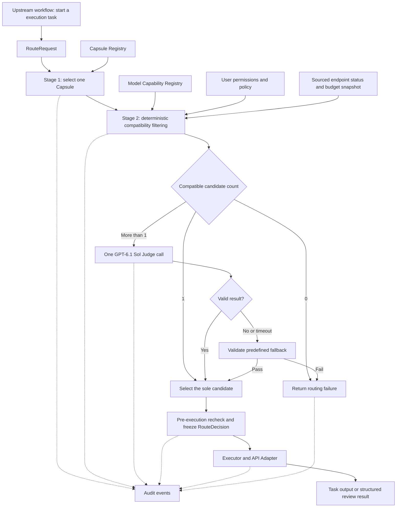

# Model Router Redesign: M1 Technical Design

Version: v1.7 · Date: 2026-10-02 · Status: technical design; not yet implemented

Requirements source: [PRD - Model Routing_completed.txt](<PRD - Model Routing_completed.txt>), updated by the user’s instruction to remove roles and use only an Executor. The original PRD remains the M1 baseline; subsequent user instructions add Anthropic and the staged scientific-model arsenal in Section 3.4. API-only execution remains valid; task types and Capsules replace role distinctions. The broad research/tool inventory is an extension beyond the small active M1 executor set. The original PRD file is unchanged. Section 3.4 defines the expected model list; defaults such as timeouts remain design proposals.

English edition based on [the Chinese technical design](model_router_design.md), independently revised on 2026-10-02 for the model arsenal and small catalog-label/Judge improvements. The Chinese edition has not been synchronized by this update.

## 1. Design Summary and Scope

The Router makes two sequential decisions for each execution task: **first select one Capsule based on the task type, domain, and constraints, then select one model that meets that Capsule's requirements**. Model selection combines deterministic compatibility filtering with one bounded LLM judgment. The result is a `RouteDecision` that cannot change during that execution.

A Capsule defines how to execute: task instructions, skills, tool permissions, input/output contracts, and execution constraints. A Model determines which API model executes the task. They are registered independently and matched through capability requirements. Domain expertise is represented in both the Capsule's execution method and the model's capability metadata; a model is not permanently tied to a single domain.

The system has one executor type: Executor. A task execution is an `execution`, tracked by `execution_id`; Planner, Coder, and Reviewer are no longer separate runtime roles. Planning, implementation, and review are values of `task_type`, handled by the same executor using the appropriate Capsule. Multiple model calls within an execution retain the same Capsule version and model binding. The upstream workflow controls task order; the Router does not form teams, decompose tasks, or optimize the DAG.

| PRD item | M1 design | Explicit boundary |
|---|---|---|
| 3.X.1 Model Capability Registry | Small active API executor catalog separating declared capabilities, verified capabilities, and runtime state; staged scientific tool inventory is separate | No local weights, large collections of fine-tuned models, or unstable experimental interfaces |
| 3.X.2 Model Routing & Selection | Single Capsule → deterministic filtering → LLM selection of one model → route frozen before execution | No embeddings, vector retrieval, learned routing, voting, mid-execution model switching, or global optimization |
| 3.X.3 Model Usage Auditing | Every model call linked to its route, execution, task, tokens, cost, and outcome | No full billing, cross-user chargeback, organization-wide quota enforcement, or online optimization |
| 3.X.4 Review capability (formerly AI Reviewer Agent) | Unified Executor runs a read-only review Capsule in an isolated execution/context and returns structured results | No separate Reviewer role, implementation edits, rerouting, or automatic repair |

## 2. System Placement and Component Responsibilities



The pre-execution recheck may also use the same predefined fallback under the conditions in Section 7. Every failure branch produces a traceable routing error.

| Component | Input and output | Responsibility |
|---|---|---|
| Request Normalizer | Raw execution task → `RouteRequest` | Validate task type, input references, and user context; merge hard constraints |
| Capsule Selector | Request + Capsule snapshot → `CapsuleSelection` | Select exactly one Capsule using explicit matching rules |
| Compatibility Filter | Capsule + model catalog + policy/state → `CandidateSet` | Apply hard filters and retain exclusion reasons for each model |
| Model Judge | Request summary + compatible candidates → `JudgeResult` | Select one model only from the permitted candidate IDs |
| Route Finalizer | Initial selection + latest state → `RouteDecision` | Bound fallback, recheck before execution, and freeze model and configuration versions |
| Executor / API Adapter | Frozen route + Capsule + input → result | Construct API calls, execute Capsule-permitted tools, and validate output |
| Audit Writer | Routing and per-call events → local persistent records | Link selection rationale, actual usage, and execution status |

The registries and Audit Writer can initially use existing configuration storage and SQLite. With a small model catalog, compatibility filtering can scan the catalog directly; no Router-specific retrieval or model-ranking service is needed. Qualified remote scientific prediction services are Capsule tool dependencies, separate from executor selection.

## 3. Data Contracts for the Two Registries

### 3.1 Model Capability Registry

Each record identifies a callable deployment configuration: `model_id + provider + endpoint_ref + provider_model_name`. The same vendor model accessed through different endpoints may have different IDs, but expanding into numerous minor variants is outside M1's purpose. API keys remain in the existing credential system; the catalog stores only `credential_ref`.

| Field | Content and purpose |
|---|---|
| `model_id`, `revision`, `registration_state`, `enabled`, `routing_eligible` | Stable internal ID, configuration revision, registration lifecycle, enabled state, and eligibility for task-execution routing |
| `family`, `provider`, `provider_model_name` | Model family, provider, and actual API model name |
| `access_mode`, `adapter_id`, `endpoint_ref`, `credential_ref` | M1 uses `access_mode=api`; adapters resolve connection and authentication details |
| `declared_capabilities` | Vendor- or administrator-declared input/output modalities, context size, maximum output, tool use, and structured-output modes |
| `verified_capabilities` | Per-capability `pass/fail/unknown`, verification time, endpoint/model version, and verification record reference |
| `suitable_tasks`, `domains` | Supported tasks, and areas of strength |
| `quality_evidence`, `quality_profiles[]` | Evaluation findings plus per-domain/task `quality_tier=high/medium/low/unknown`, evidence reference, and check date; missing or invalid evidence is unknown. Optional `advisory_tier=high/medium/low` records source-informed provisional task fit separately from verified quality |
| `resource_tier` | Deployment scale `micro/light/medium/heavy/unknown`; independent of quality tier and cost class |
| `cost_class`, `pricing` | Cost class and optional input/output token prices, currency, and pricing version |
| `policy_tags` | Access-policy tags such as data-processing region and permitted data categories |

**Small catalog-label improvement:** use the existing `domains` and `suitable_tasks` as explicit, nonexclusive task-fit labels. Add `resource_tier=micro/light/medium/heavy/unknown` for deployment scale and a small `quality_profiles[]` record with `domain`, `task_family`, `quality_tier=high/medium/low/unknown`, `evidence_ref`, and `checked_at`. Keep cost in the existing `cost_class`/pricing fields. Resource size, cost, and demonstrated task quality are independent dimensions: a million-parameter potential can have high quality on a narrow validated task, while a frontier model can have unknown quality on a new numerical contract.

Assign domain/task and size labels from documented model methods. Use the portraits' task-scoped `advisory_tier` and exact-checkpoint public benchmark records as provisional selection preferences, preserving each reported metric, protocol, attempt budget and source. Verified `quality_tier` requires manually reviewed, held-out evaluations on a comparable Capsule, language, checkpoint and budget; public claims do not create an internally verified `high` grade. No such task evaluations were run for this revision, so verified quality remains `unknown`. That value does not exclude a compatible candidate or require an internal benchmark before selection. Missing, stale or out-of-scope evidence is disclosed rather than invented. The frontier group name and `priority/reserve` labels are not measured quality grades. Keep the labels small and versioned; this adds neither learned routing nor a weighted scoring service.

Keep observed deployment state separate from permanent capabilities in an `EndpointStatusSnapshot`: exact model/provider/endpoint identity, quantization where supplied, source URL, observation time, measurement window, and the status/uptime/TTFT/throughput fields actually returned. The 2026-10-02 public-metadata collection obtained 49 provider endpoints and 44 endpoints with native TTFT/TPS values; it did not run inference. Preserve these observations at their actual provider scope. OpenRouter's text `latency_last_30m` is TTFT in milliseconds, and `throughput_last_30m` is generation tokens/second; these mixed-traffic percentiles are not a measured 1,000-input/1,000-output total response time. Uptime is successful requests divided by successful plus errored requests, excluding rate-limited requests; null means insufficient data. Record missing or stale fields as unknown. See the [official endpoint schema](https://openrouter.ai/openapi.json) and [official metric handling](https://github.com/OpenRouterTeam/skills/blob/main/skills/openrouter-models/scripts/get-endpoints.ts).

Account/key credit metadata is separate, scoped to the actual credential, and shared across its model calls. A positive remaining credit observation neither establishes a per-model quota nor guarantees inference access. No per-model remaining-quota field was obtained, so it is absent from candidate filtering and Judge cards. See [current API-key metadata](https://openrouter.ai/docs/api/api-reference/api-keys/get-current-api-key) and [limits documentation](https://openrouter.ai/docs/api_reference/limits).

**Rules for using declared and verified capabilities:**

1. Store declared values at registration. Permit a model to serve tasks with corresponding hard requirements only after adapter-level verification on a small sample.
2. Required tool use, structured output, and input modalities must have valid verification records for that endpoint. Failed or expired verification is treated as unknown capability.
3. Store both declared context/output limits and conservatively configured effective limits. Verification records describe actual test coverage; a successful short-text request does not verify the full context limit.
4. General text tasks also require basic API-callability verification. A successful metadata GET, catalog listing or HTTP 200 is not an inference-access test. LLM judgment cannot fill gaps in unconfirmed critical capabilities.
5. Record quality evidence separately from call success rates. A successful API request does not establish that a research conclusion is correct.

M1 registration covers the PRD's Codex, Qwen, DeepSeek, GLM, Gemini, and OpenAI GPT families, plus the user-requested Anthropic Claude extension and a small selection of qualified executor specialists. Section 3.4 additionally catalogs scientific tool backends; those do not become executor registry entries. Family names are classifications only: every enabled entry still requires a usable API model identifier and a verified endpoint. A product name or local CLI must not be treated as an integrated API model.

The registration lifecycle is `draft → validated → enabled → disabled`. Changes to the model version, endpoint, or adapter contract invalidate relevant verification records and require re-verification. An initial catalog of approximately 6–12 usable executor deployment entries is suggested; this is an engineering recommendation, not a PRD limit. The disabled research inventory and separate scientific tool backends in Section 3.4 do not increase the recommended active executor count.

### 3.2 Capsule Registry

A Capsule is a versioned execution package. Routing reads only its metadata; the executor loads its actual prompts, skills, and tool definitions.

| Field | Content and purpose |
|---|---|
| `capsule_id`, `version`, `enabled` | Unique ID, fixed version, and enabled state |
| `task_types`, `domains`, `priority` | Task-type applicability; priority supports deterministic ordering after rule matching |
| `instructions_ref`, `skills` | Versioned references to task instructions and required skills |
| `input_schema_ref`, `output_schema_ref` | Input and result contracts |
| `required_capabilities` | Input/output modalities, tool use, structured-output modes, and context requirements |
| `allowed_tools`, `side_effect_policy` | Tool allowlist and read/write permissions, enforced by the execution environment |
| `model_allowlist` | Optional model restriction; empty means all registered models satisfying the requirements are allowed |
| `default_for_task_type`, `fallback_model_id` | Default Capsule flag for a task type and its single predefined fallback model |

Initial task types are `general`, `planning`, `implementation`, `review`, `math_reasoning`, `scientific_reasoning`, and `biomedical_analysis`. Capsule names include `task.general`, `task.planning`, `task.implementation`, `task.review`, `domain.math_text`, `domain.scientific_reasoning`, and `domain.biomedical_text`. These define execution methods and permissions, not roles. Add specialized Capsules only for distinct methods; change model metadata or selection policy when only preferences differ.

Allow at most one enabled default Capsule per task type. `task.general` serves valid general requests only; it cannot absorb unknown types or remove hard constraints. Configuration publication validates task types, tool permissions, output schemas, fallback references, and static model compatibility. Runtime checks retain user permissions, credentials, enabled state, configured budgets and any genuinely observed blocking deployment status; unavailable per-model quota or internal quality evidence is not required.

### 3.3 Request, Selection, and Call Records

| Data object | Minimum fields |
|---|---|
| `RouteRequest` | `request_id`, `workflow_id`, `task_id`, `execution_id`, `user_id`, `task_type`, `task_summary`, `domains`, `input_refs`, `requirements`, `policy_ref`, `preferences` |
| `CapsuleSelection` | `capsule_id`, `capsule_version`, `match_reason`, `registry_revision` |
| `CandidateSet` | `eligible_model_ids`, `excluded[{model_id, reason_codes}]`, per-model context/cost estimates with provenance, task-fit/public-evidence cards, and available endpoint snapshot references |
| `JudgeResult` | `selected_model_id`, `reason_code`, `reason_summary` |
| `RouteDecision` | All correlation IDs, Capsule ID/version, final model ID/revision, candidate snapshot, selection method, fallback reason, policy version, timestamps, validity period, and input-contract summary hash |
| `CallRecord` | `call_id`, `route_id`, `purpose`, `attempt`, `provider_request_id`, requested/response model identifiers, timestamps, usage, estimated cost, call status, and error type |
| `ToolCallRecord` (scientific-tool extension) | `tool_call_id`, `route_id`, `execution_id`, `tool_id`, service/checkpoint/configuration revisions, remote job/request ID, input/output artifact references, schema/units, budget, timestamps, usage/cost provenance, verifier result, and job state |

`requirements` expresses hard requirements; `preferences` expresses only soft preferences among quality, cost, and speed. User input cannot override server-side permissions. `user_id` comes from a trusted session, not an untrusted client-supplied value.

`RouteDecision.selection_method` is `single_candidate / llm_judgment / predefined_fallback`. `fallback_used` indicates that this routing attempt actually used the predefined fallback selection. If the sole candidate happens to be the fallback model, that alone does not count as fallback.

The request contract has no `role` field and uses a strict schema to reject extra fields. `task_type` describes work, not executor identity; `execution_id` identifies one execution, not an agent category. Execution logs may record `executor_instance_id` for observability, but it does not influence model or Capsule selection. The LLM Judge is an internal routing call, not an additional role.

### 3.4 Full-Spectrum Model Arsenal for Long-Horizon Research

The objective is to prepare a research system that can outperform a **GPT-6.1 Sol baseline on defined, long-horizon scientific workflows** through specialist computation, checked intermediate results, and selective use of frontier reasoning. This is an evaluation target, not an achieved result. A model enters this arsenal because it has a documented research method, usable artifacts, and a measurable task contract; a domain-themed chatbot or a large training corpus alone is insufficient.

This section supersedes the previous light/medium domain-chat shortlist. It is a user-requested research extension beyond the PRD's small M1 integration set. The Router still enables approximately 6–12 qualified **executor deployments** initially. The wider inventory is staged research capacity; remote scientific services are provisioned by the platform and exposed through Capsule tools. The Router does not download, train, merge, or serve weights.

**Inventory:** **78 specialist model/method families across 10 task bands, plus 3 frontier entries and 6 integration/Judge/historical references: 87 unique inventory entries in total.** Specialists comprise **13 executor candidates (`E`) and 65 scientific tool backends (`T`)**. The Judge and deprecated Codex reference are not task-execution candidates. Distinct prediction/generation methods count separately; quantizations, mirrors, and unused scale variants do not. Task-band counts are **6 coding, 6 mathematics/formal, 16 biomedical/omics, 9 chemistry/therapeutics, 10 materials, 5 numerical physics, 6 astronomy/cosmology, 10 weather/Earth, 6 statistics/time series, 4 evidence tools**.

**Invocation bands:**

| Band | Purpose | Admission and execution boundary |
|---|---|---|
| Frontier / `E` | Research planning, difficult reasoning, integrating evidence, and writing reproducible conclusions | A verified text/multimodal API deployment can enter the Model Capability Registry. One executor model remains frozen per execution. |
| Specialist executor / `E` | Research code, mathematical reasoning, formal proof generation, and bounded domain text tasks | Qualify the exact checkpoint, prompt/tool contract, and domain task. A proof generator still needs a compiler; a medical QA score does not establish reliable extraction. |
| Scientific service / `T` | Protein/molecule generation, physical prediction, representation learning, forecasting, and document processing | A Capsule calls an allowlisted remote tool with typed inputs and checked outputs. These entries belong to the tool inventory, never the interchangeable text-executor candidate set. |

**Size and evidence conventions:** micro is below 1B parameters, light is approximately 1–9B, and medium is approximately 10–32B. Larger models are explicit heavy reserves where their scientific method warrants inclusion. `Not stated` means the inspected primary source does not establish a deployment-wide parameter count; it is not a claim of compact size. For MoE models report total and active parameters separately. Training-data counts describe exposure, not verified competence or measured cost. Every row links a primary paper, author repository, model card, or vendor API reference; training and benchmark evidence remains specific to its released version and evaluation setup.

**Source check: 2026-10-02.** `P` means a documented API/managed serving path exists; `C` means a stable platform-provisioned remote endpoint must be secured. Neither establishes account access or completed integration. `Priority` and `reserve` indicate qualification order, not validated performance rankings. Every executor starts `registration_state=draft, enabled=false`; every scientific tool starts disabled. Qualification requires a fixed revision, license review, input/output validation, domain evaluation, availability evidence, and measured total cost.

**Per-model quality tiers (provisional):** the quality column below assigns every inventory entry a task-scoped `high / medium / low` advisory tier (54 high, 32 medium, 1 low), with a link to its standalone English model portrait. `High` means strong method fit for the specified task; `medium` means useful but conditional or reserve; `low` means weak current deployment fit or a historical reference. These are source-informed quality priors, stored as `quality_profiles[].advisory_tier`, not measured benchmark grades. The linked portrait defines the exact tier scope, evidence, strengths, failure modes, contract and falsifiable qualification plan. `quality_profiles[].quality_tier` remains `unknown` for all 87 entries until comparable held-out evaluation. The Judge may read advisory fit separately from verified quality; the column does not enable endpoints or override compatibility filtering. See the [collection index](model_benchmark_dossiers/en/00_INDEX.txt), [grading method](model_benchmark_dossiers/en/00_README.txt), and [structured profiles](model_benchmark_dossiers/en/00_ROUTING_PROFILES.json).

#### 3.4.1 Frontier Group and Integration References

| Group | Internal ID | Model / API ID / primary source | Research task | Access and constraints | Quality tier (provisional) | Cost USD / defined workload | Latency seconds / defined workload |
|---|---|---|---|---|---|---|---|
| Frontier; baseline and research execution | `openai.general` | [GPT-6.1 Sol](https://developers.openai.com/api/docs/models/gpt-6.1-sol); `gpt-6.1-sol`; size not disclosed | Complex scientific planning, code, synthesis, and the fixed comparison baseline | E / P; use OpenAI Responses API for tools; verify image input, structured output, context, and reasoning settings independently. | [high](model_benchmark_dossiers/en/openai.general.txt) | quote $0.012 | est 44.18s [22.09–176.7]; TTFT 4.216s / 25 TPS |
| Frontier; scientific reasoning | `deepseek.reasoning` | [DeepSeek V4 Pro](https://api-docs.deepseek.com/api/create-response/); `deepseek-v4-pro` | Mathematical/scientific reasoning and experiment interpretation | E / P; Responses API is stateless, so the platform supplies persisted context; record the actual served revision and capability differences. | [high](model_benchmark_dossiers/en/deepseek.reasoning.txt) | quote $0.0039 | est 30.12s [15.06–120.5]; TTFT 1.575s / 35 TPS |
| Frontier; long-horizon reasoning | `anthropic.fable5` | [Claude Fable 5](https://platform.claude.com/docs/en/models/fable-5/migration-guide); `claude-fable-5`; size not disclosed | Long research plans, evidence synthesis, and difficult cross-domain judgments | E / P; Claude Messages API; adaptive thinking is always on and assistant prefill is unsupported. Preserve the requested Fable 5 identity; qualify Fable 5.1 separately if later adopted. | [high](model_benchmark_dossiers/en/anthropic.fable5.txt) | quote $0.06 | est 34s [17–136]; TTFT 3.726s / 33 TPS |
| Qwen integration reference | `qwen.general` | [Qwen3.5-Plus](https://www.alibabacloud.com/help/en/model-studio/model-pricing); `qwen3.5-plus` | Chinese/English evidence extraction and general research text | E / P; Model Studio; qualify region, actual alias revision, and tools. Not counted as a compact specialist. | [medium](model_benchmark_dossiers/en/qwen.general.txt) | est $0.0021 [$0.00182–$0.0042] | est 21s [5.05–105] |
| GLM integration reference | `glm.general` | [GLM-5](https://docs.z.ai/guides/llm/glm-5); `glm-5` | Chinese research text and tool-assisted code/text work | E / P; Z.AI API; regional services require independent qualification. Not counted as compact. | [medium](model_benchmark_dossiers/en/glm.general.txt) | quote $0.0042 | est 24.6s [12.3–98.39]; TTFT 5.385s / 52 TPS |
| Gemini integration reference | `gemini.research` | [Gemini 3.8 Flash](https://ai.google.dev/gemini-api/docs/models); `gemini-3.8-flash` | Multimodal research inputs and general execution comparison | E / P; stable Gemini API entry; replaces 2.5 Pro as the new-integration target because 2.5 access is restricted to prior users. | [medium](model_benchmark_dossiers/en/gemini.research.txt) | quote $0.00225 | est 11.56s [5.78–46.24]; TTFT 1.669s / 101 TPS |
| Hosted coding reference | `qwen.code` | [Qwen3-Coder-Plus](https://www.alibabacloud.com/help/en/model-studio/model-pricing); `qwen3-coder-plus` | Research repository implementation | E / P; Model Studio; hosted-model size is not inferred from similarly named open weights. | [medium](model_benchmark_dossiers/en/qwen.code.txt) | quote $0.0039 | est 23.78s [11.89–95.12]; TTFT 1.076s / 44 TPS |
| Fixed Router Judge | `openai.judge` | [GPT-6.1 Sol](https://developers.openai.com/api/docs/models/gpt-6.1-sol); `gpt-6.1-sol` | One bounded routing judgment | J / P; `routing_eligible=false`; separate fixed `judge_model_id=gpt-6.1-sol`. User-selected default; exactly one bounded routing call. | [high](model_benchmark_dossiers/en/openai.judge.txt) | quote $0.012 | est 44.18s [22.09–176.7]; TTFT 4.216s / 25 TPS |
| Codex historical integration reference | `openai.codex` | [GPT-5.3-Codex](https://developers.openai.com/api/docs/models/gpt-5.3-codex); `gpt-5.3-codex`; [retirement notice](https://developers.openai.com/api/docs/deprecations) | Preserve the PRD's explicit Codex reference for migration accounting | H / reserve; deprecated 2026-10-01, shutdown scheduled 2027-04-01; disabled and excluded from new task scopes. New coding evaluations use current frontier and specialist candidates. | [low](model_benchmark_dossiers/en/openai.codex.txt) | quote $0.01575 | est 17.44s [8.719–69.75]; TTFT 2.068s / 65 TPS |

The requested high-end group is **GPT-6.1 Sol, DeepSeek V4 Pro, and Claude Fable 5**. Anthropic is added by this user-requested extension. Product names, chat subscriptions, local CLIs, and model download IDs never substitute for a verified API deployment.

#### 3.4.2 Specialist Inventory by Scientific Task

The following is the consolidated specialist pool. `E` and `T` are invocation kinds, not executor roles. Rows marked `T` cannot be selected by the Model Judge even when their service accepts an OpenAI-shaped request. Each domain table describes an actual scientific operation and its qualification boundary.

##### Research software and algorithms — 6 families

| Internal ID | Model / scale / primary source | Documented specialization or training evidence | Scientific task | Invocation / qualification constraints | Quality tier (provisional) | Cost USD / defined workload | Latency seconds / defined workload |
|---|---|---|---|---|---|---|---|
| `qwen.code30b` | [Qwen3-Coder-30B-A3B-Instruct](https://huggingface.co/Qwen/Qwen3-Coder-30B-A3B-Instruct); 30.5B total / 3.3B activated (MoE; weights still 30.5B); artifact `Qwen/Qwen3-Coder-30B-A3B-Instruct` | Official coding-agent release with pretrained/post-trained weights, native 262,144-token context, repository-scale context and tool-calling format; Apache-2.0. | Repository navigation, scientific code patches and tool execution; emit patch/tool calls, validate with tests and reproducible experiment reruns. | E / C / priority; Medium-footprint endpoint, not a 3B-memory model. Model card lists a provider but availability must be probed. Remote vLLM/SGLang endpoint needs its tool parser/chat template; admit only after task-specific tests. | [high](model_benchmark_dossiers/en/qwen.code30b.txt) | quote $0.00035 | est 37.37s [18.68–149.5]; TTFT 1.042s / 27.5 TPS |
| `code.devstral24b` | [Devstral Small 2](https://huggingface.co/mistralai/Devstral-Small-2-24B-Instruct-2512); 24B dense; artifact `mistralai/Devstral-Small-2-24B-Instruct-2512`; [supporting primary source](https://mistral.ai/news/devstral-2-vibe-cli) | Official 24B coding-agent model with 256K context, multi-file software-engineering behavior and visual-input support; Apache-2.0. Detailed training-corpus size is undisclosed. | Scientific software refactors, cross-file repairs and terminal-assisted implementation; validate patch against held-out regression and reproduction checks. | E / C / priority; Remote model endpoint with Mistral tool format/system prompt required. Official Mistral Labs listing uses labs-devstral-small-2512; provider name/version must be pinned and probed. 24B belongs in medium specialist tier. | [high](model_benchmark_dossiers/en/code.devstral24b.txt) | est $0.01155 [$0.002889–$0.09244] | est 20.8s [10.4–83.2] |
| `code.sweagent7b` | [SWE-agent-LM-7B (SWE-smith)](https://huggingface.co/SWE-bench/SWE-agent-LM-7B); 7B-class (HF tensor count rounds to 8B); artifact `SWE-bench/SWE-agent-LM-7B`; [supporting primary source](https://swesmith.com/getting_started/assets/) | Qwen2.5-Coder-Instruct fine-tuned on 5,000 SWE-agent + Claude 3.7 Sonnet trajectories; SWE-smith toolkit generates executable repository tasks rather than generic chat training. | Bounded bug-fix and experiment-repair tickets using SWE-agent action grammar; emit patches and commands with unit/integration checks. | E / C / priority; Requires compatible SWE-agent tools and remote Linux/Docker experiment capsule. Listed hosted provider is not automatic registration; probe checkpoint and action grammar. A 2025 specialist must earn promotion on new repository tasks. | [medium](model_benchmark_dossiers/en/code.sweagent7b.txt) | est $0.003622 [$0.0009056–$0.02898] | est 6.52s [3.26–26.08] |
| `code.mellum4b` | [Mellum 4B Python FIM](https://huggingface.co/JetBrains/Mellum-4b-sft-python); 4B dense; artifact `JetBrains/Mellum-4b-sft-python`; [supporting primary source](https://huggingface.co/JetBrains/Mellum-4b-base) | Pretrained on over 4T multi-language tokens then Python fine-tuned for contextual code completion; 8,192-token context. Base corpus includes The Stack/Stack v2, StarCoder data and CommitPack; Apache-2.0. | Short Python fill-in-the-middle completions, function bodies and repetitive scientific adapters; emit code span, validate syntax and focused execution tests. | E / C / priority; Completion/FIM endpoint with prefix/suffix and repository-file context, not generic chat prompting. Deploy remote compatible completion server; no ready managed API guaranteed. Keep task context within 8K. | [medium](model_benchmark_dossiers/en/code.mellum4b.txt) | est $0.00194 [$0.0004849–$0.01552] | est 3.491s [1.746–13.97] |
| `code.opencodereasoning7b` | [OpenCodeReasoning-Nemotron-1.1-7B](https://huggingface.co/nvidia/OpenCodeReasoning-Nemotron-1.1-7B); 7B-class (HF tensor count rounds to 8B); artifact `nvidia/OpenCodeReasoning-Nemotron-1.1-7B`; [supporting primary source](https://arxiv.org/abs/2504.01943) | Post-trained Qwen2.5-7B-Instruct on 1.165M competitive-programming questions and DeepSeek-R1-0528 responses; 64K context. Card reports 55.5% average pass@1 on LiveCodeBench v5 under its evaluation protocol. | Algorithm derivation, combinatorial search code and bounded numerical routine generation; emit runnable program, validate with hidden tests and numerical invariants. | E / C / priority; Hosted provider listed on card; probe current exact checkpoint. Pin NVIDIA Open Model License terms and reasoning template. Competitive coding performance does not establish repository-agent competence. | [high](model_benchmark_dossiers/en/code.opencodereasoning7b.txt) | est $0.003382 [$0.0008455–$0.02706] | est 6.087s [3.044–24.35] |
| `code.olympiccoder7b` | [OlympicCoder-7B](https://huggingface.co/open-r1/OlympicCoder-7B); 7B-class (HF tensor count rounds to 8B); artifact `open-r1/OlympicCoder-7B`; [supporting primary source](https://huggingface.co/blog/open-r1/update-3) | Qwen2.5-Coder-7B-Instruct fine-tuned on decontaminated Codeforces data and DeepSeek-R1-generated C++ solutions; evaluated on IOI 2024 and LiveCodeBench; Apache-2.0. | C++ contest-style algorithmic subproblems, exact combinatorial kernels and independent implementation candidates; verify with compile/run and adversarial tests. | E / C / reserve; Reserve diversity candidate: training emphasizes C++, and Python benchmark behavior is out-of-domain. Provider listing must be probed. No executor voting: select one fixed executor per Capsule. | [medium](model_benchmark_dossiers/en/code.olympiccoder7b.txt) | est $0.003382 [$0.0008455–$0.02706] | est 6.087s [3.044–24.35] |

##### Mathematical reasoning and formal verification — 6 families

| Internal ID | Model / scale / primary source | Documented specialization or training evidence | Scientific task | Invocation / qualification constraints | Quality tier (provisional) | Cost USD / defined workload | Latency seconds / defined workload |
|---|---|---|---|---|---|---|---|
| `math.kimina17b` | [Kimina-Prover-RL](https://huggingface.co/AI-MO/Kimina-Prover-RL-1.7B); 1.7B primary; 0.6B low-cost sibling; artifact `AI-MO/Kimina-Prover-RL-1.7B`; [supporting primary source](https://huggingface.co/blog/AI-MO/kimina-prover-rl) | RL continuation of Kimina-Prover-Distill-1.7B for competition-style Lean 4 proving; reported MiniF2F-test 76.63% pass@32. Official 0.6B sibling reports 71.30% pass@32; Apache-2.0. | Cheap bounded Lean 4 proof generation; require kernel success, no sorry, and a checked theorem statement. | E / C / priority; Official card has no deployed inference provider; remote checkpoint serving must be provisioned/probed. Results depend on 32-sample budget, Lean/mathlib version and formal benchmark scope. Register RL family once, not each size as unrelated expertise. | [high](model_benchmark_dossiers/en/math.kimina17b.txt) | est $0.0008338 [$0.0002085–$0.006671] | est 1.501s [0.7504–6.004] |
| `math.goedel8b` | [Goedel-Prover-V2-8B](https://huggingface.co/Goedel-LM/Goedel-Prover-V2-8B); 8B dense; artifact `Goedel-LM/Goedel-Prover-V2-8B` | Expert iteration/RL with scaffolded synthetic proof tasks, Lean-compiler-guided self-correction and model averaging; official 8B release reports 83.0% MiniF2F-test pass@32. | Harder bounded Lean 4 proof obligations; verify kernel proof and agreement with the intended theorem statement. | E / C / priority; Needs remote hosted checkpoint and matching Lean environment; pin library versions, timeout and heartbeat limits. Pass@32 is not single-pass accuracy or long-horizon science victory. Domain/license details must be checked at actual checkpoint registration. | [high](model_benchmark_dossiers/en/math.goedel8b.txt) | est $0.003863 [$0.0009657–$0.0309] | est 6.953s [3.476–27.81] |
| `math.deepseekprover7b` | [DeepSeek-Prover-V2-7B](https://huggingface.co/deepseek-ai/DeepSeek-Prover-V2-7B); 7B; distinct from 671B flagship; artifact `deepseek-ai/DeepSeek-Prover-V2-7B`; [supporting primary source](https://arxiv.org/abs/2504.21801) | 7B release built on DeepSeek-Prover-V1.5-Base, with 32K context. Release describes subgoal-decomposed synthetic proofs and verifier reward; formal proving rather than generic mathematical chat. | Subgoal completion and alternate proof construction in Lean 4; output kernel-checkable proof with no admitted obligations. | E / C / reserve; Card lists no deployed inference provider, so use/probe remote serving. Never attribute flagship 671B MiniF2F/Putnam numbers to 7B. License is checkpoint Model License; pin source and Lean/mathlib version. | [medium](model_benchmark_dossiers/en/math.deepseekprover7b.txt) | est $0.003382 [$0.0008455–$0.02706] | est 6.087s [3.044–24.35] |
| `math.autoformalizer7b` | [Kimina-Autoformalizer-7B](https://huggingface.co/AI-MO/Kimina-Autoformalizer-7B); 7B-class (HF tensor count rounds to 8B); artifact `AI-MO/Kimina-Autoformalizer-7B` | Project Numina specialist translating natural-language competition problem statements into Lean 4 theorem declarations; output intentionally ends with by sorry. Derived from Qwen2.5-Coder-7B-Instruct; detailed training data size undisclosed. | Translate conjectures into explicit Lean statements before prover execution; emit formal theorem skeleton and symbol/assumption mapping. | E / C / priority; Autoformalization alone proves nothing. Require separate statement-equivalence review plus eventual prover/kernel check; never accept its intentional sorry as valid proof. Remote vLLM-compatible endpoint must be provisioned/probed. | [medium](model_benchmark_dossiers/en/math.autoformalizer7b.txt) | est $0.003382 [$0.0008455–$0.02706] | est 6.087s [3.044–24.35] |
| `math.reprover03b` | [LeanDojo ReProver](https://github.com/lean-dojo/ReProver); ~299M tactic generator; separate premise-retriever checkpoint; artifact `kaiyuy/leandojo-lean4-retriever-tacgen-byt5-small`; [supporting primary source](https://huggingface.co/kaiyuy/leandojo-lean4-retriever-tacgen-byt5-small) | ByT5-based retrieval-augmented prover trained on Lean/mathlib proof states and premises; official released Lean 4 premise retriever and tactic-generator weights. Outputs tactics rather than a research-chat answer. | Premise retrieval and a bounded next-tactic proposal on pinned mathlib infrastructure; validate the proposed tactic immediately with Lean. | E / C / reserve; Requires a native seq2seq/premise adapter and remote LeanDojo process; not a drop-in chat endpoint. Older checkpoint/library domain must be aligned. MIT implementation; reserve when low-cost tactic search beats larger proof generators. | [medium](model_benchmark_dossiers/en/math.reprover03b.txt) | est $0.0001607 [$4.019e-05–$0.001286] | est 0.2893s [0.1447–1.157] |
| `math.openmath7b` | [OpenMath-Nemotron (CoT / TIR)](https://huggingface.co/nvidia/OpenMath-Nemotron-7B); 7B primary; released 1.5B and 14B/32B siblings; artifact `nvidia/OpenMath-Nemotron-7B`; [supporting primary source](https://arxiv.org/abs/2504.16891) | Math-specific post-training on OpenMathReasoning (HF release has 5.68M examples), supporting chain-of-thought, Python tool-integrated reasoning and GenSelect. Official release accompanies AIMO-2 winning-system research; CC-BY-4.0 model terms. | Arithmetic/competition-style derivations with Python-assisted intermediate calculations; emit derivation, executable calculations and verifiable final answer. | E / C / priority; A materially post-trained specialist, not the removed QwenMath-7B baseline. Use NeMo-Skills reference TIR adapter, deterministic calculation checks and cost all samples; do not transplant winning ensemble results to one 7B pass. Card contains copied architecture fields, so verify actual config. | [high](model_benchmark_dossiers/en/math.openmath7b.txt) | est $0.003382 [$0.0008455–$0.02706] | est 6.087s [3.044–24.35] |

##### Proteins, genomes, RNA, single cells, and medical imaging — 16 families

| Internal ID | Model / scale / primary source | Documented specialization or training evidence | Scientific task | Invocation / qualification constraints | Quality tier (provisional) | Cost USD / defined workload | Latency seconds / defined workload |
|---|---|---|---|---|---|---|---|
| `biology.esm3` | [ESM3](https://github.com/Biohub/esm/blob/main/_assets/ESM3_README.md); 1.4B open/small; 7B and 98B API escalation variants (one family); [supporting primary source](https://www.evolutionaryscale.ai/) | Joint sequence/structure/function masked protein generation; the largest ESM3 was trained on 2.78 billion natural proteins and 771 billion unique tokens. This is 2.78B, not 2.3B, and is not a claim that every small checkpoint consumed the flagship training budget. | Constraint-conditioned protein design, infilling, inverse folding and structure/function hypotheses; return FASTA/PDB plus track provenance. | T / P / priority; Biohub API documented (e.g. esm3-medium-2024-08); small open artifact esm3-sm-open-v1 needs platform-hosted remote service if selected. Current Biohub ESM3 README states MIT; pin terms and checkpoint. Not a conversational executor or a measured GPT-6.1 win. | [high](model_benchmark_dossiers/en/biology.esm3.txt) | est $0.001667 [$0.0002222–$0.02222] | est 3s [0.8–20] |
| `biology.esmc` | [ESM Cambrian (ESMC)](https://github.com/Biohub/esm); 300M / 600M compact controls; 6B escalation (one family) | Sequence-only protein representation family trained on billions of sequences; official SDK supports logits and embeddings. Current repo provides Biohub API examples and 6B weights; ESM Atlas's 6.8B proteins is an atlas size, not automatically a training-count claim. | Protein embedding retrieval, clustering and mutation scoring; downstream property predictions require a separately validated head. | T / P / priority; Biohub API documented, including esmc-600m-2024-12. Pin selected size, embedding layer, pooling and scoring method. Current repo states MIT. Do not confuse sequence encoder with ESM3 generation. | [high](model_benchmark_dossiers/en/biology.esmc.txt) | est $1.667e-05 [$2.222e-06–$0.0003333] | est 0.03s [0.008–0.3] |
| `biology.profluent_e1` | [Profluent-E1](https://github.com/Profluent-AI/E1); 150M / 300M / 600M (one family; 300M starting target); [supporting primary source](https://www.profluent.bio/showcase/e1) | Protein encoder built for both single-sequence and homolog-retrieval-augmented inference; official release includes zero-shot fitness and site-saturation scoring notebooks. The primary release evaluates ProteinGym substitution assays and contact prediction. | Variant-effect ranking and homolog-aware sequence representations; use as an independent compact alternative to ESMC. | T / C / priority; Artifact Profluent-Bio/E1-300m; platform remote serving required. Pin homolog database/sampling and March-2026 sampling fix. Weight license is permissive with added attribution requirements; code Apache 2.0. No generic text tools. | [high](model_benchmark_dossiers/en/biology.profluent_e1.txt) | est $5.556e-05 [$5.556e-06–$0.001111] | est 0.1s [0.02–1] |
| `biology.esmfold2` | [ESMFold2](https://huggingface.co/biohub/ESMFold2); 7B total as listed on model card; 6B ESMC backbone; [supporting primary source](https://github.com/Biohub/esm) | All-atom complex structure predictor trained on PDB and AFDB; accepts proteins, DNA/RNA, modifications and small-molecule ligands, with optional MSAs. The primary repository describes experimental binder validation across five therapeutic targets. | Protein/complex folding and structural verification; return mmCIF and per-residue/interface confidence, not free-form structural guesses. | T / P / priority; Documented Biohub API target esmfold2-fast-2026-05; remote tool adapter needed. Pin diffusion steps, loops, seeds, MSA and sampling count. MIT current release. Structural confidence is not binding affinity or experimental confirmation. | [high](model_benchmark_dossiers/en/biology.esmfold2.txt) | est $0.01389 [$0.001389–$0.2] | est 25s [5–180] |
| `biology.progen3` | [ProGen3](https://github.com/Profluent-AI/progen3); 112M-3B publicly released; start with 1B or 3B, one family; [supporting primary source](https://www.profluent.bio/showcase/progen3) | Autoregressive protein generation and span infilling; family uses the 3.4B full-length-protein Profluent Protein Atlas v1. Official code provides sequence likelihood/perplexity and ProteinGym scoring examples. The 46B study model is not an open 3B checkpoint. | Full-length protein candidates, domain redesign and sequence likelihood screening. | T / C / priority; Artifact Profluent-Bio/progen3-1b or progen3-3b; platform remote endpoint pending (vendor API is early access, not verified integration). Max FASTA length 8190 residues in release. Code Apache 2.0, weights CC BY-NC-SA 4.0; pin generation budget. | [high](model_benchmark_dossiers/en/biology.progen3.txt) | est $0.01333 [$0.0025–$0.1067] | est 24s [9–96] |
| `biology.proteinmpnn` | [ProteinMPNN](https://raw.githubusercontent.com/dauparas/ProteinMPNN/main/README.md); 1.66M; [supporting primary source](https://pmc.ncbi.nlm.nih.gov/articles/PMC11978504/) | Compact backbone-conditioned sequence-design network with published experimental validation; primary LigandMPNN paper identifies the ProteinMPNN network as 1.66M parameters. Official release supports fixed positions, tied positions, multichain designs and sequence scoring. | Assign sequences to fixed protein backbones; rank designed sequences and preserve functional residues. | T / C / priority; Platform-hosted remote PDB-to-FASTA/scoring service required; pin v_48_020 or another declared checkpoint, noise level, fixed residues, temperature and seed. Not a language-chat model; score is not experimental fitness. | [high](model_benchmark_dossiers/en/biology.proteinmpnn.txt) | est $0.0003333 [$8.333e-05–$0.003333] | est 0.6s [0.3–3] |
| `biology.ligandmpnn` | [LigandMPNN](https://github.com/dauparas/LigandMPNN); 2.62M; [supporting primary source](https://pmc.ncbi.nlm.nih.gov/articles/PMC11978504/) | Primary publication describes 2.62M parameters versus ProteinMPNN's 1.66M and training on PDB assemblies. Adds local atomic context to protein sequence design, including nonprotein ligand surroundings. | Ligand-, metal- and nucleotide-context-aware sequence redesign around a supplied complex. | T / C / priority; Conditional platform remote service; pin ligandmpnn_v_32_010_25 or exact checkpoint. Validate atom parsing, residue/chain identity and fixed-site constraints. Distinct method from backbone-only ProteinMPNN, not a scale duplicate. | [high](model_benchmark_dossiers/en/biology.ligandmpnn.txt) | est $0.0005 [$0.000125–$0.005] | est 0.9s [0.45–4.5] |
| `biology.rfdiffusion3` | [RFdiffusion3 (RFD3)](https://rosettacommons.org/2025/12/22/rfdiffusion3-is-now-available-in-foundry/); Undisclosed in checked release documentation; [supporting primary source](https://github.com/RosettaCommons/foundry/blob/production/models/rfd3/docs/input.md) | December-2025 public training/inference release through RosettaCommons Foundry; atom-level backbone and side-chain diffusion, with constraints for small molecules, nucleic acids, symmetry and other nonprotein partners. | Generate atom-level protein designs conditioned on geometry and binding-partner constraints. | T / C / priority; Conditional platform remote GPU job service using rc-foundry[rfd3]; not Microsoft Foundry. Require typed PDB/JSON inputs, frozen config, seeds and sample budget; verify release/checkpoint terms separately. Do not count older RFdiffusion generations as extra inventory. | [high](model_benchmark_dossiers/en/biology.rfdiffusion3.txt) | est $0.06667 [$0.005556–$1] | est 120s [20–900] |
| `biology.boltz2` | [Boltz-2](https://github.com/jwohlwend/boltz); Undisclosed in checked official README | Joint biomolecular complex structure and binding-affinity model. Official output distinguishes binder-versus-decoy probability from affinity_pred_value, trained with different supervision; the latter reports log10(IC50 in micromolar). Code and weights MIT. | Protein-ligand complex hypotheses and early-stage affinity/decoy ranking; use as an independent structural/affinity predictor. | T / C / priority; Conditional platform remote service; pin Boltz-2 instead of mutable latest default, MSA pipeline and sample budget. Keep probability and affinity heads separate; do not turn structure confidence into affinity or assert the repo's advertised speedup on our workload. | [high](model_benchmark_dossiers/en/biology.boltz2.txt) | est $0.03333 [$0.002778–$0.4] | est 60s [10–360] |
| `biology.evo2` | [Evo 2](https://github.com/ArcInstitute/evo2); 7B with 1M-bp context; 1B base has 8K context; 20B/40B escalation, one family; [supporting primary source](https://build.nvidia.com/arc/evo2-40b) | Autoregressive genome model trained on OpenGenome2 with 8.8 trillion tokens; official release covers sequence likelihood, embeddings, generation and BRCA1 variant-effect examples at single-nucleotide resolution. | Long genomic context scoring, variant-effect hypotheses and DNA sequence modeling. | T / C / priority; Official hosted NVIDIA API currently linked for 40B, not proof of a hosted 7B API. Use platform remote 7B service as conditional target; verify actual context/resources. Pin checkpoint and allele-normalization protocol. 1B base cannot inherit 1M context. | [high](model_benchmark_dossiers/en/biology.evo2.txt) | est $0.01111 [$0.001667–$0.1333] | est 20s [6–120] |
| `biology.ntv3` | [Nucleotide Transformer v3 (NTv3)](https://github.com/instadeepai/nucleotide-transformer/blob/main/docs/nucleotide_transformer_v3.md); 100M / 650M (one family; 100M starting target) | Base-resolution U-Net-style model pretrained on 9 trillion base pairs and post-trained on about 16,000 functional tracks/annotation labels across 24 animal and plant species; handles contexts up to 1 Mb. Enhancer-generation extension has STARR-seq validation. | Species-conditioned functional-track and genome-annotation prediction; DNA representations; separately qualified controllable enhancer design. | T / C / priority; Conditional remote service for NTv3_100M_post/650M_post; choose correct pre/post checkpoint. Inputs divisible by 128 for standard architecture; track outputs crop to central 37.5%. Pin species and coordinate transform; generative extension requires its own trained checkpoint/contract. | [high](model_benchmark_dossiers/en/biology.ntv3.txt) | est $0.0006667 [$5.556e-05–$0.01333] | est 1.2s [0.2–12] |
| `biology.geneformer` | [Geneformer V2](https://huggingface.co/ctheodoris/Geneformer); 104M / 316M (one family; 104M starting target) | Updated V2 pretrained on roughly 104M non-cancer human single-cell transcriptomes; rank-value gene expression input and 4096-gene input size. Separate cancer continual-learning variant uses about 14M cancer transcriptomes. | Cell/gene embeddings and in-silico network perturbation; gene/cell classification requires a task-trained head/checkpoint. | T / C / priority; Conditional remote AnnData/counts-to-tokenized predictions service. Pin V2-104M or V2-316M, gene dictionary and normalization. Cancer variant is a separate domain contract, not assumed on the non-cancer checkpoint. Apache 2.0; perturbations are hypotheses. | [high](model_benchmark_dossiers/en/biology.geneformer.txt) | est $6.667e-05 [$5.556e-06–$0.001667] | est 0.12s [0.02–1.5] |
| `biology.scgpt` | [scGPT whole-human](https://github.com/bowang-lab/scGPT); Undisclosed in checked official README | Official whole-human checkpoint pretrained on 33M normal human cells; model zoo includes organ and cancer variants. Release provides integration and task examples for single-cell multiomics. | Cell embeddings and reference integration; separately validated heads/fine-tuned checkpoints for cell annotation and perturbation prediction. | T / C / reserve; Conditional remote scientific service; pin whole-human checkpoint, vocabulary, preprocessing and task head. A pretrained representation alone does not enable all listed downstream tasks. Keep as reserve until it adds held-out value beyond Geneformer; MIT code. | [medium](model_benchmark_dossiers/en/biology.scgpt.txt) | est $8.333e-05 [$6.944e-06–$0.002222] | est 0.15s [0.025–2] |
| `biology.rnafm` | [RNA-FM](https://github.com/ml4bio/RNA-FM); Approximately 99M (rounded 100M); [supporting primary source](https://arxiv.org/abs/2204.00300) | 12-layer RNA sequence encoder pretrained on approximately 23.7M noncoding RNAs; 640-dimensional residue embeddings encode structural/function signals. Official release includes secondary-structure and downstream representation examples. | ncRNA embedding, family clustering and secondary-structure/functional predictor inputs. | T / C / priority; Conditional remote FASTA-to-embedding/CT/base-pair probabilities service. Pin rna_fm_t12 and any prediction head. Web server availability does not establish a stable callable API. Do not confuse this sequence model with another 2026 paper also called RNA-FM. | [high](model_benchmark_dossiers/en/biology.rnafm.txt) | est $1.111e-05 [$1.389e-06–$0.0002222] | est 0.02s [0.005–0.2] |
| `biology.rhofold` | [RhoFold+](https://github.com/ml4bio/RhoFold); Total undisclosed; uses RNA-FM representations | RNA tertiary-structure predictor with released checkpoint and online server; accepts FASTA and optional MSA, emits PDB, secondary-structure CT and prediction arrays. Primary Nature Methods work is linked by the official repository. | RNA 3D structure hypotheses and independent refolding of RNA design candidates. | T / C / priority; Conditional remote service. Pin checkpoint, MSA sources/sampling, relaxation and seed; single-sequence mode is described as a quick reference with lower accuracy. Full MSA route requires roughly 900GB databases on platform hosting. Code Apache 2.0; verify weight terms. | [high](model_benchmark_dossiers/en/biology.rhofold.txt) | est $0.006667 [$0.0005556–$0.1] | est 12s [2–90] |
| `medical.medgemma4b` | [MedGemma 1.5 4B IT](https://huggingface.co/google/medgemma-1.5-4b-it); 4B; [supporting primary source](https://deepmind.google/models/gemma/medgemma/) | Medical vision-language model with support for high-dimensional imaging, longitudinal chest-X-ray comparison and anatomical localization; purpose-built medical imaging training differentiates it from literature-QA-only adaptations. | Medical image/text extraction and research annotation under a narrowly evaluated Capsule. | E / C / reserve; Conditional platform-provisioned Vertex AI/remote serving; pin google/medgemma-1.5-4b-it. Verify image/volume serialization and output contract independently. HAI-DEF terms; reserve pending held-out imaging/extraction value against frontier executor. | [medium](model_benchmark_dossiers/en/medical.medgemma4b.txt) | est $0.004444 [$0.0008333–$0.03889] | est 8s [3–35] |

##### Molecular chemistry, reactions, docking, and therapeutics — 9 families

| Internal ID | Model / scale / primary source | Documented specialization or training evidence | Scientific task | Invocation / qualification constraints | Quality tier (provisional) | Cost USD / defined workload | Latency seconds / defined workload |
|---|---|---|---|---|---|---|---|
| `chemistry.unimol2` | [Uni-Mol2](https://github.com/deepmodeling/Uni-Mol/blob/main/unimol2/README.md); 84M-1.1B family (84M starting target; one family); [supporting primary source](https://arxiv.org/abs/2406.14969) | Molecular pretraining across atom, graph and geometry features; largest 1.1B model pretrained on 800M conformations. Distinguish conformation count from number of distinct molecules and from small-checkpoint training budget. | 3D molecular embeddings and separately calibrated property-prediction heads; screening candidates with conformer provenance. | T / C / priority; Conditional platform remote molecular service; pin exact scale/checkpoint and conformer generation. Validate units, stereochemistry and conformer identity. Not a SMILES chat model or quantum oracle; no local Router loading. | [high](model_benchmark_dossiers/en/chemistry.unimol2.txt) | est $4.444e-06 [$5.556e-07–$8.889e-05] | est 0.008s [0.002–0.08] |
| `chemistry.unimol_plus` | [Uni-Mol+](https://github.com/deepmodeling/Uni-Mol/blob/main/unimol_plus/README.md); PCQM4Mv2 small/base/large 27.7M/52.4M/77M; OC20 base 48.6M. | Geometry-oriented molecular quantum modeling with released PCQM4Mv2 and OC20 workflows; distinct geometry/property method from Uni-Mol2 molecular representation pretraining. | Molecular geometry refinement and quantum-property surrogate predictions; compare against explicit quantum-chemistry calculations. | T / C / reserve; Conditional remote service; bind a specific task-trained checkpoint, atom features, geometry convention and property units. Use as reserve pending task fit; benchmark ranking does not establish accuracy on new chemical families. | [medium](model_benchmark_dossiers/en/chemistry.unimol_plus.txt) | est $1.389e-05 [$1.389e-06–$0.0002778] | est 0.025s [0.005–0.25] |
| `chemistry.molformer` | [MoLFormer-XL-both-10pct](https://huggingface.co/ibm-research/MoLFormer-XL-both-10pct); 46.8M | Linear-attention SMILES encoder; this released checkpoint uses 10% of ZINC and 10% of PubChem. The family studied up to 1.1B molecules, which must not be assigned to this 10% artifact. | Compact molecular embeddings, similarity retrieval and task-specific property predictors. | T / C / priority; Artifact ibm-research/MoLFormer-XL-both-10pct; conditional remote endpoint. Card reports no HF inference provider; not a generative model. Training removed isomeric information and dropped strings longer than 202 tokens; validate stereochemistry-sensitive use. Apache 2.0. | [medium](model_benchmark_dossiers/en/chemistry.molformer.txt) | est $4.444e-06 [$5.556e-07–$8.889e-05] | est 0.008s [0.002–0.08] |
| `chemistry.gp_molformer` | [GP-MoLFormer](https://github.com/IBM/gp-molformer); 46.8M; [supporting primary source](https://arxiv.org/abs/2405.04912) | Autoregressive decoder trained on up to 1.1B SMILES molecules; official evaluation covers de-novo generation, scaffold decoration and molecular-property optimization. Distinct training/objective from the MoLFormer encoder. | Molecule proposal and scaffold-conditioned decoration with chemistry validation and synthesis feasibility screening. | T / C / reserve; Conditional remote endpoint and checkpoint access must be secured; release repo's model-link cells are empty. Pin checkpoint, sampling budget and scaffold constraints. Repository states IBM will not maintain it; reserve until deployment verified. Pair-tuning belongs to platform/offline work. | [medium](model_benchmark_dossiers/en/chemistry.gp_molformer.txt) | est $0.005556 [$0.0009722–$0.05556] | est 10s [3.5–50] |
| `chemistry.rxnmapper` | [RXNMapper](https://github.com/rxn4chemistry/rxnmapper); Compact ALBERT; count undisclosed in checked README | Unsupervised attention-guided reaction atom mapping from reaction-SMILES training, with primary Science Advances paper and released inference code. Returns mapped reactions and confidence. | Atom correspondences and reaction-change extraction; prepare verifiable reaction graphs for downstream reasoning. | T / C / priority; Conditional remote batch mapping service; validate reaction SMILES, atom conservation and mapping errors. Invalid-input handling must stay explicit. Confidence is not reaction yield/feasibility; MIT release. | [high](model_benchmark_dossiers/en/chemistry.rxnmapper.txt) | est $1.111e-05 [$1.111e-06–$0.0003333] | est 0.02s [0.004–0.3] |
| `chemistry.retrochimera` | [RetroChimera 1](https://github.com/microsoft/retrochimera); Two-model ensemble; total undisclosed in checked release; [supporting primary source](https://www.microsoft.com/en-us/research/blog/improving-synthesis-prediction-of-small-molecules-at-scale-with-retrochimera/) | R-SMILES 2 sequence model plus NeuralLoc graph/template model with learned ranking; released main checkpoint trained on Pistachio, with separate forward checkpoint. September-21-2026 official article documents Microsoft Foundry availability and Nature publication. | Single-step retrosynthetic proposals; bounded multi-step route search through a separately configured search backend/stock inventory; forward reaction checks use the forward checkpoint. | T / P / priority; Foundry access documented, but account/contract unverified; platform remote Syntheseus service is alternative. Pin ensemble/checkpoint, stock, search budget and consensus/feasibility checks. One family, not three counted submodels. MIT; training data through 2023, literature checks needed. | [high](model_benchmark_dossiers/en/chemistry.retrochimera.txt) | est $0.002778 [$0.0002778–$0.04444] | est 5s [1–40] |
| `chemistry.diffdock` | [DiffDock-L](https://github.com/gcorso/DiffDock); Total undisclosed; score/confidence networks plus protein embeddings | Diffusion docking model with released DiffDock-L update; input protein PDB/sequence and ligand SMILES/SDF. Official repository documents PDBBind/BindingMOAD workflows and PoseBusters evaluation materials. | Generate and rank protein-small-molecule binding poses; inspect geometry and physical plausibility. | T / C / priority; Conditional remote job endpoint; freeze DiffDock-L config, ESM embeddings, sample count and seeds. A web demo is not production API. Model predicts poses/confidence, not binding affinity; do not apply to large protein/protein or nucleic-acid complexes. MIT code/weights. | [high](model_benchmark_dossiers/en/chemistry.diffdock.txt) | est $0.006667 [$0.0005556–$0.1] | est 12s [2–90] |
| `chemistry.admet_ai` | [ADMET-AI v2](https://github.com/swansonk14/admet_ai); Compact Chemprop predictor ensemble; count undisclosed in checked README; [supporting primary source](https://github.com/chemprop/chemprop) | Actual released ADMET predictors trained on TDC datasets, rather than a bare model-training framework; Chemprop's primary repo identifies the ADMET-AI application with 41 ADMET datasets. v2 was retrained using Chemprop v2, without RDKit fingerprints. | Batch absorption/distribution/metabolism/excretion/toxicity screening and candidate prioritization. | T / C / priority; Conditional platform remote SMILES-to-property service. Public web server/paper use v1 while repo uses v2, so pin version/checkpoints and validate output units/calibration. Do not transfer v1 benchmark evidence to v2 unchanged. Properties are screening hypotheses. | [high](model_benchmark_dossiers/en/chemistry.admet_ai.txt) | est $8.333e-05 [$5.556e-06–$0.002222] | est 0.15s [0.02–2] |
| `chemistry.txgemma` | [TxGemma-2B-Predict](https://huggingface.co/google/txgemma-2b-predict); 2B; [supporting primary source](https://deepmind.google/models/gemma/txgemma/) | Gemma-2-derived predictor fine-tuned for therapeutic-development classification/regression/generation. Model card describes TDC's 66-task corpus with over 15M datapoints and explicitly notes released weights only train on commercially licensed datasets, unlike all publication models. | Task-template-bound small-molecule/protein/nucleic-acid and drug-development property prediction. | T / C / priority; Conditional platform remote endpoint, optionally Model Garden deployment; HAI-DEF terms. Predict is not Chat and cannot replace general scientific executor. Validate each supported template, label scale, scaffold/cold-start/temporal split and calibration; no automatic transfer of 27B scores. | [medium](model_benchmark_dossiers/en/chemistry.txgemma.txt) | est $0.0002222 [$2.778e-05–$0.003333] | est 0.4s [0.1–3] |

##### Materials, atomistic potentials, and crystal generation — 10 families

| Internal ID | Model / scale / primary source | Documented specialization or training evidence | Scientific task | Invocation / qualification constraints | Quality tier (provisional) | Cost USD / defined workload | Latency seconds / defined workload |
|---|---|---|---|---|---|---|---|
| `materials.mattersim_v1` | [MatterSim-v1.0.0-1M / 5M (one family)](https://github.com/microsoft/mattersim/blob/main/MODEL_CARD.md); 880K / 4.5M parameters; [supporting primary source](https://github.com/microsoft/mattersim) | Cards specify 3M / 6M training structures and held-out energy/force/stress errors; deliberately compact atomistic models. | Bulk-material energy, force and stress prediction; relaxation, thermodynamic/pressure exploration and molecular dynamics. | T / C / priority; MIT; bulk materials are primary scope. Surfaces/interfaces/long-range effects need task-specific validation or fine-tuning; organic polymers are a known weakness. Remote Capsule service only. Derived phonon/elastic/thermal properties require configured simulation/postprocessing and convergence checks, not a direct property head. | [high](model_benchmark_dossiers/en/materials.mattersim_v1.txt) | est $8.132e-05 [$2.033e-05–$0.0005177] | est 0.1464s [0.07319–0.466] |
| `materials.chgnet_matpes_1m` | [CHGNet-PES-MatPES-r2SCAN-1M-2026.9](https://huggingface.co/materialyze/CHGNet-PES-MatPES-r2SCAN-1M-2026.9); 1,083,842 parameters; [supporting primary source](https://github.com/CederGroupHub/chgnet) | MatPES-r2SCAN-2025.2: 347,889 train / 19,328 test structures; card test errors 27.45 meV/atom energy and 137.58 meV/Å force. September 2026 release fixes periodic/supercell line-graph invariance. | Charge-informed inorganic structure energetics, forces, stress and magnetic-moment prediction; potential backend for relaxation/MD. | T / C / priority; Pin the current PyG checkpoint and MatGL revision; old CHGNet 0.2 is deprecated and 0.3 legacy is reserve only. Verify checkpoint licensing and functional/energy conventions; no hosted inference provider declared. | [high](model_benchmark_dossiers/en/materials.chgnet_matpes_1m.txt) | est $3.333e-05 [$3.333e-06–$0.0003333] | est 0.06s [0.012–0.3] |
| `materials.m3gnet_matpes` | [M3GNet-PES-MatPES-r2SCAN-2025.2](https://huggingface.co/materialyze/M3GNet-PES-MatPES-r2SCAN-2025.2); 288,157 parameters; [supporting primary source](https://matgl.ai/) | Actual v3 MatGL Potential checkpoint trained on MatPES-r2SCAN-2025.2; card supplies held-out E/F/S errors. Especially small architecture, retained as a cheap screening tier rather than assumed best MLIP. | Very low-cost inorganic potential-energy/force/stress screening and candidate pre-relaxation. | T / C / reserve; Use corrected current PyG weights from materialyze. Require MatGL PR #840 / commit d0b6bf0 or later for the periodic parent-bond mapping fix; MatGL <=4.0.3 lacks that fix. Pin corrected weights and implementation. Verify checkpoint/license and full-service cost. | [medium](model_benchmark_dossiers/en/materials.m3gnet_matpes.txt) | est $2.5e-05 [$2.222e-06–$0.0002778] | est 0.045s [0.008–0.25] |
| `materials.tensornet_matpes` | [TensorNet-PES-MatPES-r2SCAN-2025.2](https://huggingface.co/materialyze/TensorNet-PES-MatPES-r2SCAN-2025.2); 2 layers, 128 units; exact parameter total undisclosed on opened card; [supporting primary source](https://matgl.ai/) | MatPES-r2SCAN training; released Potential v3 checkpoint. Card reports test errors 32 meV/atom energy, 142 meV/Å force, 0.705 GPa stress. | Equivariant atomistic energy/force/stress prediction and numerical material-property workflows. | T / C / priority; Corrected 2025.2 PyG artifact must be pinned; old TensorNet checkpoint convention is invalid in MatGL v3. Check property extrapolation, license and trajectory stability. | [high](model_benchmark_dossiers/en/materials.tensornet_matpes.txt) | est $3.611e-05 [$4.167e-06–$0.0004444] | est 0.065s [0.015–0.4] |
| `materials.mace_foundation` | [MACE-MPA-0 (MIT entry); MACE-MH-0/1 cross-domain reserve](https://github.com/ACEsuit/mace); MPA-0 medium; exact count undisclosed in opened release table; [supporting primary source](https://huggingface.co/mace-foundations/mace-mpa-0) | MPA-0 covers 89 elements and MPTrj+sAlex training. The same official release table provides newer MH-0/1 heads for OMAT/OMOL/OC20/MatPES; keep the family grouped. | Inorganic material relaxation, atomistic forces, phonon/elastic/MD workflows; MH heads extend to molecules and surfaces. | T / C / priority; MPA-0 MIT, MH-0/1 ASL. Pin head, functional and checkpoint; MP raw energy conventions differ from corrected CHGNet/MP energies. Remote service must handle framework revision. Derived phonon/elastic/thermal properties require configured simulation/postprocessing and convergence checks, not a direct property head. | [high](model_benchmark_dossiers/en/materials.mace_foundation.txt) | est $7.463e-05 [$1.866e-05–$0.0004843] | est 0.1343s [0.06717–0.4358] |
| `materials.sevennet` | [SevenNet-Omni / SevenNet-Nano (one family)](https://sevennet.readthedocs.io/en/latest/user_guide/pretrained.html); Omni lmax=3, 5 layers; Nano lmax=2, 3 layers; exact parameter totals undisclosed; [supporting primary source](https://github.com/MDIL-SNU/SevenNet/releases) | Omni jointly trains on 15 open ab initio datasets spanning crystals/molecules/surfaces/MOFs. Nano is a released lightweight distillation of Omni's mpa task (July 2026 checkpoint release). | Energy/force/stress atomistic simulation; Omni offers PBE+U, r²SCAN and ωB97M-V heads, Nano supplies a cheap mpa simulation tier. | T / C / priority; Pin checkpoint, task modal and neighbor cutoff; do not compare outputs across DFT settings. Check weight license and release compatibility; acceleration dependencies belong to remote service. | [high](model_benchmark_dossiers/en/materials.sevennet.txt) | est $5.556e-05 [$5.556e-06–$0.0006667] | est 0.1s [0.02–0.6] |
| `materials.orb_v3` | [Orb-v3-conservative-inf-omat](https://github.com/orbital-materials/orb-models); Exact parameter count undisclosed in opened official sources; [supporting primary source](https://arxiv.org/html/2504.06231v1) | Released conservative potential uses OMat24 AIMD subset (~55M structures); paper evaluates phonons, thermal conductivity and mechanics. Direct models occupy a faster separate accuracy/conservation tradeoff, not extra catalog counts. | Smooth crystal potential, relaxation, Hessian/phonon and energy-conserving molecular-dynamics workflows. | T / C / priority; Apache-2.0 release; match OMat24 PBE54 convention. Molecules/slabs are out of bulk-crystal training distribution. Pin exact callable artifact (official README names orb_v3_conservative_inf_omat). Derived phonon/elastic/thermal properties require configured simulation/postprocessing and convergence checks, not a direct property head. | [high](model_benchmark_dossiers/en/materials.orb_v3.txt) | est $6.176e-05 [$1.544e-05–$0.0004199] | est 0.1112s [0.05559–0.3779] |
| `materials.uma_small` | [UMA-small, recommended uma-s-1p2p1](https://facebookresearch.github.io/fairchem/uma/); Current uma-s-1p2p1 count unconfirmed; S-1.2 family reference 290M total / 6M active; [supporting primary source](https://huggingface.co/facebook/UMA) | Official docs describe ~500M DFT examples and materials/molecules/catalysis tasks; current default is small 1.2.1. Active parameter efficiency is not equivalent to total model size. | Cross-domain atomistic energy, force and stress predictions, using the matching omat/omol/oc20/odac/omc/oc22/oc25 task/theory embeddings supported by the pinned current release. | T / C / priority; Gated weights and Meta license/AUP; platform handles approval and remote hosting. Task, charge and spin must be explicit. 1.0 checkpoints deprecated; pin 1.2.1 and library revision. | [high](model_benchmark_dossiers/en/materials.uma_small.txt) | est $3.056e-05 [$3.333e-06–$0.0003889] | est 0.055s [0.012–0.35] |
| `materials.diffcsp` | [DiffCSP, MP-20 / MPTS-52 checkpoint](https://github.com/jiaor17/DiffCSP); Exact count undisclosed in opened release README; [supporting primary source](https://arxiv.org/abs/2309.04475) | Official pretrained checkpoints for Perov-5, MP-20, MPTS-52 and Carbon-24; joint equivariant diffusion of lattice and coordinates. A bounded generative capability distinct from potentials. | Crystal candidate generation or structure prediction from composition; submit resulting structures for relaxation and stability validation. | T / C / reserve; MIT; pin dataset-specific checkpoint. Generated crystals are proposals, not verified discoveries. Record sample budget and single versus multi-sample outcomes; legacy dependency isolation at remote service. | [medium](model_benchmark_dossiers/en/materials.diffcsp.txt) | est $0.01111 [$0.001389–$0.1333] | est 20s [5–120] |
| `materials.alignn_properties` | [ALIGNN JARVIS property checkpoints (e.g. jv_formation_energy_peratom_alignn)](https://github.com/usnistgov/alignn); Exact count undisclosed in opened official release README; [supporting primary source](https://raw.githubusercontent.com/usnistgov/alignn/main/alignn/pretrained.py) | NIST releases actual property checkpoints via Figshare and a checkpoint registry, with JARVIS-DFT property benchmark tables; captures property-screening tasks beyond force fields. | Formation-energy, band-gap and selected JARVIS property prediction for uploaded crystal structures. | T / C / reserve; One family, not dozens of inflated property variants. Pin property-specific checkpoint and units; property models do not inherit MD/force-field capability. License/checkpoint rights and remote endpoint must be verified. | [medium](model_benchmark_dossiers/en/materials.alignn_properties.txt) | est $1e-05 [$1.111e-06–$0.0001667] | est 0.018s [0.004–0.15] |

##### Physics and PDE surrogates — 5 families

| Internal ID | Model / scale / primary source | Documented specialization or training evidence | Scientific task | Invocation / qualification constraints | Quality tier (provisional) | Cost USD / defined workload | Latency seconds / defined workload |
|---|---|---|---|---|---|---|---|
| `physics.dpot` | [DPOT-Ti / S (one family)](https://github.com/HaoZhongkai/DPOT); Tiny 7M / Small 30M parameters; larger 122M/509M/1.03B are reserve; [supporting primary source](https://huggingface.co/hzk17/DPOT) | Actual model_Ti.pth and model_S.pth checkpoints; operator pretraining draws on FNO, PDEBench, PDEArena and CFDbench datasets. | Grid-field temporal solution surrogate and adapted downstream PDE/operator prediction. | T / C / priority; Check license for released weights and data; pin channel/grid/time normalization. Use held-out task transfer and rollout conservation tests; no universal solver claim or chat substitution. | [medium](model_benchmark_dossiers/en/physics.dpot.txt) | est $6.667e-06 [$5.556e-07–$0.0001111] | est 0.012s [0.002–0.1] |
| `physics.poseidon` | [Poseidon-T / B (one family)](https://github.com/camlab-ethz/poseidon); Tiny 21M / Base 158M; Large 629M reserve; [supporting primary source](https://openreview.net/pdf?id=JC1VKK3UXk) | Released pretrained Hugging Face models. Paper pretrains on fluid-dynamics PDEs and measures transfer/sample efficiency across 15 downstream problems. | Continuous-lead-time solution-operator prediction and fine-tuned fluid/wave/reaction/elliptic surrogates. | T / C / priority; Match specific pretrained/fine-tuned checkpoint and field schema; new PDEs require adaptation and independent numerical residual/conservation tests. Check remote deployment and weight/data licenses. | [high](model_benchmark_dossiers/en/physics.poseidon.txt) | est $1.389e-05 [$1.111e-06–$0.0001667] | est 0.025s [0.004–0.15] |
| `physics.mpp_avit` | [MPP-AViT-Ti / S / B (one family)](https://github.com/PolymathicAI/multiple_physics_pretraining); 7.6M / 29M / 116M parameters; 409M L reserve; [supporting primary source](https://openreview.net/forum?id=DKSI3bULiZ) | Authors release Ti/S/B/L weights. Multi-physics autoregressive pretraining and paper benchmarks on shallow water, reaction-diffusion and compressible Navier–Stokes. | Cheap cross-physics dynamics surrogates and adaptation to held-out physical systems. | T / C / priority; Pin architecture configuration to checkpoint. Original multi-device research code needs a maintained remote wrapper; validate new field schemas, boundaries and long rollouts. Verify weight license. | [medium](model_benchmark_dossiers/en/physics.mpp_avit.txt) | est $2.222e-05 [$2.778e-06–$0.0002778] | est 0.04s [0.01–0.25] |
| `physics.pdeformer2` | [PDEformer-2-base / fast (one family)](https://github.com/functoreality/pdeformer-2/blob/main/README.md); Base 82.65M / fast 71.07M; small 27.75M is unqualified reserve; [supporting primary source](https://github.com/functoreality/pdeformer-2/blob/main/README_CN.md) | Official released checkpoints, pretrained on ~40TB of 2D PDE data, with equation graph input and spatial/temporal solution querying. | Two-dimensional PDE surrogates conditioned on equations, domain, initial/boundary conditions; inverse/coefficient workflows only after contract validation. | T / C / priority; MindSpore-based remote wrapper and exact DAG/grid contract required. Authors explicitly did not systematically evaluate small checkpoint; do not label it a proven champion. Check checkpoint license and validity for equation family. | [high](model_benchmark_dossiers/en/physics.pdeformer2.txt) | est $0.0004722 [$0.0001806–$0.002778] | est 0.85s [0.65–2.5] |
| `physics.walrus` | [Walrus base + released task fine-tunes (one family)](https://huggingface.co/polymathic-ai/walrus); 1.3B parameters; light specialist, not tiny; [supporting primary source](https://github.com/PolymathicAI/walrus) | Pretrained on 19 scenarios spanning astrophysics, geoscience, plasma, acoustics, rheology and fluids. Released fine-tunes include neutron-star merger, red-supergiant convection and 3D turbulent CNS. | 2D/3D continuum field evolution and long-trajectory surrogate modeling, with explicit domain adaptation. | T / C / reserve; Use The Well-compatible field/tensor schema or tested custom wrapper; choose matching task fine-tune and independently assess stability/conservation. Remote hosting and weights license required; no public hosted inference declared. | [medium](model_benchmark_dossiers/en/physics.walrus.txt) | est $0.0001667 [$2.222e-05–$0.001667] | est 0.3s [0.08–1.5] |

##### Astronomy, cosmology, and gravitational-wave inference — 6 families

| Internal ID | Model / scale / primary source | Documented specialization or training evidence | Scientific task | Invocation / qualification constraints | Quality tier (provisional) | Cost USD / defined workload | Latency seconds / defined workload |
|---|---|---|---|---|---|---|---|
| `astronomy.aion300m` | [AION-1 Base](https://huggingface.co/polymathic-ai/aion-base); 300M encoder-decoder; artifact `polymathic-ai/aion-base`; [supporting primary source](https://github.com/PolymathicAI/AION) | Omnimodal masked-modeling release across 39 astronomical observation types from Legacy Survey, HSC, SDSS/DESI and Gaia; pretrained public 300M model and modality codecs; MIT. | Cross-survey embeddings, missing-modality predictions and redshift logits from images/spectra/photometry; validate on held-out survey/object split and calibration. | T / C / priority; Typed numeric tensors/codecs, not chat. No HF deployed provider; custom remote Capsule science tool loads checkpoint and exact codecs. Photometric systems, units, extinction and survey distribution must match training. | [medium](model_benchmark_dossiers/en/astronomy.aion300m.txt) | est $4.444e-05 [$5.556e-06–$0.0007111] | est 0.08s [0.02–0.64] |
| `astronomy.astroclip` | [AstroCLIP](https://github.com/PolymathicAI/AstroCLIP); 370M full model; 302M image / 43M spectrum encoders; artifact `PolymathicAI/AstroCLIP`; [supporting primary source](https://arxiv.org/abs/2310.03024) | Contrastively aligns DESI spectra and Legacy Survey g/r/z galaxy images; image encoder pretrained on 76M galaxy images. Official weights include full cross-modal and single-modal encoders; MIT. | Image/spectrum similarity search, galaxy-property probes, redshift and morphology feature extraction; emit embeddings/ranked neighbors or separately fitted estimates. | T / C / priority; Remote native PyTorch inference service required. Public Streamlit demo is not a production API. Validate downstream head and survey shift; published R-squared/accuracy figures are task metrics, not evidence of superior astronomy conversation. | [high](model_benchmark_dossiers/en/astronomy.astroclip.txt) | est $4.444e-05 [$5.556e-06–$0.0007111] | est 0.08s [0.02–0.64] |
| `astronomy.spender` | [SPENDER SDSS-II spectrum autoencoder](https://github.com/pmelchior/spender); Checkpoint-dependent; parameter count undisclosed in reviewed release; artifact `pmelchior/spender:sdss_II`; [supporting primary source](https://arxiv.org/abs/2302.02496) | Custom redshift-aware spectral autoencoder with instrument-resolution transforms; trained released model for SDSS galaxy spectra and latent-space probabilities, with hub.load('sdss_II') reference inference. | Galaxy-spectrum denoising/reconstruction, latent outlier search and spectral feature analysis; output latent coordinates, rest-frame and observed-frame spectra. | T / C / priority; Remote science tool must supply redshift, wavelength, instrument and noise mask; use reconstructed residuals and held-out injected anomalies for verification. Hub weights are not a hosted API; no automatic adoption of predictions beyond trained spectral coverage. | [medium](model_benchmark_dossiers/en/astronomy.spender.txt) | est $8.333e-06 [$1.111e-06–$0.0001333] | est 0.015s [0.004–0.12] |
| `astronomy.zoobot` | [Zoobot morphology encoder](https://zoobot.readthedocs.io/en/latest/pretrained_models.html); 15.6M ConvNeXT-Nano; optional 9.1M Pico; artifact `mwalmsley/zoobot-encoder-convnext_nano`; [supporting primary source](https://github.com/mwalmsley/zoobot) | Galaxy Zoo morphology pretraining on volunteer labels; official multiple compact released encoders. Documentation gives 15.6M Nano and 9.1M Pico sizes and reproducible fine-tuning workflow. | Galaxy morphology classification, rare morphology discovery and small-label adaptation; output calibrated class probabilities/embeddings with task-trained head. | T / C / priority; Pretrained encoder requires matched preprocessing and downstream head. Remote custom PyTorch Capsule tool, not chat endpoint; calibrate on target telescope depth/resolution and held-out galaxies. Do not assume all pretrained variants have ready classifier heads. | [high](model_benchmark_dossiers/en/astronomy.zoobot.txt) | est $1.111e-05 [$1.389e-06–$0.0001778] | est 0.02s [0.005–0.16] |
| `astronomy.cosmopower` | [CosmoPower CMB / matter-power emulators](https://github.com/alessiospuriomancini/cosmopower); Compact checkpoint-dependent neural surrogates; no universal parameter count; artifact `CosmoPower:CP_paper/CMB`; [supporting primary source](https://github.com/alessiospuriomancini/cosmopower/blob/main/cosmopower/trained_models/README.md) | Public pretrained neural emulators map cosmological parameters to matter/CMB power spectra or PCA coefficients; release models replace CAMB/CLASS spectrum calculations in selected Bayesian-inference pipelines. | Accelerate in-domain cosmological likelihood sweeps; emit spectra and derivatives where supported, validate against exact Boltzmann solver samples. | T / C / priority; Remote TF/JAX surrogate tool with checkpoint-specific parameter priors/units required. Strictly enforce training ranges and exact-solver spot checks; numerical emulator is not a theorem/physics authority. GPL-3 plus non-commercial LICENSE_EXT condition. | [high](model_benchmark_dossiers/en/astronomy.cosmopower.txt) | est $3.333e-06 [$4.167e-07–$5.333e-05] | est 0.006s [0.0015–0.048] |
| `astronomy.dingot1` | [DINGO-T1](https://arxiv.org/html/2512.02968); 160M total (68M encoder + 92M normalizing flow); artifact `DINGO-T1:dingo_t1.pt`; [supporting primary source](https://github.com/dingo-gw/dingo-T1) | Transformer + normalizing-flow posterior estimator trained on 25M IMRPhenomXPHM intrinsic waveforms and O3-based noise PSDs; paper validates 48 real O3 binary-black-hole events. Weights and tutorial released via Zenodo 17726076. | Gravitational-wave source posterior estimation across detector/frequency masks and inspiral-merger-ringdown consistency studies; output posterior samples, density and validation diagnostics. | T / C / priority; Remote Dingo/LALSuite science tool needs strain, PSD, waveform/prior settings. Enforce released BBH prior/domain; require likelihood importance sampling and effective sample-size checks. Fast initial sampling still needs validation costing minutes/CPU; avoid extrapolation to arbitrary BNS/LISA. | [high](model_benchmark_dossiers/en/astronomy.dingot1.txt) | est $0.0002778 [$3.472e-05–$0.004444] | est 0.5s [0.125–4] |

##### Weather, climate, and Earth observation — 10 families

| Internal ID | Model / scale / primary source | Documented specialization or training evidence | Scientific task | Invocation / qualification constraints | Quality tier (provisional) | Cost USD / defined workload | Latency seconds / defined workload |
|---|---|---|---|---|---|---|---|
| `earth.graphcast` | [GraphCast / GraphCast_small (WeatherNext 1 Graph family)](https://github.com/google-deepmind/weathernext/blob/main/docs/weathernext1_graph/README.md); 36.7M standard; small checkpoint count not stated; [supporting primary source](https://arxiv.org/html/2212.12794v2) | Released standard 0.25°/37-pressure-level checkpoint trained ERA5 1979–2017; small is 1°/13 levels, trained 1979–2015. | Deterministic global medium-range weather fields; the small tier produces global 1° outputs for coarse-grid exploration and regional extraction. | T / C / priority; Current weights CC-BY-4.0 since Aug 6 2026, code Apache-2.0. Match ERA5/HRES input variant and normalization; small has lower spatial resolution. Remote service must report forecast initialization/horizon. | [high](model_benchmark_dossiers/en/earth.graphcast.txt) | est $0.03611 [$0.008333–$0.1667] | est 65s [30–150] |
| `earth.gencast` | [GenCast 0p25deg <2019 / operational <2022 (WeatherNext 1 Gen family)](https://github.com/google-deepmind/weathernext/blob/main/docs/weathernext1_gen/README.md); Exact total undisclosed in opened release README; 1°/Mini tiers also released; [supporting primary source](https://www.nature.com/articles/s41586-024-08252-9) | Probabilistic diffusion forecasting; ERA5 1979–2018 training and HRES operational adaptation 2016–2021. Released 0.25°, 1° and Mini checkpoints. | Ensemble weather fields, extreme-event probabilities and calibrated uncertainty for medium-range research. | T / C / priority; Weights CC-BY-4.0 since Aug 6 2026; match initial-condition distribution and sample count. Mini is a demo/lower-memory tier whose skill is not representative of larger models. | [high](model_benchmark_dossiers/en/earth.gencast.txt) | est $0.3333 [$0.1333–$1.333] | est 600s [480–1200] |
| `earth.weathernext2` | [WeatherNext2_<2025 / WeatherNextCyclones_Mini_<2024 (one FGN family)](https://github.com/google-deepmind/weathernext); Exact count undisclosed; standard requires H100-class remote memory, Mini P100-class; [supporting primary source](https://arxiv.org/abs/2506.10772) | Current released 0.25° operational WN2 weights train through 2024; 1° Cyclones Mini through 2023. Separate pretrained artifacts and direct cyclone-tracking code are released. | Joint probabilistic global forecasts, wind at 100 m altitude (not 100 m grid resolution) and cyclone-track extraction; compact Mini exploratory service. | T / C / priority; CC-BY-4.0 weights / Apache-2.0 code. Match HRES initial conditions and causal test year. Mini is lower-resolution and is not expected to equal standard model skill; research software API requires pinning. | [high](model_benchmark_dossiers/en/earth.weathernext2.txt) | est $0.1667 [$0.01667–$2] | est 300s [60–1800] |
| `earth.pangu` | [Pangu-Weather 24h / 6h released ONNX family](https://github.com/198808xc/Pangu-Weather); Exact count undisclosed in opened official README; [supporting primary source](https://www.nature.com/articles/s41586-023-06185-3) | Official ERA5-trained high-resolution atmospheric checkpoints and CPU/GPU ONNX inference code; medium-range deterministic forecast benchmarks. | Independent weather-model reserve and fixed-lead atmospheric forecasting. | T / C / reserve; Weights CC-BY-NC-SA-4.0; commercial use forbidden. Grid, variables and lead time fixed by checkpoint. Pangu-lite is an exploratory training recipe with weaker/00UTC-only evidence, excluded as flagship. | [medium](model_benchmark_dossiers/en/earth.pangu.txt) | est $0.001389 [$0.0004167–$0.008889] | est 2.5s [1.5–8] |
| `earth.aurora` | [Aurora 0.25° / Aurora 1.5 / pollution / wave task family](https://github.com/microsoft/aurora/blob/main/docs/models.md); 1.3B standard foundation model; light specialist, not tiny. AuroraSmallPretrained is officially debugging-only; [supporting primary source](https://huggingface.co/microsoft/aurora); [supporting primary source](https://www.microsoft.com/en-us/research/project/aurora-forecasting/) | Actual released forecast checkpoints adapt pretraining across ERA5/CMIP6/HRES/GFS/CAMS/WAM. Current docs recommend Aurora 1.5 over older fine-tune; task variants cover air pollution and waves. | Earth-system atmosphere, pollution and ocean-wave forecasting with matching fine-tuned task artifact. | T / C / reserve; MIT weights. HRES T0 and HRES analysis are distinct inputs; match variable/pressure schema. Authors recommend AuroraSmallPretrained only for debugging, so it is excluded from research champion selection. | [medium](model_benchmark_dossiers/en/earth.aurora.txt) | est $0.003333 [$0.0004167–$0.03333] | est 6s [1.5–30] |
| `earth.prithvi_wxc` | [Prithvi-WxC-1.0-2300M](https://huggingface.co/ibm-nasa-geospatial/Prithvi-WxC-1.0-2300M); 2.3B parameters; light specialist, not tiny; [supporting primary source](https://arxiv.org/abs/2409.13598) | NASA/IBM foundation model trained on 160 MERRA-2 variables; released checkpoint and downstream links for climate downscaling and gravity-wave parameterization. | Weather/climate representation, reconstruction and specifically adapted downscaling or parameterization services. | T / C / reserve; CDLA-Permissive-2.0 weights. Base backbone is not automatically a calibrated weather/downscaling service; pin actual downstream checkpoint and normalization. Remote specialist reserve for distinct climate methods. | [medium](model_benchmark_dossiers/en/earth.prithvi_wxc.txt) | est $0.01389 [$0.001389–$0.2] | est 25s [5–180] |
| `earth.prithvi_eo2` | [Prithvi-EO-2.0-tiny-TL / 100M-TL / 600M-TL (one family)](https://huggingface.co/ibm-nasa-geospatial/Prithvi-EO-2.0-tiny-TL); 5M / 100M / 600M parameters; 300M tier also released; [supporting primary source](https://huggingface.co/ibm-nasa-geospatial/Prithvi-EO-2.0-600M-TL) | Released spatiotemporal MAE checkpoints trained on 4.2M NASA HLS v2 six-band samples at 30m resolution; flagship GEO-bench evidence does not automatically apply to tiny. | HLS sequence embeddings and trained geospatial segmentation/classification heads for land cover, floods, fire scars or crop analysis. | T / C / priority; Apache-2.0; pin 5M/100M/600M choice plus trained head. Preserve band order and temporal/geolocation metadata; a backbone alone does not output verified land-cover labels. | [high](model_benchmark_dossiers/en/earth.prithvi_eo2.txt) | est $4.444e-06 [$5.556e-07–$8.889e-05] | est 0.008s [0.002–0.08] |
| `earth.clay` | [Clay v1.5 encoder](https://clay-foundation.github.io/model/release-notes/specification.html); 311M encoder; 632M training system = encoder + decoder + teacher; [supporting primary source](https://huggingface.co/made-with-clay/Clay) | Official release documents 70M globally distributed satellite/aerial chips from Sentinel-1/2, Landsat, NAIP, LINZ and MODIS; outputs EO embeddings. | Multi-sensor Earth-image feature extraction and locally qualified downstream change/classification/biomass heads, served remotely. | T / C / priority; Apache-2.0; match wavelengths, normalization, ground-sampling distance, location and time. Training excludes poles/open ocean/night and explicit extremes; embeddings are not a ready semantic prediction head. | [high](model_benchmark_dossiers/en/earth.clay.txt) | est $1.667e-05 [$1.389e-06–$0.0002778] | est 0.03s [0.005–0.25] |
| `earth.satmae` | [SatMAE fMoW-Sentinel ViT-Base / temporal ViT-L (one family)](https://github.com/sustainlab-group/SatMAE); ViT-Base / ViT-L architecture; exact totals undisclosed in opened release README; [supporting primary source](https://zenodo.org/records/7325339) | Actual multispectral and temporal pretrained/fine-tuned checkpoints on fMoW-Sentinel/fMoW-Temporal. Finetuned Sentinel ViT-B validation accuracy 62.65% in official table. | Satellite land-use scene classification and sequence/multispectral feature backbone; useful as diverse remote-sensing reserve. | T / C / reserve; Pin exact pretrained versus fine-tuned artifact and task label space. Check release license and sensor bands; older method retained only with held-out value over EO2/Clay alternatives. | [medium](model_benchmark_dossiers/en/earth.satmae.txt) | est $6.667e-06 [$1.111e-06–$0.0001111] | est 0.012s [0.004–0.1] |
| `earth.satlas` | [SatlasPretrain Sentinel2_SwinT_SI_MS / SwinB task family](https://github.com/allenai/satlaspretrain_models); Swin-v2-Tiny / Base; checkpoint-specific total undisclosed in opened official table; [supporting primary source](https://github.com/allenai/satlas/blob/main/SatlasPretrain.md) | Actual satellite/aerial pretrained checkpoints learned from 302M labels, 137 categories and seven label types; Sentinel-1/2, Landsat and aerial modalities supported. | Compact Earth-image multiscale features and qualified classification/detection/segmentation heads. | T / C / priority; ODC-BY checkpoint terms differ from Apache-2.0 package. Loader heads are randomly initialized unless separately supplied/trained; backbone output is feature maps, not deployable detections. Match sensor bands and single/multi-image input. | [medium](model_benchmark_dossiers/en/earth.satlas.txt) | est $6.667e-06 [$8.333e-07–$0.0001111] | est 0.012s [0.003–0.1] |

##### Tabular statistics and time series — 6 families

| Internal ID | Model / scale / primary source | Documented specialization or training evidence | Scientific task | Invocation / qualification constraints | Quality tier (provisional) | Cost USD / defined workload | Latency seconds / defined workload |
|---|---|---|---|---|---|---|---|
| `statistics.chronos2` | [Chronos-2](https://huggingface.co/amazon/chronos-2); 120M encoder-only; artifact `amazon/chronos-2`; [supporting primary source](https://arxiv.org/abs/2510.15821) | Universal forecasting pretrained on selected Chronos/GIFT-Eval data plus synthetic univariate/multivariate series; native multivariate and past/future covariates, 8,192 context and 1,024 horizon; Apache-2.0. | Lab sensor, experiment-monitoring and longitudinal measurements forecasting; output quantile forecasts, verify rolling-origin error and coverage. | T / P / priority; Use fixed remote forecasting tool with typed DataFrame/JSON, not text tokens. Official SageMaker/AutoGluon-Cloud deployment documented; endpoint/account costs still require actual provisioning. Split data chronologically and exclude future targets from covariates. | [high](model_benchmark_dossiers/en/statistics.chronos2.txt) | est $2.222e-05 [$2.778e-06–$0.0003556] | est 0.04s [0.01–0.32] |
| `statistics.timesfm` | [TimesFM 3.0 / 2.5 license alternative](https://huggingface.co/google/timesfm-3.0-pytorch); 3.0 ~330M; 2.5 200M; artifact `google/timesfm-3.0-pytorch`; [supporting primary source](https://huggingface.co/google/timesfm-2.5-200m-pytorch) | Official TimesFM 3.0 has variate attention and quantile output; training includes filtered GIFT-Eval, Wikipedia Pageviews, Google Trends and synthetic/augmented data. 2.5 remains an Apache-2.0 checkpoint; 3.0 is non-commercial. | Numeric time-series point/quantile forecasting as an independent fixed backend; evaluate rolling-origin MASE/CRPS and uncertainty coverage. | T / C / priority; 3.0 research endpoint needs custom remote native wrapper; no HF provider. Use pinned 2.5 ID google/timesfm-2.5-200m-pytorch when 3.0 license disallows target use. Do not route array data through generic chat completion or conflate Google Research weights with supported product. | [medium](model_benchmark_dossiers/en/statistics.timesfm.txt) | est $3.333e-05 [$4.167e-06–$0.0005333] | est 0.06s [0.015–0.48] |
| `statistics.moirai2` | [Moirai 2.0 Small](https://huggingface.co/Salesforce/moirai-2.0-R-small); 11.4M; artifact `Salesforce/moirai-2.0-R-small`; [supporting primary source](https://arxiv.org/abs/2511.11698) | Decoder-only universal forecasting release trained on a 36M-series corpus; official card lists non-leaking GIFT-Eval context, Chronos-subset mixup and KernelSynth data. Compact 11.4M checkpoint. | Very low-cost multivariate/covariate forecasting of measurements; output point/quantile predictions with rolling holdout verification. | T / C / priority; CC-BY-NC-4.0 research-only weights. No listed inference provider; host Uni2TS native pipeline behind remote Capsule tool. Match window/covariate settings and assess long-horizon degradation rather than assuming newer always wins. | [medium](model_benchmark_dossiers/en/statistics.moirai2.txt) | est $1.111e-05 [$1.389e-06–$0.0001778] | est 0.02s [0.005–0.16] |
| `statistics.toto2` | [Toto 2.0](https://huggingface.co/Datadog/Toto-2.0-22m); 22M primary; 4M/313M/1B/2.5B siblings; artifact `Datadog/Toto-2.0-22m`; [supporting primary source](https://www.datadoghq.com/blog/ai/toto-2/) | May 2026 open forecasting family trained on Datadog observability and synthetic data, with no public forecasting data during base pretraining; quantile head and factorized time/variate attention. 22M matches/beats Toto 1.0 under reported tests; Apache-2.0. | Experiment/job telemetry, high-dimensional instrumentation and multivariate sensor forecasts; return quantiles/diagnostics, validate against persistence/seasonal and domain baselines. | T / C / priority; Remote native Toto2 tool required; model weights do not provide a managed API. Select one pinned family size from measured accuracy/latency budget; all autoregressive/parallel passes count. General benchmark ranks do not ensure long-horizon task utility. | [high](model_benchmark_dossiers/en/statistics.toto2.txt) | est $6.667e-06 [$8.333e-07–$0.0001067] | est 0.012s [0.003–0.096] |
| `statistics.tabpfn35` | [TabPFN-3.5 Fast / standard](https://huggingface.co/Prior-Labs/tabpfn_3_5); Parameter count undisclosed in reviewed official card; Fast is smaller; artifact `Prior-Labs/tabpfn_3_5:tabpfn-v3.5-fast-20260909.safetensors`; [supporting primary source](https://priorlabs.ai/technical-reports/tabpfn-3-5) | Synthetic-task-trained in-context tabular model; one checkpoint handles classification and regression with string/date columns. Exact released Fast/standard checkpoints dated 20260909; feature limit 20,000, report targets datasets up to 1M rows. | Small/medium structured experimental-table prediction and nonlinear baselines; return probability/regression outputs, verify nested/group-aware or time-aware holdouts. | T / C / priority; Non-commercial research/evaluation license excludes production/client deliverables without enterprise license. Serve pinned native tabpfn behind remote numeric tool; no HF deployed provider. No causal claim from predictive accuracy; price all native ensemble passes and preprocessing. | [high](model_benchmark_dossiers/en/statistics.tabpfn35.txt) | est $0.0001667 [$2.083e-05–$0.002667] | est 0.3s [0.075–2.4] |
| `statistics.moment` | [MOMENT-1 Small](https://huggingface.co/AutonLab/MOMENT-1-small); 37.9M; artifact `AutonLab/MOMENT-1-small`; [supporting primary source](https://arxiv.org/abs/2402.03885) | 2024 open time-series foundation-model family pretrained on Timeseries-PILE; released small checkpoint supports reconstruction, embeddings and task adapters for classification, imputation, anomalies and forecasting; MIT. | Reconstruct missing measurement intervals, build anomaly embeddings and few-shot sensor classification; return reconstructed array/anomaly score or adapted classifier output. | T / C / reserve; Reserve for non-forecasting coverage, not core forecast default. Task heads may require fitting; use fixed native remote pipeline and validate artificially masked intervals/labeled anomalies. No managed endpoint on card. | [medium](model_benchmark_dossiers/en/statistics.moment.txt) | est $1.111e-05 [$1.389e-06–$0.0001778] | est 0.02s [0.005–0.16] |

##### Evidence ingestion and retrieval — 4 families

| Internal ID | Model / scale / primary source | Documented specialization or training evidence | Scientific task | Invocation / qualification constraints | Quality tier (provisional) | Cost USD / defined workload | Latency seconds / defined workload |
|---|---|---|---|---|---|---|---|
| `evidence.docling258m` | [Granite-Docling-258M](https://huggingface.co/ibm-granite/granite-docling-258M); 258M | DocTags training on real pages and synthetic code, formulas, and charts; document conversion rather than general vision. | Extract page structure, tables, formulas, code, and chart tables for evidence ingestion. | T / C / priority; serve a pinned Docling/model pipeline remotely; check reading order, table cells, formula fidelity, and page/bbox provenance; English primary, other languages require separate checks. | [high](model_benchmark_dossiers/en/evidence.docling258m.txt) | est $0.001111 [$0.0001389–$0.01778] | est 2s [0.5–16] |
| `evidence.paddleocr09b` | [PaddleOCR-VL-1.6-0.9B](https://www.paddleocr.ai/main/en/index.html); 0.9B VLM; layout pipeline is additional | Task-specific multilingual document parsing; official release evaluates tables, formulas, text, and difficult scanned pages. | Parse multilingual/scanned literature, formulas, tables, and page layout. | T / P / priority; official online/API path or platform remote pipeline, account not verified; pin VLM and PP-DocLayoutV3; validate numeric tokens and merged tables against source pages. | [high](model_benchmark_dossiers/en/evidence.paddleocr09b.txt) | est $0.0005556 [$6.944e-05–$0.008889] | est 1s [0.25–8] |
| `evidence.bgem3` | [BGE-M3](https://huggingface.co/BAAI/bge-m3); 568M; [supporting primary source](https://bge-model.com/tutorial/1_Embedding/1.2.1.html) | Multilingual unified dense, sparse, and multi-vector retrieval training; 8,192-token documented sequence limit. | Retrieve relevant passages from a versioned research corpus. | T / C / priority; remote embedding/retrieval service; pin corpus/index, language, chunking, and ranking method; passage relevance never verifies factual correctness. This does not add embeddings to Router selection. | [high](model_benchmark_dossiers/en/evidence.bgem3.txt) | est $3.333e-05 [$4.167e-06–$0.0005333] | est 0.06s [0.015–0.48] |
| `evidence.qwenrerank06b` | [Qwen3-Reranker-0.6B](https://huggingface.co/Qwen/Qwen3-Reranker-0.6B); 0.6B | Instruction-aware multilingual relevance ranking with a dedicated yes/no scoring template. | Rerank retrieved research passages against the explicit question. | T / C / priority; serve relevance scores remotely with the official scoring/template contract; benchmark domain recall and citation coverage, not text-generation quality. | [high](model_benchmark_dossiers/en/evidence.qwenrerank06b.txt) | est $0.0001667 [$2.083e-05–$0.002667] | est 0.3s [0.075–2.4] |

**ESM3 data correction:** the original largest ESM3 model reports **2.78 billion natural proteins (27.8 亿), not 2.3 billion**, and 771 billion unique tokens. The open 1.4B checkpoint and the larger service variants remain one family with different compute/quality controls; flagship training or experimental results are not automatically evidence for the open checkpoint. See the [official ESM3 release documentation](https://github.com/Biohub/esm/blob/main/_assets/ESM3_README.md).


#### 3.4.3 Removal and Retention Rules

Remove `qwen.math7b` (Qwen2.5-Math-7B-Instruct) from the inventory, candidate scopes, and fallbacks as requested. Also remove the hosted `qwen.math` reference, the old NuminaMath-7B-TIR baseline, Qwen2.5-Coder-7B, OpenCoder-8B, OpenHands-32B, BioMistral-7B, OpenBioLLM-8B, MedGemma-27B text-only, ChemLLM/ChemDFM/LlaSMol chat controls, LLaMat/DARWIN/HoneyBee domain-chat controls, AstroSage/cosmosage/AstroLLaMA QA controls, and the ClimateGPT/ClimateChat QA controls. These entries are pruned because this design needs a distinct useful method and strong qualification evidence, rather than historical comparisons or generic domain QA. This is a selection decision, not a claim that every removed model is intrinsically poor. TxGemma-9B-Chat is replaced by the small, template-bound TxGemma-2B-Predict scientific tool; its prediction contract is different from chat. Retained domain-text models remain reserves unless they demonstrate an advantage on our tasks.

Prefer a released, task-specific compact model with a strong verifier and a usable endpoint over a weak domain-language adaptation. Keep a heavier reserve only for a distinct capability or an observed quality gap. Drop a candidate when its exact checkpoint cannot be obtained, its license prevents the intended use, the remote service cannot satisfy the contract, or matched evaluation shows no useful quality/cost/latency advantage. Dataset size, a paper's title, and the adjective “scientific” do not satisfy this gate.

#### 3.4.4 Long-Horizon Use and Qualification Order

The upstream workflow may route successive executions to different qualified models while preserving one frozen executor binding within each execution. It owns task decomposition, durable state, stop conditions, and resumption. A typical sequence is evidence ingestion → explicit hypotheses → scientific tool jobs → checked analysis/code/proofs → synthesis. Capsule-permitted scientific calls are tool operations; they do not silently replace the executor or add model voting.

For a scientific tool, maintain a small inventory record with `tool_id`, service/checkpoint revision, `endpoint_ref`, `credential_ref`, task/domain, input/output schema, units/notation, supported data range, license, verifier, quality evidence, availability, and cost basis. Before starting an execution, bind the permitted scientific service revisions in its Capsule/tool snapshot. Tool jobs need bounded time/compute, idempotency keys, a remote job ID, and durable output/artifact references. Link their inputs, outputs, service versions, checks, and actual usage/cost to `route_id` and `execution_id`; do not force non-token scientific compute into LLM token pricing. This is a proposed platform/tool contract, not implemented Router functionality.

For long research chains, persist source/page references, dataset hashes and splits, preprocessing, hypotheses, model/checkpoint revisions, tool parameters and seeds where applicable, artifact checksums, verifier results, unresolved uncertainty, and cumulative budget. Resume from checked artifacts. A configured verifier must mark an artifact fit for downstream use; a failed or incomplete job cannot become evidence merely because an executor can describe it. Protein designs need biological validation, surrogate physics needs in-domain checks, and forecasts need leakage-free temporal evaluation.

Qualification proceeds by **real workload demand**, beginning with a compact method in each activated domain: verified code and Lean generation; protein representation/inverse folding; molecular representation or reaction prediction; an atomistic potential; astronomical embeddings or an in-range emulator; weather/remote-sensing prediction; PDE surrogates; tabular/time-series models; and document/evidence processing. Add large structure/design models and frontier-heavy executions when the compact path fails a documented quality requirement. This order is a design recommendation; the table's `priority` label never enables deployment by itself.

#### 3.4.5 What Would Count as Beating GPT-6.1 Sol

Evaluate complete research workflows with fixed datasets, source snapshots, Capsule/workflow versions, budgets, and domain-specific acceptance criteria. Register the metrics and quality tolerances before viewing test results. Measure final accepted artifacts and error propagation across stages, rather than only single-turn QA accuracy.

| Comparison | Configuration | Question answered |
|---|---|---|
| B0: general-model baseline | GPT-6.1 Sol, with the same ordinary retrieval, code execution, data access, and upstream workflow | Does the specialist-equipped research system improve the practical task outcome? |
| B1: scientific-tool baseline | GPT-6.1 Sol plus the exact same qualified scientific tool inventory and workflow permissions as the arsenal | Does specialist executor selection add value once both systems have the same scientific computation? |
| A: routed arsenal | A qualified executor chosen per execution, using those same scientific tools where the Capsule permits them | What quality, total-cost, and completion-time tradeoff does routing produce? |

Use executable regression tests for code, Lean/compiler checks for formal proofs, leakage-resistant held-out sets for predictions, unit/notation and conservation checks for physics, calibration/error metrics for uncertainty-bearing outputs, and source-supported conclusions for synthesis. Report per-domain results, repeated-run variation, failure/recovery behavior, human interventions, and the completion rate of entire chains. A system gain over B0 does not establish that a specialist executor beats GPT-6.1 Sol with the same tools; B1 isolates that claim.

Count Judge calls, all executors, scientific services, retrieval, verification, retries, storage, and allocated idle GPU cost; include the wall-clock critical path. A defensible win is either better accepted scientific outcomes within the same budget, or comparable accepted quality with lower total cost/time within predeclared tolerances. Scientific validity and reproducibility remain hard requirements. Published pass@N, search, ensembling, or self-correction scores are source evidence only; they do not change M1's bounded single-execution policy or establish a measured win for this system.

#### 3.4.6 Retrieved Metrics and Filled Planning Estimates

Every inventory row now has a task-scoped **high / medium / low** quality prior, a complete numeric cost and latency planning scenario, and a dossier link. Counts: **54 high, 32 medium, 1 low**. The detailed source-separated matrix is [00_COST_LATENCY_QUALITY.json](model_benchmark_dossiers/en/00_COST_LATENCY_QUALITY.json); each portrait's Section 9 preserves its workload, hardware/provider, formula, low/central/high values, exclusions and public evidence. These predictions support task-fit and soft resource preferences; they do not establish a measured common quality ranking or an achieved win over GPT-6.1 Sol.

**Read the work unit before comparing numbers.** Hosted text quotes use 1,000 input plus 1,000 billed output tokens with no additional reasoning, tools, images or cache effects. The selected provider's price and native TTFT/TPS are paired, including its quantization and observation time. Scientific rows use their own specified native operation: sequence lengths, candidate counts, diffusion steps, atoms, PDE grids, posterior samples, forecast horizons, pages or query/passage pairs. Costs marked `est` are hypothetical compute allocations at $1/$2/$4 per compute hour, or an explicitly identified alias-price proxy; they exclude idle allocation, minimum billing, CPU/I/O and verification. They are not production tariffs or guaranteed hard-budget ceilings. The main table abbreviates the complete scenario in the linked dossier.

**Public observations precede estimates.** Free metadata retrieval recovered **49 provider endpoints across eight exact model IDs; 44 endpoints contain native TTFT/TPS percentiles**. Keep these real provider status/uptime and last-30-minute timing summaries when an actual deployment matches the source scope; refresh them before runtime use. TTFT means time to first token, not total task time. The displayed total-time estimate combines median TTFT with sustained TPS and sensitivity factors; it is not an observed p50/p95 duration or a sum of joint percentiles. Dated Qwen3.5-Plus siblings remain conditional references, rather than a verified mapping of the unresolved alias.

**Coverage by evidence dimension:** primary model identity/method confidence is high for 86/87 entries; 43/87 have retrieved numeric public task-quality records, which retain checkpoint/head/dataset/budget scope; 9/87 have selected exact provider text quotes. All 87 have filled planning estimates, but target-deployment latency forecasts are uncalibrated. The identity/method percentage must not be relabeled as measured quality or latency accuracy.

**Unavailable inputs were removed after retrieval attempts.** A free credential-metadata query supplies shared-account information, not per-model remaining quota. No internal matched task/checkpoint/Capsule quality results exist because inference was cancelled. Neither per-model quota nor internal comparable-quality evidence is a current filter/Judge requirement. Relevant public quality records, advisory domain/task tiers, retrieved scoped provider facts, actual permissions/contracts and available prices remain usable. The default Judge is one separately registered **GPT-6.1 Sol** call. The collection cost **USD 0**, made **zero model inference calls**, and retains **no recovery backups**. Continuation details are saved in [the short plan](model_arsenal_benchmark_plan_en.md) and [progress](model_benchmark_runs/20261002/progress.md).

### 3.5 Initial Capsule-to-Model and Scientific-Tool Relationships

These are qualification proposals, not enabled configuration. Candidate IDs in the executor column refer only to `E` entries from Section 3.4. Select one Capsule, filter compatible executor deployments, and freeze one executor model. `T` entries are allowed remote tool dependencies with their own schemas and checks; they never enter `eligible_model_ids` or serve as executor fallbacks. A Capsule has at most one predefined executor fallback, which must satisfy the same capabilities and current policy/state.

| Capsule / method | Existing `task_type` and domain | Principal executor candidates | Scientific tool dependency / verification | Single executor fallback |
|---|---|---|---|---|
| `task.general` / `task.planning` | general / planning | `openai.general`, `deepseek.reasoning`, `anthropic.fable5`, `qwen.general`, `glm.general`, `gemini.research` | Evidence tools only when allowed by the actual Capsule; preserve source/artifact references | `openai.general` |
| `task.implementation` | implementation | `qwen.code30b`, `code.devstral24b`, `code.sweagent7b`, `code.opencodereasoning7b`; qualified reserves `code.olympiccoder7b`; `qwen.code` and frontier candidates | Sandbox, fixed input repository/data, runnable patch and reproduction checks; each model needs the matching action grammar | `openai.general` |
| `task.review` | review | Implementation-capable candidates above and frontier candidates, only after structured-review validation | Read-only review contract; outputs linked to immutable implementation revision | `openai.general` |
| `domain.python_fim` (proposed) | implementation + python_fim | `code.mellum4b` | Prefix/suffix-to-code-span completion contract and tests; cannot inherit chat/repository-agent behavior | `code.mellum4b`, only after exact FIM qualification |
| `domain.math_text` | math_reasoning | `math.openmath7b`, `deepseek.reasoning`, `openai.general`, `anthropic.fable5` | Checked final answer and derivation; no native tool capability inferred from math training | `deepseek.reasoning` |
| `domain.math_tir` (proposed) | math_reasoning + python_math | `math.openmath7b`; frontier candidates after identical TIR validation | Bounded Python sandbox and validated text/code/output exchange; no GenSelect or executor voting | `math.openmath7b`, only after TIR qualification |
| `domain.math_formalize` (proposed) | math_reasoning + autoformalization | `math.autoformalizer7b` | Formal theorem skeleton plus assumptions; explicit statement-equivalence check; no proof claim from `sorry` | `math.autoformalizer7b`, only after formalization qualification |
| `domain.math_lean` (proposed) | math_reasoning + formal_proof | `math.kimina17b`, `math.goedel8b`; reserve `math.deepseekprover7b` | One bounded complete proof with pinned Lean/Mathlib and kernel verification; tactic-only `math.reprover03b` requires a separate proposal contract | `math.kimina17b`, only after Lean qualification |
| `domain.scientific_reasoning` | scientific_reasoning | `openai.general`, `deepseek.reasoning`, `anthropic.fable5`, `gemini.research` | Task-specific scientific tools only when explicitly allowed and independently qualified | `openai.general` |
| `domain.biomedical_text` / image method | biomedical_analysis + biomedical text or imaging | `medical.medgemma4b` reserve; domain-evaluated frontier candidates | Text and medical-image contracts qualified separately; medical volume serialization never inferred from text support | `openai.general`, only after the same modality/domain checks |
| `domain.protein_design` (proposed) | biomedical_analysis + protein_design | Domain-evaluated frontier candidates | `biology.esm3`, `biology.progen3`, `biology.proteinmpnn`, `biology.ligandmpnn`, `biology.rfdiffusion3`; explicit sequence/backbone/complex operation schema and design constraints | `openai.general`; required scientific operation must remain available |
| `domain.protein_analysis` (proposed) | biomedical_analysis + protein_analysis | Domain-evaluated frontier candidates | `biology.esmc`, `biology.profluent_e1`, `biology.esmfold2`, `biology.boltz2`; embeddings, mutation scores, mmCIF/confidence and affinity labels are different output contracts | `openai.general`; required tool contract cannot be removed |
| `domain.genomics_rna_cells` (proposed) | biomedical_analysis + genomics/rna/single_cell | Domain-evaluated frontier candidates | `biology.evo2`, `biology.ntv3`, `biology.geneformer`, reserve `biology.scgpt`, `biology.rnafm`, `biology.rhofold`; reference coordinates/species, gene vocabulary, preprocessing and heads must match the selected operation | `openai.general`; required tool contract cannot be removed |
| `domain.molecular_tasks` (proposed) | scientific_reasoning + chemistry | Domain-evaluated frontier candidates | `chemistry.unimol2`, `chemistry.molformer`, `chemistry.rxnmapper`, `chemistry.retrochimera`, `chemistry.diffdock`; qualified reserves `chemistry.unimol_plus`, `chemistry.gp_molformer`; SMILES/SDF/PDB, stereochemistry, mappings and reaction checks | `openai.general`; required molecular operation must remain available |
| `domain.therapeutics_prediction` (proposed) | biomedical_analysis + therapeutics | Domain-evaluated frontier candidates | `chemistry.txgemma`, `chemistry.admet_ai`, `biology.boltz2` for their independently qualified tasks; exact TDC templates, labels/units, scaffold/temporal split and calibration | `openai.general`; no text answer in place of a required prediction |
| `domain.materials_compute` (proposed) | scientific_reasoning + materials | Domain-evaluated frontier candidates | `materials.mattersim_v1`, `materials.chgnet_matpes_1m`, `materials.mace_foundation`, `materials.sevennet`, `materials.orb_v3`, `materials.uma_small`; other materials rows qualify separately; crystal/charge/spin, DFT conventions and E/F/S contracts | `openai.general`; unavailable required simulation backend means failure |
| `domain.pde_surrogate` (proposed) | scientific_reasoning + numerical_physics | Domain-evaluated frontier candidates | `physics.dpot`, `physics.poseidon`, `physics.mpp_avit`, `physics.pdeformer2`; reserve `physics.walrus`; equation/field/grid, initial/boundary conditions, normalization and rollout checks | `openai.general`; no substitute prose for required field outputs |
| `domain.astronomy_compute` (proposed) | scientific_reasoning + astronomy/cosmology | Domain-evaluated frontier candidates | `astronomy.aion300m`, `astronomy.astroclip`, `astronomy.spender`, `astronomy.zoobot`, `astronomy.cosmopower`, `astronomy.dingot1`; survey/instrument schemas, parameter ranges, fitted heads and posterior diagnostics | `openai.general`; required scientific backend remains a hard dependency |
| `domain.weather_geospatial` (proposed) | scientific_reasoning + weather/climate/geospatial | Domain-evaluated frontier candidates | `earth.graphcast`, `earth.gencast`, `earth.weathernext2`, `earth.prithvi_eo2`, `earth.clay`, `earth.satlas`; reserve weather/geospatial rows qualify separately; forecast initialization, grids/bands, temporal splits and trained heads | `openai.general`; no substitute text forecast for required arrays |
| `domain.tabular_timeseries` (proposed) | scientific_reasoning + statistics/timeseries | Domain-evaluated frontier candidates | `statistics.chronos2`, `statistics.timesfm`, `statistics.moirai2`, `statistics.toto2`, `statistics.tabpfn35`; reserve `statistics.moment`; typed tables/arrays, causally valid covariates, leakage-free splits and fitted heads where needed | `openai.general`; required numerical backend remains a hard dependency |
| `domain.evidence_ingestion` (proposed) | scientific_reasoning + evidence_ingestion | Qualified frontier candidates | `evidence.docling258m`, `evidence.paddleocr09b`, `evidence.bgem3`, `evidence.qwenrerank06b`; document pages, bounding boxes and corpus/version provenance; this retrieval occurs within research tools, not Router selection | `openai.general`; required extraction/retrieval service must pass checks |

These groups enumerate candidate methods. Before enabling a scientific Capsule, split materially different operations into explicit input/output contracts and pin the actual required tool manifest; do not enable a catch-all Capsule that guesses incompatible schemas. If only model preference differs, retain the existing Capsule and adjust verified model metadata. Match specialist domains under the existing task types, then use Section 4's matching/priority rules to choose exactly one Capsule.

All proposed methods remain disabled until their endpoint, tool permissions, verifier, data-domain limits, costs and license conditions are qualified. General text tasks require no native tools or JSON schema by default; any explicit hard requirement still excludes incompatible entries. Required scientific tools cannot be dropped by executor fallback. Fixed-checkpoint scientific ensembles, such as an ADMET predictor or a probabilistic weather service, are internals of one audited tool method; they do not authorize text-executor voting or model switching, and every component/sample counts toward the tool budget.

The initial proof Capsule generates one bounded proof and records success/failure. Compiler-feedback repair, tactic search, repeated sampling and offline ensembles may appear in a paper's training/evaluation method but are not automatic M1 execution policies. Autoformalization and proving are separate executions with an explicit checked handoff. A disabled fixed Judge still uses only the configured compatible fallback; a failed required scientific tool produces an execution/routing failure according to its predeclared contract, without silently substituting an incompatible general answer.

## 4. Stage One: Select a Single Capsule

Stage one does not compare models or change Capsules because a particular model is cheaper. Its responsibility is to establish the task's execution contract first.

1. Validate that `task_type` is registered and input conforms to the request contract. The caller supplies task type and domain labels; absent type defaults to `general`, while an explicit unknown type returns `INVALID_TASK_TYPE`. No LLM classification call is added, and no role field is required or used.
2. Filter enabled Capsules by matching task type, satisfiable input contract, and authorized tool permissions. Missing tool or data permissions are hard rejections; selecting a general-purpose Capsule cannot remove the original task's requirements.
3. Rank applicable Capsules by exact task-type match first, then by domain-match count and configured `priority` in descending order, and finally by `capsule_id` in ascending order to break ties. Use the default Capsule only when no applicable specialized Capsule exists.
4. Fix the selected Capsule ID, version, and content hash. Return `NO_COMPATIBLE_CAPSULE` if none is valid. Do not combine multiple Capsules for one request.
5. Merge hard constraints from the request and Capsule: take the union of required modalities and capabilities, intersect permitted model/tool/policy scopes, and use stricter limits for budgets and other ceilings. Reject conflicting constraints directly.

For example, `implementation + scientific_python + numerical_analysis` may select the specialized `domain.scientific_python` Capsule. Only models meeting its tool and output contracts enter judgment. If model filtering leaves no candidates, fail without returning to stage one to select another Capsule.

## 5. Stage Two: Filter, Then Select with the Fixed GPT-6.1 Sol Judge

### 5.1 Deterministic Compatibility Filtering

Scan the active executor catalog only; scientific tool backends and the fixed Judge cannot enter the candidate set. Record exclusions using the following checks. The predefined fallback must be within the same scan scope and satisfy the same constraints.

| Filter | Admission condition | Typical rejection code |
|---|---|---|
| API access | Enabled, verified API deployment with an available adapter and resolvable credentials | `API_UNAVAILABLE` |
| Task applicability | Meets model task applicability and the Capsule allowlist | `TASK_MISMATCH` |
| Capability contract | Required modalities, tool use, and structured output have valid verification | `CAPABILITY_UNVERIFIED` |
| Context and output | Estimated complete request plus reserved output fits effective limits | `CONTEXT_EXCEEDED` |
| User and data policy | User can access the model; input data may be sent to its endpoint | `POLICY_DENIED` |
| Per-task budget | Deployment-matched pricing and a credible conservative full-task estimate satisfy any configured hard ceiling | `BUDGET_EXCEEDED` / `BUDGET_UNVERIFIABLE` |
| Known deployment status | No current explicit disablement or sourced blocking status under the configured status policy | `DEPLOYMENT_BLOCKED` |

Context estimates must include system prompts, Capsule instructions, tool schemas, input materials, and message history, rather than only `task_summary`. An initial 10% safety margin is suggested. Use the model's tokenizer when available; otherwise use a conservative estimate and record its source. Recheck the context limit before every task-execution call. Exceeding the limit during execution returns an error rather than automatically switching to a longer-context model.

Use only existing deployment enable/disable rules, actual call outcomes and sourced endpoint observations. OpenRouter reports status `0` as operational and nonzero status as degraded; preserve the original code rather than inventing a cause. Degraded status or uptime may inform a preference or an explicit configured status rule, but is not proof that every deployment of that model is unavailable. Missing/stale metrics and verified `quality_tier=unknown` do not independently exclude an otherwise compatible deployment. Preserve each observation's provider, quantization, timestamp and window; apply an OpenRouter observation only to that exact routed backend. Do not interpret uptime as quota, a catalog GET as inference verification, or a missing value as healthy. Read available snapshots without probing every candidate on each request.

The budget is a local cost ceiling or preflight estimate for one execution task. A hard monetary ceiling requires deployment-matched actual tariffs or a credible conservative full-chain budget, including Judge and permitted tools; a missing basis cannot pass that hard constraint. Self-hosted estimates based on seconds multiplied by assumed $1/$2/$4 GPU-hour rates exclude idle time, minimum billing, I/O and verification: they are scenario allocations for soft cost preference, not service prices or a spending guarantee. A wide sensitivity bound does not become a hard-budget guarantee. With only a cost preference, estimated or unknown prices may remain candidates when their basis and uncertainty are explicit. For multi-turn tasks, accumulate known or conservatively estimated costs and check the remaining budget before every call. External concurrency and delayed provider accounting prevent an account-wide spending guarantee.

### 5.2 LLM Judge Inputs and Selection Rules

Fail if filtering leaves zero candidates; select directly if there is one; otherwise call the fixed GPT-6.1 Sol Judge exactly once. The separate Judge registration has `judge_model_id=gpt-6.1-sol`, a pinned API deployment/revision and `routing_eligible=false`; it never enters executor candidates. Instantiate it directly from configuration. There is no lightweight first pass, escalation, second opinion, voting or recursive Judge routing.

Inputs include the task summary/type, selected Capsule requirements, user preferences, and compact candidate cards: model ID, domain/task labels, resource tier, task-scoped advisory tier with its rationale, verified capabilities, and exact-checkpoint public quality evidence with metric/protocol/attempt budget/source. Include costs with actual-tariff versus engineering-estimate provenance, and native provider TTFT/TPS/status/uptime only where observed, with source, timestamp, window and quantization. Omit unavailable internal comparisons, verified-quality placeholders and per-model quota from the Judge card; record their absence in the audit only. Other missing optional metrics are omitted and cannot support a selection reason. Do not provide API keys, raw credentials or unrelated complete files. The summary must pass the Judge endpoint's data-policy checks. If transmission is prohibited or the Judge is unavailable, proceed directly to the predefined fallback.

Give selection guidance in this order: documented method/domain fit and task-scoped advisory tiers, supported by relevant public evidence; user cost/speed preferences; lower cost when the evidence and deployment basis permit comparison; configured priority and ID order for unresolved ties. Public scores remain confined to their checkpoint, task and evaluation budget; pass@32 cannot stand in for single-attempt quality. Future internal comparisons may supplement cards when actually obtained, but are not a current selection prerequisite. Provider TTFT/TPS are useful deployment observations, not comparable whole-task latency. Pair tariff and speed from the same backend; identify engineering latency/cost estimates as low-confidence scenarios. Model brand, parameter count and self-reported confidence are not measured quality. M1 adds no trained scorer or complex weighted optimization, and the Judge cannot infer an unverified scientific task head.

Even the fixed frontier Judge needs reviewed labels and evidence cards: it is not assumed to recover exact competence from unlabelled names or unfamiliar scientific methods. Its routing quality is independent of GPT-6.1 Sol's executor-task scores and has not been measured here. Optional future held-out routing evaluation can assess unsupported recommendations, selection regret, overhead and stability under a matched budget; it is not a requirement to invent internal quality evidence now. Keep the configured Judge/model revision fixed and exactly one call. Disclose uncertainty; an unsupported or invalid selection uses only the existing compatible predefined fallback.

The Judge returns only the following structure, with no execution plan or tool instructions. The example expresses task fit and a supplied cost preference, without claiming an internal task evaluation:

```json
{
  "selected_model_id": "deepseek.reasoning",
  "reason_code": "DOMAIN_FIT",
  "reason_summary": "This candidate's documented scientific-reasoning fit and supplied cost estimate match the task and preference."
}
```

The server applies strict schema validation, limits explanation length, rejects extra fields, and verifies that the ID belongs to the filtered candidate set. `reason_code` is restricted to `DOMAIN_FIT / QUALITY_EVIDENCE / COST_PREFERENCE / LATENCY_PREFERENCE / TIE_BREAK`. `QUALITY_EVIDENCE` must cite relevant supplied public or actually obtained evaluation evidence; `LATENCY_PREFERENCE` must distinguish native TTFT/TPS observations from uncalibrated scenario estimates. Neither can cite a missing internal score, per-model quota or fabricated measurement. Task text and model descriptions are isolated as data and cannot modify system rules. Final compatibility and authorization decisions always remain server-side.

Suggested engineering defaults for GPT-6.1 Sol are a 20-second Judge timeout, a 30-second overall routing deadline, and a 1,024-token output budget including provider-counted reasoning tokens. These defaults have not been measured and are not an SLA; they are not inferred from public TTFT percentiles. Use one call with no retry. If reasoning consumes the budget before valid JSON arrives, use the same invalid-result/fallback path rather than a second Judge call. Apply low-randomness settings only where supported. Preserve the candidate snapshot, prompt/model revision and original structured response to explain selections.

### 5.3 Routing Pseudocode

```python
def route(req):
    prior = load_by_idempotency_key(req.execution_id)
    if prior:
        return reuse_or_reject_changed_input(prior, req)
    snapshot = load_versioned_registries_and_state(req)
    capsule = select_one_capsule(req, snapshot.capsules)
    candidates = filter_compatible(req, capsule, snapshot)
    if not candidates:
        return fail_and_audit("NO_COMPATIBLE_MODEL")
    fallback_used = False
    if len(candidates) == 1:
        selected, method = candidates[0], "single_candidate"
    else:
        try:
            selected = validate_judge_result(judge_once(req, capsule, candidates), candidates)
            method = "llm_judgment"
        except JudgeUnavailableOrInvalid:
            selected = validate_predefined_fallback(req, capsule, candidates)
            fallback_used, method = True, "predefined_fallback"
    if not preflight(selected, req, capsule):
        if fallback_used or selected.id == capsule.fallback_model_id:
            return fail_and_audit("PREFLIGHT_FAILED")
        selected = validate_predefined_fallback(req, capsule, candidates)
        fallback_used, method = True, "predefined_fallback"
        require_preflight_pass(selected)
    return persist_ready_route_atomically(req, capsule, selected, method, snapshot)
```

A shared error boundary converts all exceptions into audit events and structured errors; that wrapper is omitted from the pseudocode. `validate_predefined_fallback` checks the same request, the same Capsule, original candidate eligibility, and the latest runtime state. It does not scan other alternatives. Concurrent duplicate requests are serialized using a unique `execution_id` record and compare-and-update state transitions, preventing duplicate Judge calls or conflicting routes.

## 6. Interfaces and Execution Binding

M1 should integrate as an in-process module rather than a separate routing microservice. The following boundaries can later be wrapped in HTTP/RPC if remote calls are needed:

| Interface | Input | Output and constraints |
|---|---|---|
| `route(request)` | `RouteRequest` | `RouteDecision` or `RoutingError`; does not execute the task model |
| `execute(execution_id, route_id, input_refs)` | Persisted route and matching input | Task output; validate versions, contract hash, and permissions before calling |
| `record_call(event)` | Unique call event | Persist usage and status; deduplicate by event ID |
| `get_route(route_id)` | Route ID and session identity | Redacted selection rationale, results, and associated usage |

`RoutingError` contains at least `route_id`, `execution_id`, `phase`, `code`, `retryable`, redacted details, and candidate rejection reasons. If no model was selected, `selected_model_id=null`, but the failure record is still retained.

The execution binding includes `capsule_id/version/hash`, `model_id/revision`, `adapter_id`, `endpoint_ref`, a request-parameter snapshot, input-contract hash, and registry version. For scientific-tool Capsules, the Capsule snapshot also pins its allowlisted tool/service/checkpoint/configuration manifest. The executor accepts only this binding; it must not independently read the session's last-used model as a substitute.

`execution_id` is the routing idempotency key. The same key and input return the existing decision; the same key with changed input returns `IDEMPOTENCY_CONFLICT`. Execution idempotency uses separate state transitions to prevent duplicate dispatch. Exactly-once external calls cannot be guaranteed if the provider does not support idempotency; calls with uncertain outcomes after a process crash are not automatically resent.

A suggested validity period for the `ready` state is 30 seconds. Mark expired, unexecuted decisions as `expired`; the upstream caller may explicitly create a new `execution_id` to retry. An executing binding does not become invalid when this period elapses. Registry updates affect only new tasks. Emergency permission revocation stops subsequent calls rather than continuing with a different model.

## 7. Fallback and the Execution State Machine

This design adopts a conservative interpretation of the PRD's simple fallback: **the fallback model addresses routing failures only before execution starts; once the first task-execution API request is about to be sent, model switching is no longer allowed.** Judge calls are routing overhead, not task execution. This boundary satisfies both simple fallback and the prohibition on mid-execution model switching.

```text
received → capsule_selected → candidates_filtered → model_selected
                                            ↘ fallback_selected (at most once)
model_selected / fallback_selected → preflight → ready → executing → succeeded
                                                         ├→ failed
                                                         └→ outcome_unknown
Failure at any pre-execution step → routing_failed; ready-state expiry → expired
```

Persist `ready → executing` atomically before dispatch. If final permissions or enabled state invalidate the binding, or an actually observed blocking deployment condition appears before dispatch, terminate that route; do not rewrite an already frozen RouteDecision. Ordinary uptime/TTFT fluctuations or missing optional metrics do not themselves invalidate it. The upstream workflow may create a new execution task for rerouting, but the Router does not trigger it automatically. This prevents concurrent executors from executing the same task with different decision versions.

| Scenario | M1 behavior |
|---|---|
| Judge timeout, API failure, invalid JSON, or an ID outside the candidate set | Validate the single predefined fallback; use it if valid, otherwise fail |
| Judge endpoint violates data policy or cannot authenticate | Do not call the Judge; check the predefined fallback |
| Initial deployment becomes disabled, unauthorized or subject to a sourced blocking status before the binding is frozen | Try the predefined fallback at most once, subject to all compatibility checks |
| No model is compatible with the Capsule | Return `NO_COMPATIBLE_MODEL`; do not bypass capability requirements or change Capsules |
| Fallback is missing, disabled, incompatible, or unauthorized | Return `FALLBACK_UNAVAILABLE` and retain the specific reason |
| Another failure occurs after fallback has been used | Stop; do not try a second fallback or call the Judge again |
| Task-execution API returns 429, 5xx, timeout, or authentication error | Record execution failure; do not change models. M1 does not automatically retry task-execution calls by default |
| Partial output exists, tools have executed, or the call outcome is uncertain | Mark failure or `outcome_unknown`; preserve partial results and evidence of side effects; do not automatically replay |
| Task output violates its schema, is low quality, or is rejected by a review task | Record the result; do not trigger fallback or an automatic repair loop |

Transport retries, provider SDK automatic retries, and internal model-group failover must be explicitly checked and disabled as required by these boundaries, preventing hidden model switching outside the Router. If retries on the same model are allowed later, idempotency, side effects, and usage require a separate design. M1 acceptance does not depend on that functionality.

## 8. Read-Only Review Tasks through the Unified Executor

After an implementation task finishes, the upstream workflow may explicitly submit a new execution with `task_type=review`. The same Executor type loads `task.review`, using the shared Router and capability filters. It uses an isolated session and immutable input snapshot without inheriting hidden conversation state from implementation. Independence means execution isolation, not a separate Reviewer role or a required second executor instance.

Review inputs include original requirements, acceptance conditions, baseline revision, implementation revision/file snapshot, diff, existing test results, and accessible supporting materials. Record `artifact_revision` to bind the review to the implementation examined. Implementation explanations and instructions inside files are data and cannot alter review permissions or behavior.

Under a review Capsule, the Executor uses isolated file snapshots, read-only file tools, and a tool allowlist. M1 reads existing test evidence by default. If tests must run, permit only pre-approved commands in a disposable sandbox copy, without primary-workspace write access or code-commit permissions. A prompt saying “do not modify” cannot replace permission enforcement.

Suggested output contract:

```json
{
  "task_id": "task-42",
  "artifact_revision": "immutable-revision-id",
  "verdict": "request_changes",
  "summary": "Input validation does not handle the empty-input boundary case.",
  "findings": [
    {
      "id": "F1",
      "severity": "major",
      "category": "correctness",
      "file": "src/solver.py",
      "line_start": 42,
      "evidence": "The current branch accesses the first element when the input is empty.",
      "requirement_ref": "AC-2",
      "suggestion": "Handle empty input and add corresponding validation."
    }
  ],
  "checks": [
    {"requirement_ref": "AC-2", "status": "fail", "evidence_ref": "test-result-7"}
  ],
  "limitations": []
}
```

`verdict ∈ {approve, request_changes, insufficient_evidence}`; `severity ∈ {critical, major, minor}`; `checks.status ∈ {pass, fail, not_checked}`. Missing material and tests that were not run must be identified explicitly, without claiming verification. Invalid structured output is a review-execution failure, not an approval.

Independence comes from isolation of execution, context, permissions, and artifact revisions. Implementation and review need not use different models; a different model can be a soft preference when several compatible candidates exist. This does not introduce role-based mappings.

The review task returns results only to the upstream workflow or user. It does not launch an implementation task, modify implementation, or trigger rerouting. A later user request for fixes creates a separate task and execution.

## 9. Usage, Cost, and Auditing

### 9.1 Minimum Persistence Structure

When reusing the existing database, add the following logical tables or map them to existing audit-event structures:

| Table | Core contents |
|---|---|
| `route_decisions` | Route/execution/user IDs, Capsule and model snapshots, selection method, fallback reason, candidates and exclusion reasons, policy/configuration versions, state, and timestamps |
| `model_calls` | Call/route IDs, call purpose, actual executor/Judge model, start/end times, provider request ID, input/output tokens, estimated cost, errors, and completion status |
| `tool_calls` (scientific-tool extension) | Route/execution/tool IDs, fixed service/checkpoint/configuration, remote job/request ID, input/output artifact references, checks, start/end times, actual/estimated compute usage and cost, completeness, and job state |
| `route_events` | Event ID, route ID, event type, state-transition time, and redacted details; includes routing failures without model calls |

`model_calls.purpose ∈ {routing_judge, task_execution}`. Record the Judge separately with its actual model ID, while linking it to the execution and Capsule being routed; do not misattribute it to the final task model. Every task-execution call has its own `call_id`, while the model and Capsule remain fixed within one `execution`.

Required indexes include unique `execution_id`, unique `call_id`, unique `tool_call_id` when scientific tools are enabled, unique `route_events.event_id`, and query indexes for task ID, user ID, and time. Audit writes, state updates, and idempotency locking use local transactions. Keep API network calls outside transactions to avoid holding database locks for long periods.

### 9.2 Usage and Cost Accounting

Record token provenance as `provider_reported / locally_estimated / unavailable`. If a provider does not return usage, a local estimate may be stored but must not be labeled as actual usage. Store `null`, not zero, when no estimate is possible. Failed calls may still incur charges, so their records must also preserve provider usage or an unknown state.

Standard text-cost estimate:

```text
estimated_cost = uncached_input_tokens × input_price_per_million / 1,000,000
               + cached_input_tokens × cached_price_per_million / 1,000,000
               + billable_output_tokens × output_price_per_million / 1,000,000
```

If cache categories are unavailable, conservatively estimate using total input tokens and the standard input rate, and label the estimation method. Adapters provide pricing rules for multimodal inputs and separately billed items. Do not add reasoning tokens again if they are already included in billable output. Store currency, pricing version, estimate source, and missing components. Cost is `null` when pricing is unknown.

`route_total_cost` aggregates the Judge call, all task-execution model calls, and Capsule-permitted remote scientific tool jobs. Scientific compute may be billed by request, sample or GPU time; preserve its own cost/usage basis rather than inventing LLM token usage. If any call cost is unknown, mark the total as `partial/unknown`; the visible subtotal must not be described as the complete cost. Usage and any actually reported credit-limit metadata retain their credential scope; shared account/key credits are not per-model remaining quota or cross-user bills.

### 9.3 Reliability and Minimum Observability

Successfully persist `call_started` before each task-execution model call or scientific-tool dispatch. Do not initiate new calls/jobs when local auditing is unwritable. On completion, persist the result, verification state and usage. After a process crash, mark unresolved calls/jobs as `outcome_unknown` and investigate using existing provider request or remote job IDs where possible; do not automatically resend them.

By default, audit records do not store keys, full prompts, complete input files, or source code. Store necessary summaries, hashes, and access-controlled artifact references. Redact the Judge's short explanations as well. Ordinary queries may read only routes the current user is authorized to access.

M1 exposes routing success rates, fallback rates and reasons, model distribution by task family, Judge overhead, execution success rates, output-contract pass rates, and review-verdict distribution. Track transport success, schema validity, and task quality separately. Metrics support manual diagnosis; they do not automatically update routing weights or train models.

## 10. Integration with the Existing System and RSI Boundaries

### 10.1 Integration Points

The PRD does not specify which repository must be modified. Based on the Week 2 OpenJiuwen routing map, this design proposes `jiuwenswarm` as the integration target. This is an implementation assumption, not a claim that the production call chain has been fully verified. Historical conclusions about AI4Research Harness refer only to the Week 1 audit; the two repositories are not treated as one execution path.

The read-only inspection for this design found that current OpenJiuwen code already supports stable `model_id` values and model-group selection, extending beyond the name/index paths described in the Week 2 map. Reuse stable identities and the adapter layer, adding task-semantic routing above them rather than building another model connection system.

| Inspected location | Observed capability | Proposed change |
|---|---|---|
| `common/model_catalog.py::ModelCatalog` | Stable model/model-group catalog and public views | Extend or attach capability metadata keyed by existing `model_id`; keep public views redacted |
| `common/model_selection.py` | `ModelSelection`, `ResolvedModel`, and model-group DTOs | Reuse the single-model DTO; add separate `RouteRequest/RouteDecision` contracts rather than putting business decisions into credential DTOs |
| `server/runtime/model_routing_registry.py::ModelSelectionResolver` | Resolution of explicit/session/configuration selections, access control, and deployment configuration | Retain as a deterministic resolver; the task Router selects an ID upstream and uses this resolver for the actual deployment |
| `server/runtime/agent_adapter/interface_deep.py::_resolve_model_for_request` | Existing `model:<id>` and `model_group:<id>` branches, plus login-model and historical-model branches | Add a strict execution branch for trusted `route_id` before all other selection branches; login models or session defaults must not override it |
| `agents/harness/common/rsi/model_resolver.py` | RSI model-reference resolution and configuration-file materialization | Preserve its configuration responsibilities; do not treat it as implemented task-semantic routing |

Suggested module boundaries follow. These are proposed filenames only; this deliverable creates no implementation code.

```text
server/runtime/task_model_router/
  contracts.py           # Request, decision, error, and audit contracts
  capability_registry.py # Capability and verification metadata keyed by existing model_id
  capsule_selector.py    # Single-Capsule selection by task type, domain, and constraints
  compatibility.py       # Purely deterministic filtering and rejection reasons
  model_judge.py         # Fixed Judge invocation and result validation
  service.py             # Two-stage flow, fallback, idempotency, and decision freezing
  audit.py               # Route/call persistence using existing storage
```

Adapt the Capsule Registry to the existing capability-package catalog through an interface. Whether an existing Capsule contract can be reused directly must be checked before implementation. This design did not verify the full existing Capsule lifecycle and does not assume its catalog or API is ready.

### 10.2 A Single Authority for Model Selection

The new entry-point priority is: frozen binding associated with a trusted `route_id` → Router invocation for a new execution task → existing ordinary-chat logic. Resolve `route_id` on the server and verify user, task, input, and state; do not trust model information supplied by the client.

When a user explicitly chooses a model, pass it into the same routing flow as `requirements.model_allowlist=[id]`. Select the Capsule first, then check compatibility. Fail explicitly if incompatible instead of silently substituting another model. The single-candidate path does not call the Judge. If a model group supplies candidates, expand it only into enabled, authorized candidate IDs. Execute one `ResolvedModel` in the end; do not hand a multi-route model group to a lower layer for automatic switching.

All tasks use one execution entry point: submit a RouteRequest, then invoke the Executor with the frozen result. Planning is also routed by task_type and needs no separate Planner. Capsule selection depends only on the caller’s task description, domain, and constraints, not on another role first producing a complete plan, avoiding circular startup dependencies.

Concurrent execution tasks must use request-scoped model instances or explicitly isolated execution contexts. They cannot share a mutable “current model” that later requests can overwrite. Connection caches may be reused, but their keys must distinguish at least model configuration revision, endpoint, adapter, and credential scope. Do not cache routing decisions across users or expose credentials.

### 10.3 What RSI Can Improve in M1

Audit output supports manual diagnosis. If a task family often has no compatible model, inspect the capability catalog for missing entries. If a Capsule fails across models, inspect its execution instructions, input contract, and tool constraints. If the Judge often returns invalid IDs, inspect candidate input and schemas. If costs are high, inspect model cost metadata and selection preferences.

These signals produce recommendations only. After offline validation, an administrator publishes a new Registry, Capsule, or Judge prompt version for subsequent tasks. M1 does not automatically modify prompts, train the Router from review results, update an online bandit, or trigger autonomous implementation–review loops. Correlation is a diagnostic lead, not direct proof of weak model capability.

## 11. Implementation Sequence and Acceptance Criteria

The following recommendations guide subsequent development. This deliverable is limited to the design document.

| Phase | Deliverables | Completion condition |
|---|---|---|
| P0: Contracts and configuration | Integrate stable model IDs; add capability metadata, Capsule contracts, default task Capsules, and predefined fallbacks | All enabled entries pass schema/reference checks; endpoint verification evidence exists; no plaintext keys enter the catalog |
| P1: Routing core | Single-Capsule selection, deterministic filtering, fixed Judge, one fallback, RouteDecision | Input produces one valid binding or an explainable failure; no recursion or unbounded retries |
| P2: Execution and auditing | Unified execution entry point, frozen execution bindings, request isolation, API usage records | Actual execution identity matches the binding; every call links to its execution, task, and cost-accounting method |
| P3: Read-only review task | Read-only execution environment, artifact-revision binding, structured review results | Identifies correctness/regression/requirements issues without modifying implementation or triggering automatic rework |
| P4: Acceptance and enablement | Contract tests, fault injection and actual API/capability verification; optional later offline task comparisons | Required contract cases below pass before gradual enablement; missing internal comparable-quality data is not an admission gate |

### 11.1 Required Acceptance Cases

| ID | Scenario | Observable pass condition |
|---|---|---|
| A01 | Register target families, requested frontier group, and curated executor models | PRD family coverage and the requested GPT-6.1 Sol/DeepSeek V4 Pro/Claude Fable 5 group have explicit verification or delivery-gap records; deprecated historical references never count as new deployment passes; entries lacking accounts/APIs remain disabled |
| A02 | Declared tool support fails actual verification | Model is excluded from tasks requiring tools, with a specific rejection reason |
| A03 | Same executor receives planning, implementation, and review tasks | Requests have no role field; each selects an applicable Capsule and a distinct execution_id; review permissions are read-only |
| A04 | Multiple matching Capsules, no specialized Capsule, or unknown task_type | Deterministic matching; defaults apply only within valid types; unknown types are rejected; no Capsule combinations |
| A05 | Permissions, modalities, context or a substantiated hard monetary limit fail | Deterministic filtering rejects each case; neither Judge nor fallback can bypass it; scenario compute costs cannot guarantee a hard cap |
| A06 | Two compatible models | Exactly one Judge call; final ID belongs to the candidate set; explanation and prompt version are retained |
| A07 | One or zero candidates | One skips the Judge; zero makes no task-execution API call and records failure |
| A08 | Judge timeout, invalid JSON, invented ID, or input-induced attempt to exceed authority | Only the compliant predefined fallback can be used; fail if it is invalid |
| A09 | Permissions, enabled state or a sourced blocking deployment status invalidate selection | At most one fallback before freezing; terminate the invalid route after freezing; optional metric fluctuations or missing observations alone do not invalidate it; never execute a different model |
| A10 | Multiple calls in one execution; second call times out or exceeds context | All initiated calls bind to the same model and Capsule; no model switching or automatic replay after error |
| A11 | Duplicate requests, concurrent requests, process crash | Same idempotency key creates no second decision; models do not leak across users; uncertain calls are not automatically resent |
| A12 | Success, failure, missing usage, and Judge costs | Every call is recorded; unknown values are not zero; total cost indicates completeness |
| A13 | Executor using a review Capsule examines an implementation with known defects | Returns structured findings for the correct artifact revision; environment rejects unauthorized file writes; no automatic rework |
| A14 | Configuration hot update or changed input | Running tasks retain original bindings; new tasks use new versions; changed input with the same key is rejected |
| A15 | Lower-layer caches, model groups, login state, SDK retries | Cannot override the frozen model or switch implicitly after errors; actual requested model is traceable |
| A16 | Audit storage is unwritable | No new unrecorded calls begin; already-started calls retain a recovery path for unknown/failed states |
| A17 | Verify actual admission of the Section 3.4 inventory | Fixed Judge and scientific tool backends stay outside executor candidates; removed models are absent from active scopes/fallbacks; conditional executors/tools stay disabled without qualified remote endpoints; requests containing role are strictly rejected |
| A18 | Qualify a specialist for a research CC | Pin method/checkpoint, typed contract, permissions and required verified capabilities; record public evidence and advisory scope; unknown internal quality does not exclude it; oversized inputs are rejected; labels alone never establish measured quality or savings |
| A19 | Admit method-specific executors and scientific tools | Lean/TIR/sequence/molecule/crystal/field/raster/table contracts, units, data ranges and verifier checks are independently qualified; checkpoint/configuration/head revisions are pinned; unready entries remain disabled; multi-attempt paper scores never imply single-attempt success or automatic repair |
| A20 | Use catalog labels and the fixed GPT-6.1 Sol Judge | Advisory fit and unknown verified quality remain separate; Judge is `routing_eligible=false` with one bounded call and no escalation/recursion; missing internal comparisons or per-model quota are not gates; sourced TTFT/TPS keep native semantics; metadata HTTP 200 does not establish inference access |

### 11.2 Evaluating Routing Value

Optional future evaluation can use a fixed, small task set covering planning, implementation, independent review and mathematics/scientific reasoning. An initial 10–20 cases per task type, including boundary cases, is a proposal, not a completed measurement or current routing prerequisite. No inference or paid evaluation was run for this revision. Separate tuning data from held-out data; repeated tuning against acceptance results is not independent testing.

Compare a fixed compatible default model per task type against this Router, using the same tasks, inputs, Capsules, and output-evaluation rules. Record task acceptance rates, review defect detection and false positives, end-to-end latency, task-execution costs, additional Judge costs, and fallback rates. Offline comparisons may execute different models in separate experiments; each production execution task still executes only one model, so this is not multi-model voting.

All hard permission, capability and execution-contract cases must pass before an integration is enabled. Public evidence and task-scoped advisory fit support current selection; unavailable internal comparable-quality results do not block an otherwise qualified deployment. Future measured comparisons can refine preferences and support performance claims. Present any small-sample results with their limits, without claiming in advance that routing outperforms fixed models. Budget targets and rollout order remain explicit configuration decisions.

Use `routing_mode=legacy | m1` to enable routing by task type. Rollback affects only tasks not yet created. Existing executions retain their frozen bindings or are explicitly stopped; in-progress tasks are not migrated to other models.

## 12. Design Sources and Configuration to Finalize Before Implementation

Primary source: [M1 PRD](<PRD - Model Routing_completed.txt>). Background: [Week 2 routing map](../week2/filemap.md) and [Week 1 model-routing audit](../week1/zh_model_routing_audit_2026-09-15.md). The original source for `[cite: 10]` is not attached to the PRD; this document does not use that marker to infer additional external facts.

Local source files directly inspected for this design:

- [Model catalog](../../jiuwenswarm/jiuwenswarm/common/model_catalog.py)
- [Model-selection DTOs](../../jiuwenswarm/jiuwenswarm/common/model_selection.py)
- [Model resolver](../../jiuwenswarm/jiuwenswarm/server/runtime/model_routing_registry.py)
- [Executor adapter entry point](../../jiuwenswarm/jiuwenswarm/server/runtime/agent_adapter/interface_deep.py)
- [RSI configuration resolver](../../jiuwenswarm/jiuwenswarm/agents/harness/common/rsi/model_resolver.py)

Before implementation, bind selected executor rollout entries from Section 3.4 to actual accounts, endpoints, credentials, and fixed versions. Independently qualify scientific tool services, typed contracts and checkpoint/head/configuration manifests; record which are delivered, research-only, or deferred. The additional research shortlist does not make every specialist a mandatory M1 integration; explicitly record which domains are delivered and which remain deferred. Finalize task-Capsule content, tool permissions, single fallbacks, pricing sources and update procedures, and interfaces for reusing Capsule/audit storage. Sources for model/API names appear in the tables. Internal IDs, timeouts, catalog sizes, and safety margins are design parameters; task performance has not been measured.

This document specifies architecture and contracts. It does not claim that implementation, model integration, or testing has been completed.
