# 3.W Capability Capsule

> **Draft for review.** CC's answer to section 3.W of the PRD template, for readers in the repo.
>
> - **Where it comes from:** the [capsule folder](../capsule/capsule.md) and the [schemas](../schemas/schemas.md). Where they disagree with this page, they win.
> - **Proposed items:** items marked *proposed* are CC design choices not yet written into those pages.
> - **The full version:** [capsule-3w-full.md](capsule-3w-full.md) carries every detail inside the file, for sending outside the repo. It adds the terms, the five verdicts, the POC confinement gap, the full blacklist and what could come next.

**In one paragraph.** A capability capsule is one capability the system can run, with a contract that says what it takes, gives, needs, changes and promises. Every field is already in the schema, but M1 checks only what the first working pipeline needs. The rest is accepted and stored, and switched on later without rewriting any capsule. So everything under "not in M1" below is deferred to keep M1 on schedule, not dropped. Two things are permanent: the capsule layer never chooses models, and the system never changes model weights.

## A capsule's life in M1

```mermaid
flowchart LR
    AU["author: capsule.json, code, tests"]:::ctrl --> KIT["author kit: validate, hash, run own tests, generate make_capsule.md"]:::ctrl
    KIT --> ADM{{"admission: shape, hashes, rules, tests"}}:::gate
    RSI["RSI branch, offline"]:::off -.->|"new version, released only after a person approves"| ADM
    ADM -->|"Verdict, Standing"| LIB[("library: code by sha256, records written once")]:::rec
    LIB -->|"current admitted version"| FR["freeze: re-hash, one Binding per node"]:::ctrl
    FR --> RUN["CC runner: pin, call, record"]:::ctrl
    RUN -->|"Artifacts, Observation"| GATE{{"Evaluator Gate"}}:::gate
    GATE -->|"Verification, verdict"| LOG[("run records")]:::rec
    LOG -.->|"sample runs as fixtures"| RSI

    classDef gate fill:#C9A8E0,stroke:#5B1F86,stroke-width:2.5px,stroke-dasharray:6 3,color:#1a1208,font-weight:bold
    classDef ctrl fill:#ffffff,stroke:#5B1F86,stroke-width:2.5px,color:#1a1208,font-weight:bold
    classDef rec fill:#E6CFB6,stroke:#6E3F12,stroke-width:2px,color:#1a1208,font-weight:bold
    classDef off fill:#F2F2F2,stroke:#A0A0A0,stroke-width:1.5px,stroke-dasharray:4 4,color:#555555
```

Grey dashed = the RSI parallel track: part of M1, but off the main path (PRD section 2). Terms are defined in the [full version, Appendix A](capsule-3w-full.md#appendix-a-terms).

---

## 3.W.1 Capability Capsule Definition & Assembly

**Definition & Expectation:** Define the capsule's contract, metadata, dependencies, resources, and executable entry points.

**Whitelist (M1 Scope)**

- **One contract per capsule.** Each capsule has a machine-checked contract, `capsule.json`. A readable `make_capsule.md` is generated from it, so the two never disagree.
- **What the contract states:**
  - what the capsule takes and gives, typed, as strict JSON;
  - how every output is checked;
  - what it calls;
  - what it may change;
  - how long a call may take;
  - whether it may ask a person;
  - what RSI (recursive self-improvement) may change.
- **Code is pinned by hash.** Code that changed after testing does not load.
- **Three kinds of capsule:** code tools, Markdown skills a model follows, and shared prompt text.
- **The capsules:** the seven from PRD 4.1, plus a code-only benchmark runner and three operators (proposed). The sciencediscovery prompts and rubrics are copied into each capsule.
- **An author kit** checks a capsule before it is submitted.
- **The PRD's contract experiment:** the same pipeline, run with and without per-capsule contracts.

**Blacklist (Excluded from M1)**

- **Other capsule kinds:** MCP tools, remote A2A agents, sub-agents, agent capsules (including the generalist), and capsules built from other capsules.
- **Importing** tools and skills from outside the repo.
- **Per-capsule installation:** package installs, secrets, and resource limits other than time.
- **Declared failure modes, retries and quality targets.**
- **Calls that block waiting for a person.**
- **Autonomous capsule generation.**
- **Permanent:** model choice in the capsule layer.

**Dependencies**

- **sciencediscovery:** the six skills being ported.
- **deepsearch repo:** DeepSearch and CodeSearch, for the operators.
- **Model Routing (Xiaoyang):** the Codex CLI adapter.
- **Verifier (Ramika):** the acceptance-rule format and the verifier's rubric.
- **Requirement Compilation:** the Research Brief schema.

*Detail: [fields](../capsule/fields.md), [stages](../capsule/stages.md), [make_capsule.md](../capsule/make-capsule.md).*

---

## 3.W.2 Capsule Governance, Certification & Registry Management

**Definition & Expectation:** Validate, certify, register, version, publish, suspend, deprecate, and audit capsules.

**Whitelist (M1 Scope)**

- **Validate.** Admission is the only way into the library, for hand-written capsules and RSI versions alike. It:
  - checks the contract;
  - confirms the files are the ones submitted;
  - applies the rules;
  - runs the tests;
  - records a decision, with reasons.
- **Certify.** One trust level, *provisional*: the capsule's own tests pass.
- **Register.** The library stores code by hash, and writes every record once.
- **Version.** Any change is a new version with a new admission. Old versions are kept.
- **Suspend, deprecate, retire, revoke, roll back.** A person does each one with a command, and the reason is recorded.
- **Audit.** Every admission and every call is recorded.
- **Judging at admission.** The verifier judges the other capsules' judged checks at admission, but never its own.

**Blacklist (Excluded from M1)**

- **Higher trust:** a *certified* level, based on hidden tests written by someone else. Also the *exempt* level.
- **The automatic librarian:** drift detection, quality measurement, security revocation.
- **Publishing** to a store, and signing capsules.
- **Isolated verification** of capsules from outside.
- **Screening sets of capsules** that fail together.
- **Uninstalling.**

**Dependencies**

- **Capsule authors:** the test cases.
- **Verifier (Ramika):** the verifier admitted first.
- **RSI (Saurav):** new versions.
- **RSI data foundation (Suraj):** the fixtures.
- **Verifier fine-tuning (James):** new judge versions.
- **agent-core:** its key-value store.

*Detail: [library](../capsule/library.md), [trust](../capsule/trust.md), [Standing](../schemas/standing.md), [policy](../schemas/policy.md).*

---

## 3.W.3 Capability Discovery, Scoring & Selection

**Definition & Expectation:** Find and rank eligible capsules by compatibility, policy, quality, cost, and performance.

**Whitelist (M1 Scope)**

- **No search and no ranking.** The Default DAG names the capsule at each node.
- **Eligibility is checked when each run starts.** Each capsule must be:
  - admitted and current;
  - unchanged since admission;
  - type-compatible with its neighbours.

  A verifier that RSI could change is refused.
- **Contracts are ready for selection.** They already carry everything selection will read, so adding selection later rewrites no capsule.
- **A read-only catalogue of admitted capsules** for Planner Phase 2 (proposed).

**Blacklist (Excluded from M1)**

- **Finding capsules:** search and retrieval, including through Symphony.
- **Choosing among them:**
  - ranking by quality, cost or speed;
  - dynamic selection on the main path;
  - chaining by type;
  - picking older versions.
- **Filling gaps** when no capsule fits.
- **Permanent:** selecting models.

**Dependencies**

- **The Default DAG script** (Planner Phase 1).
- **Planner Phase 2:** the catalogue.
- **Later:** Symphony, and cost data from Model Routing.

*Detail: [Binding](../schemas/binding.md), [Symphony](../capsule/symphony.md).*

---

## 3.W.4 Capsule Invocation & Composition

**Definition & Expectation:** Execute capsules with governed inputs and compose compatible capsules into reusable capabilities.

**Whitelist (M1 Scope)**

- **One runner.** One CC runner runs every capsule call, as Swarmflow's backend.
- **Before each call** it checks the code's hash, the inputs and the preconditions.
- **Pinned calls only.** A capsule can call only what it pinned at admission. Operators run under their caller's pin.
- **Recording.** Every output and every call is recorded.
- **Time budgets.** Each call has a time budget. A capsule that runs too long is kept apart from a runtime that hangs, so blame lands on the right party.
- **The PRD's Stage Evidence Bundle** is built from these records.
- **The two-tier gate.** Code checks first; the verifier's judgement comes second.
- **Five verdicts,** mapped from the gate's decision (proposed; needs Ramika's agreement).
- **Composition is chaining,** with a gate between every pair of capsules.

**Blacklist (Excluded from M1)**

- **Composites:** capsules made of capsules (A-B).
- **Fusion (AB):** rewriting a proven chain into one capsule.
- **Merged versions** and the composer.
- **Spatiotemporal composability:** installing or removing capsules while a run is going.
- **Retries and repair loops.**
- **Token and money budgets.**
- **Sandboxing.**
- **Duplicate-call skipping.**
- **Calls that block waiting for a person.**

**Dependencies**

- **Harness:** Swarmflow.
- **Model Routing (Xiaoyang):** the Codex CLI adapter.
- **Verifier (Ramika):** tier 2 and the verdicts.
- **The Default DAG script:** it halts the run on a failed gate.
- **deepsearch:** DeepSearch and CodeSearch, including any API keys they need.

**Known gap.** Code that the POC step runs is not confined at M1, for files or network, until a sandbox is added.

*Detail: [composition](../capsule/composition.md), [permissions](../capsule/permissions.md), [policy gates](../schemas/policy.md#gates); the five verdicts and POC confinement in [the full version, Appendices B and C](capsule-3w-full.md#appendix-b-the-five-verdicts).*

---

## 3.W.5 Capability Capsule Evolution & Version Promotion

**Definition & Expectation:** Improve capsules from runtime evidence, validate candidates, and promote or roll back versions.

**Whitelist (M1 Scope)**

- **RSI only where the author allows it.** Each capsule says whether RSI may build new versions, and lists exactly which parts it may change. Nothing else can change.
- **The verifier never evolves.**
- **Every run leaves records,** which become RSI's sample fixtures.
- **RSI versions pass the same admission,** plus rules that check the version only changed what was allowed.
- **A person activates each new version.** A person rolls back by returning to an earlier version.

**Blacklist (Excluded from M1)**

- **Automatic promotion,** and RSI on live runs.
- **Building new capsules** from gaps.
- **Automatic dependency updates.**
- **Hidden tests** at admission.
- **Drift monitoring.**
- **Evolving the whole workflow.**
- **Permanent:** changing model weights.

**Dependencies**

- **RSI (Saurav):** a separate branch.
- **RSI data foundation (Suraj).**
- **Verifier fine-tuning (James).**
- **The librarian command,** for activations and rollbacks.
- **PRD section 2's Integration Gate.**

*Detail: [RSI](../capsule/rsi.md), [evolution fields](../capsule/fields.md#evolution-what-rsi-may-change).*

---

## Open points

1. **The capsule count.** PRD 4.1 lists six workflow capsules plus the verifier. The kickoff says "5 workflow + 1 verifier". This answer follows PRD 4.1.
2. **The five-verdict mapping** needs the Verifier's agreement (Appendix E).
3. **Differs from the PRD: token ceilings.** PRD 4.3 wants token budget ceilings in tier 1. The Codex runtime reports no token usage, so M1 gates on time only.
4. **Differs from the PRD: the contract experiment.** The PRD says it decides "if manual schemas are required". Here it measures what per-capsule contracts add, because the Verifier and RSI both read the contracts.
5. **POC confinement.** Executed POC code is not confined until a sandbox or Code Mode is used ([Appendix C](capsule-3w-full.md#appendix-c-poc-confinement)).
6. **Blocking human interaction.** It waits until `human_session` can take a reply on the Codex runtime.
