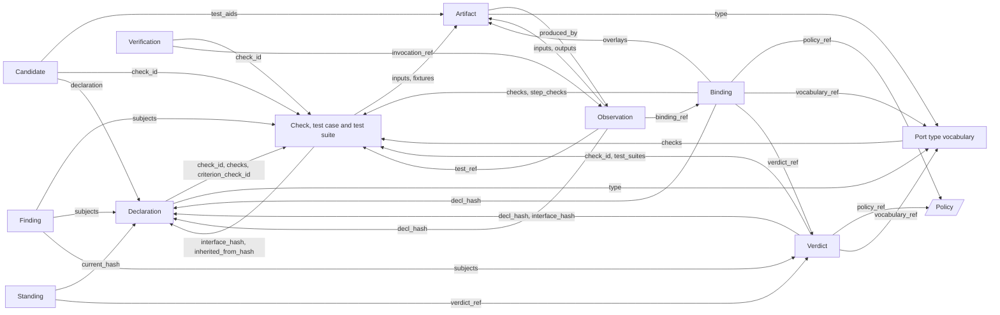

# The core schemas

**Nothing here is approved yet.** Every page in this folder, and the Declaration on its own page, is `draft` or `proposed`, not `v1`. The items below are decisions to have ready for whenever a real review happens. They are not gates blocking anything today. See [the invariants](invariants.md#change) for what `v1` will mean once a page actually reaches it.

## For reviewers

1. **Exception handling adopted:** economical optional failure modes supplement existing contracts; each adds verification cost. Unexpected exceptions use CAPSULE_ERROR, runtime failures keep their infrastructure codes, and Artifact issues carry permitted caveats.
2. **Draft defaults.** Each is a default a reviewer may overturn:
   - (a) The admission core is checked: shape, re-hash, rules, and running the visible suite. Certification, sandbox and source fields are unchecked.
   - (b) `identity.lineage` is optional, and holds no submission id (`builder_ref` was removed).
   - (c) The Verification is one record, written by the gate, with `invocation_ref`. A `dispatch` Observation with no Verification is a call the gate skipped.
   - (d) Names are local to a library; `decl_hash` is global; `identity.namespace` (unchecked) names the publisher.
   - (e) `interface_hash` leaves out `failure_modes`.
3. What v1 does not cover: [Known gaps](#known-gaps-not-in-v1).

## What these pages are

The records that Capability Capsule (CC) tools read and write about capsules. The capsule's own schema, the Declaration, is defined once, on its [own page](../capsule/fields.md) in the capsule folder; it is listed here because every record points at it. Each page gives the fields, what lives in the policy instead, and what it reuses. Start with the [invariants](invariants.md), then [common](common.md) and the [policy](policy.md). The **M1** and **Unlocks** columns are defined on [checked and unchecked at M1](../capsule/stages.md).

## The records

| Record | Id | What it is | Written by |
|---|---|---|---|
| [Common](common.md) | `cc.common.v1` | the envelope and shared shapes; not a record | none |
| [Declaration](../capsule/fields.md) | `cc.declaration.v1` | the contract one capability declares; its hash is its version | its author (checked with the author kit), RSI, an importer or the composer, inside a Candidate |
| [Candidate](candidate.md) | `cc.candidate.v1` | a submission to admission | the submitter: an author, RSI or an importer |
| [Port type vocabulary](port-types.md) | `cc.types.v1` | type names, each with its schema and checks, and every registry check in full | a reviewed change, one record per version |
| [Check, test case, test suite](checks.md) | `cc.check.v1`, `cc.check.case.v1`, `cc.check.suite.v1` | how a promise is tested | checks: in a Declaration, the vocabulary or a Binding; cases and suites: admission only |
| [Verdict](verdict.md) | `cc.verdict.v1` | admission's decision on a Declaration | admission |
| [Standing](standing.md) | `cc.standing.v1` | which version of a name is current | per `state`: admission (`admitted`, `admitted_inactive`), the librarian (every other state) |
| [Binding](binding.md) | `cc.binding.v1` | the pin for one call site of a run | freeze (M03) |
| [Observation](observation.md) | `cc.observation.v1` | one capsule call | runner |
| [Artifact](artifact.md) | `cc.artifact.v1` | one value; every capsule output is one | runner (runs), admission (test inputs and fixtures) |
| [Verification](verification-record.md) | `cc.verification.v1` | the gate's check of one call's live output | gate |
| [Finding](finding.md) | `cc.finding.v1` | an observation about capsules, judges or an unmet need; unchecked in M1 | per kind: selection, gate, librarian, RSI |
| [Policy](policy.md) | `cc.policy.v1` | every rule, default and registry, as a pinned epoch | a reviewed change, one record per epoch |

## How the schemas relate

An arrow from A to B means A points at B; the label is the field. Common is left out. `tools/sync.py` generates this from the field tables; to change an arrow, change the field.

<!-- sync:schema-map -->

<!-- /sync:schema-map -->

## Naming decisions

| Word | Decision |
|---|---|
| `interface_hash` | a capsule's hash without its body, once `contract_hash` |
| admission, gate | *admission* is the library's door, never called a gate. The *gate* checks a call's live output and decides `pass`, `fail` or `blocked` |
| Verdict | admission's record only; the gate writes a Verification |
| step, node | a Binding is for one call site, keyed `step_id`; "node" is prose for it, as in `applies_at: node`. On spans it is `cc.step_id`, because agent-core's `openjiuwen.step.id` is the reasoning-loop step |
| run | `run_id`: one pass of a workflow from request to answer (AI4Research's "sprint") |
| caller | the Observation's `caller` is who asked for a call: a workflow, the gate or admission |
| name, namespace | `identity.name` is local to a library; `decl_hash` is the global identity; `identity.namespace` names the publisher when a capsule moves |

## Approval checklist

- [ ] Every field table: names, types, Req, M1, Unlocks.
- [ ] `decl_hash`, `interface_hash` and `code_sha256` ([Declaration](../capsule/fields.md)).
- [ ] `Check.applies_at`; where a Check is written in full; admission as the only writer of test cases and suites ([Check](checks.md)).
- [ ] Every capsule output is an Artifact; lineage through `produced_by` ([Artifact](artifact.md)).
- [ ] Reason codes and registries; `required`, `rules`, `levels`, `mappings`, epochs and the gates fold ([Policy](policy.md)).
- [ ] The Standing states and their writers ([Standing](standing.md)).
- [ ] INV-1 to INV-19, and the naming decisions.
- [x] Economical optional failure modes and standard error mapping (INV-19); execution evidence remains a downstream obligation.
- [ ] The open questions and known gaps below.

## Open questions

- Model capsules use `kind: skill` or `prompt_section`, not a new `model` kind.
- Sealed suites live in a store only admission can read.

## Known gaps (not in v1)

- A bundle or export record that carries a Declaration, its files, suites and Verdict between stores.
- An issuer identity and signature on a Verdict, so another store can check who admitted what.
- A server-level unit, with its config, for a local stdio MCP server whose tools become capsules.
- A revocation and advisory feed shared across stores.
- A record for submitting a sealed suite to admission.
- A Candidate field naming the epoch it asks to be admitted under.
- A verifiable `Check.author`; today it is self-declared.
- A reader for v1.x records newer than itself; INV-14 refuses unknown fields.
- Automated librarian analysis of effect drift across calls and resulting Standing changes remains deferred. M1 runtime broker/process capture and comparison to pinned permissions/effects are required: the runner writes checked Observation.effects_observed and mandatory raw capture, denies undeclared operations and cannot report ok with unavailable capture. See [permissions](../capsule/permissions.md) and [runtime observability](../system/observability.md).
- A tool, run by the planner or binder, that uses `changes.effects[].idempotent` and `Common.idempotency_key` together to skip re-dispatching a call that already ran with the same inputs. The fields already exist; nothing reads them together yet to make that call. Not scheduled, but it will exist.

`SCHEMA.md` v2.10b stays as the reasoning; where it disagrees with an approved page, the page wins.
