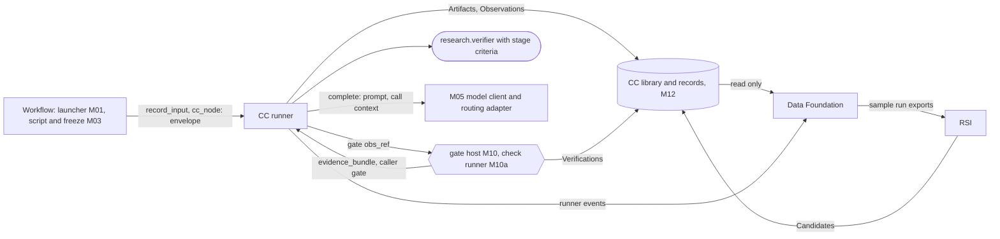

> **Draft, reconciled against the frozen October 2 sources.** Definitions live on the linked owner pages; this index does not duplicate contracts.

# Seams: where each workstream meets Capability Capsule

A **seam** is an API between two modules that different people build. Each seam below says who calls whom, with what datatype, and where that datatype is defined. Both sides build to the seam and to nothing else. So two people, or two coding agents, can build connected modules apart and still get code that works together.

Every datatype named here has exactly one definition, listed in [where every shared datatype is defined](types/types.md#where-every-shared-datatype-is-defined). A seam never redefines one.

## The seams at a glance

| Seam | Caller | Callee | API | Datatypes | Status |
|---|---|---|---|---|---|
| Workflow to runner | M01, the Swarmflow script | runner | `record_input`, `cc_node`, `CcBackend.run` | `intake`; call descriptor; envelope | defined in [runner](capsule/runner.md#swarmflow-backend-talking-to-the-engine) |
| Runner to gate | runner (R1) | M10 | `gate(obs_ref) -> GateResult` | Observation, Verification, the five verdicts | [below](#evaluator-gate-and-verifier) |
| Gate to judge | the gate host (M10) | shared `research.verifier`, through the runner | a `gate` call using pinned stage criteria | `evidence_bundle`, `verifier_assessment` | [below](#evaluator-gate-and-verifier) |
| Check code to check runner | M10a | any check's runner | the check calling convention | `CheckResult` | defined in [checks](schemas/checks.md#calling-convention) |
| Runner to model | runner (R7, R6b) | M05 | `complete(prompt, ...)` | `ModelReply`, call context; a capsule's router is a pinned capsule, not here | [below](#model-routing) |
| Records to Data Foundation | Data Foundation's assembler | M12, runner events | read only | every CC record | [below](#data-foundation) |
| RSI to the library | RSI | admission (M14) | submit a Candidate | Candidate, Verdict, test suites | [below](#rsi) |

## Evaluator Gate and Verifier

Owner: Ramika (Verifier track, PRD 4.2 and [3.V](../product/prd-m1-verifier.txt)). CC supplies the inputs, the check runner and the records. The Verifier owns the judge's rubric and the fold's thresholds.

**Runner to Gate.** The API and fold are defined once on [Gate host](capsule/gate-host.md). One [shared verifier](capsule/gate-capsules.md) consumes [`evidence_bundle`](types/evidence-bundle.md) and returns [`verifier_assessment`](types/verifier-assessment.md). A step pins independent criteria through its Gate profile; the host evaluates deterministic checks and stores the authoritative Verification. [Lifecycle](system/lifecycle.md) prevents release when that save fails.

**What the Verifier owns.** Frozen research criteria, semantic rubric and assessment meaning. The shared verifier body is independent of Builder/RSI mutation. CC owns the host, check ABI and records. The [model-selection proposal](../product/verifier-model-selection-proposal-2026-10-02.md) may substitute an unmodified judge only in the permitted isolated experimental configuration, preserving these contracts and baseline restoration.

**Frozen PRD 4.2** supplies evidence, criteria, routing verdicts and acceptance cases. Durable Verification, reason ownership and explicit human recovery are adopted designs, not unanswered owner questions. The [verification hooks](system/verification.md) distinguish their specified outcomes from downstream runtime results.

## Model Routing

Owner: the Model Routing workstream ([3.X](../product/prd-m1-model-routing.txt); their [design](model_router_design_en.md), and CC's [reply](model-routing/README.md)).

**Who picks what.** The plan selects admitted capabilities; routing selects an approved endpoint for one model request. Production uses static Codex and never invokes the selector. The [routing adapter](model-routing/README.md) supplies exact request/result fields, configuration pins and fallback limits for isolated experiments. It is an ordinary service, not an extra M1 capsule or capability registry.

**How records join.** The bridge attaches its persisted routing decision to the model call's obs_id and route_id; the supervisor owns storage. Static calls record requested/served model identity, with unavailable served identity explicit. Router-off is frozen configuration; experiment switches do not alter capability or library hashes. Resume reuses the recorded decision.

## Data Foundation

Owner: Suraj ([PRD](../product/prd-m1-data-foundation.md), [technical design](data-foundation/capsule-run-records.md)). Data Foundation observes; it never changes a run.

**The seam in one line:** CC's records are the source of truth for every capsule call; Data Foundation's Capsule Run Record is a **view** its assembler builds from them, plus the raw material only Data Foundation captures.

### Settled here, against the run records design

| Design question (its section 10) | Answer | Why |
|---|---|---|
| Q1: which files make up a capsule, and what identifies a version | **`decl_hash`.** The Declaration names every file by hash: code (`carrier` or `body`), each check's `runner`, and each `Port.value_schema`. So `decl_hash` changes whenever any of them changes. `code_sha256` identifies the code alone | one identity for a capsule version across every record (INV-6). A second "hash over all files" would be a copy that could disagree |
| Q2: is each stage's capsule fixed, or does the router select it | **Fixed by the run plan. The planner picks the capsule; the router never does.** `selected_by` is always the plan. A router only picks a model inside a capsule call | CC decides what is done; routing makes it better ([model routing](#model-routing)) |
| Q3: do capsules run through one shared wrapper | **Yes: the CC runner.** Its events (R8) are the live hooks; Data Foundation subscribes to them | every capsule call has an Observation, including calls that never reach the gate |
| Q4: does the gate give per-check results | **Yes:** Verification `results[]`, one per check, with `runner_sha256` and evidence | |
| Q5: native `verify()` or a verifier capsule | **A verifier capsule**, called through the runner | `verify()` returns votes, not per-check results ([B1](archive/b1-design.md#file-level-hooks)) |
| Q10: can a capsule call another, and who owns the record | **Yes, through the broker.** Each call has its own Observation; a nested one names its caller in `causation_id`. The node's record is its `dispatch` Observation | |
| record key | **`obs_id`**, not a Swarmflow `agent_id` | under `CcBackend` an `agent()` call starts no team worker, so no `agent_id` or `member_name` exists. The engine's `call_key` is kept in `ext.runner.engine_call_key` |
| `label` rule | **`label` is the `step_id`.** The call descriptor carries `decl_hash` and input hashes, so the journal re-runs a step when its capsule changes | same effect as `<capsule>@<hash>`, with the version in one place |
| storage | CC records in M12 are the source. `records/records.jsonl`, bundles, scorecard and exports are Data Foundation's derived outputs, rebuildable from M12 plus its raw captures | one writer per record kind (INV-3) |
| prompt as sent | the runner stores every model turn's prompt and reply as content, listed in the Observation's `ext.runner.turns` ([runner](capsule/runner.md#records-the-runner-writes)) | the bundle can be rebuilt byte for byte |
| sample run export, and M1 architecture's M17 fixture export | **one export, owned by Data Foundation.** M17 is retired in its favour | two exports of the same runs would drift |

### Where each run record group comes from

| Run record group | Source of truth | Captured by |
|---|---|---|
| Identity: run, step, attempt, times | Observation `scope.run_id`, Binding `step_id`, `attempt`, `started_at`, `at` | runner |
| Capsule: name, kind, version | Binding `decl_hash`; the Declaration's `identity` | admission, freeze |
| Given and produced | Observation `inputs`, `outputs`; Artifacts by `content_sha256` | runner |
| Lineage | Artifact `produced_by`; Observation `inputs`; nested `causation_id` | runner |
| Model and route | Observation `models`; `ext.runner.turns[].model_hint`, `.model_id`, `.route_record_id`; the router's own records | runner, router |
| Cost | Observation `cost`; the router's token counts | runner, router |
| Gate | Verification results, decision and durable gate_result; judge Observation and required capture | gate host, runner |
| How it stopped, what went wrong | Observation `outcome`, `reason`, `ext.runner.failure_code`, `error_detail` | runner |
| Failure class | **derived, never stored.** `runtime`-owned reason: `infrastructure`. `PORT_MISMATCH`, `PRECONDITION_FAILED`, `PRECONDITION_DEFERRED` or an `input`-owned code: `input`. Other refusals: `infrastructure`. `capsule`-owned reason, or a failing `capsule` check: `capsule`. A `fail` classification in `evaluation_verdict`: `scientific` | Data Foundation's assembler |
| Environment, host, workspaces, traces, tool calls, human answers | acknowledged immutable execution manifests; required capture loss blocks the run | Data Foundation collector; supervisor for human review |
| Declared against observed | required runner/broker/process capture fills Observation.effects_observed and compares against the frozen Declaration/profile before ok; Data Foundation projects evidence | runner; Data Foundation projection |

**Adopted span mapping:** CC records and explicit CC spans identify non-team calls by obs_id; native worker names are optional adapter metadata. The first runtime verifies native display compatibility. Missing native spans do not remove required capture or authoritative records.

## RSI

Owner input: Saurav ([frozen full source](../product/prd-m1-rsi-full.md)). RSI uses an offline library copy. Hidden evaluation has independent oracle custody and unprivileged children; it is distinct from the POC boundary. The [oracle API](capsule/fixture-oracle.md) owns quota, paired comparison and terminal evaluation. Runtime evidence is tracked in [validation obligations](open-issues.md).

| RSI needs | The seam | Defined in |
|---|---|---|
| a parent to improve, and what it may change | the parent's Declaration (`evolution.rsi`, `evolution.may_change`), Verdict and test suites | [fields](capsule/fields.md#evolution-what-rsi-may-change), [checks](schemas/checks.md) |
| real runs to learn from | Data Foundation's sample run exports | [Data Foundation PRD](../product/prd-m1-data-foundation.md) |
| to try a child | private Trial executor shares mandatory visible/parent checks and confined kind handlers under RSI/oracle scope; it does not create a public Candidate or admission Observation before acceptance | [RSI engine](capsule/rsi-engine.md), [scoped model bridge](system/environment.md#model-call-scope-and-private-capture) |
| hidden regression fixtures | submit a private TrialRef under an oracle-issued session; oracle owns hidden split and terminal close/final sequence; public Candidate follows promotable final evidence | [fixture oracle](capsule/fixture-oracle.md) |
| to propose a child to mainline | a Candidate with `submitted_by.kind: rsi` and `lineage.parent_hash`, through mainline admission | [Candidate](schemas/candidate.md), [library](capsule/library.md#admission-the-only-way-in) |

RSI uses the offline [engine API](capsule/rsi-engine.md). It consumes frozen exports, visible dev fixtures and oracle aggregates; submits through admission; and awaits attributable human activation. [Oracle](capsule/fixture-oracle.md), [private storage](system/storage.md) and [deployment](system/deployment.md) own the session, capture and security contracts. Their implementation probes remain explicit validation obligations. No fixture contents or oracle-private comparison data reaches the child/proposer.

## Ingestion

Owner: CC (M01). PRD 3.1.

The launcher reads the input folder and the prompt, builds one [`intake`](types/intake.md) value, and stores it with `record_input(run_id, "intake", vocabulary_ref=..., value=..., origin="human")`. PRD 3.1.4 sends file paths, sizes and times to "the Swarmflow telemetry log": the `intake` value holds paths and sizes, and the Artifact's `at` holds the time.
