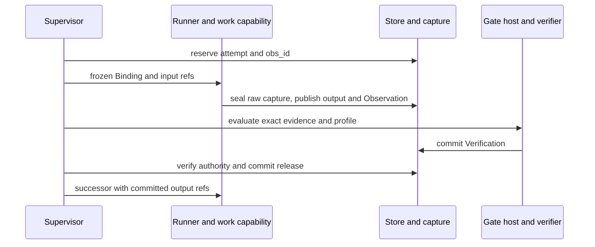

# Research from question to report

## Starting item

A user asks: “Reduce peak attention VRAM by at least 30% relative to this baseline. Do not retrain.” They provision a local repository and validation data under the approved workspace. For this illustrative run, a registered peak-VRAM method and a supported GPU are available; absence of either stops readiness or Hypothesis before code generation. No accuracy target is implied by this example.

The local CLI enters through `cc/adapters/entry.py`. The [launcher](../capsule/toolchain.md#m01-launcher) validates intake, classifies resources and creates source_text using ordinary `cc/research/` helpers. It records immutable Artifacts rather than handing changing host paths to capsules. The run is R1; payloads themselves carry no duplicated run IDs.

## Code and data connections

| Order | Proposed code receiving the item | Contract and next consumer |
|---|---|---|
| 1 | `cc/config.py`, `cc/bootstrap.py`, `cc/doctor.py` | Effective config, image/security/model readiness. Failed mandatory probes mean no research dispatch |
| 2 | `cc/launcher/`, `cc/freeze.py` | Fixed run_plan, admitted library snapshot, intake and source_text. Publish all Bindings before engine invocation |
| 3 | `cc/adapters/swarmflow.py`, `plan_script.py` | Wrap upstream run_workflow with CcBackend. cc_node sends a frozen descriptor to `cc/runner/client.py` |
| 4 | `capsules/research.compile_brief/` | intake + source_text → research_brief, with explicit relative-percent target and source grounding |
| 5 | `capsules/research.search_ideas/` | research_brief + intake → idea_set. `cc/runner/broker.py` mediates op.scholarly_search, op.local_search and op.codesearch; exact bounded outputs/evidence return to Search |
| 6 | `capsules/research.select_opportunity/` | idea_set + research_brief → opportunity_card. Local ranking preserves losing/filtered candidates |
| 7 | `capsules/research.form_hypothesis/` | card + Brief + intake → hypothesis_blueprint. Freeze method, resources, seed, repeats and predicates before generation |
| 8 | `capsules/research.build_poc/` | blueprint + Brief + intake → poc_bundle, with patch/harness and syntax evidence |
| 9 | `capsules/research.run_benchmark/` | poc_bundle + blueprint → benchmark_payload through confined POC and trusted measurement services |
| 10 | `capsules/research.evaluate_results/` | benchmark_payload + blueprint + Brief → evaluation_verdict, without changing thresholds |
| 11 | `capsules/research.write_report/` | Verdict, benchmark, Brief, idea_set, card, blueprint and authorized StageContext → research_report |
| 12 | Ordinary publisher in `cc/research/` | Mechanically verify and atomically publish report/POC files and output manifest; only durable publication completes R1 |

Exact port names and profile references are owned by the [production plan](../m1/pipeline.md). Upstream engine symbols and adapter responsibilities are owned by [integration](../system/integration.md). The shared `research.verifier` is additional semantic Gate work, not a ninth research stage.

## What every research handoff does

Supervisor reserves the call identity before effects. Runner executes the exact pinned capability, returning capture/output/Observation commit requests to the supervisor-owned store. Skill model turns go through the protected bridge; tool children cannot inherit credentials. The Gate checks the committed Observation and output, invoking the shared verifier only for applicable semantic criteria.

For Screening, for example: O-screen-1 names its Binding and input Artifacts; the card Artifact is derived from that reserved identity; V-screen-1 verifies O-screen-1; the release record names exactly that dispatch, attempt, Observation and Verification. Hypothesis starts only after the supervisor commits and rereads the release. Every other research edge follows the same sequence.

## Ending and alternate ending

The example [science story](04-scientific-execution.md) observes a 35% reduction against a 40% claim. The pre-registered default makes that scientific INCONCLUSIVE even though the 30% user target is met. Valid science still reaches a truthful report after infrastructure Gates pass.

If Search evidence is unavailable, Screening has no eligible candidate, or a required save fails, the first affected boundary halts R1. No downstream capsule receives a fabricated payload. Local views read the same durable halt; [recovery](03-durable-recovery.md) requires explicit operator action.
