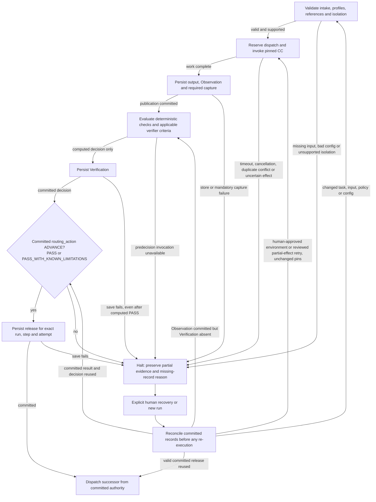

# Information flow: full and filtered views

These graphs show **logical information dependencies**, not unrestricted direct process access or a temporal scheduler. Payload arrows resolve immutable references through authorized runner/host interfaces. Every work result is persisted and accepted before any consumer may run. [Today's overview](overall-draft.md) explains placement; this page expands the actual bindings.

## What is complete here, and what is a filter?

- All eight work CCs, their **23 required production input bindings** (18 inter-stage joins plus five launcher inputs), all three nested retrieval CCs, and the shared verifier are included. These binding edges are generated directly from the owning pipeline fixture; changing that plan makes the projection stale.
- Optional IntentIR and authorized Report StageContext are drawn separately. They are not invented extra required run-plan ports.
- Intake resources enter through requalification/snapshot/extraction, not arbitrary host paths. External scholarly retrieval enters only through its broker; model results enter through the protected bridge.
- Report publication, sealed benchmark export and authorized downloads leave through public manifests. Hidden oracle inputs/answers and model credentials never enter those exports. RSI proposal prompts/replies and session evidence stay in private controller custody; the public store arrow represents public run capture, not those private records.
- The full view includes capture-derived UI/telemetry/Data Foundation views and offline RSI. Filtered views hide their branches only; hiding observability never disables required capture, and hiding RSI never removes its M1 acceptance requirement.
- [Isolated planner placement](overall-draft.md#2-whole-application-alternate-tracks-and-authority) remains a separate overlay: allowed plans can differ, so the fixed production wiring below must not be presented as a universal experimental DAG.
- Scope is every capsule and system-level information boundary, not every internal helper/file or every record field. Exact schemas, authorized mounts, settings and private session evidence remain on their owning pages.

## 1. Full: research, evidence views and offline RSI

```mermaid
flowchart TB
    USER["Researcher: question and declared local resources"]
    HAR["External harness: intake proposal and config_ref"]
    IN["Entry: validate, snapshot, extract source_text"]
    POLICY["Configuration, policy, schemas and admitted library pins"]
    VALID["Validate fixed production plan, then freeze Bindings"]
    CTRL["Supervisor and runner: dispatch, resolve refs, enforce quotas"]
    GATE["Gate host and CC: research.verifier"]
    STORE["Canonical store: required evidence and committed records"]
    MODEL["Protected bridge and Codex: authorized prompt and reply captures"]
    LOCAL["CC: op.local_search"]
    SCHOLAR["CC: op.scholarly_search"]
    CODE["CC: op.codesearch"]
    WEB["arXiv and Semantic Scholar: bounded retrieval"]
    MEASURE["Confined baseline/treatment and trusted measurement"]
    CONTEXT["Authorized StageContext: committed evidence references"]
    PUB["Publisher: validate report and commit directory manifest"]
    EXPORT["Export/retrieval: sealed manifest members and correlated evidence"]
    HALT["Halt: retained evidence and explicit human recovery"]
    subgraph WORK["Eight fixed production work CCs: logical input bindings"]
        P0["CC: research.compile_brief"]
        P1["CC: research.search_ideas"]
        P2["CC: research.select_opportunity"]
        P3["CC: research.form_hypothesis"]
        P4["CC: research.build_poc"]
        P5["CC: research.run_benchmark"]
        P6["CC: research.evaluate_results"]
        P7["CC: research.write_report"]
    end
    USER -->|"question and provisioned resource locators"| IN
    HAR -->|"authenticated task, config, seed and request identity"| IN
    IN -->|"committed intake identity"| VALID
    POLICY -->|"exact versions, policy and permitted config"| VALID
    VALID -->|"committed valid plan and frozen Bindings"| CTRL
    CTRL -->|"reserved invocation through admitted ports"| WORK
    IN -->|"intake to intake"| P0
    IN -->|"source_text to source_text"| P0
    P0 -->|"research_brief to research_brief"| P1
    IN -->|"intake to intake"| P1
    P1 -->|"idea_set to idea_set"| P2
    P0 -->|"research_brief to research_brief"| P2
    P2 -->|"opportunity_card to opportunity_card"| P3
    P0 -->|"research_brief to research_brief"| P3
    IN -->|"intake to intake"| P3
    P3 -->|"hypothesis_blueprint to hypothesis_blueprint"| P4
    P0 -->|"research_brief to research_brief"| P4
    IN -->|"intake to intake"| P4
    P4 -->|"poc_bundle to poc_bundle"| P5
    P3 -->|"hypothesis_blueprint to hypothesis_blueprint"| P5
    P5 -->|"benchmark_payload to benchmark_payload"| P6
    P3 -->|"hypothesis_blueprint to hypothesis_blueprint"| P6
    P0 -->|"research_brief to research_brief"| P6
    P6 -->|"evaluation_verdict to evaluation_verdict"| P7
    P5 -->|"benchmark_payload to benchmark_payload"| P7
    P0 -->|"research_brief to research_brief"| P7
    P1 -->|"idea_set to idea_set"| P7
    P2 -->|"opportunity_card to opportunity_card"| P7
    P3 -->|"hypothesis_blueprint to hypothesis_blueprint"| P7
    IN -.->|"optional deterministic intent_ir hints"| P0
    P1 -->|"query, documents and top_k: each query"| LOCAL
    LOCAL -->|"search_hits: verbatim passages"| P1
    P1 -->|"query and top_k: each query"| SCHOLAR
    SCHOLAR -->|"search_hits: paper abstracts"| P1
    SCHOLAR -->|"approved broker requests"| WEB
    WEB -->|"paper metadata and abstracts"| SCHOLAR
    P4 -->|"query, repository snapshot and top_k"| CODE
    CODE -->|"code_hits: verified source ranges"| P4
    P5 -->|"frozen protocol, POC bundle and resource pins"| MEASURE
    MEASURE -->|"trusted samples, logs and raw evidence refs"| P5
    CONTEXT -->|"authorized StageContext, not a capsule port"| P7
    STORE -->|"committed permitted evidence only"| CONTEXT
    CTRL -->|"authorized model requests: work or verifier"| MODEL
    MODEL -->|"captured result or typed failure"| CTRL
    CTRL -->|"work output and required capture publication"| STORE
    CTRL -->|"committed evidence_bundle and pinned gate profile"| GATE
    GATE -->|"Verification publication via supervisor writer"| STORE
    STORE -->|"committed Verification and release replay"| CTRL
    CTRL -->|"persist release before successor dispatch"| STORE
    CTRL -->|"failure, nonpass or uncertain effect"| HALT
    HALT -.->|"explicit recovery reuses committed results or records new attempt"| CTRL
    P7 -->|"research_report after committed acceptance"| PUB
    P4 -->|"poc_bundle_ref"| PUB
    P5 -->|"benchmark_payload_ref"| PUB
    CONTEXT -->|"stage_context_ref"| PUB
    CTRL -->|"report release, authorized destination_ref and request_id"| PUB
    PUB -->|"atomic manifest publication through store"| STORE
    STORE -->|"sealed public evidence snapshot"| EXPORT
    EXPORT -->|"report and authorized artifact retrieval"| USER
    EXPORT -->|"benchmark_export and manifest-scoped downloads"| HAR
    VIEWS["Derived Data Foundation, telemetry and local progress views"]
    STORE -.->|"lossless committed evidence: assemble, never rewrite"| VIEWS
    CTRL -.->|"progress notifications: not release authority"| VIEWS
    VIEWS -.->|"display and diagnostics"| USER
    RSI["CONDITIONAL session: required offline RSI"]
    ORACLE["Private fixture oracle: inputs/answers stay protected"]
    ADMIT["Admission: integrity plus tested or Puppet provider"]
    ACT["Explicit human activation for future snapshots"]
    USER -.->|"offline target/session request"| RSI
    POLICY -->|"frozen parent, suites and mutation policy"| RSI
    RSI -->|"private trial refs and reserved query"| ORACLE
    RSI -->|"authorized private proposal prompt"| MODEL
    MODEL -->|"private captured proposal, no hidden cases"| RSI
    ORACLE -->|"aggregate comparison and final evidence only"| RSI
    RSI -->|"eligible public Candidate, no hidden cases"| ADMIT
    USER -->|"developer-authored Candidate or allowlist"| ADMIT
    ADMIT -->|"admitted inactive RSI version"| ACT
    USER -->|"explicit activation command"| ACT
    ACT -->|"new future library snapshot, never active Binding"| POLICY
    classDef cc fill:#E4F2F5,stroke:#087E8B,color:#172D45;
    classDef optional fill:#FFF4DC,stroke:#A87B24,stroke-dasharray:5 4,color:#172D45;
    class P0,P1,P2,P3,P4,P5,P6,P7,LOCAL,SCHOLAR,CODE,GATE cc;
    class RSI optional;
```

<!-- generated:information-full -->

<!-- /generated:information-full -->

## 2. Observability hidden: preserve required evidence and RSI

Only derived displays/telemetry/assembler edges disappear. Canonical raw capture and durable decision/release records remain, because they are execution authority rather than optional logging.

```mermaid
flowchart TB
    USER["Researcher: question and declared local resources"]
    HAR["External harness: intake proposal and config_ref"]
    IN["Entry: validate, snapshot, extract source_text"]
    POLICY["Configuration, policy, schemas and admitted library pins"]
    VALID["Validate fixed production plan, then freeze Bindings"]
    CTRL["Supervisor and runner: dispatch, resolve refs, enforce quotas"]
    GATE["Gate host and CC: research.verifier"]
    STORE["Canonical store: required evidence and committed records"]
    MODEL["Protected bridge and Codex: authorized prompt and reply captures"]
    LOCAL["CC: op.local_search"]
    SCHOLAR["CC: op.scholarly_search"]
    CODE["CC: op.codesearch"]
    WEB["arXiv and Semantic Scholar: bounded retrieval"]
    MEASURE["Confined baseline/treatment and trusted measurement"]
    CONTEXT["Authorized StageContext: committed evidence references"]
    PUB["Publisher: validate report and commit directory manifest"]
    EXPORT["Export/retrieval: sealed manifest members and correlated evidence"]
    HALT["Halt: retained evidence and explicit human recovery"]
    subgraph WORK["Eight fixed production work CCs: logical input bindings"]
        P0["CC: research.compile_brief"]
        P1["CC: research.search_ideas"]
        P2["CC: research.select_opportunity"]
        P3["CC: research.form_hypothesis"]
        P4["CC: research.build_poc"]
        P5["CC: research.run_benchmark"]
        P6["CC: research.evaluate_results"]
        P7["CC: research.write_report"]
    end
    USER -->|"question and provisioned resource locators"| IN
    HAR -->|"authenticated task, config, seed and request identity"| IN
    IN -->|"committed intake identity"| VALID
    POLICY -->|"exact versions, policy and permitted config"| VALID
    VALID -->|"committed valid plan and frozen Bindings"| CTRL
    CTRL -->|"reserved invocation through admitted ports"| WORK
    IN -->|"intake to intake"| P0
    IN -->|"source_text to source_text"| P0
    P0 -->|"research_brief to research_brief"| P1
    IN -->|"intake to intake"| P1
    P1 -->|"idea_set to idea_set"| P2
    P0 -->|"research_brief to research_brief"| P2
    P2 -->|"opportunity_card to opportunity_card"| P3
    P0 -->|"research_brief to research_brief"| P3
    IN -->|"intake to intake"| P3
    P3 -->|"hypothesis_blueprint to hypothesis_blueprint"| P4
    P0 -->|"research_brief to research_brief"| P4
    IN -->|"intake to intake"| P4
    P4 -->|"poc_bundle to poc_bundle"| P5
    P3 -->|"hypothesis_blueprint to hypothesis_blueprint"| P5
    P5 -->|"benchmark_payload to benchmark_payload"| P6
    P3 -->|"hypothesis_blueprint to hypothesis_blueprint"| P6
    P0 -->|"research_brief to research_brief"| P6
    P6 -->|"evaluation_verdict to evaluation_verdict"| P7
    P5 -->|"benchmark_payload to benchmark_payload"| P7
    P0 -->|"research_brief to research_brief"| P7
    P1 -->|"idea_set to idea_set"| P7
    P2 -->|"opportunity_card to opportunity_card"| P7
    P3 -->|"hypothesis_blueprint to hypothesis_blueprint"| P7
    IN -.->|"optional deterministic intent_ir hints"| P0
    P1 -->|"query, documents and top_k: each query"| LOCAL
    LOCAL -->|"search_hits: verbatim passages"| P1
    P1 -->|"query and top_k: each query"| SCHOLAR
    SCHOLAR -->|"search_hits: paper abstracts"| P1
    SCHOLAR -->|"approved broker requests"| WEB
    WEB -->|"paper metadata and abstracts"| SCHOLAR
    P4 -->|"query, repository snapshot and top_k"| CODE
    CODE -->|"code_hits: verified source ranges"| P4
    P5 -->|"frozen protocol, POC bundle and resource pins"| MEASURE
    MEASURE -->|"trusted samples, logs and raw evidence refs"| P5
    CONTEXT -->|"authorized StageContext, not a capsule port"| P7
    STORE -->|"committed permitted evidence only"| CONTEXT
    CTRL -->|"authorized model requests: work or verifier"| MODEL
    MODEL -->|"captured result or typed failure"| CTRL
    CTRL -->|"work output and required capture publication"| STORE
    CTRL -->|"committed evidence_bundle and pinned gate profile"| GATE
    GATE -->|"Verification publication via supervisor writer"| STORE
    STORE -->|"committed Verification and release replay"| CTRL
    CTRL -->|"persist release before successor dispatch"| STORE
    CTRL -->|"failure, nonpass or uncertain effect"| HALT
    HALT -.->|"explicit recovery reuses committed results or records new attempt"| CTRL
    P7 -->|"research_report after committed acceptance"| PUB
    P4 -->|"poc_bundle_ref"| PUB
    P5 -->|"benchmark_payload_ref"| PUB
    CONTEXT -->|"stage_context_ref"| PUB
    CTRL -->|"report release, authorized destination_ref and request_id"| PUB
    PUB -->|"atomic manifest publication through store"| STORE
    STORE -->|"sealed public evidence snapshot"| EXPORT
    EXPORT -->|"report and authorized artifact retrieval"| USER
    EXPORT -->|"benchmark_export and manifest-scoped downloads"| HAR
    RSI["CONDITIONAL session: required offline RSI"]
    ORACLE["Private fixture oracle: inputs/answers stay protected"]
    ADMIT["Admission: integrity plus tested or Puppet provider"]
    ACT["Explicit human activation for future snapshots"]
    USER -.->|"offline target/session request"| RSI
    POLICY -->|"frozen parent, suites and mutation policy"| RSI
    RSI -->|"private trial refs and reserved query"| ORACLE
    RSI -->|"authorized private proposal prompt"| MODEL
    MODEL -->|"private captured proposal, no hidden cases"| RSI
    ORACLE -->|"aggregate comparison and final evidence only"| RSI
    RSI -->|"eligible public Candidate, no hidden cases"| ADMIT
    USER -->|"developer-authored Candidate or allowlist"| ADMIT
    ADMIT -->|"admitted inactive RSI version"| ACT
    USER -->|"explicit activation command"| ACT
    ACT -->|"new future library snapshot, never active Binding"| POLICY
    classDef cc fill:#E4F2F5,stroke:#087E8B,color:#172D45;
    classDef optional fill:#FFF4DC,stroke:#A87B24,stroke-dasharray:5 4,color:#172D45;
    class P0,P1,P2,P3,P4,P5,P6,P7,LOCAL,SCHOLAR,CODE,GATE cc;
    class RSI optional;
```

<!-- generated:information-no-observability -->

<!-- /generated:information-no-observability -->

## 3. RSI hidden: production with evidence views

Candidate/oracle/admission/activation detail disappears. The pinned admitted library remains a production prerequisite. The library can also receive normal developer-authored candidates through the owning admission API.

```mermaid
flowchart TB
    USER["Researcher: question and declared local resources"]
    HAR["External harness: intake proposal and config_ref"]
    IN["Entry: validate, snapshot, extract source_text"]
    POLICY["Configuration, policy, schemas and admitted library pins"]
    VALID["Validate fixed production plan, then freeze Bindings"]
    CTRL["Supervisor and runner: dispatch, resolve refs, enforce quotas"]
    GATE["Gate host and CC: research.verifier"]
    STORE["Canonical store: required evidence and committed records"]
    MODEL["Protected bridge and Codex: authorized prompt and reply captures"]
    LOCAL["CC: op.local_search"]
    SCHOLAR["CC: op.scholarly_search"]
    CODE["CC: op.codesearch"]
    WEB["arXiv and Semantic Scholar: bounded retrieval"]
    MEASURE["Confined baseline/treatment and trusted measurement"]
    CONTEXT["Authorized StageContext: committed evidence references"]
    PUB["Publisher: validate report and commit directory manifest"]
    EXPORT["Export/retrieval: sealed manifest members and correlated evidence"]
    HALT["Halt: retained evidence and explicit human recovery"]
    subgraph WORK["Eight fixed production work CCs: logical input bindings"]
        P0["CC: research.compile_brief"]
        P1["CC: research.search_ideas"]
        P2["CC: research.select_opportunity"]
        P3["CC: research.form_hypothesis"]
        P4["CC: research.build_poc"]
        P5["CC: research.run_benchmark"]
        P6["CC: research.evaluate_results"]
        P7["CC: research.write_report"]
    end
    USER -->|"question and provisioned resource locators"| IN
    HAR -->|"authenticated task, config, seed and request identity"| IN
    IN -->|"committed intake identity"| VALID
    POLICY -->|"exact versions, policy and permitted config"| VALID
    VALID -->|"committed valid plan and frozen Bindings"| CTRL
    CTRL -->|"reserved invocation through admitted ports"| WORK
    IN -->|"intake to intake"| P0
    IN -->|"source_text to source_text"| P0
    P0 -->|"research_brief to research_brief"| P1
    IN -->|"intake to intake"| P1
    P1 -->|"idea_set to idea_set"| P2
    P0 -->|"research_brief to research_brief"| P2
    P2 -->|"opportunity_card to opportunity_card"| P3
    P0 -->|"research_brief to research_brief"| P3
    IN -->|"intake to intake"| P3
    P3 -->|"hypothesis_blueprint to hypothesis_blueprint"| P4
    P0 -->|"research_brief to research_brief"| P4
    IN -->|"intake to intake"| P4
    P4 -->|"poc_bundle to poc_bundle"| P5
    P3 -->|"hypothesis_blueprint to hypothesis_blueprint"| P5
    P5 -->|"benchmark_payload to benchmark_payload"| P6
    P3 -->|"hypothesis_blueprint to hypothesis_blueprint"| P6
    P0 -->|"research_brief to research_brief"| P6
    P6 -->|"evaluation_verdict to evaluation_verdict"| P7
    P5 -->|"benchmark_payload to benchmark_payload"| P7
    P0 -->|"research_brief to research_brief"| P7
    P1 -->|"idea_set to idea_set"| P7
    P2 -->|"opportunity_card to opportunity_card"| P7
    P3 -->|"hypothesis_blueprint to hypothesis_blueprint"| P7
    IN -.->|"optional deterministic intent_ir hints"| P0
    P1 -->|"query, documents and top_k: each query"| LOCAL
    LOCAL -->|"search_hits: verbatim passages"| P1
    P1 -->|"query and top_k: each query"| SCHOLAR
    SCHOLAR -->|"search_hits: paper abstracts"| P1
    SCHOLAR -->|"approved broker requests"| WEB
    WEB -->|"paper metadata and abstracts"| SCHOLAR
    P4 -->|"query, repository snapshot and top_k"| CODE
    CODE -->|"code_hits: verified source ranges"| P4
    P5 -->|"frozen protocol, POC bundle and resource pins"| MEASURE
    MEASURE -->|"trusted samples, logs and raw evidence refs"| P5
    CONTEXT -->|"authorized StageContext, not a capsule port"| P7
    STORE -->|"committed permitted evidence only"| CONTEXT
    CTRL -->|"authorized model requests: work or verifier"| MODEL
    MODEL -->|"captured result or typed failure"| CTRL
    CTRL -->|"work output and required capture publication"| STORE
    CTRL -->|"committed evidence_bundle and pinned gate profile"| GATE
    GATE -->|"Verification publication via supervisor writer"| STORE
    STORE -->|"committed Verification and release replay"| CTRL
    CTRL -->|"persist release before successor dispatch"| STORE
    CTRL -->|"failure, nonpass or uncertain effect"| HALT
    HALT -.->|"explicit recovery reuses committed results or records new attempt"| CTRL
    P7 -->|"research_report after committed acceptance"| PUB
    P4 -->|"poc_bundle_ref"| PUB
    P5 -->|"benchmark_payload_ref"| PUB
    CONTEXT -->|"stage_context_ref"| PUB
    CTRL -->|"report release, authorized destination_ref and request_id"| PUB
    PUB -->|"atomic manifest publication through store"| STORE
    STORE -->|"sealed public evidence snapshot"| EXPORT
    EXPORT -->|"report and authorized artifact retrieval"| USER
    EXPORT -->|"benchmark_export and manifest-scoped downloads"| HAR
    VIEWS["Derived Data Foundation, telemetry and local progress views"]
    STORE -.->|"lossless committed evidence: assemble, never rewrite"| VIEWS
    CTRL -.->|"progress notifications: not release authority"| VIEWS
    VIEWS -.->|"display and diagnostics"| USER
    classDef cc fill:#E4F2F5,stroke:#087E8B,color:#172D45;
    classDef optional fill:#FFF4DC,stroke:#A87B24,stroke-dasharray:5 4,color:#172D45;
    class P0,P1,P2,P3,P4,P5,P6,P7,LOCAL,SCHOLAR,CODE,GATE cc;
```

<!-- generated:information-no-rsi -->

<!-- /generated:information-no-rsi -->

## 4. Core: both overlays hidden

Use this for the research data path and its acceptance/I/O boundaries. It is still the same architecture; this filter is not a reduced release scope.

```mermaid
flowchart TB
    USER["Researcher: question and declared local resources"]
    HAR["External harness: intake proposal and config_ref"]
    IN["Entry: validate, snapshot, extract source_text"]
    POLICY["Configuration, policy, schemas and admitted library pins"]
    VALID["Validate fixed production plan, then freeze Bindings"]
    CTRL["Supervisor and runner: dispatch, resolve refs, enforce quotas"]
    GATE["Gate host and CC: research.verifier"]
    STORE["Canonical store: required evidence and committed records"]
    MODEL["Protected bridge and Codex: authorized prompt and reply captures"]
    LOCAL["CC: op.local_search"]
    SCHOLAR["CC: op.scholarly_search"]
    CODE["CC: op.codesearch"]
    WEB["arXiv and Semantic Scholar: bounded retrieval"]
    MEASURE["Confined baseline/treatment and trusted measurement"]
    CONTEXT["Authorized StageContext: committed evidence references"]
    PUB["Publisher: validate report and commit directory manifest"]
    EXPORT["Export/retrieval: sealed manifest members and correlated evidence"]
    HALT["Halt: retained evidence and explicit human recovery"]
    subgraph WORK["Eight fixed production work CCs: logical input bindings"]
        P0["CC: research.compile_brief"]
        P1["CC: research.search_ideas"]
        P2["CC: research.select_opportunity"]
        P3["CC: research.form_hypothesis"]
        P4["CC: research.build_poc"]
        P5["CC: research.run_benchmark"]
        P6["CC: research.evaluate_results"]
        P7["CC: research.write_report"]
    end
    USER -->|"question and provisioned resource locators"| IN
    HAR -->|"authenticated task, config, seed and request identity"| IN
    IN -->|"committed intake identity"| VALID
    POLICY -->|"exact versions, policy and permitted config"| VALID
    VALID -->|"committed valid plan and frozen Bindings"| CTRL
    CTRL -->|"reserved invocation through admitted ports"| WORK
    IN -->|"intake to intake"| P0
    IN -->|"source_text to source_text"| P0
    P0 -->|"research_brief to research_brief"| P1
    IN -->|"intake to intake"| P1
    P1 -->|"idea_set to idea_set"| P2
    P0 -->|"research_brief to research_brief"| P2
    P2 -->|"opportunity_card to opportunity_card"| P3
    P0 -->|"research_brief to research_brief"| P3
    IN -->|"intake to intake"| P3
    P3 -->|"hypothesis_blueprint to hypothesis_blueprint"| P4
    P0 -->|"research_brief to research_brief"| P4
    IN -->|"intake to intake"| P4
    P4 -->|"poc_bundle to poc_bundle"| P5
    P3 -->|"hypothesis_blueprint to hypothesis_blueprint"| P5
    P5 -->|"benchmark_payload to benchmark_payload"| P6
    P3 -->|"hypothesis_blueprint to hypothesis_blueprint"| P6
    P0 -->|"research_brief to research_brief"| P6
    P6 -->|"evaluation_verdict to evaluation_verdict"| P7
    P5 -->|"benchmark_payload to benchmark_payload"| P7
    P0 -->|"research_brief to research_brief"| P7
    P1 -->|"idea_set to idea_set"| P7
    P2 -->|"opportunity_card to opportunity_card"| P7
    P3 -->|"hypothesis_blueprint to hypothesis_blueprint"| P7
    IN -.->|"optional deterministic intent_ir hints"| P0
    P1 -->|"query, documents and top_k: each query"| LOCAL
    LOCAL -->|"search_hits: verbatim passages"| P1
    P1 -->|"query and top_k: each query"| SCHOLAR
    SCHOLAR -->|"search_hits: paper abstracts"| P1
    SCHOLAR -->|"approved broker requests"| WEB
    WEB -->|"paper metadata and abstracts"| SCHOLAR
    P4 -->|"query, repository snapshot and top_k"| CODE
    CODE -->|"code_hits: verified source ranges"| P4
    P5 -->|"frozen protocol, POC bundle and resource pins"| MEASURE
    MEASURE -->|"trusted samples, logs and raw evidence refs"| P5
    CONTEXT -->|"authorized StageContext, not a capsule port"| P7
    STORE -->|"committed permitted evidence only"| CONTEXT
    CTRL -->|"authorized model requests: work or verifier"| MODEL
    MODEL -->|"captured result or typed failure"| CTRL
    CTRL -->|"work output and required capture publication"| STORE
    CTRL -->|"committed evidence_bundle and pinned gate profile"| GATE
    GATE -->|"Verification publication via supervisor writer"| STORE
    STORE -->|"committed Verification and release replay"| CTRL
    CTRL -->|"persist release before successor dispatch"| STORE
    CTRL -->|"failure, nonpass or uncertain effect"| HALT
    HALT -.->|"explicit recovery reuses committed results or records new attempt"| CTRL
    P7 -->|"research_report after committed acceptance"| PUB
    P4 -->|"poc_bundle_ref"| PUB
    P5 -->|"benchmark_payload_ref"| PUB
    CONTEXT -->|"stage_context_ref"| PUB
    CTRL -->|"report release, authorized destination_ref and request_id"| PUB
    PUB -->|"atomic manifest publication through store"| STORE
    STORE -->|"sealed public evidence snapshot"| EXPORT
    EXPORT -->|"report and authorized artifact retrieval"| USER
    EXPORT -->|"benchmark_export and manifest-scoped downloads"| HAR
    classDef cc fill:#E4F2F5,stroke:#087E8B,color:#172D45;
    classDef optional fill:#FFF4DC,stroke:#A87B24,stroke-dasharray:5 4,color:#172D45;
    class P0,P1,P2,P3,P4,P5,P6,P7,LOCAL,SCHOLAR,CODE,GATE cc;
```

<!-- generated:information-core -->

<!-- /generated:information-core -->

## 5. Failure and recovery: which data authorizes the next step?

An existing committed release is replayed without rerunning the work or Gate. If a committed Observation exists but its Verification is absent, recovery evaluates the Gate on that Observation; the shorthand graph's reuse arrow applies only to a committed decision. New-run recovery allocates a new run identity; input/setting changes cannot silently alter the old one. Scientific FAIL/INCONCLUSIVE/preregistered conditional outcomes can continue when their infrastructure Gate passes. No eligible opportunity, invalid evidence, unsupported environment or failed durable write halts the affected path. An uncertain effect is not automatically retried.

## How to read the deeper design

- A CC's responsibility and exact inputs/outputs: [capability guides](../m1/capability-designs.md), [pipeline table](../m1/pipeline.md) and [owning type index](../types/types.md).
- Who writes/authorizes/restarts: [records](records.md), [storage](storage.md), [lifecycle](lifecycle.md), [Gate host](../capsule/gate-host.md).
- External/private access: [deployment](deployment.md), [model auth](model-auth.md), [oracle](../capsule/fixture-oracle.md), [benchmark API](benchmark-export.md).
- Expected boundary failures and actual evidence limits: [verification](verification.md), [stories](../stories/README.md), [validation obligations](../open-issues.md).

The filtered graphs are generated from one projection definition, following [C4's views at different detail levels](https://c4model.com/diagrams) and the typed-component pattern in [Kubeflow](https://www.kubeflow.org/docs/components/pipelines/reference/component-spec/). This is a documentation method, not a new runtime dependency.
