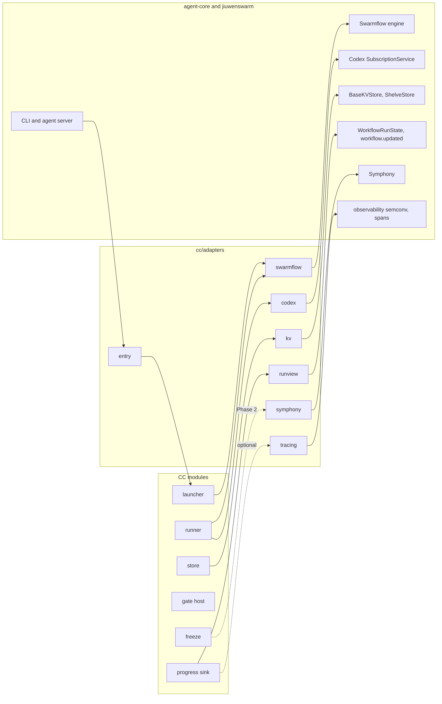

****
> **Draft, reopened for the frozen October 2 scope.** Every place CC code meets existing code. Each row fixes an adapter boundary; runtime verification remains downstream.

# Integration: where CC code meets existing code

**Citations.** AC is agent-core at `9e339019`, jiuwenswarm's dependency pin; paths start `openjiuwen/`. JS is jiuwenswarm at `6cc05c36b`; paths start `jiuwenswarm/`. Rows distinguish verified source entrypoints from new adapter behavior. Runtime integration probes remain validation obligations, not undefined architecture.

The [October 5 pinned-source audit](reuse-audit-2026-10-05.md) records native retries, cache bypass, flush/rename limitations, shared Codex service custody, Leader limits and CodeSearch execution controls. These source mechanisms require the described adapters and probes; native behavior is not automatically CC authority.

## Centralised communication

Rechecked additions: the native human_session and backend session quartet at AC openjiuwen/agent_teams/workflow/engine/primitives.py and engine/backends/base.py map through cc.adapters.local_session, as specified by [lifecycle](lifecycle.md#human-review-and-recovery). OpenJiuwen CodeSearch's model-free BM25Retriever/build_index/search_ast_nodes at deepsearch ff243bca4ab409116476587dcb106cf526581804 map through cc.adapters.codesearch, as specified by [CodeSearch](../m1/op-codesearch.md). These rows establish adapter scope; terminal execution and package import acceptance are still unrun.

Three rules keep every author on the same wires:

1. **Only `cc/adapters/` imports agent-core or jiuwenswarm.** There is one adapter per existing system, each with the small API below. No other CC module imports `openjiuwen` or `jiuwenswarm`. This is checked once code exists (proposed lint `adapters_only`).
2. **Inside CC, modules use published public APIs, the record store and the event bus.** No CC module calls another module's internals. The [module/process map](modules.md) names allowed calls; [lifecycle](lifecycle.md) owns service IPC.
3. **A new connection to existing code is a new row on this page first, then code.** An author who needs something not listed adds the row (with its citation) through [the change order](../PROCESS.md#the-order-for-changing-anything), never a private import.

## The adapters

### `swarmflow`: run a plan, be the backend

**Adapter API:** `start_run(run_id, args, *, journal_path) -> dict` (calls `run_workflow` with the generic script, `CcBackend` and the progress forwarder; re-raises `CcHalt`); `CcBackend` (the `AgentBackend`); `cc_node(args, step_id, **refs) -> envelope`; `ENVELOPE_SCHEMA`; the generic script `plan_script.py`.

| Existing symbol | Where | What CC does with it | M1 |
|---|---|---|---|
| `run_workflow(path, *, args, backend, resume, journal_path, progress_sink, run_id, ...)` | AC `agent_teams/workflow/engine/runner.py:294` (`args` :297, `backend` :298, `resume` :299, `journal_path` :300, `progress_sink` :305, `run_id` :311) | the launcher calls it directly with the [generic script](nodes.md#generic-workflow-adapter), `CcBackend`, the run's journal and the progress sink | used |
| `AgentBackend.run(prompt, opts, schema_json, *, call_key) -> AgentResult` | AC `agent_teams/workflow/engine/backends/base.py:118` (class :39; `AgentResult` :22) | `CcBackend` implements it ([runner](../capsule/runner.md#swarmflow-backend-talking-to-the-engine)) | used |
| `agent(prompt, *, label, phase, schema, options)` | AC `agent_teams/workflow/engine/primitives.py:540` | `cc_node` calls it once per step | used |
| script entry `async def run(args)` | AC `agent_teams/workflow/engine/primitives.py:1668-1680` | the generic script defines `run(args)` | used |
| `load_workflow_source`, `META` | AC `agent_teams/workflow/engine/loader.py:97-110` | the generic script defines a top-level literal `META` and `async def run(args)`, or the loader refuses it | used |
| `call_signature` | AC `agent_teams/workflow/engine/journal.py:61` | the resume key the call descriptor is designed around | used |
| `ProgressSink`, `WorkflowProgressEvent`, `ProgressKind` | AC `agent_teams/workflow/engine/progress.py:137`, `:59`, `:37` | the engine's own events (agent started, completed, failed, workflow completed, and more) reach the progress sink beside CC's events | used |
| `run_swarmflow`, `SwarmflowTool` | AC `agent_teams/workflow/runner.py:228`; `agent_teams/workflow/tool_swarmflow.py:70` | **not used.** They are the team-mode path. jiuwenswarm has no direct caller of `run_workflow` today, so the CC launcher is the first | not used |

### `codex`: the model, for M05

**Adapter authority:** [environment ModelBridge](environment.md#model-bridge) owns turn/cancel/status, deadlines, required capture and dedicated process custody. Reuse the pinned service/transport primitives through a CC-owned instance; the native shared singleton and its inactivity/interrupt defaults are not the CC lifecycle. Map provider failures through M05 without silently repeating a turn.

| Existing symbol | Where | What CC does with it | M1 |
|---|---|---|---|
| `get_service()` | JS `jiuwenswarm/server/runtime/codex_subscription/service.py:214` | Native shared root accessor, inspected for reuse only; CC constructs a dedicated instance/profile through its adapter | used |
| `SubscriptionService.stream(session_id, request_id, text, model=None)` | JS same file `:131` | M05 sends one turn and drains it to completion ([model client](../capsule/runner.md#the-model-client-contract-m05)) | used |
| `CodexSubscriptionAdapter.process_message_stream_impl` | JS `jiuwenswarm/server/runtime/agent_adapter/interface_codex.py:33` | **not used by M05.** It refuses everything but plain chat (`MILESTONE_TEXT_ONLY`). A web entry into a CC run is a new branch beside it ([entry](#entry-how-a-run-starts)) | entry only |

### `kv`: the record store's backing

**Adapter API:** data_dir resolves the local user root. The previous open_kv/Shelve proposal becomes an optional committed-record lookup cache; [storage](storage.md) owns durable immutable publication and atomic batches. Only M12 accesses backing storage; a cache cannot authorize a Gate transition.

| Existing symbol | Where | What CC does with it | M1 |
|---|---|---|---|
| `BaseKVStore.exclusive_set`, `.get`, `.get_by_prefix` | AC `core/foundation/store/base_kv_store.py:42`, `:57`, `:93` | M12 writes once with `exclusive_set` and lists by prefix | used |
| `ShelveStore(db_path)` | AC `core/foundation/store/kv/shelve_store.py:30` | optional rebuilt index; no assumed transaction/fsync guarantee | cache only |
| `get_user_workspace_dir()` | JS `jiuwenswarm/common/utils.py:416` (reads `JIUWENSWARM_DATA_DIR` at :427) | the data dir for records, content and the code cache | used |
| `BaseObjectStorageClient` | AC `core/foundation/store/object/base_storage_client.py:7` | content bytes, when they move off the local disk | later |

### `runview`: what the user sees

**Adapter API:** `forward(event)`, which takes engine progress events and CC events and sends `workflow.updated` deltas for the run's chat session.

| Existing symbol | Where | What CC does with it | M1 |
|---|---|---|---|
| `WorkflowRunState.apply(progress)` | JS `jiuwenswarm/agents/harness/team/handlers/workflow_state.py:200`, `:345` (input `WorkflowProgress` :41) | the progress sink turns engine events and `cc.gate.decided` and `cc.run.halted` into run-view deltas | used |
| `workflow.updated` event shape | JS `jiuwenswarm/agents/harness/team/handlers/workflow_monitor_handler.py:323-328` | CC sink constructs the same `{event_type, session_id, workflow}` projection and installs subscription for the CC session; this adapter does not require team dispatch | used; non-team rendering is an explicit downstream fixture |

### `entry`: how a run starts

**Adapter API:** the CLI command `jiuwenswarm cc run --topic <text> [--workspace <dir>]`, which calls `launch(prompt, "cli", workspace)`; and the web branch, which calls `launch(prompt, "web", workspace)`.

| Existing symbol | Where | What CC does with it | M1 |
|---|---|---|---|
| the `jiuwenswarm` CLI | JS `pyproject.toml` script `jiuwenswarm.channels.cli.main:main` | a `--topic` command calls the launcher (PRD 3.1.1) | used |
| `dispatch_parsed_request` (`chat.send`) | JS `jiuwenswarm/server/agent_ws_server.py:2383` | authenticated CC entry routes to `cc.adapters.entry` before ordinary text-chat runtime dispatch; the adapter calls the same launcher as CLI | used; explicit new branch, no dependency on ordinary AgentRuntime adapter hop |

### `deepsearch`: scholarly search

**Adapter API:** `async scholarly(query: str, top_k: int) -> list[dict]`, called only by [`op.scholarly_search`](../m1/op-scholarly-search.md). Each row is `{source, source_id, title, authors, published, url, content}`. Exactly what it does:

1. **Construction.** It builds both wrappers with `fetch_full_text=False`, `max_web_search_results=top_k` and `full_text_timeout_seconds=20`. So each call makes exactly one API request per service, and never scrapes or downloads a paper (PRD 3.3.2 excludes navigating unstructured sites).
2. **Calls.** It calls arXiv, then Semantic Scholar, each under `asyncio.wait_for(..., 50)`. Before each arXiv request it waits until 3 s have passed since the last one: the wrapper's own spacing is per process, and every tool host is a new process. The last-request time is kept in `<workspace>/.cc/state/deepsearch.json`.
3. **Errors.** Every `httpx.HTTPError`, `requests.RequestException`, `ScholarlySearchResponseError` and timeout from one service marks that service unavailable. One unavailable service is reported to the operator, which records an `EXTERNAL_UNAVAILABLE` issue. Both unavailable raises `cc.ExternalUnavailable`.
4. **Rows.**
   - A Semantic Scholar row whose `content` is the wrapper's no-abstract fallback (title, authors, journal and date joined, DS `semantic_scholar.py:179`) is dropped. Only abstracts become passages.
   - An arXiv id has its trailing `v<n>` stripped before it becomes `arxiv:<id>`, and before rows are compared.
   - The two lists are merged alternating (arXiv first), duplicates (the same arXiv id, or the same DOI) dropped, and the result cut to `top_k`.
5. **Replay.** When `cc.replaying()` is true, no request is sent. Each service request reads `<workspace>/.cc/replay/deepsearch/<sha256 of RFC 8785 JSON {service, query, max_results}>.json`, the raw response body (arXiv Atom XML, Semantic Scholar JSON), and parses it with the wrapper's own parser. A missing file means that service is unavailable.

DS is the deepsearch repository at `ff243bc`; paths start `deepsearch/openjiuwen_deepsearch/framework/openjiuwen/tools/search_api/scholarly_search/`.

| Existing symbol | Where | What CC does with it | M1 |
|---|---|---|---|
| `ArxivSearchAPIWrapper.aresults(query) -> list[dict]` | DS `arxiv.py:65` (class), `:100` (`aresults`); `fetch_full_text` default `True` (`:46`, `:71`); spacing `ARXIV_REQUESTS_PER_SECOND = 1/3` (`:50`) | external search, with full text off | used |
| `SemanticScholarSearchAPIWrapper.aresults(query) -> list[dict]` | DS `semantic_scholar.py:43` (class), `:98` (`aresults`); `max_web_search_results` 1 to 10 (`:48`); no-abstract fallback (`:179`) | external search, with full text off; its API key is optional | used |
| row fields `title`, `url`, `content`, `source`, `source_id`, `published`, `authors` | DS `arxiv.py:223-232`; `semantic_scholar.py:183-188` | mapped onto [`search_hits`](../types/search-hits.md) | used |
| `ScholarlySearchResponseError` | DS `common.py:37` | caught, with the HTTP errors arXiv does not wrap | used |
| `DeepSearchAgent`, `AgentFactory` | DS package root | **not used.** It needs its own LLM API key, and would hide model behaviour inside an operator | not used |
| local search (Milvus index, embedding model) | DS `LocalSearchConfig` | **not used.** Local search is [`op.local_search`](../m1/op-local-search.md), plain keyword code | not used |

**Dependency resolution.** `openjiuwen-deepsearch` pins `openjiuwen[observability]==0.1.17` while this project pins agent-core `9e339019`. Do not install its conflicting dependency tree into M1. Vendor the minimum licensed scholarly connector/parser sources under `cc/adapters/deepsearch/`, with source commit/licence notices and replacement imports isolated there. CodeSearch likewise implements the verified model-free BM25 interface behind `cc/adapters/codesearch.py`; no DeepSearch agent/model runtime is imported. Validate clean imports, parser fixtures and wire compatibility downstream. Replace the vendored adapter when upstream dependencies converge without changing search_hits or operator ports.

### `symphony`: planned nodes (Phase 2)

| Existing symbol | Where | What CC does with it | M1 |
|---|---|---|---|
| `CapabilityProvider` (`capabilities()`, `source_snapshot()`) | AC `symphony/interfaces/capability.py:13` | `CapsuleProvider` publishes admitted capsules only, ports as `CapabilityIO` (AC `symphony/models/capability.py:15`, descriptor `:61`) | Phase 2 |
| `SymphonyGraphEngine.plan(query, candidate_ids, ...)` | AC `symphony/graph_engine.py:113` | source precedent only; M1 isolated native Leader supplies proposals through [planner](planner.md), followed by deterministic validation. No planner/operator capsule layer | not active |
| `ScanResultCapabilityProvider`, `SwarmSymphonyService.plan` | JS `jiuwenswarm/symphony/adapter.py:27`; `jiuwenswarm/symphony/service.py:390` | templates for the provider and the planning call | Phase 2 |
| `symphony.enabled` | JS `jiuwenswarm/resources/config.yaml:33-34`; `jiuwenswarm/symphony/config.py:142` | off unless a Phase 2 run turns it on | Phase 2 |

### `leader`: isolated native planner

At agent-core `9e339019`, `openjiuwen/agent_teams/schema/blueprint.py` exports `LeaderSpec` and `TeamAgentSpec.build`; `runtime/team_plan.py` exports `is_team_plan_enabled`. Reuse their identity/model/plan-mode configuration through `cc/adapters/leader.py`. Source was verified with `git show 9e339019:<path>` on 2026-10-02; the local mirror HEAD differs and is not the dependency pin. [Planner](planner.md) owns propose/validate interfaces. Native unrestricted delegation, plan approval and task mutation do not substitute for freeze or Gate release. The adapter exposes the read-only CC catalogue and returns a typed proposal; only CC supervisor dispatches admitted nodes.

### Inspection and replacement policy

This is the recorded integration map, inspected at the dependency pin. Reinspect a symbol only when its pin changes, a described behavior is disproved, or a new requirement affects it. Adapters are the migration boundary. The pattern follows [Microsoft's anti-corruption layer](https://learn.microsoft.com/en-us/azure/architecture/patterns/anti-corruption-layer): translate upstream behavior into stable CC contracts without leaking upstream types into every module.

### `tracing`: optional spans

| Existing symbol | Where | What CC does with it | M1 |
|---|---|---|---|
| `OJ_RUN_ID = "openjiuwen.run.id"` | AC `extensions/observability/semconv.py:50` | every CC span carries the run id | optional |
| `open_agent_run_span(..., run_id=...)` | AC `harness/observability/run_span.py:69` | one root span per run | optional |
| `get_current_tool_span()` | AC `extensions/observability/span_context.py:982` | `cc.*` attributes on the current span | optional |
| `TrajectoryStore`; `trajectory_ui.enabled: false` | JS `jiuwenswarm/observability/store.py:388`; `jiuwenswarm/resources/config.yaml:569-570` | where spans land when tracing is turned on | optional; off in Codex mode |

## Existing code CC deliberately does not use

| Existing | Where | Why not |
|---|---|---|
| jiuwenswarm `SkillManager` install, agent-core `SkillManager.register` | JS `jiuwenswarm/server/runtime/skill/skill_manager.py:735`; AC `core/single_agent/skills/skill_manager.py:159` | a skill's files can change under the same version in that store, so CC runs skills only from its own content store, by hash ([tools](../capsule/tools.md#what-the-existing-pieces-give)). An importer may use `install_symphony_skill_artifact` (JS same file `:5348`) later |
| `PermissionEngine.check_permission` | AC `harness/security/permission_engine/core.py:272` | the Codex runtime skips the permission rail; at M1 the runner decides permission itself ([runner](../capsule/runner.md#permissions-and-human-interaction-at-m1)). The engine is used once tool hosts run on the DeepAgent path |
| `JiuwenBoxRunner`, `SysOperation` sandbox mode | JS `jiuwenswarm/server/sandbox/jiuwenbox_runner.py:73`; AC `core/sys_operation/sys_operation.py:167-184` | broader jiuwenbox deferred; M1 restricted capsule/POC execution has its separate environment profile |
| RSI service (`RsiTaskService.create`, `.start`) | JS `jiuwenswarm/agents/harness/common/rsi/services.py:124`, `:474` | RSI connects to CC through Candidates and Data Foundation exports, not at run time ([seams](../seams.md#rsi)) |
| engine `verify()` | AC `agent_teams/workflow/engine/primitives.py:882` | it returns votes, not per-check results; CC's gates need three outcomes and records |
