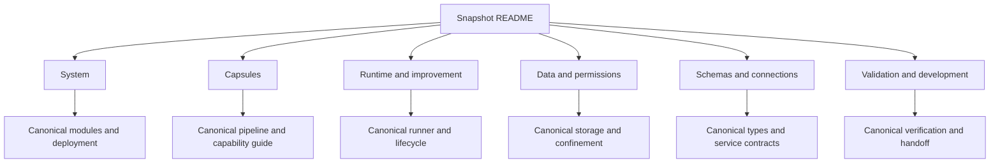

# M1 architecture snapshot

**5 October 2026 · Current specified design · Implementation validation pending.**

This is a linked reading package for Obsidian. It describes the architecture, not a running product. The [canonical M1 architecture](../../m1/pipeline.md) and [frozen source set](../../../product/SOURCE_FREEZE.md) remain authoritative. Open `docs/architecture` as the Obsidian vault, then open this README. The links lead to the canonical architecture pages.

## Two-minute summary

- **Main flow:** intake -> intent capsule -> intent Gate -> requirement capsules -> requirement Gate -> planner -> validated DAG -> capsule/Gate binding and freeze -> local execution -> delivery.
- SwarmFlow provides the fixed required outer flow. Planned task nodes also become fixed after validation, binding and freeze.
- The planner creates nodes, dependencies and typed data bindings from accepted requirements and an admitted library snapshot. It is an orchestration service, not a capsule.
- Task data enters the DAG through declared inputs. Dispatch executes ready nodes using their pinned local capsules. Every capsule call is followed by its bound Gate capsule before dependent work can consume the result.
- Output/capture, Verification and release are durable authority. A failed Gate or failed commit stops following work capsules; recovery reuses committed evidence.
- One Dockerized modular monolith contains the control plane and restricted local execution processes. Model work uses the protected Codex adapter.
- The research chain is a capability example, not the whole system. The previous twelve-capability inventory and 23 research bindings are baseline material; intent identities and revised planner entry contracts still need reconciliation.
- One shared verifier capability serves the Gate call sites through pinned criteria profiles. Every Gate-role capsule has zero RSI-mutable components.
- Delivery is ordinary result processing/publication and returns authorized data to the user view. It is not a capsule.
- Offline RSI cannot change live runs or activate candidates. SkillFuzz interaction analysis remains deferred.

**Flow owner:** [M1 control flow](../../m1/control-flow.md). This correction is specified at system level; it is not a completed schema/API release. The older [M1 map](../../m1.md) shows the same intake/intent/requirements/dispatch separation but has an earlier one-node pass-through planner.

## Reading order

| Page | Answers | Deeper owner |
|---|---|---|
| [System](presentation.md) | Deployment, components, tracks and placement | [Modules](../../system/modules.md), [deployment](../../system/deployment.md) |
| [Capsules](capsules.md) | What each capability does, receives and produces | [Capability guide](../../m1/capability-designs.md), [pipeline](../../m1/pipeline.md) |
| [Runtime and improvement](runtime-and-improvement.md) | Calls, Gates, failures, recovery, RSI and planner authority | [Lifecycle](../../system/lifecycle.md), [runner](../../capsule/runner.md) |
| [Data and permissions](data-and-permissions.md) | Intake, measurements, export, credentials and capture | [Storage](../../system/storage.md), [process boundary](../../capsule/process-boundary.md) |
| [Schemas and connections](schemas-and-connections.md) | Exact versions and producer/consumer agreements | [Types](../../types/types.md), [services](../../contracts/services-v1.schema.json) |
| [Validation and development](validation-and-development.md) | Evidence, remaining checks and coding handoff | [Verification](../../system/verification.md), [handoff](../../system/handoff.md) |

## Diagram and evidence routes

- [Current overall system](../../m1/control-flow.md): intake, gated intent/requirements, planning, binding, local DAG execution and delivery.
- [Information flow](../../system/information-flow.md): current fixed frontend and planned/frozen DAG, with full, observability-hidden, RSI-hidden and core views.
- [Temporal sequences](../../system/temporal.md) and [diagram atlas](../../system/diagram-atlas.md): call order, trust boundaries and deeper navigation.
- [Quick PDF](../../../../output/pdf/m1-architecture-presentation-2026-10-05.pdf): portable reading view. Markdown contains the complete navigation and detail.
- [Previous snapshot review](../../reviews/2026-10-05-showcase-review.md): checks for the superseded fixed-plan presentation. It is not acceptance evidence for this flow correction.

## Maintenance

Edit the canonical owner first, update affected contracts together, then regenerate the presentation. Preserve draft/checked/locked status: documentation checks do not imply approval or executed system acceptance. [Policies](../../policies.md) and [authority](../../authority.md) define change control. Design precedents are explained at those owning pages; this notebook uses local document links rather than a separate citation list.
