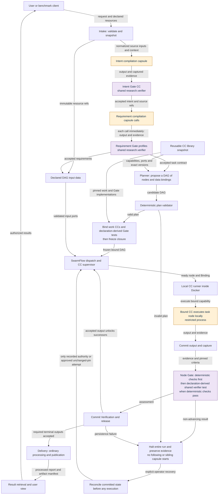

# System

[Start here](README.md) · Specified design · Runtime validation pending

## Deployment and component roles

- **Dockerized modular monolith:** one Linux application image, shared configuration and versioned internal interfaces. Separate subprocesses enforce trust boundaries; a component box does not imply a separately deployed service. See [deployment](../../system/deployment.md) and [module map](../../system/modules.md).
- **Capability capsule (CC):** admitted, versioned capability with a Declaration, typed ports, dependencies, effects and checks. It is stored for planning and application and is not tied to one task. See [Declaration](../../capsule/fields.md).
- **Workflow node:** the hot-path use of a CC for one specific task, bound into the workflow with actual input references, limits and its Gate. Multiple nodes can use one capability. See [run plan](../../types/run-plan.md).
- **Ordinary module:** control or deterministic helper without independent capsule admission. Examples: supervisor, extraction, resource freezing, numeric arithmetic, plan validator and publisher. See [pipeline](../../m1/pipeline.md).
- **Host boundary:** browser and benchmark client use the application API. CLI/TUI/tmux execute inside the workstation environment; host terminal attachment is an access path. See [workstation](../../system/workstation.md).

## Main workflow

- [SwarmFlow](../../system/integration.md#swarmflow-run-a-plan-be-the-backend) runs the fixed outer workflow. Its required preparation, planning, dispatch and delivery positions remain present; planned nodes become fixed at freeze.
- Intake preserves the request and permitted resource snapshots.
- One intent compilation capsule derive intent. Each runs through its associated intent Gate; accepted intent is required before requirements begin.
- Requirement capsules derive the task contract. Each is followed by its associated requirement Gate. Only accepted requirements enter planning.
- The planner creates a DAG of nodes and typed data connections. Deterministic validation checks the plan; the binder resolves admitted work/Gate versions and freezes them.
- Data enters declared DAG ports. Ready nodes execute locally through the runner. Every bound work capsule is followed by its Gate capsule, evidence commit and durable release before a successor receives its output.
- Delivery is an ordinary module: it collects accepted terminal outputs, processes/formats and publishes them, then returns authorized results to the user view. Offline RSI and separately configured experiments retain their custody boundaries; neither changes a live frozen DAG.
- [M1 control flow](../../m1/control-flow.md) owns this corrected sequence and its remaining contract work. The previous fixed chain does not define the overall system.

## Spatial view

Generated from [M1 control flow](../../m1/control-flow.md). Arrows summarize placement and interfaces, not filesystem permissions. Required capture is present even where its edges are omitted. Host terminal attachment reaches the in-container CLI/TUI/tmux environment.

<!-- generated:showcase-system -->

<!-- /generated:showcase-system -->

## Why these boundaries

- One deployment keeps M1 operation small; restricted subprocesses retain distinct credential and code identities. The borrowed container/process patterns and replacement points are recorded in [deployment](../../system/deployment.md) and [confinement](../../capsule/process-boundary.md).
- Typed capabilities separate reusable behavior from scheduling. The [control-flow owner](../../m1/control-flow.md) separates node identity, bound capability and dispatch authority; [pipeline](../../m1/pipeline.md) retains the research capability baseline.
- Existing OpenJiuwen integration stays behind adapters. [Reuse audit](../../system/reuse-audit-2026-10-05.md) records source pins and actual symbols; [integration](../../system/integration.md) separates reused behavior from new work.

[Next: capsules](capsules.md)
