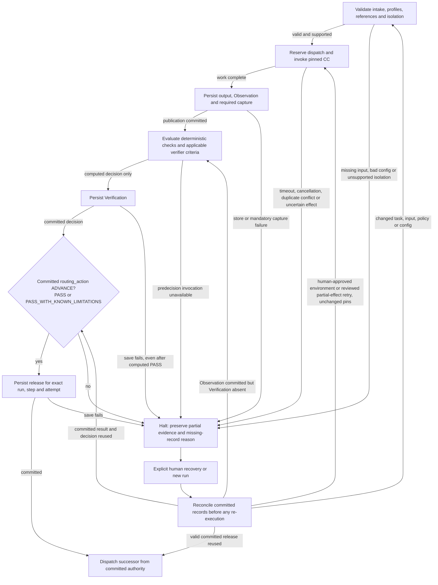

# Runtime and improvement

[Start here](README.md) · Specified design · Crash and provider tests pending

## Production authority and normal sequence

- Accepted intent and requirements precede planning. The planner proposes the DAG; the supervisor validates it, binds work/Gate capsules, freezes the library/configuration/policy closure and owns dispatch. The [runner](../../capsule/runner.md) enforces a Binding, validates ports, reserves call budgets and captures execution. Capsules cannot choose their successor.
- The [model bridge](../../system/model-auth.md) wraps Codex behind a provider interface. Production uses the static configured route; experimental routing selects an allowed endpoint inside a call, not a capability or workflow successor.
- Work output and capture commit first. [Gate host](../../capsule/gate-host.md) evaluates the evidence under a pinned profile and persists Verification through the trusted writer. The supervisor commits release before dispatching the next node.
- Advancement requires committed `PASS` or `PASS_WITH_KNOWN_LIMITATIONS` with `routing_action: ADVANCE`, plus the release record. A passing calculation whose durable save fails cannot release work. See [lifecycle](../../system/lifecycle.md).
- Scientific `PASS`, `FAIL`, `INCONCLUSIVE` and `CONDITIONALLY_ACCEPTABLE` describe research results, not infrastructure permission to advance. A valid negative result can reach a report. See [evaluation](../../m1/evaluation.md).

## What the verifier checks

`research.verifier` is a CC. It checks the actual result of a task-specific workflow node against the reusable bound CC’s Declaration and criteria. A library capsule is a capability definition; a node is its hot-path application with concrete inputs and run identity. [Nodes](../../system/nodes.md#capsule-versus-node) owns this distinction.

## Gate count and protection

- One shared `research.verifier` capability identity serves intent, requirement and DAG-node Gate call sites. Different criteria profiles are not different verifier capsules.
- Each capsule call enters its Gate boundary immediately after output/capture commit. Mandatory deterministic failure blocks the boundary before a semantic verifier call; otherwise the Gate host invokes the pinned verifier and records its assessment.
- Every Gate-role capsule has `evolution.rsi: none` and `evolution.may_change: []`: zero RSI-mutable components. The [verifier owner](../../capsule/gate-capsules.md) and [RSI controller](../../capsule/rsi-engine.md) protect this fixed referee.
- Success-rate comparisons retain capsule, verifier, criteria, fixture, model and protocol pins. Keeping the referee fixed makes comparisons interpretable; a human referee revision starts a new cohort.

## Automatic Gate preparation

The Gate builder reads each bound work capsule’s Declaration and prepares its schema/guarantee/effect checks with mandatory policy. It binds a declaration-specific test instance of the shared `research.verifier` capsule immediately after that work call. Declaration, test, verifier and profile pins freeze together; Gate-role RSI mutation remains zero. Unsupported checks refuse preparation. The exact builder/test-record interfaces remain architecture work. See [Gate owner](../../capsule/gate-capsules.md#declaration-derived-gate-construction).

## Failure and recovery

- Stable duplicate request IDs reuse committed results or report in-progress state; changed bytes conflict. Model/effectful calls do not silently repeat after uncertain outcomes.
- A failed Gate stops subsequent capsule dispatch for the run, including other ready branches. Existing committed outputs are retained; in-flight work follows cancellation/capture rules. Timeout, cancellation, invalid inputs, denied effects and persistence failures also halt and retain safe evidence. Attribution uses the [reason registry](../../schemas/policy.md), not a different error vocabulary per capsule.
- Recovery inspects committed state: reuse work evidence, reevaluate a missing Gate, reuse a committed decision, or dispatch from an existing release. Explicit environment/partial-effect remediation may create an attempt under unchanged pins. Changed inputs, implementation, policy or configuration require a new run. [Lifecycle](../../system/lifecycle.md) and [storage](../../system/storage.md) own exact rules.

- Screening with no eligible card records `NO_ELIGIBLE_OPPORTUNITY` and halts before Hypothesis for human review; it does not create a successful empty card. See [Screening](../../m1/screening.md).

The per-node durable sequence below remains applicable after the corrected planner/binder boundary. Generated from the [retained recovery owner](../../system/information-flow.md):

<!-- generated:showcase-recovery -->

<!-- /generated:showcase-recovery -->

## Admission, RSI and activation

- [Admission](../../capsule/admission.md) always checks declaration integrity, hashes, closure and permissions before the selected provider. Tested admission records checks actually executed. Puppet admission allowlists exact developer-selected hashes with `exempt` assurance; it cannot invent certification or runtime Gate passes.
- [Library](../../capsule/library.md) keeps version, assurance and active alias separate. A candidate can be admitted but inactive; manual activation changes future snapshots, not a frozen run.
- [Offline RSI](../../capsule/rsi-engine.md) uses the private [fixture oracle](../../capsule/fixture-oracle.md), bounded session/lifetime budgets and lineage evidence. Permitted changes stay inside the target's frozen contract. It cannot modify schemas, referee, acceptance policy, permissions, live DAG or active aliases.
- The RSI search loop and final evaluation use separate reservations. Loop calls cannot consume the final evaluation reservation. Read the oracle owner for exact allocation and cross-session limitations.

## Separate experimental authority

Approved component and Gate ablations use a distinct track-scoped authority: `experimental_gate_evidence` records NOT_RUN or PARTIAL, and `experimental_advance` authorizes the permitted experimental transition. A skipped check never becomes a passed Verification. Authentication, confinement, schema validation, raw capture and storage integrity cannot be disabled. [Experiments](../../system/experiments.md) owns approval, evidence, replacements and promotion boundaries.

## Planner and deferred interaction analysis

- The planner is an orchestration service in the corrected main flow, using the configured Codex bridge. Accepted requirements and an admitted library snapshot are its inputs; a candidate DAG is its output. [Control flow](../../m1/control-flow.md) supersedes the former experimental-only entry.
- The deterministic validator checks exact schemas, closure, cycles, reachability, bounds, permissions, required Gates and objective coverage. Only a committed valid proposal can freeze and dispatch. The corrected main flow plans after the requirement Gate; the former fixed-template bootstrap must be revised.
- Invalid proposals preserve structured findings and cannot dispatch. No live replanning or unrestricted delegation is introduced.
- **Deferred:** SkillFuzz analysis of how CC sets interact. Planned structural/failure fixtures remain; probabilistic interaction screening is not a current admission, planning or handoff prerequisite. No interaction campaign is claimed to have run.

The durable-history, policy/enforcement and version/alias precedents are explained at [lifecycle](../../system/lifecycle.md), [Gate host](../../capsule/gate-host.md) and [library](../../capsule/library.md).

[Next: data and permissions](data-and-permissions.md)
