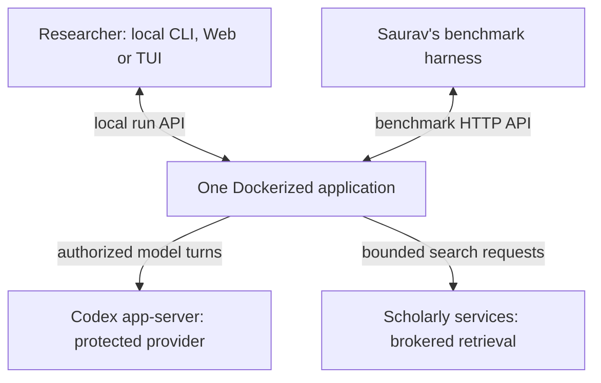
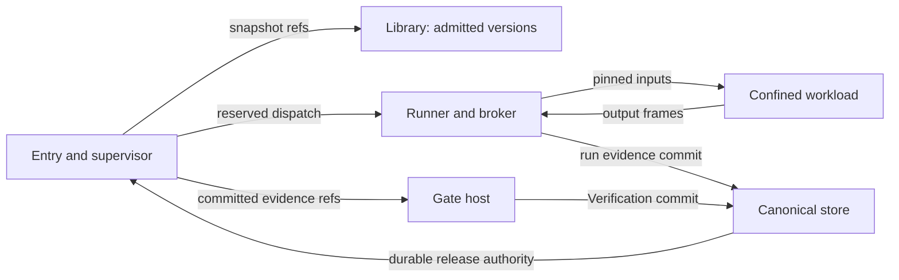
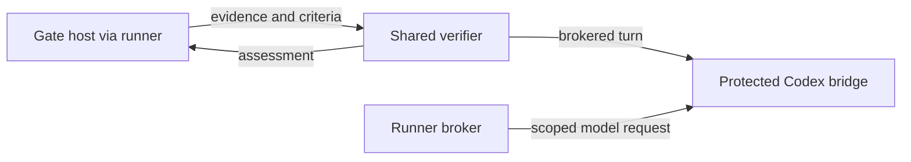
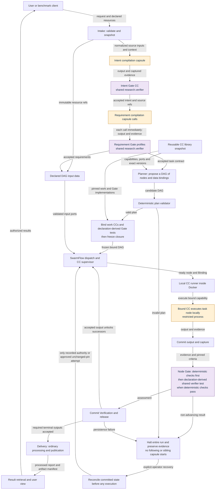
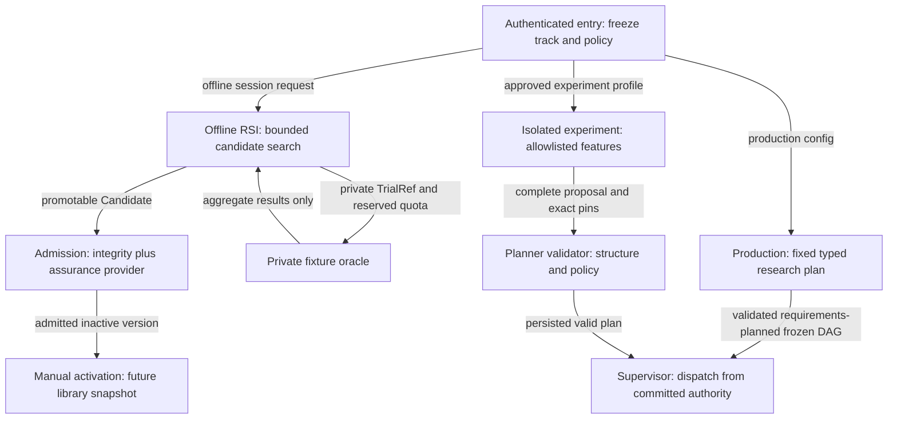
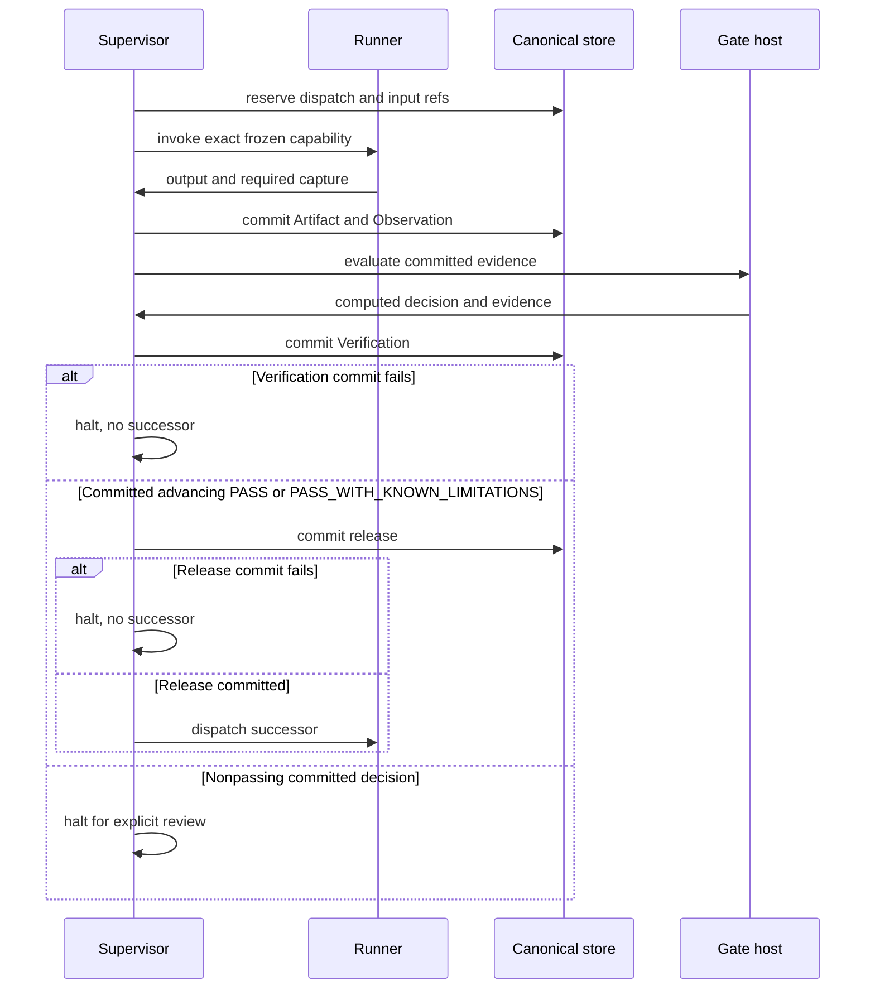

# Diagram atlas: explain first, inspect next

These views summarize linked contracts. They do not define extra APIs or product scope. Each view shows one question; follow its owner links for field meanings and failures. This uses the context/container/component zoom pattern of the [C4 model](https://c4model.com/diagrams), with Mermaid flowcharts and sequence diagrams instead of a new diagram framework.

| Depth | Question | Read next |
|---|---|---|
| 1 Context | Who uses it, and what is deployed? | context below; [deployment](deployment.md) |
| 2 Components | Who may execute, judge, store or call Codex? | control view below; [modules](modules.md), [full typed map](diagram.md) |
| 3 Research data | What does each capability consume and produce? | [pipeline ports and plan fixture](../m1/pipeline.md), [capability design packets](../m1/capability-designs.md) |
| 4 Time and failure | What commits before the next step? | [temporal sequences](temporal.md), [failure stories](../stories/README.md) |

Start with [today's whole-system capsule views](overall-draft.md) for the fixed frontend and planned/frozen execution section. Use the [complete information-flow variants](information-flow.md) for current data/authority connections, filtered observability/RSI and failure recovery. Return here for deeper questions.

## 1. Context and deployment

The Codex app-server process belongs inside the application's trusted bridge boundary; the box above exposes its replaceable provider role. The benchmark harness is external. No capsule receives that harness's implementation or the bridge's credential volume.

## 2. Authority and trust components

Semantic assessment and inference expand the runner/Gate boundary separately so storage edges do not obscure model custody:

This is an authority map, not a filesystem permission grant. Workload processes cannot open the store. [Deployment](deployment.md) owns process identities, [environment](environment.md) owns IPC, [records](records.md) owns reservations, and [Gate host](../capsule/gate-host.md) owns the fold. The [current system map](diagram.md) expands the preparation/planning/execution boundaries without changing these boundaries.

## 3. Fixed preparation and planned execution spine

This generated view follows the [control-flow owner](../m1/control-flow.md): fixed intake/intent/requirements acceptance, planning, binding/freeze and governed DAG execution. [Information flow](information-flow.md) adds evidence, model, export and optional display branches. The [research contract baseline](research-contract-map.md) retains earlier detailed payload wiring for reconciliation, not current overall ordering.

<!-- generated:production-flow -->

<!-- /generated:production-flow -->

## 4. Three isolated execution tracks

Activation is an explicit developer action; RSI cannot move the active alias. Experimental dispatch remains labelled and obeys the authority appropriate to its pinned study/profile. Approved Gate ablations never fabricate production PASS/release. [Experiments](experiments.md), [planner](planner.md) and [RSI engine](../capsule/rsi-engine.md) own those distinctions.

## 5. One step, including failed durable success

[Temporal flows](temporal.md) expands recovery, RSI and planner ordering. Diagram arrows to storage mean requests to an authorized writer; Gate host may publish through that writer. A computed success is never durable authorization.

## Diagram maintenance

Change the owning contract first. Update the affected view and deep diagram, then parse/render and inspect its labels, direction, trust placement and failure branches. Retain simple ASCII labels and standard shapes for renderer compatibility. A passing Mermaid parser proves syntax only; it cannot verify product semantics or isolation.
