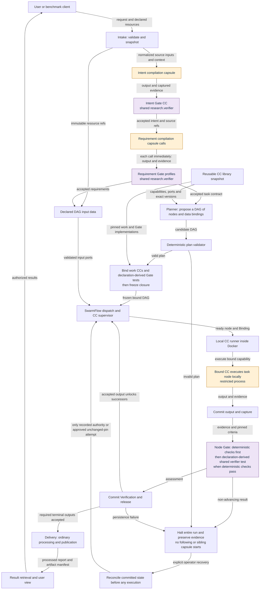
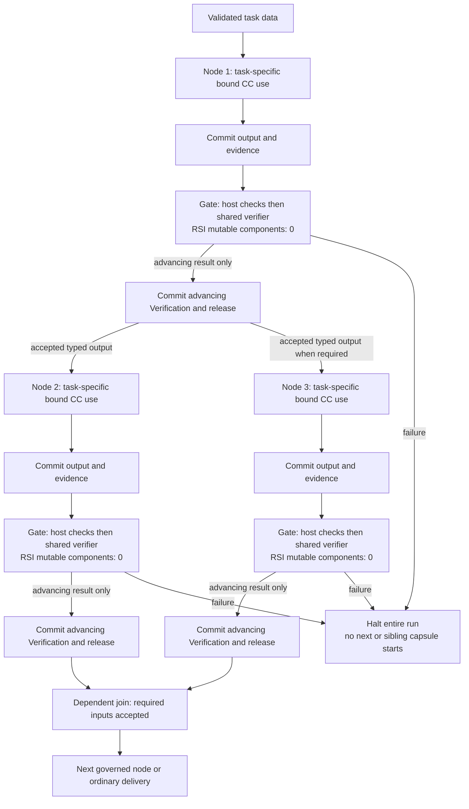

# System data and control connections

The [control-flow owner](../m1/control-flow.md) defines this sequence. The fixed SwarmFlow outer workflow gates intent and requirements before planning. The planner supplies a task DAG; validator/binder freeze exact work and Gate versions before local execution.

## Main path

<!-- generated:current-main -->

<!-- /generated:current-main -->

## Bound-node data and Gate ordering

<!-- generated:current-dag -->

<!-- /generated:current-dag -->

## Deeper contracts

- [Information-flow variants](information-flow.md): required evidence, output/export and offline RSI.
- [Temporal sequence](temporal.md): fixed frontend, proposal/freeze and per-node advancement.
- [Module map](modules.md), [integration](integration.md), [deployment](deployment.md): placement, SwarmFlow adapter and local process boundaries.
- [Runner](../capsule/runner.md), [Gate host](../capsule/gate-host.md), [shared verifier](../capsule/gate-capsules.md), [storage](storage.md): invocation, acceptance and persistence.
- [Research capabilities](../m1/capability-designs.md) remain capability design references; they are not a universal fixed overall chain. Intent/requirement/planner contract reconciliation remains explicit in the control-flow owner.
