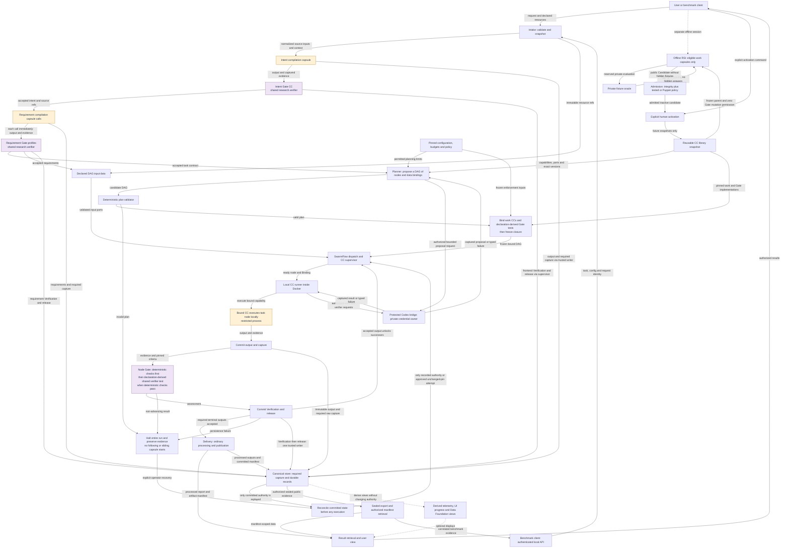
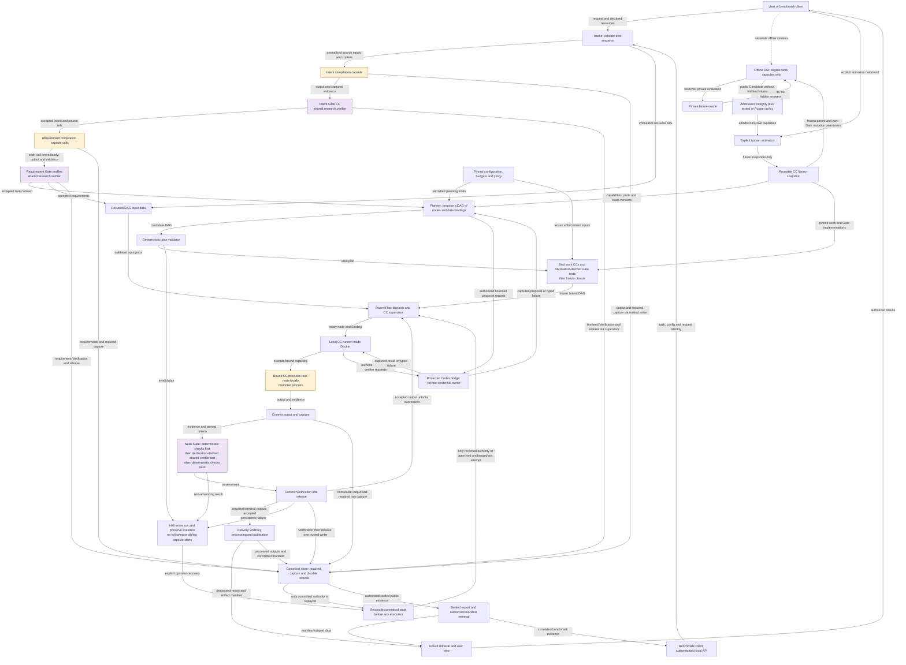
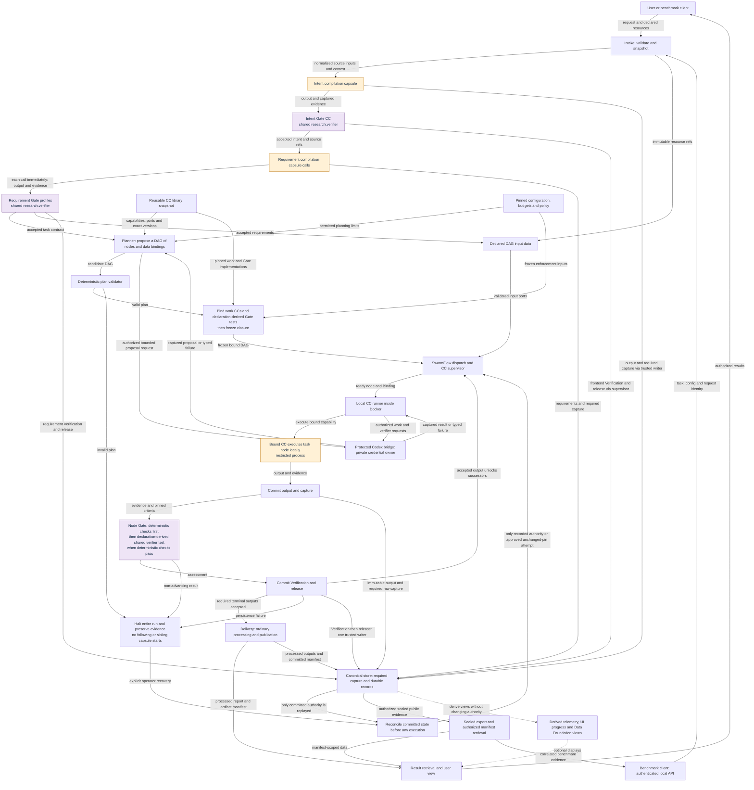
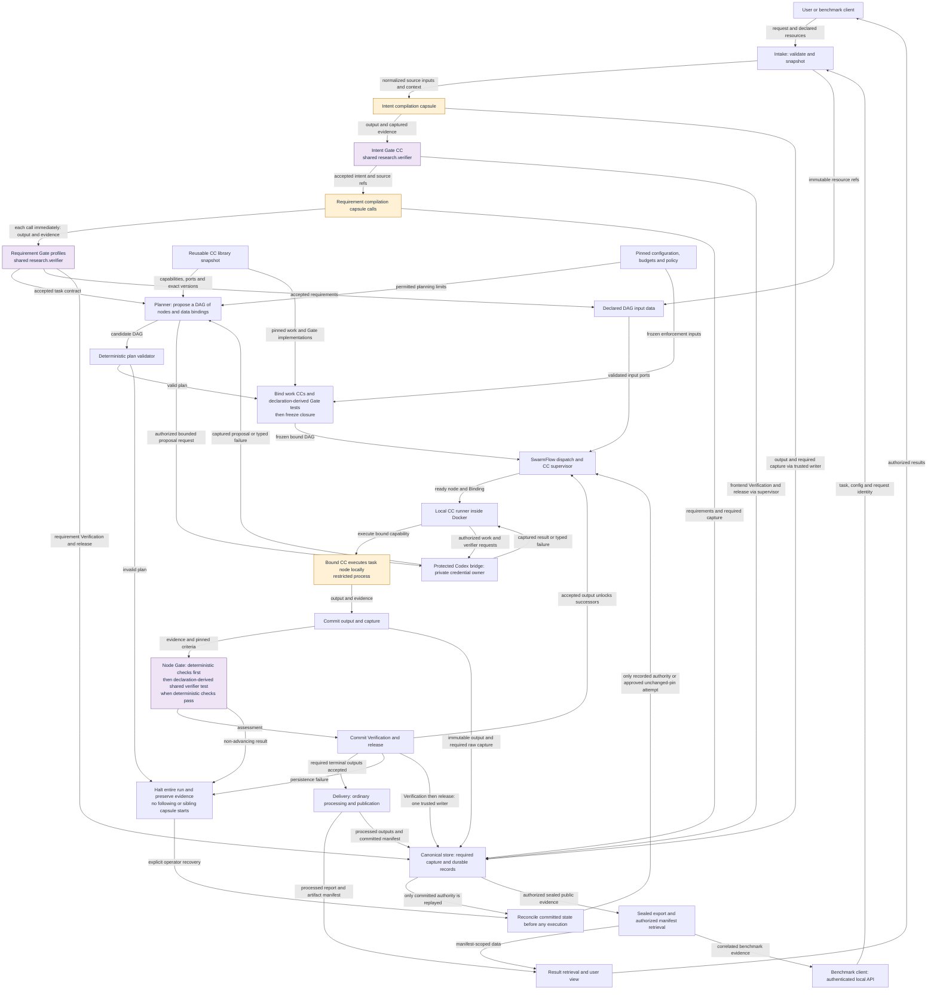
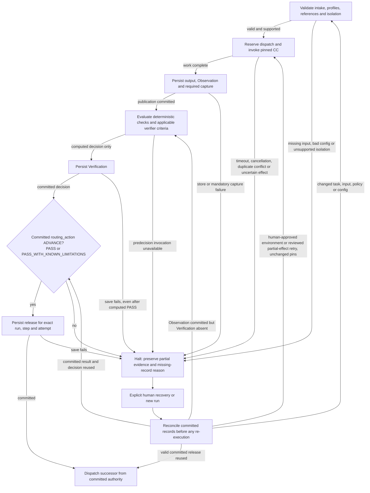

# Information flow: fixed preparation and planned execution

The [M1 control-flow owner](../m1/control-flow.md) defines the main path: intake -> intent capsules/Gates -> requirement capsules/Gates -> planner -> validation/binding/freeze -> local DAG execution -> ordinary Delivery processing and user retrieval.

SwarmFlow supplies required fixed outer positions. Requirements determine the task DAG, which becomes fixed before execution. Every work capsule enters its Gate boundary before its output can unlock consumers. A failed Gate halts further capsule dispatch for the whole run. Gate call sites reuse one `research.verifier` identity through criteria profiles, with zero RSI-mutable components.

## Reading these views

- Arrows show logical data and authority dependencies, not unrestricted process access. Inputs/evidence resolve through authorized references.
- All four views preserve the fixed preparation path, planner boundary, bound local execution, Gates, durable authority and ordinary Delivery/output path.
- Observability filtering hides derived display branches only. Required capture and records remain. RSI filtering hides the separate offline session only; it does not remove its M1 scope.
- The previous 23-binding research example is preserved in the [archived fixed-chain map](../archive/information-flow-fixed-research-2026-10-05.md). It does not define this overall flow. Concrete intent/requirement/planner wire contracts remain in connected revision; diagram labels are logical data roles, not newly released schemas.
- [Storage](storage.md), [Gate host](../capsule/gate-host.md), [shared verifier](../capsule/gate-capsules.md), [Codex bridge](model-auth.md) and [benchmark export](benchmark-export.md) own enforcement and persistence details.

## 1. Full system with derived views and offline RSI

<!-- generated:information-full -->

<!-- /generated:information-full -->

## 2. Without derived observability

<!-- generated:information-no-observability -->

<!-- /generated:information-no-observability -->

## 3. Without the offline RSI branch

<!-- generated:information-no-rsi -->

<!-- /generated:information-no-rsi -->

## 4. Core request-to-DAG flow

<!-- generated:information-core -->

<!-- /generated:information-core -->

## 5. Gate persistence, halt and recovery

This per-call temporal view applies to intent, requirements and DAG work. It does not authorize bypassing frontend Gates or replanning a live DAG.

