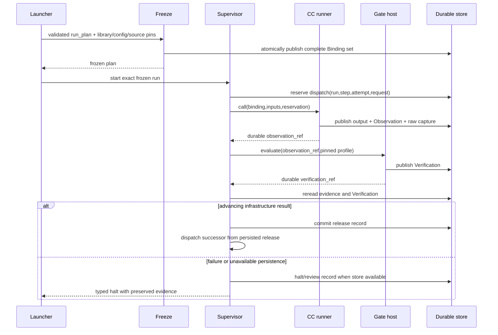

# Nodes and governed execution

A governed node is a plan position, not a capsule implementation. It becomes a frozen run-plan step with one work capability, the shared `research.verifier`, and one independently authored stage GateProfile. Mechanical helpers execute inside their owning stage boundary and have explicit module contracts, not separate admitted capsules. The Gate host validates evidence and persists Verification; the supervisor alone releases work.

SwarmFlow supplies a fixed outer preparation/control flow. Intent and requirements capsules are gated before the planner creates the task DAG. The validator/binder freeze that DAG before execution; planned nodes are fixed thereafter. The planner is an orchestration service. Required offline RSI has its own bounded lifecycle. No M1 path installs a capsule, mutates an active DAG, automatically repairs failure or promotes a candidate.

## Capsule versus node

A Capability Capsule is a reusable capability stored in the library for planning and application. Its Declaration, body, ports and version describe what it can do; it is not tied to a particular research task.

A node is the hot-path use of that capability for one specific task, bound into the workflow. Its Binding fixes the CC version, actual inputs, run/step/attempt identity, execution limits and declaration-derived Gate test. The same stored CC may serve different nodes or runs without changing its reusable identity.

The `research.verifier` CC checks **the result of the node**: its actual output and captured effects/evidence, against the bound capability's Declaration and task criteria. It does not merely validate a library entry. Admission checks library availability separately; runtime Gate acceptance controls node advancement.

## Control sequence and authority

A Gate PASS whose save fails never becomes release. The runner response, event stream, UI, model output and native workflow cache cannot grant authority. Recovery reads committed records; a missing Observation after reservation means an uncertain effect. Explicit human restart allocates a new attempt under the same run/step, preserving evidence. Changed inputs/configuration require a new run.

## Gates

Tier 1 checks schema, references, files, contract checks, provenance, time/invocation budgets and required evidence. Mandatory failure spends no verifier call. Tier 2 calls the shared independent verifier with stage criteria and bounded evidence. Malformed/missing judgment blocks. The host directly validates the verifier assessment to end recursion; it never recursively gates the referee call. Every research work output receives its real Gate.

## Generic workflow adapter

PRD 5.6.5 isolated ablation runs use [experimental advancement](experiments.md#experimental-interfaces) when the pinned study disables/replaces a control. The same dispatcher reads a committed experimental_advance Artifact only when track=isolated_experiment and validates its evidence/profile/study/attempt pins. Production accepts only the canonical release SystemRecord. A plan cannot choose its own authorization mode: the experimental entry/validator derives it from the approved study before freeze. Missing advancement evidence stops either track.

One Swarmflow script walks the frozen ordered steps. It resolves references only from launcher inputs and already released predecessor outputs, invokes the CC backend, then waits for the supervisor's committed release. It never embeds stage behavior. Requirements-planned main-flow and separately approved experimental plans use the same run-plan/Binding interfaces and carry distinct track tags. Detailed request framing, duplicates, cancellation and recovery are owned by [lifecycle](lifecycle.md); actual code locations/reuse are owned by the module map.

The durable progression pattern follows [Temporal workflow history](https://docs.temporal.io/workflow-execution), with a local append-only store rather than a Temporal deployment. Replace the scheduling adapter when throughput demands concurrency; preserve reserve/Observation/Verification/release identities and authority.
