> **Draft: detailed implementation map.** Start with the [diagram atlas](diagram-atlas.md) for shallow context, trust components and ordered failure views. This detailed canary checks that drawn nodes and edge payload labels have linked definitions; it cannot prove execution ordering, permissions or completeness. Update it when its owning contracts change.

# Research contract baseline: typed connections

Deployment and trust-process placement are drawn in [deployment](deployment.md#deployment-and-process-placement); the graph below expands the one application container. The browser and external harness remain outside it.

## Detailed module and data connections

```mermaid
flowchart LR
    USER(["user"])
    UI["browser run view"]
    subgraph ENTRYG["entry"]
        ENTRY["entry adapter: CLI and web"]
    end
    subgraph CONTROL["control hosts"]
        LN["launcher M01"]
        FRZ["freeze M03"]
        HH["halt host M03h"]
        CFG["configuration, startup and doctor"]
        SR["system records and dispatch reservations"]
        WS["local CLI, TUI, tmux and token session"]
    end
    subgraph ENGINE["Swarmflow, through cc.adapters.swarmflow"]
        ENG["Swarmflow engine and the generic script"]
        BK["CcBackend R1"]
    end
    subgraph RUNNER["CC runner"]
        PIPE["call pipeline R2"]
        TH["tool host R6a"]
        SK["skill handler R6b"]
        PSH["prompt_section handler R6c"]
        BRK["broker R7"]
        MC["model client M05"]
    end
    subgraph GATES["gating"]
        GH{{"gate host M10"}}
        CR["check runner M10a"]
    end
    PB["M1 generated-code process boundary"]
    FO["RSI fixture oracle"]
    MTH["trusted measurement service"]
    subgraph CAPS["M1 capsules"]
        XT["source extraction module"]
        CI["intent hint module"]
        CB(["research.compile_brief"])
        VF(["research.verifier"])


        PG["pinned shared judging text"]
        CS(["research.search_ideas"])

        OFR["freeze_resources function"]
        OSC["syntax_check function"]
        OCT["compare_to_thresholds function"]
        OPL(["op.local_search"])
        OPS(["op.scholarly_search"])
        OPR["rank_opportunities function"]
        ODA["assess_dependency function"]
        SCR(["research.select_opportunity"])
    end
    subgraph LIB["library side"]
        AUTH(["capsule author"])
        KIT["author kit M13"]
        ADM{{"admission M14"}}
        VB["vocabulary builder M00a"]
        PP["policy publisher M00c"]
    end
    ST[("record and content store M12")]
    BUS["CC event bus"]
    PS["progress sink M18"]
    subgraph BOXES["research capabilities and workspace module"]
        HYP(["research.form_hypothesis"])
        POC(["research.build_poc"])
        BEN(["research.run_benchmark"])
        EVA(["research.evaluate_results"])
        REP(["research.write_report"])
        DEL["artifact publisher"]
        OPC(["op.codesearch"])
        OPW["workspace module: read write list"]
    end
    CXA["codex adapter"]
    DSA["deepsearch adapter"]
    DSX["arXiv and Semantic Scholar"]
    CDX["Codex subscription service"]
    DF["Data Foundation"]
    RSI["offline RSI controller"]
    PL["isolated native Leader planner"]
    VAL["plan validator"]
    EX["experimental entry"]
    EXP["benchmark export adapter"]

    EX -->|"research_brief"| PL
    PL -->|"run_plan"| VAL
    VAL -->|"run_plan"| FRZ
    MC -->|"ModelReply"| PL
    PL -->|"ModelCallContext"| MC
    ST -->|"SystemRecord"| EXP
    EXP -->|"exports"| DF
    EX -->|"ConfigSnapshot"| LN
    USER -->|"prompt"| ENTRY
    ENTRY -->|"launch"| LN
    LN -->|"run_plan, intake"| PIPE
    LN -->|"run_plan"| FRZ
    ST -->|"Standing, Verdict, Declaration"| FRZ
    FRZ -->|"Binding"| ST
    LN -->|"args"| ENG
    ENG -->|"call descriptor"| BK
    BK -->|"envelope"| ENG
    ENG -->|"CcHalt"| LN
    LN -->|"CcHalt"| HH
    BK -->|"call descriptor"| PIPE
    ST -->|"Binding, Declaration, code, Artifact"| PIPE
    PIPE -->|"Artifact, Observation, content"| ST
    PIPE -->|"frames"| TH
    PIPE -->|"inputs"| SK
    PIPE -->|"inputs"| PSH
    ENTRY -->|"intake"| XT
    XT -->|"source_text"| CI
    CI -->|"intent_ir"| ENTRY
    SK -->|"intake, intent_ir"| CB
    CB -->|"research_brief"| SK
    SK -->|"evidence_bundle"| VF
    VF -->|"verifier_assessment"| SK
    PSH -->|"text"| PG
    TH -->|"research_brief, intake"| CS
    CS -->|"idea_set"| TH
    TH -->|"query, intake"| OPL
    OPL -->|"search_hits"| TH
    TH -->|"query"| OPS
    OPS -->|"search_hits"| TH
    OPS -->|"scholarly query"| DSA
    DSA -->|"scholarly query"| DSX
    TH -->|"idea_set, research_brief"| SCR
    SCR -->|"screening_assessments"| OPR
    OPR -->|"dependency_requirement"| ODA
    ODA -->|"dependency_assessment"| OPR
    OPR -->|"opportunity_card"| SCR
    SCR -->|"opportunity_card"| TH
    TH -->|"evidence_bundle"| VF
    VF -->|"verifier_assessment"| TH
    TH -->|"opportunity_card, research_brief, intake"| HYP
    HYP -->|"hypothesis_blueprint"| TH
    TH -->|"hypothesis_blueprint, research_brief, intake"| POC
    POC -->|"poc_bundle"| TH
    TH -->|"poc_bundle, hypothesis_blueprint"| BEN
    BEN -->|"benchmark_payload"| TH
    BEN -->|"PocExecutionRequest"| PB
    PB -->|"PocExecutionResult"| BEN
    TH -->|"benchmark_payload, hypothesis_blueprint, research_brief"| EVA
    EVA -->|"evaluation_verdict"| TH
    SK -->|"evaluation_verdict, benchmark_payload, research_brief, idea_set, opportunity_card, hypothesis_blueprint"| REP
    REP -->|"research_report"| SK
    GH -->|"research_report, poc_bundle, benchmark_payload"| DEL
    DEL -->|"path"| TH
    TH -->|"query"| OPC
    OPC -->|"code_hits"| TH
    TH -->|"file"| OPW
    OPW -->|"file, path"| TH
    SK -->|"nested call, turn"| BRK
    TH -->|"frames"| BRK
    BRK -->|"call descriptor"| PIPE
    BRK -->|"ModelCallContext"| MC
    MC -->|"ModelReply"| BRK
    MC -->|"turn"| CXA
    CXA -->|"turn"| CDX
    BK -->|"obs_ref"| GH
    GH -->|"GateResult"| BK
    GH -->|"checks"| CR
    CR -->|"CheckResult"| GH
    CR -->|"frames"| TH
    GH -->|"evidence_bundle"| PIPE
    GH -->|"Verification"| ST
    PIPE -->|"events"| BUS
    GH -->|"events"| BUS
    LN -->|"events"| BUS
    FRZ -->|"events"| BUS
    HH -->|"events"| BUS
    ENG -->|"WorkflowProgressEvent"| PS
    BUS -->|"events"| PS
    PS -->|"workflow.updated"| UI
    AUTH -->|"capsule folder"| KIT
    KIT -->|"Candidate"| ADM
    ADM -->|"call_admission"| PIPE
    ADM -->|"checks"| CR
    ADM -->|"Declaration, Verdict, Standing, test case, content"| ST
    VB -->|"vocabulary, content"| ST
    PP -->|"policy"| ST
    ST -->|"vocabulary, policy"| LN
    CFG -->|"ConfigSnapshot"| LN
    WS -->|"launch"| LN
    WS -->|"human review"| HH
    LN -->|"SystemRecord"| SR
    SR -->|"SystemRef"| BK
    SR -->|"SystemRecord"| ST
    PIPE -->|"ExecutionCapture"| DF
    DF -->|"EvidenceManifestRef"| PIPE
    PB -->|"MeasurementRequest"| MTH
    MTH -->|"BenchmarkSample"| PB
    MTH -->|"Artifact, content"| ST
    HYP -->|"intake"| OFR
    OFR -->|"resource_snapshot"| HYP
    OFR -->|"file"| HYP
    POC -->|"file, hypothesis_blueprint"| OSC
    OSC -->|"file"| POC
    EVA -->|"benchmark_payload, hypothesis_blueprint"| OCT
    OCT -->|"file"| EVA
    BUS -->|"events"| DF
    ST -->|"Artifact, Observation, Verification"| DF
    DF -->|"exports"| RSI
    RSI -->|"Candidate"| ADM
    RSI -->|"FixtureEvaluationRequest"| FO
    FO -->|"FixtureEvaluationResult"| RSI
```

**How to read it.** Each run step is one `dispatch` call through `CcBackend` and the pipeline, then one gate. All values move as Artifacts in the store; an edge such as `TH -->|intake| CI` shows which value a capsule receives, not a copy outside the store. An operator such as `op.scholarly_search` runs as a nested call in its own tool host, drawn through `TH`. All research stages have published contracts. Helpers and publication are ordinary modules. One shared semantic verifier is configured by independent stage criteria. The remaining stage Gate contracts and required trusted services are drawn here; their draft/provisional status is recorded at each owning page. A diagram edge is not a runnable-platform claim.

## Nodes

The spatial graph shows public call/data boundaries. [Pipeline](../m1/pipeline.md) and [temporal flow](temporal.md) show execution order and durable release.

Every node in the diagram, and the one page that defines it. The lint checks that every node id here is drawn and every drawn id is here.

| Id | Node | Defined in |
|---|---|---|
| `USER` | the user, at the CLI or the web prompt box | [PRD 3.1.1](../../product/prd-m1-full-2026-10-02.txt) |
| `UI` | the browser's workflow run view | [integration](integration.md#runview-what-the-user-sees) |
| `ENTRY` | the entry adapter | [integration](integration.md#entry-how-a-run-starts) |
| `LN` | the launcher | [toolchain M01](../capsule/toolchain.md#m01-launcher) |
| `FRZ` | freeze, the Binding writer | [toolchain M03](../capsule/toolchain.md#m03-freeze-the-binding-writer) |
| `HH` | the halt host | [toolchain M03h](../capsule/toolchain.md#m03h-halt-host) |
| `ENG` | the Swarmflow engine and the generic script | [nodes](nodes.md#generic-workflow-adapter), [integration](integration.md#swarmflow-run-a-plan-be-the-backend) |
| `BK` | `CcBackend` | [runner R1](../capsule/runner.md#swarmflow-backend-talking-to-the-engine) |
| `PIPE` | the call pipeline | [runner R2](../capsule/runner.md#one-call-start-to-finish) |
| `PB` | M1 generated-code process boundary for benchmark execution | [process boundary](../capsule/process-boundary.md) |
| `FO` | private fixture oracle for RSI | [fixture oracle](../capsule/fixture-oracle.md) |
| `TH` | the tool host | [runner R6a](../capsule/runner.md#tool-a-python-function-in-its-own-process) |
| `SK` | the skill handler | [runner R6b](../capsule/runner.md#skill-model-turns-that-follow-skillmd) |
| `PSH` | the `prompt_section` handler | [runner R6c](../capsule/runner.md#prompt_section-text-for-a-skills-prompt) |
| `BRK` | the broker | [runner R7](../capsule/runner.md#nested-calls-and-the-broker) |
| `MC` | the model client | [runner](../capsule/runner.md#the-model-client-contract-m05) |
| `GH` | the gate host | [gate host](../capsule/gate-host.md) |
| `CR` | the check runner | [toolchain M10a](../capsule/toolchain.md#m10a-check-runner-and-the-check-library) |
| `XT` | ordinary source extraction | [source projection](../m1/extract-text.md) |
| `CI` | ordinary intent hints | [intent capsule](../m1/intent-capsule.md) |
| `CB` | `research.compile_brief` | [requirement capsule](../m1/requirement-capsule.md) |

| `PG` | `prompt.gate_judging` | [shared verifier](../capsule/gate-capsules.md) |
| `CS` | `research.search_ideas` | [search capsule](../m1/search-capsule.md) |

| `OPL` | `op.local_search`, an operator | [op.local_search](../m1/op-local-search.md) |
| `OPS` | `op.scholarly_search`, an operator | [op.scholarly_search](../m1/op-scholarly-search.md) |
| `OPR` | ordinary rank_opportunities function | [op.rank_opportunities](../m1/op-rank-opportunities.md) |
| `ODA` | ordinary assess_dependency function | [dependency operator](../m1/op-assess-dependency.md) |
| `SCR` | `research.select_opportunity` | [screening](../m1/screening.md) |
| `HYP` | `research.form_hypothesis`, a research capability | [hypothesis](../m1/hypothesis.md) |
| `POC` | `research.build_poc`, a research capability | [POC](../m1/poc.md) |
| `BEN` | `research.run_benchmark`, a research capability | [benchmark](../m1/benchmark.md) |
| `EVA` | `research.evaluate_results`, a research capability | [evaluation](../m1/evaluation.md) |
| `REP` | `research.write_report`, a research capability | [delivery](../m1/delivery.md) |
| `DEL` | ordinary artifact publisher | [delivery](../m1/delivery.md) |
| `OPC` | `op.codesearch`, a search operator | [op.codesearch](../m1/op-codesearch.md) |
| `OPW` | `op.workspace_io`, a search operator | [op.workspace_io](../m1/op-workspace-io.md) |
| `DSA` | the deepsearch adapter | [integration](integration.md#deepsearch-scholarly-search) |
| `DSX` | the arXiv and Semantic Scholar services | [integration](integration.md#deepsearch-scholarly-search) |
| `AUTH` | a capsule author: a person, RSI, the importer | [capsule](../capsule/capsule.md) |
| `KIT` | the author kit | [toolchain M13](../capsule/toolchain.md#m13-author-kit) |
| `ADM` | admission | [toolchain M14](../capsule/toolchain.md#m14-admission) |
| `VB` | the vocabulary builder | [toolchain M00a](../capsule/toolchain.md#m00a-vocabulary-builder) |
| `PP` | the policy publisher | [toolchain M00c](../capsule/toolchain.md#m00c-policy-publisher) |
| `ST` | the record and content store | [toolchain M12](../capsule/toolchain.md#m12-store) |
| `BUS` | the CC event bus | [observability](observability.md#the-events) |
| `PS` | the progress sink | [observability](observability.md#who-reads-what) |
| `CXA` | the codex adapter | [integration](integration.md#codex-the-model-for-m05) |
| `CDX` | jiuwenswarm's Codex subscription service | [integration](integration.md#codex-the-model-for-m05) |
| `DF` | Data Foundation | [seams](../seams.md#data-foundation) |
| `RSI` | RSI | [seams](../seams.md#rsi) |

| `VF` | shared research.verifier with pinned independent stage criteria | [Gate capsules](../capsule/gate-capsules.md) |
| `PL` | isolated planner orchestration service | [planner](planner.md) |
| `VAL` | deterministic plan validation | [planner](planner.md) |
| `EX` | experimental entry and feature isolation | [experiments](experiments.md) |
| `EXP` | provisional external benchmark export adapter | [benchmark export](benchmark-export.md) |
| `CFG` | configuration, startup, doctor | [environment](environment.md) |
| `SR` | durable control-record API and reservations | [system records](records.md) |
| `WS` | local workstation adapters | [workstation](workstation.md) |
| `MTH` | trusted measurement/logging authority | [measurement protocol](../m1/measurement-protocol.md#trusted-measurement-authority) |

| `OFR` | ordinary freeze_resources | [measurement protocol](../m1/measurement-protocol.md#frozen-methods) |
| `OSC` | ordinary syntax_check | [measurement protocol](../m1/measurement-protocol.md#syntax-checking) |
| `OCT` | ordinary compare_to_thresholds | [measurement protocol](../m1/measurement-protocol.md) |

## Edge labels

Every datatype an edge carries, and the one page that defines it. The lint checks that every label on an edge is a row here.

| Label | Is | Defined in |
|---|---|---|
| `prompt` | the user's request text | [intake](../types/intake.md) |
| `launch` | `launch(prompt, channel, workspace)` | [toolchain M01](../capsule/toolchain.md#m01-launcher) |
| `run_plan` | a payload type | [run plan](../types/run-plan.md) |
| `intake` | a payload type | [intake](../types/intake.md) |
| `source_text` | a payload type | [source text](../types/source-text.md) |
| `resource_snapshot` | an immutable bound resource payload | [resource snapshot](../types/resource-snapshot.md) |
| `dependency_requirement` | one canonical dependency request | [dependency requirement](../types/dependency-requirement.md) |
| `dependency_assessment` | one frozen dependency-policy result | [dependency assessment](../types/dependency-assessment.md) |
| `intent_ir` | a payload type | [intent_ir](../types/intent-ir.md) |
| `research_brief` | a payload type | [research brief](../types/research-brief.md) |
| `evidence_bundle` | a payload type | [evidence bundle](../types/evidence-bundle.md) |
| `verifier_assessment` | a payload type | [verifier assessment](../types/verifier-assessment.md) |
| `idea_set` | a payload type | [idea set](../types/idea-set.md) |
| `screening_assessments` | a typed nested-call input, not a pipeline artifact | [screening assessments](../types/screening-assessments.md) |
| `opportunity_card` | a payload type | [opportunity card](../types/opportunity-card.md) |
| `hypothesis_blueprint` | a payload type, provisional | [hypothesis blueprint](../types/hypothesis-blueprint.md) |
| `poc_bundle` | a payload type, provisional | [POC bundle](../types/poc-bundle.md) |
| `benchmark_payload` | a payload type, provisional | [benchmark payload](../types/benchmark-payload.md) |
| `evaluation_verdict` | a payload type, provisional | [evaluation verdict](../types/evaluation-verdict.md) |
| `research_report` | a payload type, provisional | [research report](../types/research-report.md) |
| `code_hits` | canonical snapshot code locations | [code hits](../types/code-hits.md) |
| `path` | a base port type | [port types](../schemas/port-types.md) |
| `file` | a base port type | [port types](../schemas/port-types.md) |
| `search_hits` | a payload type | [search hits](../types/search-hits.md) |
| `query` | an operator's query and `top_k` inputs | [op.local_search](../m1/op-local-search.md), [op.scholarly_search](../m1/op-scholarly-search.md) |
| `scholarly query` | one search request to the scholarly services | [integration](integration.md#deepsearch-scholarly-search) |
| `text` | a base port type | [port types](../schemas/port-types.md) |
| `inputs` | a call's bound input values | [runner values](../capsule/runner.md#values-how-each-port-type-travels) |
| `args` | the script's arguments: run id, plan, pins, inputs | [runner](../capsule/runner.md#swarmflow-backend-talking-to-the-engine) |
| `call descriptor` | the prompt `agent()` sends; also a nested call's request | [runner](../capsule/runner.md#swarmflow-backend-talking-to-the-engine) |
| `PocExecutionRequest` | constrained request from the benchmark capsule to the M1 generated-code boundary | [process boundary](../capsule/process-boundary.md#provisional-api) |
| `PocExecutionResult` | process outcome and evidence references returned to the benchmark capsule | [process boundary](../capsule/process-boundary.md#provisional-api) |
| `FixtureEvaluationRequest` | candidate and session request for private fixture evaluation; oracle selects its suite | [fixture oracle](../capsule/fixture-oracle.md#closed-api-envelopes) |
| `FixtureEvaluationResult` | aggregate-only fixture result returned to RSI | [fixture oracle](../capsule/fixture-oracle.md#closed-api-envelopes) |
| `envelope` | what a node returns to the script | [runner](../capsule/runner.md#swarmflow-backend-talking-to-the-engine) |
| `CcHalt` | the exception that ends a run on a halting verdict | [runner](../capsule/runner.md#swarmflow-backend-talking-to-the-engine) |
| `frames` | the tool host's NDJSON frames | [runner](../capsule/runner.md#tool-a-python-function-in-its-own-process) |
| `nested call` | a capsule's call to a pinned capsule | [runner](../capsule/runner.md#nested-calls-and-the-broker) |
| `turn` | one model turn | [runner](../capsule/runner.md#the-model-client-contract-m05) |
| `ModelCallContext` | which call a model turn belongs to | [runner](../capsule/runner.md#the-model-client-contract-m05) |
| `ModelReply` | a model turn's answer | [runner](../capsule/runner.md#the-model-client-contract-m05) |
| `obs_ref` | a `Ref` to a dispatch Observation | [common](../schemas/common.md) |
| `GateResult` | the gate host's answer | [gate host](../capsule/gate-host.md#api) |
| `checks` | full Checks or Binding check entries | [checks](../schemas/checks.md) |
| `CheckResult` | one check's result | [checks](../schemas/checks.md#calling-convention) |
| `call_admission` | the runner's admission entry | [runner](../capsule/runner.md#the-four-callers) |
| `Binding` | a record | [Binding](../schemas/binding.md) |
| `Standing` | a record | [Standing](../schemas/standing.md) |
| `Verdict` | a record | [Verdict](../schemas/verdict.md) |
| `Declaration` | a capsule's contract | [fields](../capsule/fields.md) |
| `Candidate` | a record | [Candidate](../schemas/candidate.md) |
| `test case` | a record | [checks](../schemas/checks.md) |
| `Artifact` | a record | [Artifact](../schemas/artifact.md) |
| `Observation` | a record | [Observation](../schemas/observation.md) |
| `Verification` | a record | [Verification](../schemas/verification-record.md) |
| `code` | capsule files, by hash | [runner](../capsule/runner.md#from-hash-to-running-code) |
| `content` | bytes in the content store, by hash | [toolchain M12](../capsule/toolchain.md#m12-store) |
| `vocabulary` | the port type vocabulary document | [port types](../schemas/port-types.md) |
| `policy` | a policy epoch document | [policy](../schemas/policy.md) |
| `events` | CC events | [observability](observability.md#the-events) |
| `WorkflowProgressEvent` | the engine's progress events | [integration](integration.md#swarmflow-run-a-plan-be-the-backend) |
| `workflow.updated` | the run view's update | [integration](integration.md#runview-what-the-user-sees) |
| `capsule folder` | what an author writes | [toolchain](../capsule/toolchain.md#the-capsule-folder) |
| `exports` | Data Foundation's sample run exports | [Data Foundation PRD](../../product/prd-m1-data-foundation.md) |

| `ConfigSnapshot` | frozen effective settings | [environment](environment.md) |
| `SystemRecord` | internal durable control record | [system records](records.md) |
| `SystemRef` | ID/hash of a system record | [system records](records.md) |
| `human review` | attributable terminal action | [lifecycle](lifecycle.md#human-review-and-recovery) |
| `ExecutionCapture` | required raw capture and frozen input/code references | [storage](storage.md#required-evidence-and-derived-views) |
| `EvidenceManifestRef` | sealed complete execution evidence manifest | [storage](storage.md#required-evidence-and-derived-views) |
| `MeasurementRequest` | authenticated measure_next request | [measurement protocol](../m1/measurement-protocol.md#trusted-measurement-authority) |
| `BenchmarkSample` | trusted per-arm sample | [measurement protocol](../m1/measurement-protocol.md#harness-stream-benchmarksample) |

## What drawing it found (2026-10-01)

Drawing the diagram was the step back. Three parts could not be drawn as the pages stood:

1. **No writer for policy documents, and two writers for the vocabulary.** The runner's key table said admission writes both. The toolchain said the vocabulary builder writes the vocabulary, and named no writer for policy. Fixed: the vocabulary builder (M00a) is the vocabulary's one writer, and a new policy publisher (M00c) is the policy's. Both are drawn above.
2. **"The current" policy and vocabulary were undefined.** The launcher loaded them without saying how. Fixed: jiuwenswarm's `config.yaml` names them (`cc.policy_epoch`, `cc.vocabulary_sha256`). The launcher and admission resolve those names in the store ([toolchain M01](../capsule/toolchain.md#m01-launcher)).
3. **The admission judge has no use at M1.** Every judged criterion is now a step check, run by a gate capsule. No M1 capsule declares a judged check of its own, so `levels.admission_judge` (`verifier_capsule`) is not needed to admit anything at M1 ([open issues](../open-issues.md) 31).
