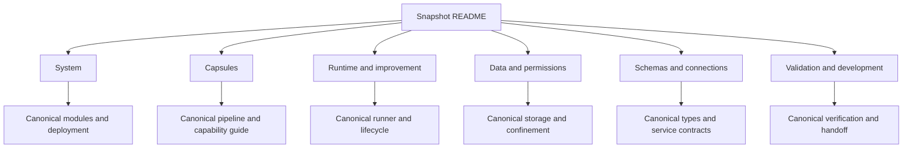

# M1 architecture snapshot

**5 October 2026 · Current specified design · Implementation validation pending.**

This is a linked reading package for Obsidian. It describes the architecture, not a running product. The [canonical M1 architecture](../../m1/pipeline.md) and [frozen source set](../../../product/SOURCE_FREEZE.md) remain authoritative. Open `docs/architecture` as the Obsidian vault, then open this README. The links lead to the canonical architecture pages.

## Two-minute summary

- One Dockerized modular monolith contains the supervisor, capsule runner, Gate host, storage and local interfaces. Protected subprocesses separate model credentials, generated code and the private RSI oracle.
- Twelve capsule identities: eight research capabilities, one shared semantic verifier and three search operators. Production follows a fixed plan; it does not ask a model to choose the next stage.
- Every production step uses pinned inputs and policies. Work evidence, the Gate decision (Verification) and release must be committed before the supervisor dispatches its successor.
- Offline recursive self-improvement (RSI) creates candidate versions. Admission records a candidate and its assurance; activation is a separate human decision. Isolated experimental planning cannot change the production workflow.
- SkillFuzz analysis of interactions between capsule sets is **deferred**. Typed bindings and deterministic plan validation remain required; they do not establish that independently valid capsules behave well together.
- Schemas and APIs have one owner. Presentation tables and repeated diagrams are generated from those owners. No runtime, isolation or measured performance result is claimed here.

## Reading order

| Page | Answers | Deeper owner |
|---|---|---|
| [System](presentation.md) | Deployment, components, tracks and placement | [Modules](../../system/modules.md), [deployment](../../system/deployment.md) |
| [Capsules](capsules.md) | What each capability does, receives and produces | [Capability guide](../../m1/capability-designs.md), [pipeline](../../m1/pipeline.md) |
| [Runtime and improvement](runtime-and-improvement.md) | Calls, Gates, failures, recovery, RSI and planner authority | [Lifecycle](../../system/lifecycle.md), [runner](../../capsule/runner.md) |
| [Data and permissions](data-and-permissions.md) | Intake, measurements, export, credentials and capture | [Storage](../../system/storage.md), [process boundary](../../capsule/process-boundary.md) |
| [Schemas and connections](schemas-and-connections.md) | Exact versions and producer/consumer agreements | [Types](../../types/types.md), [services](../../contracts/services-v1.schema.json) |
| [Validation and development](validation-and-development.md) | Evidence, remaining checks and coding handoff | [Verification](../../system/verification.md), [handoff](../../system/handoff.md) |

## Diagram and evidence routes

- [Overall system](../../system/overall-draft.md): all capsules and conditional placement.
- [Information flow](../../system/information-flow.md): full, observability-hidden, RSI-hidden and core views. Each preserves all 23 required production bindings and publication inputs.
- [Temporal sequences](../../system/temporal.md) and [diagram atlas](../../system/diagram-atlas.md): call order, trust boundaries and deeper navigation.
- [Quick PDF](../../../../output/pdf/m1-architecture-presentation-2026-10-05.pdf): portable reading view. Markdown contains the complete navigation and detail.
- [Snapshot review](../../reviews/2026-10-05-showcase-review.md): actual documentation checks and review findings. Historical evidence is labelled with its revision.

## Maintenance

Edit the canonical owner first, update affected contracts together, then regenerate the presentation. Preserve draft/checked/locked status: documentation checks do not imply approval or executed system acceptance. [Policies](../../policies.md) and [authority](../../authority.md) define change control. Design precedents are explained at those owning pages; this notebook uses local document links rather than a separate citation list.
