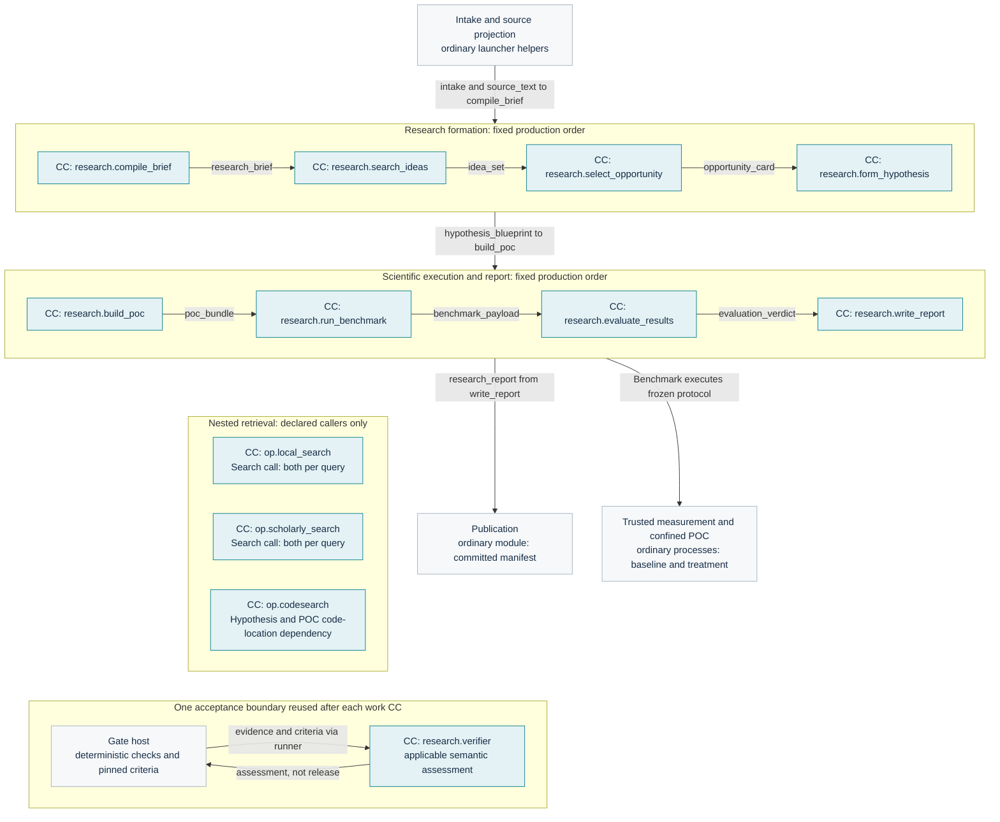

# Capsules

[Start here](README.md) · Specified design · No measured optimization claims

## Inventory and execution

The [pipeline](../../m1/pipeline.md) owns the twelve identities. The [capability guide](../../m1/capability-designs.md) links each behavior owner, fixture family and optimization hypothesis. Installation does not mean every capability executes in every run: retrieval operators execute through declared callers, and the shared verifier executes at applicable Gates.

| Capability | Responsibility and execution | Dependencies / behavior owner |
|---|---|---|
| `research.compile_brief` | Skill; one semantic pass turns the source request into a research contract | [Requirement](../../m1/requirement-capsule.md) |
| `research.search_ideas` | Tool; bounded model work and retrieval form evidence-backed ideas | Both local and scholarly operators per query; [Search](../../m1/search-capsule.md) |
| `research.select_opportunity` | Tool; consolidation and scoring, deterministic filtering/ranking, one selected card | Frozen dependency registry; [Screening](../../m1/screening.md) |
| `research.form_hypothesis` | Tool; bounded model work freezes hypotheses, predicates and protocol | CodeSearch and resource freezing; [Hypothesis](../../m1/hypothesis.md) |
| `research.build_poc` | Tool; bounded generation creates experiment files and harness | CodeSearch; [POC](../../m1/poc.md) |
| `research.run_benchmark` | Tool; no model; coordinates trusted baseline/treatment execution | Measurement adapters and confined worker; [Benchmark](../../m1/benchmark.md) |
| `research.evaluate_results` | Bounded plausibility turn plus deterministic numeric classification | Read-only measurement evidence; [Evaluation](../../m1/evaluation.md) |
| `research.write_report` | Skill; one synthesis turn, then ordinary rendering/publication | No admitted nested dependency; [Delivery](../../m1/delivery.md) |
| `research.verifier` | Shared skill; stage-selected semantic assessment, not numeric scientific classification | [Verifier](../../capsule/gate-capsules.md), [assessment](../../types/verifier-assessment.md) |
| `op.local_search` | Tool; query and local documents produce ranked search hits | [Local search](../../m1/op-local-search.md) |
| `op.scholarly_search` | Tool; query produces bounded scholarly search hits | [Scholarly search](../../m1/op-scholarly-search.md) |
| `op.codesearch` | Tool; query and repository snapshot produce code hits | [CodeSearch](../../m1/op-codesearch.md), [code hits](../../types/code-hits.md) |

## Production ports

Generated from [pipeline](../../m1/pipeline.md). Exact payload versions are in [schema inventory](schemas-and-connections.md). StageContext is a trusted contextual input, not an invented output port.

<!-- generated:showcase-ports -->
| Step / capability | Required inputs and context | Output | Gate profile |
|---|---|---|---|
| requirement: `research.compile_brief` | launcher intake; source_text; optional deterministic intent_ir hints | `research_brief` | `research.accept_brief.v1` |
| search: `research.search_ideas` | research_brief; intake | `idea_set` | `research.accept_ideas.v1` |
| screening: `research.select_opportunity` | idea_set; research_brief | `opportunity_card` | `research.accept_card.v1` |
| hypothesis: `research.form_hypothesis` | opportunity_card; research_brief; intake | `hypothesis_blueprint` | `research.accept_hypothesis.v1` |
| poc: `research.build_poc` | hypothesis_blueprint; research_brief; intake | `poc_bundle` | `research.accept_poc.v1` |
| benchmark: `research.run_benchmark` | poc_bundle; hypothesis_blueprint | `benchmark_payload` | `research.accept_benchmark.v1` |
| evaluation: `research.evaluate_results` | benchmark_payload; hypothesis_blueprint; research_brief | `evaluation_verdict` | `research.accept_evaluation.v1` |
| report: `research.write_report` | evaluation_verdict; benchmark_payload; research_brief; idea_set; opportunity_card; hypothesis_blueprint; authorized StageContext | `research_report` | `research.accept_report.v1` |
<!-- /generated:showcase-ports -->

The shared verifier consumes an [evidence bundle](../../types/evidence-bundle.md) and emits a [verifier assessment](../../types/verifier-assessment.md). The Gate host combines that assessment with deterministic checks. Operator argument/result contracts are owned by [local search](../../m1/op-local-search.md), [scholarly search](../../m1/op-scholarly-search.md) and [CodeSearch](../../m1/op-codesearch.md), not this inventory.

## Capsule-level graph

Generated from [overall draft](../../system/overall-draft.md). This overview suppresses cross-stage fan-in for readability; [complete information flow](../../system/information-flow.md) retains it.

<!-- generated:showcase-capsules -->

<!-- /generated:showcase-capsules -->

## Construction and optimization

- Build storage, runner, admission, broker and minimal fixtures first; then Brief, shared verifier and durable Gate continuation. Add retrieval/Screening, Hypothesis/POC, scientific execution/evaluation/report, workstation/export, RSI and isolated experiments in dependency order. [Build order](../../system/build-order.md) owns prerequisites.
- Keep algorithm choices inside modules. Preserve output semantics, frozen policies, permission boundaries and evidence ordering when optimizing.
- Measure model calls separately from deterministic helper work. Use pinned fixtures and compare correctness before latency/cost. [Capability guide](../../m1/capability-designs.md) owns proposed optimization experiments; [benchmark materials](../../m1/benchmarking-material.md) records candidate material and restrictions.
- SkillFuzz capsule-set interaction analysis is deferred. Current contract checks establish interface compatibility, not semantic safety of every combination. See [library](../../capsule/library.md).

[Next: runtime and improvement](runtime-and-improvement.md)
