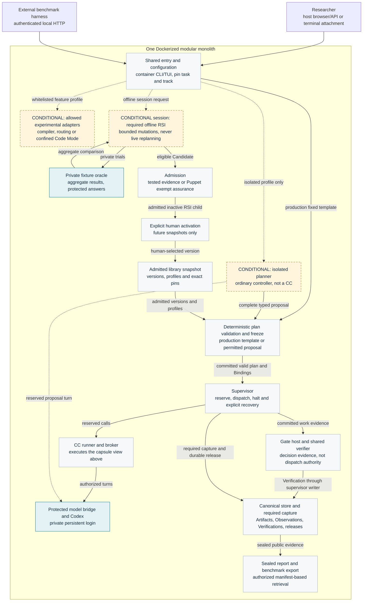

# System

[Start here](README.md) · Specified design · Runtime validation pending

## Deployment and component roles

- **Dockerized modular monolith:** one Linux application image, shared configuration and versioned internal interfaces. Separate subprocesses enforce trust boundaries; a component box does not imply a separately deployed service. See [deployment](../../system/deployment.md) and [module map](../../system/modules.md).
- **Capability capsule (CC):** admitted, versioned capability with a Declaration, typed ports, dependencies, effects and checks. It performs work; it does not release the next workflow node. See [Declaration](../../capsule/fields.md).
- **Workflow node:** a plan position binding one pinned capability to input references, budgets and a Gate profile. Multiple nodes can use one capability. See [run plan](../../types/run-plan.md).
- **Ordinary module:** control or deterministic helper without independent capsule admission. Examples: supervisor, extraction, resource freezing, numeric arithmetic, plan validator and publisher. See [pipeline](../../m1/pipeline.md).
- **Host boundary:** browser and benchmark client use the application API. CLI/TUI/tmux execute inside the workstation environment; host terminal attachment is an access path. See [workstation](../../system/workstation.md).

## Three tracks

- **Production:** fixed research plan, static Codex route, real Gates, durable records, local report publication. This is the first integration target.
- **Offline RSI:** isolated candidate changes and private evaluation; no live production changes or automatic activation.
- **Isolated experiments:** only whitelisted planning, routing, intention-compilation, Code Mode, alternate semantic verifier and approved component/Gate ablation paths. The planner is an orchestration service, not a CC. Conditional participation does not make required production stages optional.
- Scope and promotion boundaries are owned by [experimental tracks](../../system/experiments.md). Fusion, composite capsules, live replanning and unrestricted delegation are outside current acceptance.

## Spatial view

Generated from [overall draft](../../system/overall-draft.md). Arrows summarize placement and interfaces, not filesystem permissions. Required capture is present even where its edges are omitted. Host terminal attachment reaches the in-container CLI/TUI/tmux environment.

<!-- generated:showcase-system -->

<!-- /generated:showcase-system -->

## Why these boundaries

- One deployment keeps M1 operation small; restricted subprocesses retain distinct credential and code identities. The borrowed container/process patterns and replacement points are recorded in [deployment](../../system/deployment.md) and [confinement](../../capsule/process-boundary.md).
- Typed capabilities separate reusable behavior from scheduling. Component-specification precedent and the minimum-boundary rationale are recorded in [pipeline](../../m1/pipeline.md).
- Existing OpenJiuwen integration stays behind adapters. [Reuse audit](../../system/reuse-audit-2026-10-05.md) records source pins and actual symbols; [integration](../../system/integration.md) separates reused behavior from new work.

[Next: capsules](capsules.md)
