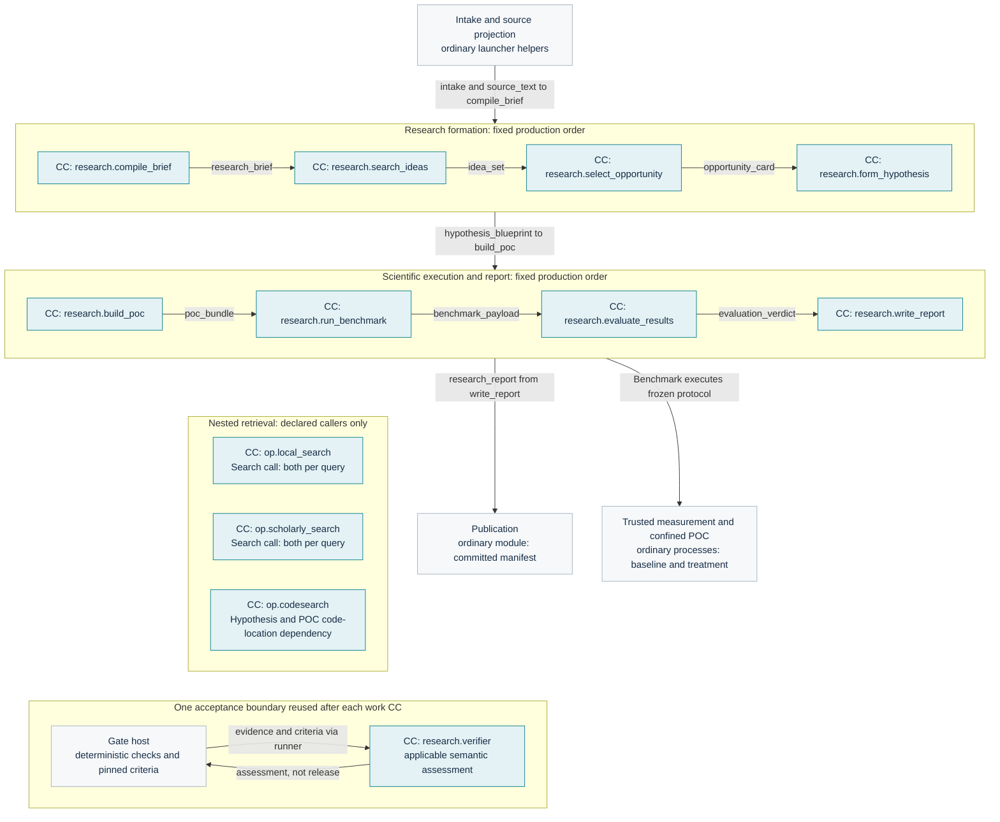
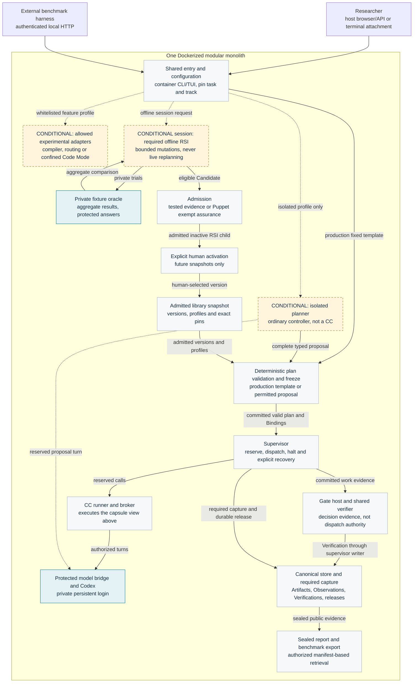

# Today's architecture: whole system at capsule level

**Snapshot: 5 October 2026. Draft, not executed acceptance.** These are reading views of the [production plan](../m1/pipeline.md), [module map](modules.md) and [three tracks](experiments.md). They add no contracts. Start here for the shape of the system; use the [atlas](diagram-atlas.md) for deeper spatial/temporal views and the [typed map](diagram.md) for complete ports.

## Legend and dynamic placement

- **Blue CC boxes:** the twelve capability identities in the current inventory. The eight work CCs are fixed production nodes, not choices a production planner may omit. A halted run simply has not reached later nodes.
- **Pale boxes:** ordinary services, resources and control modules, not capsules. A label names a responsibility, not a separately deployed service.
- **Dashed border marked CONDITIONAL:** present in a particular run/session only when its approved track or declared caller needs it. This does not mean the capability is absent from the shipped library.
- **Solid arrows:** the primary data/control path. **Dashed arrows:** nested calls, evidence assessment or optional track participation. They do not grant filesystem/network permissions.
- **Experimental placement:** a validated isolated plan may include different permitted CCs and bindings from the admitted library. The diagram shows no universal experimental sequence; it cannot imply that an arbitrary subset is valid. Required inputs, dependencies, Gates and objective coverage still constrain placement.
- **Not drawn repeatedly:** Brief/intake/resource fan-in, individual logging writes and every model-call edge. Exact inputs remain in the pipeline owner. Required evidence capture is a shared responsibility, never optional observability. Local and scholarly retrieval are mandatory nested dependencies of production Search; dynamic experimental placement does not change that production rule.

## 1. Every capsule and its place in the research path

Group arrows name their actual caller/consumer to preserve a readable layout: they are not all-to-all connections. Retrieval and acceptance boxes are supporting insets, not downstream stages; invisible layout links only position those insets. Their invocation points are named in each box and below. Search calls both local and scholarly operators per query, including when inputs/results are empty; Hypothesis and POC both pin CodeSearch to locate repository mechanisms. Benchmark owns scientific execution coordination. Every work node has its pinned Gate profile, even though the reusable acceptance boundary is drawn once. Verifier invocation depends on applicable criteria and deterministic-check success; its admission identity is shared, its criteria are stage-specific. The supervisor alone releases successors after durable Verification and release publication.

**Why this shape:** [Kubeflow typed component specifications](https://www.kubeflow.org/docs/components/pipelines/reference/component-spec/) motivate ports and reuse; [OPA policy/data separation](https://www.openpolicyagent.org/docs) motivates one Gate interface with criteria profiles. These are precedents, not runtime dependencies or proof of safety.

## 2. Whole application, alternate tracks and authority

- **Placement:** all application boxes belong to one deployable. Separate protected processes and the CLI/TUI/tmux runtime remain inside it. The harness, host browser/API clients and terminal attachment are outside; attachment does not move the TUI process onto the host. No runtime Docker socket or per-task container creation is implied.
- **Dynamic authority:** optional isolated plans choose permitted capsule versions/placement before execution. Validator acceptance and frozen bindings are mandatory; nodes cannot add live successors or perform automatic repair. RSI is a required M1 feature but a separate explicitly started session, not a node present in every production run.
- **Admission is not a runtime Gate:** Puppet allowlisting changes honest assurance, not test truth. RSI cannot move aliases, change the referee or release production work.
- **Experimental adapter placement:** the compiler prepares input before proposal; routing is inside an authorized model call; Code Mode runs in an isolated worker with result validation/Gates. The dashed feature box is a profile annotation, not a universal upstream plan node.
- **Observability:** required raw capture belongs to the canonical evidence path; UI traces and Data Foundation views derive from it. Individual record/event edges are deliberately omitted.
- **Failure:** failed Verification/release persistence means no successor. Unsupported confinement or missing mandatory evidence blocks the selecting path. Scientific negative results may still produce a valid report.

**Why this shape:** [Docker deployment](https://docs.docker.com/engine/containers/run/) plus protected internal processes; [Temporal durable execution](https://docs.temporal.io/workflow-execution) as the record-before-release precedent; [MLflow version/alias separation](https://mlflow.org/docs/latest/ml/model-registry/workflow/) as the admission/activation precedent. Follow [deployment](deployment.md), [lifecycle](lifecycle.md), [planner](planner.md), [RSI](../capsule/rsi-engine.md), [model authentication](model-auth.md) and [benchmark export](benchmark-export.md) for exact contracts.

For all 23 required production bindings and versions with observability/RSI hidden, use the [information-flow views](information-flow.md). The overview above deliberately summarizes those secondary inputs.

## Questions these views answer

- What is one deployment versus a capsule versus a protected process?
- Which capabilities always belong to production, which are nested calls, and which paths are conditional?
- Who chooses versions/placement, judges evidence, owns credentials and releases the next node?
- Where do RSI candidates enter admission and human activation?
- Where do local users and benchmarking connect, and where does the final evidence leave?

For exact fields, all secondary fan-in and timeout/recovery conditions, follow the owning contracts rather than infer missing edges from this simplified view. Platform isolation and execution acceptance remain [implementation obligations](../open-issues.md).
